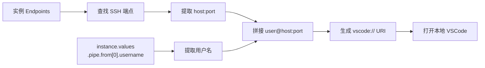
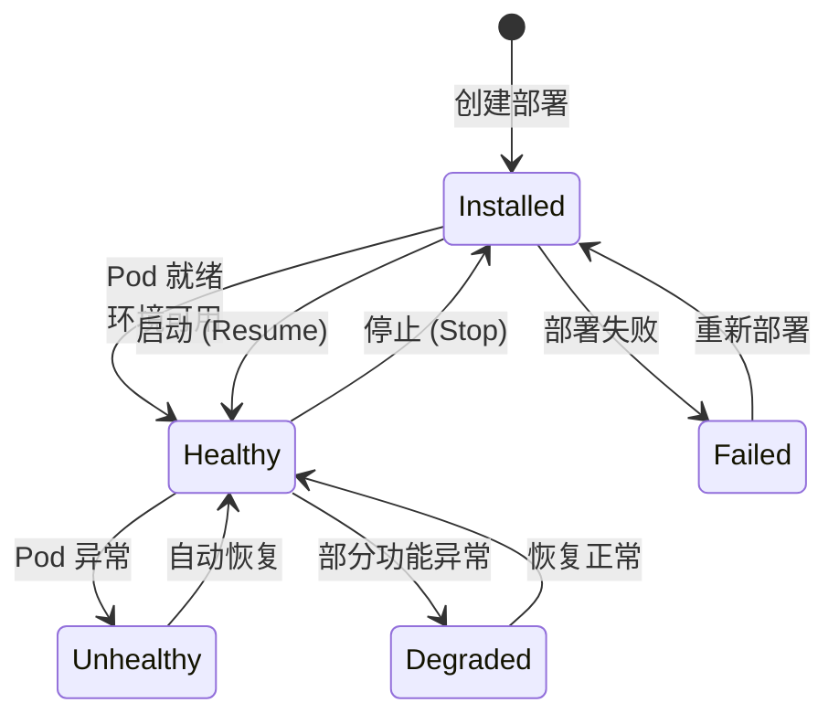

# 开发环境

## 功能概述

开发环境（Interactive Machine Learning，`category=im`）允许用户在 Rune 平台上启动交互式的 AI 开发环境，用于模型开发、数据探索、算法原型验证和调试。平台支持通过 **VSCode SSH 远程连接** 和 **JupyterLab Web 访问** 两种方式使用开发环境，兼顾专业开发和交互式探索需求。

开发环境基于统一的 Instance 架构构建（`category=im`），与推理服务、微调服务共享相同的模板驱动部署机制和生命周期管理。

### 核心能力

- **VSCode SSH 远程开发**：直接在本地 VSCode 中通过 SSH 连接到云端开发环境，享受完整 IDE 体验
- **JupyterLab Web 访问**：通过浏览器访问 JupyterLab，进行交互式数据分析和模型调试
- **GPU 加速计算**：可分配 GPU 资源，支持大规模模型训练和推理调试
- **持久化存储**：通过挂载存储卷实现代码和数据的持久化，环境重启不丢失
- **弹性启停**：支持随时停止和恢复，停止时释放 GPU 资源节约成本

## 进入路径

Rune 工作台 → 左侧导航 → **开发环境**

---

## 开发环境列表


列表页展示当前工作空间下所有开发环境实例。

### 列表列说明

| 列 | 说明 | 示例 |
|----|------|------|
| 名称 | 实例名称（K8s 资源名），点击进入详情 | `my-jupyter-dev` |
| 状态 | 当前运行状态徽标 | 🟢 Healthy |
| 规格（Flavor） | 计算资源规格描述 | `8C16G 1GPU` |
| 模板 | 使用的开发环境模板及版本 | `JupyterLab v3.6` |
| 创建时间 | 实例创建时间 | `2025-06-15 09:00` |
| 操作 | 可执行操作按钮组 | SSH 连接 / Web 访问 / 停止 / 删除 |

### 状态说明

| 状态 | 颜色 | 含义 |
|------|------|------|
| Installed | 🔵 蓝色 | Helm Chart 已安装，环境正在初始化/已停止 |
| Healthy | 🟢 绿色 | 环境运行正常，可以连接使用 |
| Unhealthy | 🟡 黄色 | 环境存在异常，可能影响使用 |
| Degraded | 🟠 橙色 | 环境降级运行 |
| Failed | 🔴 红色 | 环境部署或启动失败 |

---

## 创建开发环境

### 操作步骤

1. 点击列表页右上角的 **部署** 按钮
2. 选择开发环境模板（如 JupyterLab、VSCode Server 等）
3. 填写基本信息（ID、名称、描述）
4. 选择计算规格（Flavor）
5. 配置 SchemaForm 中的模板参数
6. 挂载存储卷用于持久化代码和数据（建议）
7. 确认并提交


### 配置字段

| 字段 | 类型 | 必填 | 说明 |
|------|------|------|------|
| ID | 文本 | ✅ | K8s 资源名，仅支持小写字母、数字和连字符，1-63 字符 |
| 显示名称 | 文本 | ✅ | 环境的可读名称 |
| 描述 | 文本域 | — | 环境描述信息 |
| 模板 | 选择 | ✅ | 开发环境类型模板 |
| 规格 | 选择 | ✅ | 计算资源规格（CPU/内存/GPU） |
| 存储卷 | 选择 | — | 挂载的持久化存储卷 |

> 💡 提示: 强烈建议挂载存储卷。开发环境本身是无状态的，停止或重建后容器内的文件会丢失，只有存储卷中的数据才能持久保留。

### 模板参数（SchemaForm）

与推理和微调服务一样，开发环境的模板参数通过 SchemaForm 动态渲染，支持图形化模式和 JSON 编辑模式。不同模板提供不同的可配置参数。

---

## 使用开发环境

开发环境启动成功（状态为 **Healthy**）后，支持以下两种访问方式：

### 方式一：VSCode SSH 远程连接

VSCode SSH 连接是开发环境的核心功能，允许用户在本地 VSCode 中直接连接到远程开发环境，获得完整的 IDE 体验（代码补全、调试、终端等）。


#### 连接机制

系统通过以下方式获取 SSH 连接信息：

1. 从实例的 endpoints 列表中查找 SSH 类型端点
2. 提取连接地址信息：`user@host:port`
3. 用户名从 `instance.values.pipe.from[0].username` 字段中解析
4. 生成 `vscode://` URI 协议链接



#### 操作步骤

1. 确保本地已安装 **Visual Studio Code** 和 **Remote - SSH** 扩展
2. 在开发环境列表或详情页，找到 VSCode SSH 连接按钮
3. 按钮为分体式设计（Split Button），包含两个功能：

| 操作 | 说明 |
|------|------|
| **连接（主按钮）** | 直接打开本地 VSCode 并发起 SSH 连接，等效于触发 `vscode://` URI |
| **复制命令（下拉）** | 复制命令行到剪贴板：`code --new-window --remote ssh-remote+user@host:port` |

4. 点击 **连接** 后，浏览器可能弹出"是否打开 Visual Studio Code？"的确认提示，点击确认即可
5. VSCode 将打开新窗口并自动建立 SSH 连接

> 💡 提示: 如果需要手动连接，可以使用复制的命令行在终端中执行，或在 VSCode 中按 `Ctrl+Shift+P` → `Remote-SSH: Connect to Host` 并输入连接地址。

#### 多 SSH 端点处理

当实例暴露了多个 SSH 端点时，按钮会显示为下拉菜单，用户可以选择要连接的目标端点。

> ⚠️ 注意: VSCode SSH 连接功能仅在实例状态为 **Healthy** 时可用。Installed、Failed 等状态下按钮将被禁用。

### 方式二：JupyterLab Web 访问

JupyterLab 通过 Web 端点提供浏览器内的交互式开发体验，使用与微调服务相同的 **UrlSelectButton** 组件。


#### 操作步骤

1. 在列表或详情页点击 **Web 访问** 按钮
2. 浏览器新标签页中打开 JupyterLab 界面
3. 开始编写代码、运行 Notebook

#### URL 优先级规则

与微调服务一致，当实例暴露多个 Web 端点时，按以下优先级选择：

1. **External + UI/Web/Console 类型端点**（最高优先级）
2. **External 其他端点**
3. **Internal 端点**（最低优先级）

---

## 文件持久化

开发环境的持久化策略需要特别关注：

| 存储位置 | 是否持久化 | 说明 |
|---------|-----------|------|
| 挂载的存储卷路径 | ✅ 是 | 停止/重启/删除环境后数据保留 |
| 容器内其他路径 | ❌ 否 | 环境停止或重建后数据丢失 |

> ⚠️ 注意: 请务必将重要的代码文件、数据集和训练产出保存到挂载的存储卷路径中。容器内未挂载的路径（如 `/tmp`、`/home/user` 等）在环境停止后将被清除。

### 建议的目录组织

```
/mnt/storage/          # 存储卷挂载点
├── code/              # 项目源代码
├── datasets/          # 训练/测试数据集
├── models/            # 模型权重文件
├── outputs/           # 实验输出结果
└── notebooks/         # Jupyter Notebook 文件
```

---

## 环境生命周期

开发环境支持弹性启停，适合间歇性使用场景：



### 生命周期操作

| 操作 | 前置状态 | 目标状态 | 说明 |
|------|---------|---------|------|
| 创建 | — | Installed | 安装 Helm Chart，创建环境资源 |
| 启动（Resume） | Installed（已停止） | Healthy | 恢复环境，重新创建 Pod |
| 停止（Stop） | Healthy | Installed | 释放 GPU/CPU 资源，Pod 被清除 |
| 删除 | 任意 | — | 彻底删除环境及所有 K8s 资源 |

> 💡 提示: 停止操作仅释放计算资源（GPU/CPU/内存），不会影响挂载的存储卷数据。恢复后环境配置不变，可以继续之前的工作。**不使用时请及时停止**，将宝贵的 GPU 资源释放给其他用户。

---

## 详情页

点击实例名称进入详情页，包含以下标签页：

### 概览（Overview）

- **ServiceInfoCard**：实例 ID、名称、状态、模板、规格、创建时间、端点地址
- **PodList**：关联 Pod 的名称、状态、重启次数、所在节点

### 监控（Monitoring）

集成 Prometheus 看板，展示资源使用情况：
- GPU 利用率和显存使用
- CPU 使用率
- 内存使用量
- 磁盘 I/O
- 网络流量

### 日志（Logging）

实时查看 Pod 容器日志，支持多容器切换和日志搜索。

### 事件（Events）

Kubernetes 事件流，包含 Pod 调度、镜像拉取、容器启动等事件。

---

## 权限要求

| 操作 | 所需角色 |
|------|---------|
| 查看列表和详情 | ADMIN / DEVELOPER / MEMBER |
| 创建开发环境 | ADMIN / DEVELOPER |
| SSH 连接 / Web 访问 | ADMIN / DEVELOPER |
| 启动/停止 | ADMIN / DEVELOPER |
| 删除 | ADMIN / DEVELOPER |
| 查看监控和日志 | ADMIN / DEVELOPER / MEMBER |

---

## 故障排查

### SSH 连接失败

1. **确认实例状态为 Healthy**：只有 Healthy 状态下 SSH 服务才可用
2. **检查 Remote-SSH 扩展**：确保 VSCode 已安装 `Remote - SSH` 扩展
3. **检查网络连通性**：确认本地网络可以访问 SSH 端点地址和端口
4. **检查防火墙**：部分企业网络可能阻止非标准端口的 SSH 连接
5. **查看 SSH 端点**：在实例详情的端点列表中，确认 SSH 端点是否已正确暴露
6. **手动连接测试**：在终端中执行 `ssh user@host -p port` 测试连通性

### JupyterLab 无法访问

1. 确认实例状态为 Healthy
2. 检查浏览器是否阻止了弹出窗口
3. 尝试直接在地址栏输入端点 URL
4. 清除浏览器缓存后重试

### 环境启动缓慢

- 首次启动需要拉取容器镜像，可能耗时较长
- 检查事件页面中的镜像拉取进度
- 大型开发环境镜像（包含 CUDA 工具链等）可能超过 10GB

### 存储卷数据不可见

- 确认存储卷已正确挂载到实例
- 检查挂载路径是否与预期一致
- 确认存储卷状态为 Bound

---

## 最佳实践

- **合理选择规格**：日常开发可选择较小的 CPU 规格，仅在训练调试时使用 GPU 环境
- **及时停止闲置环境**：下班或不使用时停止环境，释放资源
- **善用存储卷**：将所有项目文件放在存储卷中，形成良好的目录结构
- **定期保存工作**：使用 Git 进行版本管理，避免意外丢失代码
- **利用 SSH 免密登录**：在平台的 SSH Key 管理中上传公钥，避免每次输入密码
- **使用 VSCode 扩展**：安装 Python、Jupyter 等扩展，提升远程开发体验
