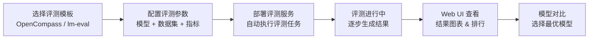
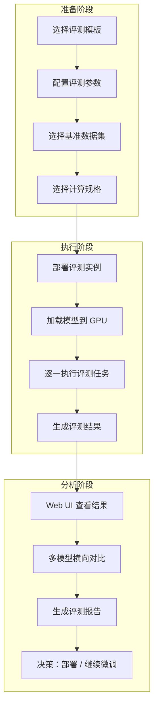

# 评测管理

## 功能概述

评测管理（Evaluation）是 Rune 平台中用于对 AI 模型进行系统化性能评测的功能模块。在模型训练或微调完成后，用户需要通过标准化的基准测试（Benchmark）来衡量模型在不同任务上的表现，如语言理解、推理能力、代码生成、知识问答等。评测管理服务使这一过程实现了自动化和可视化。

评测管理服务属于 Instance 架构中 `category=evaluation` 类别，与推理服务、微调服务、实验服务共享相同的底层实例模型和部署机制。评测的基准数据集、评测指标和结果展示均由模板内嵌的 Web 应用提供，用户可通过 Web UI 直观地查看和对比评测结果。

### 核心能力

- **模板驱动部署**：基于 Helm Chart 模板一键部署评测工具（如 OpenCompass、lm-evaluation-harness 等）
- **多维度评测**：支持多种评测基准和指标类型，全面评估模型能力
- **Web 可视化**：通过模板内嵌的 Web 应用查看评测结果、对比模型表现
- **自动化流程**：配置好评测参数后，系统自动执行评测并生成报告
- **完整生命周期管理**：支持创建、启动、停止、删除等全生命周期操作

### 评测工作流

## 进入路径

Rune 工作台 → 左侧导航 → **评测**

---

## 评测任务列表

列表页展示当前工作空间下所有评测任务实例，提供快速概览和操作入口。

### 列表列说明

| 列 | 说明 | 示例 |
|----|------|------|
| 名称 | 实例名称（K8s 资源名），点击进入详情 | `llama3-eval-mmlu` |
| 状态 | 当前运行状态徽标 | 🟢 Healthy |
| 规格（Flavor） | 计算资源规格可读描述 | `8C16G 1GPU` |
| 模板 | 使用的评测模板及版本 | `OpenCompass v0.3` |
| 创建时间 | 任务创建时间 | `2025-06-22 14:00` |
| 操作 | 可执行操作 | Web 访问 / 停止 / 删除 |

### 状态徽标说明

| 状态 | 颜色 | 含义 |
|------|------|------|
| Installed | 🔵 蓝色 | Helm Chart 已安装，评测环境正在初始化 |
| Healthy | 🟢 绿色 | 评测服务运行正常，可通过 Web UI 查看结果 |
| Unhealthy | 🟡 黄色 | 部分 Pod 未就绪 |
| Succeeded | ⚪ 灰色 | 评测任务完成 ✅ |
| Failed | 🔴 红色 | 评测失败 ❌ |
| Degraded | 🟠 橙色 | 服务降级运行 |

### Web 访问按钮

评测服务列表中提供 **Web 访问** 按钮（UrlSelectButton），用于通过浏览器直接访问评测工具的 Web UI，查看评测结果、排行榜和详细报告。

> 💡 提示: Web 访问按钮仅在实例状态为 Healthy 时可用。评测工具的 Web 界面由模板内嵌提供，不同模板的界面风格可能不同。

---

## 创建评测任务

### 操作步骤

1. 点击列表页右上角的 **部署** 按钮
2. 在部署页面中选择评测模板（如 OpenCompass、lm-evaluation-harness），也可从应用市场一键跳转
3. 填写基本信息和模板参数
4. 确认资源规格后提交

### 基本信息字段

| 字段 | 类型 | 必填 | 说明 |
|------|------|------|------|
| ID（名称） | 文本 | ✅ | K8s 资源名，仅支持小写字母、数字和连字符，1-63 字符 |
| 显示名称 | 文本 | ✅ | 实例的可读名称，可包含中文 |
| 模板 | 选择 | ✅ | 评测模板（OpenCompass / lm-eval 等） |
| 模板版本 | 选择 | ✅ | 模板的版本号 |
| 规格（Flavor） | 选择 | ✅ | 计算资源规格，评测大模型通常需要 GPU |
| 存储卷 | 选择 | — | 持久化存储，用于保存评测数据和结果 |

### 模板参数配置

模板参数通过 SchemaForm 动态渲染，以下是常见的评测参数类别：

| 参数类别 | 示例参数 | 说明 |
|---------|---------|------|
| 模型配置 | `model_path`, `model_name` | 待评测模型的路径或名称 |
| 数据集 | `datasets`, `benchmark_suite` | 评测数据集或基准测试套件 |
| 评测设置 | `batch_size`, `num_fewshot` | 推理批次大小、Few-shot 示例数 |
| 输出配置 | `output_dir`, `report_format` | 结果输出目录和报告格式 |
| 环境变量 | 自定义键值对 | 额外的环境变量 |

> ⚠️ 注意: 评测大语言模型通常需要将完整模型加载到 GPU 显存中，请根据模型参数量选择足够大的 GPU 规格。例如，评测 70B 模型通常需要至少 4×A100 80G。

---

## 评测基准数据集

平台支持的模板通常预集成了主流的评测基准数据集，覆盖模型的多维度能力评估：

### 通用语言能力

| 基准数据集 | 评测维度 | 说明 |
|-----------|---------|------|
| MMLU | 知识理解 | 57 个学科的多项选择题，评估模型知识广度 |
| C-Eval | 中文知识 | 52 个学科的中文评测基准 |
| HellaSwag | 常识推理 | 日常场景下的常识推理能力 |
| ARC | 科学推理 | 小学到中学水平的科学问答 |

### 专项能力

| 基准数据集 | 评测维度 | 说明 |
|-----------|---------|------|
| HumanEval | 代码生成 | Python 编程题目，评估代码生成质量 |
| GSM8K | 数学推理 | 小学数学应用题 |
| TruthfulQA | 事实准确性 | 评估模型回答的真实性和准确性 |
| BBH | 复杂推理 | BIG-Bench 子集，评估难度更高的推理能力 |

---

## 评测指标类型

根据不同的评测任务，系统使用不同类型的评估指标：

| 指标类型 | 常见指标 | 适用场景 |
|---------|---------|---------|
| 准确率 | Accuracy, Top-K Accuracy | 分类任务、选择题评测 |
| 生成质量 | BLEU, ROUGE, METEOR | 文本生成、翻译、摘要 |
| 代码能力 | Pass@K, Execution Rate | 代码生成评测 |
| 推理能力 | Exact Match, F1 Score | 阅读理解、数学推理 |
| 安全性 | Toxicity Score, Bias Score | 安全和偏见评估 |

---

## 评测详情页

点击评测任务名称进入详情页，可查看以下信息：

### 基本信息

- **实例名称**：K8s 资源名和显示名称
- **状态**：当前运行状态
- **模板信息**：所用模板名称和版本
- **规格**：分配的计算资源（CPU / 内存 / GPU）
- **创建/更新时间**：生命周期时间戳

### Pod 列表

展示与实例关联的所有 Kubernetes Pod：

| 字段 | 说明 |
|------|------|
| Pod 名称 | K8s Pod 名称 |
| 状态 | Running / Pending / Failed 等 |
| 节点 | 运行所在的 K8s 节点 |
| 重启次数 | 容器重启计数 |

### 监控与日志

- **监控面板**：Prometheus/Grafana 风格的实例监控面板
- **日志查看器**：支持实时和历史日志查询
- **K8s 事件**：展示与实例相关的 Kubernetes 事件流

---

## 通过 Web UI 查看评测结果

评测服务的 Web UI 由模板内嵌提供，支持以下功能：

### 结果概览

- **总分/排名**：模型在各基准上的综合得分
- **分维度得分**：按知识、推理、代码、数学等维度的详细得分
- **雷达图**：多维度能力的可视化对比

### 模型对比

在 Web UI 中可以对比多个模型的评测结果：

1. 选择需要对比的模型（至少 2 个）
2. 查看各维度得分的并排对比
3. 查看每个基准数据集上的详细表现差异
4. 导出对比报告

> 💡 提示: 建议在微调前后分别运行评测，通过对比分数变化来衡量微调效果。如果某些维度分数下降，可能存在"灾难性遗忘"（Catastrophic Forgetting）问题。

---

## 评测流程全景

---

## 最佳实践

### 评测策略

1. **基线对比**：始终保留基线模型（未微调的原始模型）的评测结果，作为微调效果的参照
2. **全面评测**：不仅评测微调任务相关的指标，也要关注其他维度是否出现能力下降
3. **多轮评测**：对于微调过程中的不同 checkpoint，可以分别评测以观察训练趋势
4. **统一环境**：确保不同评测使用相同的评测模板和版本，保证结果可比性

### 资源规划

- 评测通常需要 GPU 资源来进行模型推理，但不需要与训练相同的资源量
- 对于大参数模型，可以使用量化（如 INT8/INT4）后的版本进行评测，降低资源需求
- 建议评测任务与推理服务分开调度，避免资源争抢

### 结果分析

- 关注绝对分数和相对排名，与公开的 Leaderboard 结果对比
- 分析模型在不同难度子集上的表现差异，找到弱项并针对性优化
- 保留评测配置和数据版本信息，确保结果可复现

> ⚠️ 注意: 不同评测工具和版本的评测结果可能不完全可比。进行模型对比时，请确保使用相同的评测模板和配置。

---

## 权限要求

| 操作 | 所需角色 |
|------|---------|
| 查看评测列表 | ADMIN / DEVELOPER / MEMBER |
| 创建评测任务 | ADMIN / DEVELOPER |
| Web 访问评测 UI | ADMIN / DEVELOPER |
| 停止/删除评测 | ADMIN / DEVELOPER |
