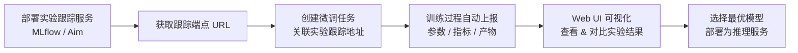
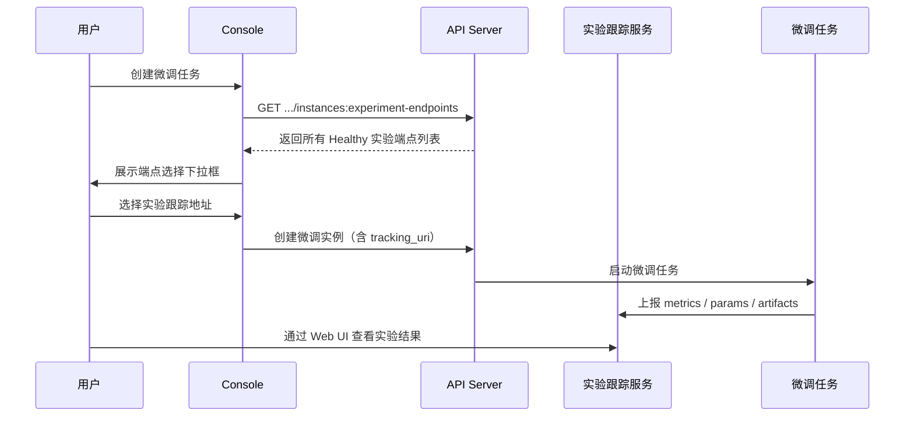

# 实验管理

## 功能概述

实验管理（Experiment Tracking）是 Rune 平台中用于跟踪、记录和对比机器学习实验的核心功能模块。在模型开发过程中，研究者和工程师通常需要反复调整超参数、更换数据集、尝试不同的模型架构，而实验管理服务提供了一个统一的平台来记录每次实验的参数（Parameters）、指标（Metrics）和产物（Artifacts），从而实现实验的可追溯性和可复现性。

实验管理服务属于 Instance 架构中 `category=experiment` 类别，与推理服务、微调服务共享相同的底层实例模型和部署机制。平台通过模板市场提供主流的实验跟踪工具（如 MLflow、Aim 等），用户可一键部署实验跟踪服务，并通过 Web UI 进行实验管理。

### 核心能力

- **模板驱动部署**：基于 Helm Chart 模板一键部署 MLflow、Aim 等主流实验跟踪工具
- **指标与参数跟踪**：记录每次训练的超参数、损失函数曲线、评估指标等关键数据
- **产物管理**：存储和版本化管理模型文件、数据集快照、配置文件等实验产物
- **实验对比**：通过内嵌 Web UI 可视化对比多次实验结果，快速定位最优配置
- **微调集成**：实验跟踪服务端点可在创建微调任务时作为 Experiment Tracking Server 地址使用
- **完整生命周期管理**：支持创建、启动、停止、编辑、删除等全生命周期操作

### 实验跟踪工作流

## 进入路径

Rune 工作台 → 左侧导航 → **实验**

---

## 实验服务列表

列表页展示当前工作空间下所有实验跟踪服务实例，提供快速概览和操作入口。

### 列表列说明

| 列 | 说明 | 示例 |
|----|------|------|
| 名称 | 实例名称（K8s 资源名），点击进入详情 | `mlflow-tracking` |
| 状态 | 当前运行状态徽标 | 🟢 Healthy |
| 规格（Flavor） | 计算资源规格可读描述 | `4C8G` |
| 模板 | 使用的实验模板及版本 | `MLflow v2.10` |
| 创建时间 | 实例创建时间 | `2025-06-20 09:00` |
| 操作 | 可执行操作 | Web 访问 / 停止 / 删除 |

### 状态徽标说明

| 状态 | 颜色 | 含义 |
|------|------|------|
| Installed | 🔵 蓝色 | Helm Chart 已安装，资源正在创建中 |
| Healthy | 🟢 绿色 | 服务运行正常，可通过 Web UI 访问 |
| Unhealthy | 🟡 黄色 | 部分 Pod 未就绪，服务可能不可用 |
| Degraded | 🟠 橙色 | 服务降级运行 |
| Failed | 🔴 红色 | 部署失败或服务崩溃 |

### Web 访问按钮

实验服务列表中提供 **Web 访问** 按钮（UrlSelectButton），用于通过浏览器直接访问实验跟踪工具的 Web UI（如 MLflow Dashboard、Aim Explorer）。

> 💡 提示: Web 访问按钮仅在实例状态为 Healthy 时可用。点击后将在新标签页中打开实验跟踪 Web 界面。

---

## 创建实验跟踪服务

### 操作步骤

1. 点击列表页右上角的 **部署** 按钮
2. 在部署页面中选择实验模板（如 MLflow、Aim），也可从应用市场一键跳转
3. 填写基本信息和模板参数
4. 确认资源规格后提交

### 基本信息字段

| 字段 | 类型 | 必填 | 说明 |
|------|------|------|------|
| ID（名称） | 文本 | ✅ | K8s 资源名，仅支持小写字母、数字和连字符，1-63 字符 |
| 显示名称 | 文本 | ✅ | 实例的可读名称，可包含中文 |
| 模板 | 选择 | ✅ | 实验跟踪模板（MLflow / Aim 等） |
| 模板版本 | 选择 | ✅ | 模板的版本号 |
| 规格（Flavor） | 选择 | ✅ | 计算资源规格 |
| 存储卷 | 选择 | — | 持久化存储，用于保存实验数据和产物 |

### 模板参数配置

模板参数通过 SchemaForm 动态渲染，根据所选模板不同，可配置的参数也不同。常见参数包括：

| 参数类别 | 示例参数 | 说明 |
|---------|---------|------|
| 后端存储 | `artifact_root` | 产物存储路径（本地或 S3） |
| 数据库 | `backend_store_uri` | 元数据数据库连接地址 |
| 认证 | `auth_enabled` | 是否启用访问认证 |
| 环境变量 | 自定义键值对 | 额外的环境变量配置 |

> ⚠️ 注意: 建议为实验跟踪服务挂载持久化存储卷，以防止实例重启后实验数据丢失。

---

## 实验端点与微调集成

实验跟踪服务的核心价值之一是与微调任务集成。平台提供专用 API `listExperimentEndpoints` 来获取所有健康状态的实验跟踪服务端点。

### 工作原理

### 端点查询 API

- **接口**：`GET /api/v1/tenants/{tenant}/clusters/{cluster}/workspaces/{workspace}/instances:experiment-endpoints`
- **返回**：所有状态为 Healthy 的实验跟踪实例的端点列表
- **用途**：在创建微调任务时，作为 Experiment Tracking Server 地址的候选列表

> 💡 提示: 在创建微调任务的表单中，"实验跟踪地址"字段会自动调用此 API 并以下拉列表形式展示可用的实验端点，选择后训练过程会自动将指标数据上报到对应的跟踪服务。

---

## 实验详情页

点击实验服务名称进入详情页，可查看以下信息：

### 基本信息

- **实例名称**：K8s 资源名和显示名称
- **状态**：当前运行状态
- **模板信息**：所用模板名称和版本
- **规格**：分配的计算资源（CPU / 内存 / GPU）
- **创建/更新时间**：生命周期时间戳

### Pod 列表

展示与实例关联的所有 Kubernetes Pod：

| 字段 | 说明 |
|------|------|
| Pod 名称 | K8s Pod 名称 |
| 状态 | Running / Pending / Failed 等 |
| 节点 | 运行所在的 K8s 节点 |
| 重启次数 | 容器重启计数 |
| 创建时间 | Pod 创建时间 |

### 监控与日志

- **监控面板**：Prometheus/Grafana 风格的实例监控面板，展示 CPU、内存、网络等指标
- **日志查看器**：支持实时和历史日志查询，支持 LogQL 语法
- **K8s 事件**：展示与实例相关的 Kubernetes 事件流

---

## 通过 Web UI 管理实验

### MLflow

MLflow 是最常用的实验跟踪工具，部署后可通过 Web UI 完成以下操作：

- **Experiments 视图**：按实验分组查看所有 Run
- **Run 详情**：查看每次训练的参数、指标曲线、产物列表
- **对比视图**：选中多个 Run 进行指标可视化对比
- **模型注册**：将优秀的模型注册到 MLflow Model Registry

### Aim

Aim 提供更丰富的可视化能力：

- **Metrics Explorer**：交互式指标探索，支持分组和聚合
- **Params Explorer**：超参数空间可视化
- **Images/Audio Explorer**：多媒体产物浏览
- **Runs 对比**：多维度对比不同实验运行

---

## 实验跟踪数据类型

通过模板内嵌的实验跟踪工具，可以记录以下类型的数据：

| 数据类型 | 说明 | 示例 |
|---------|------|------|
| Parameters（参数） | 训练超参数和配置 | `learning_rate=0.001`, `batch_size=32` |
| Metrics（指标） | 训练过程中的评估指标 | `loss`, `accuracy`, `f1_score` |
| Artifacts（产物） | 模型文件和其他输出 | 模型权重、混淆矩阵图、配置文件 |
| Tags（标签） | 自定义标记 | `best_model`, `production_ready` |

---

## 最佳实践

### 实验管理规范

1. **命名规范**：使用有意义的实验名称，如 `llama3-sft-medical-v2`，包含模型、方法、领域信息
2. **参数记录**：确保所有影响结果的超参数都被完整记录，便于复现
3. **指标选择**：针对不同任务选择合适的评估指标（分类任务用 F1，生成任务用 BLEU/ROUGE 等）
4. **产物保存**：保存模型 checkpoint、训练配置、数据预处理脚本等关键产物

### 资源规划

- 实验跟踪服务（如 MLflow Server）通常不需要 GPU，选择 CPU 规格即可
- 为跟踪服务挂载足够的存储空间，特别是使用本地 artifact 存储时
- 建议每个工作空间部署一个共享的实验跟踪服务，供多个微调任务使用

### 与微调服务协同

1. 先部署实验跟踪服务并确认状态为 Healthy
2. 创建微调任务时选择对应的实验端点
3. 训练完成后通过 Web UI 对比不同微调结果
4. 选择最优模型部署为推理服务

> 💡 提示: 在微调模板中，很多模板已经预配置了与 MLflow/Aim 的集成逻辑，只需在创建时填写正确的 tracking server 地址即可自动上报实验数据。

---

## 权限要求

| 操作 | 所需角色 |
|------|---------|
| 查看实验列表 | ADMIN / DEVELOPER / MEMBER |
| 创建实验服务 | ADMIN / DEVELOPER |
| Web 访问实验 UI | ADMIN / DEVELOPER |
| 启动/停止/编辑 | ADMIN / DEVELOPER |
| 删除实验服务 | ADMIN / DEVELOPER |
