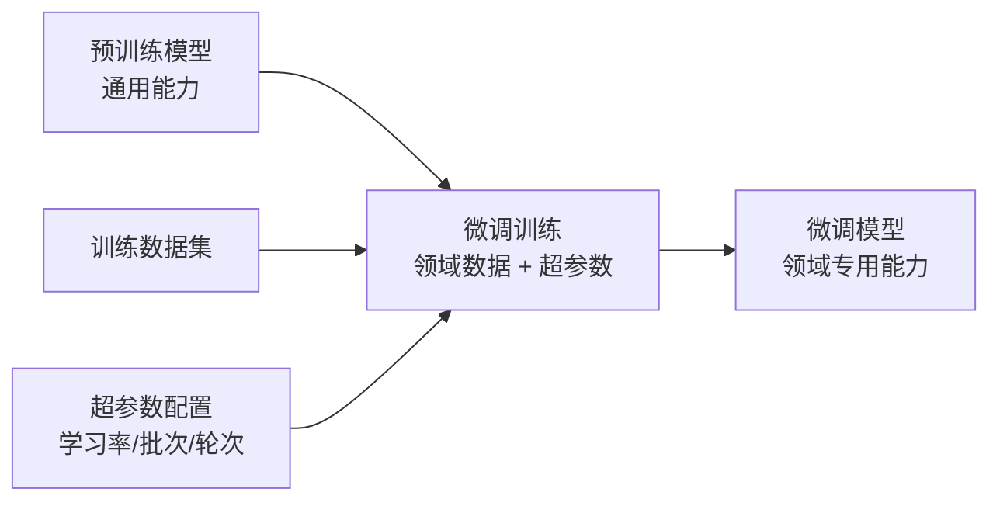
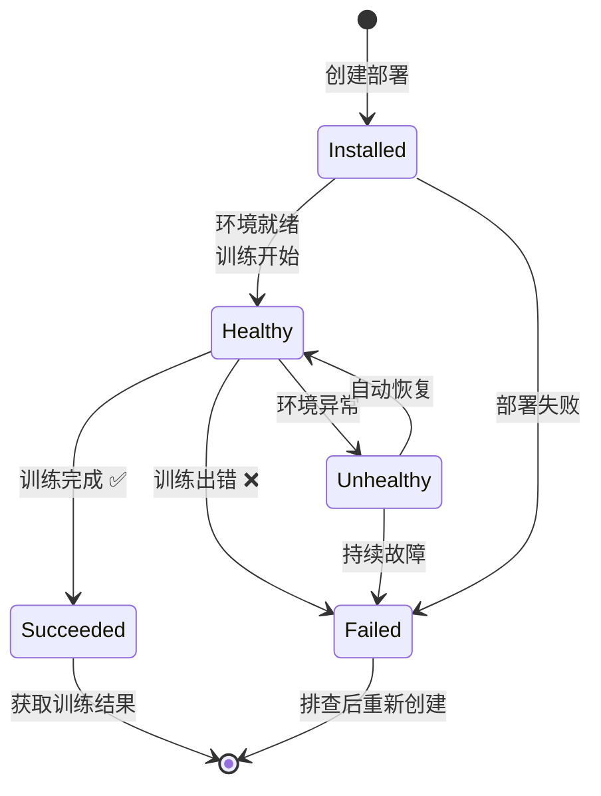

# 微调服务

## 功能概述

微调服务（Fine-tuning）是 Rune 平台中用于对预训练模型进行二次训练的核心功能。通过微调，用户可以在保留预训练模型通用能力的基础上，使模型适应特定领域的任务需求（如领域问答、代码生成、文本分类等）。

微调服务属于 Instance 架构中 `category=tune` 类别，与推理服务共享相同的底层实例模型和部署机制。微调任务的所有超参数（学习率、批次大小、训练轮次、基础模型、训练数据集等）均通过 Helm Chart 的 Schema 定义，在 SchemaForm 中动态渲染。

### 核心能力

- **模板驱动**：基于 Helm Chart 模板定义微调工具链（如 LLaMA-Factory、Swift 等），所有参数通过 SchemaForm 配置
- **全流程管理**：从数据准备、参数配置、任务提交到结果评估的完整工作流
- **训练 Web UI**：支持通过 Web 界面访问训练工具的可视化 UI（如 LLaMA-Factory WebUI）
- **任务型生命周期**：训练完成后自动进入 Succeeded 状态，异常时标记为 Failed
- **多维度监控**：集成 Prometheus 监控、日志查看和 K8s 事件流

### 什么是模型微调？

简单来说，微调就是用你自己的数据"教会"一个已有的大模型完成特定任务。例如：
- 用医疗问答数据微调 LLaMA，使其成为医疗助手
- 用代码仓库数据微调 CodeLlama，提升特定语言的代码生成能力
- 用客服对话数据微调 ChatGLM，构建智能客服

## 进入路径

Rune 工作台 → 左侧导航 → **微调服务**

---

## 微调服务列表

列表页展示当前工作空间下所有微调任务实例。

### 列表列说明

| 列 | 说明 | 示例 |
|----|------|------|
| 名称 | 实例名称（K8s 资源名），点击进入详情 | `llama3-sft-medical` |
| 状态 | 当前运行状态徽标 | 🟢 Healthy |
| 规格（Flavor） | 计算资源规格描述 | `8C16G 1GPU` |
| 模型名称 | 基础模型标识 | `Meta-Llama-3-8B` |
| 模板 | 使用的微调模板及版本 | `LLaMA-Factory v0.8` |
| 创建时间 | 任务创建时间 | `2025-06-15 14:00` |
| 操作 | 可执行操作 | Web 访问 / 删除 |

### 状态说明

| 状态 | 含义 |
|------|------|
| Installed | Helm Chart 已安装，训练环境正在初始化 |
| Healthy | 训练环境就绪，训练任务运行中 |
| Succeeded | 训练任务已完成 ✅ |
| Failed | 训练失败 ❌ |
| Unhealthy | 训练环境异常 |
| Degraded | 训练环境降级运行 |

### Web 访问按钮

微调任务列表中提供 **Web 访问** 按钮（UrlSelectButton），用于通过浏览器访问训练工具的 Web UI，例如 LLaMA-Factory 的可视化训练界面。

> 💡 提示: Web 访问按钮仅在实例状态为 Healthy 时可用。按钮根据端点 URL 优先级自动选择最佳访问地址。

#### URL 优先级规则

当实例暴露多个端点时，系统按以下优先级选择 Web 访问地址：

1. **External + UI/Web/Console 类型端点**（最高优先级）
2. **External 其他端点**
3. **Internal 端点**（最低优先级）

---

## 创建微调任务

### 操作步骤

1. 点击列表页右上角的 **部署** 按钮
2. 选择微调模板（如 LLaMA-Factory、Swift 等）
3. 填写基本信息（ID、名称、描述）
4. 选择计算规格（Flavor）
5. 配置 SchemaForm 中的微调参数
6. 挂载训练数据和输出模型的存储卷
7. 确认并提交

### 基本信息

| 字段 | 类型 | 必填 | 说明 |
|------|------|------|------|
| ID | 文本 | ✅ | K8s 资源名，仅支持小写字母、数字和连字符，1-63 字符 |
| 显示名称 | 文本 | ✅ | 任务的可读名称 |
| 描述 | 文本域 | — | 任务描述信息 |

### 配置超参数（SchemaForm）

微调模板的所有超参数均定义在 Helm Chart 的 `values.schema.json` 中，通过 SchemaForm 动态渲染。支持**图形化模式**和 **JSON 编辑模式**两种方式。

#### 常见超参数

| 参数 | 说明 | 示例值 |
|------|------|--------|
| base_model | 基础预训练模型路径 | `/models/llama3-8b` |
| dataset | 训练数据集路径 | `/datasets/medical-qa` |
| learning_rate | 学习率 | `2e-5` |
| batch_size | 训练批次大小 | `4` |
| num_epochs | 训练轮次 | `3` |
| lora_rank | LoRA 秩 | `8` |
| lora_alpha | LoRA 缩放系数 | `16` |
| max_length | 最大序列长度 | `2048` |
| gradient_accumulation | 梯度累积步数 | `4` |
| warmup_ratio | 预热比例 | `0.1` |
| output_dir | 输出目录 | `/output/llama3-sft` |

> ⚠️ 注意: 不同模板的超参数可能不同。以上仅为常见参数示例，实际可配置的参数由所选模板的 Schema 定义决定。

### 训练数据准备

在提交微调任务前，需要确保训练数据已准备就绪：

1. **创建存储卷**：在存储卷管理中创建一个存储卷用于存放训练数据
2. **上传数据**：通过文件管理器上传训练数据集（JSON/JSONL/CSV 格式）
3. **挂载到微调实例**：在部署时选择该存储卷

> 💡 提示: 训练数据的格式要求取决于所选的微调模板。例如，LLaMA-Factory 支持 Alpaca 和 ShareGPT 两种数据格式，请参阅模板文档了解详情。

---

## 微调任务生命周期

> 💡 提示: 与推理服务不同，微调任务是 **一次性任务**。训练完成后状态变为 Succeeded，不支持"停止/启动"循环。如需重新训练，需要创建新的微调任务实例。

---

## 监控训练进度

### 通过 Web UI 监控

对于支持 Web UI 的微调模板（如 LLaMA-Factory），可以通过列表中的 **Web 访问** 按钮打开训练界面：

Web UI 通常提供：

- 实时训练指标（Loss 曲线、学习率变化）
- 训练进度百分比
- 当前 Epoch / Step 信息
- 评估指标展示

### 通过详情页监控

#### 概览（Overview）

展示实例的 ServiceInfoCard 和 PodList，与推理服务的概览页结构一致。

#### 监控（Monitoring）

集成 Prometheus 监控看板：

- **GPU 利用率**：训练过程中的 GPU 使用率曲线
- **GPU 显存使用**：训练过程中的显存消耗
- **训练 Loss 趋势**（如模板上报了自定义 Metrics）
- **CPU / 内存使用**

#### 日志（Logging）

实时查看训练日志输出，包含：

- 训练进度信息（epoch、step、loss 值）
- 模型加载和初始化日志
- 数据集加载日志
- 错误和警告信息

#### 事件（Events）

Kubernetes 事件流，按时间倒序展示。

---

## 训练结果获取

训练完成（Succeeded）后：

1. 微调模型权重保存在配置的输出目录中（通常在挂载的存储卷内）
2. 进入存储卷文件管理器，可以浏览和下载训练产出的模型文件
3. 训练日志和检查点文件也保存在输出目录中

### 输出模型的使用

微调后的模型可以通过以下方式使用：

- **部署为推理服务**：在推理服务中使用挂载了微调模型的存储卷，配置模型路径指向微调输出
- **继续微调**：将微调输出作为新的基础模型进行下一轮微调
- **下载到本地**：通过文件管理器下载，在本地环境中使用

---

## 权限要求

| 操作 | 所需角色 |
|------|---------|
| 查看列表和详情 | ADMIN / DEVELOPER / MEMBER |
| 创建微调任务 | ADMIN / DEVELOPER |
| Web 访问 | ADMIN / DEVELOPER |
| 删除任务 | ADMIN / DEVELOPER |
| 查看监控和日志 | ADMIN / DEVELOPER / MEMBER |

---

## 故障排查

### 训练任务失败（状态 Failed）

1. **查看事件页面**：检查是否有资源不足、镜像拉取失败等 K8s 层面的错误
2. **查看日志**：检查训练日志中的报错信息
3. **常见原因**：
   - **GPU 显存不足（OOM）**：降低 batch_size 或启用梯度累积
   - **数据格式错误**：检查训练数据的格式是否符合模板要求
   - **模型路径错误**：确认基础模型路径是否正确，存储卷是否正确挂载
   - **磁盘空间不足**：确认存储卷有足够空间存储模型检查点

### 训练速度缓慢

- 检查是否正确使用了 GPU（日志中应显示 CUDA 设备信息）
- 适当增大 batch_size 以提高 GPU 利用率
- 启用混合精度训练（fp16 / bf16）
- 检查数据加载是否成为瓶颈（增加 dataloader workers）

### Web UI 无法访问

- 确认实例状态为 Healthy
- 检查浏览器是否阻止了弹出窗口
- 尝试直接复制端点 URL 在新标签页中打开
- 检查网络代理设置是否影响了访问

---

## 最佳实践

- **从小规模开始**：先用少量数据和较少训练轮次验证流程，确认无误后再进行全量训练
- **合理设置检查点**：启用定期保存检查点，避免因意外中断导致训练进度丢失
- **监控 Loss 变化**：通过 Web UI 或日志观察 Loss 是否正常收敛
- **准备验证集**：设置验证集用于在训练过程中评估模型效果，避免过拟合
- **使用 LoRA 微调**：对于大模型，推荐使用 LoRA/QLoRA 等参数高效微调方法，大幅减少 GPU 资源需求
- **保留训练日志**：训练完成后的日志和指标输出是调优超参数的重要参考
