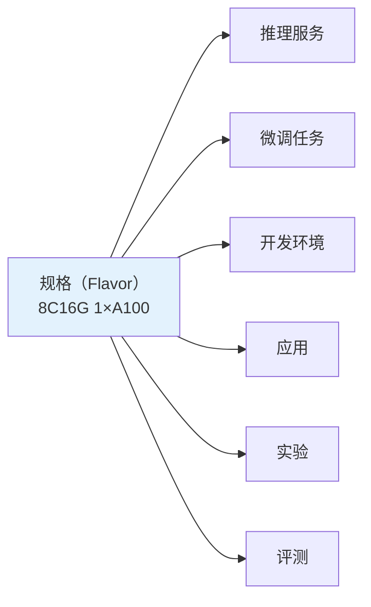
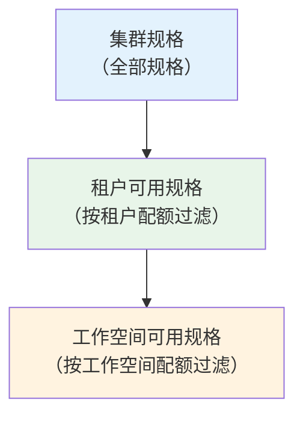

# 规格管理

## 功能概述

规格（Flavor）是 Rune 平台中用于定义计算资源组合的标准化模板。每个规格描述了一组确定的计算资源配置——包括 CPU 核心数、内存大小、GPU 类型和数量等——供用户在部署推理服务、微调任务、开发环境和应用等实例时选择。通过规格标准化，平台实现了资源的统一管理和合理调度。

### 核心能力

- **标准化资源模板**：将 CPU、内存、GPU 等资源打包为规格，用户无需关注底层资源细节
- **三级可见范围**：规格按集群、租户、工作空间三个级别展示，不同层级可见的规格不同
- **多种加速器支持**：支持 GPU（NVIDIA/AMD）、NPU（华为昇腾）、DCU（海光）、MLU（寒武纪）、vGPU 等
- **售罄机制**：当集群中某规格的资源已耗尽时，自动标记为售罄
- **统一关联**：所有 Instance 类型的实例列表均展示 Flavor 列，便于识别资源占用

### 规格与实例的关系

> 💡 提示: 规格由平台管理员在 BOSS 端创建和管理。Console 端的用户只能查看和选择可用的规格，不能创建或修改规格。

## 进入路径

路径：`/rune/tenants/:tenant/flavors`

---

## 规格数据模型

每个规格包含以下核心字段：

| 字段 | 说明 | 示例值 |
|------|------|--------|
| name | 规格名称 | `8c16g-1gpu-a100` |
| cluster | 所属集群 | `gpu-cluster-bj` |
| enabled | 是否启用 | `true` |
| type | 规格类型 | `gpu` / `cpu` |
| model | 加速器型号 | `NVIDIA-A100` |
| vendor | 加速器厂商 | `nvidia` |
| resourcePool | 所属资源池 | `default-pool` |
| nodeSelector | 节点选择器 | `{"accelerator": "a100"}` |
| status.soldOut | 是否售罄 | `false` |
| resources.limits | 资源上限 | `{cpu: 8, memory: 16Gi, nvidia.com/gpu: 1}` |
| resources.requests | 资源请求 | `{cpu: 8, memory: 16Gi, nvidia.com/gpu: 1}` |
| config | 附加配置 | 模型相关的额外参数 |

---

## 规格列表

### 列表列说明

| 列 | 说明 | 示例 |
|----|------|------|
| 名称 | 规格名称 | `8c16g-1gpu-a100` |
| 类型 | CPU 或 GPU 规格 | 🟢 GPU |
| CPU | CPU 核心数 | `8` |
| 内存 | 内存大小 | `16 GiB` |
| 加速器 | 加速器类型和数量 | `1× NVIDIA A100 80G` |
| 资源池 | 所属资源池 | `default-pool` |
| 状态 | 可用 / 售罄 | 🟢 可用 / 🔴 售罄 |

### 规格格式展示

规格在各页面中以统一的可读格式展示，如：

| 格式 | 说明 |
|------|------|
| `4C8G` | 4 核 CPU + 8G 内存（CPU 规格） |
| `8C16G 1GPU` | 8 核 CPU + 16G 内存 + 1 块 GPU |
| `16C32G 2GPU` | 16 核 CPU + 32G 内存 + 2 块 GPU |
| `32C64G 4GPU` | 32 核 CPU + 64G 内存 + 4 块 GPU |
| `8C16G 1NPU` | 8 核 CPU + 16G 内存 + 1 块 NPU |

> 💡 提示: 在推理服务、微调任务等实例列表中，Flavor 列统一使用这种可读格式展示，帮助用户快速了解每个实例占用的资源量。

---

## 规格类型

### CPU 规格

适用于不需要 GPU 加速的工作负载：

| 典型规格 | 适用场景 |
|---------|---------|
| 2C4G | 轻量级服务、实验跟踪、Web 应用 |
| 4C8G | 数据处理、API 服务、中等负载应用 |
| 8C16G | 大规模数据处理、CPU 密集型任务 |
| 16C32G | 超大规模数据处理 |

### GPU 规格

适用于需要 GPU 加速的 AI 工作负载：

| 典型规格 | 适用场景 |
|---------|---------|
| 8C16G 1GPU | 小模型推理、单卡微调 |
| 16C32G 2GPU | 中等模型推理、双卡微调 |
| 32C64G 4GPU | 大模型推理、多卡并行微调 |
| 64C128G 8GPU | 超大模型推理、全量微调 |

---

## 加速器类型

平台支持多种 AI 加速器硬件：

| 加速器类型 | 厂商 | 代表型号 | K8s 资源名 | 适用场景 |
|-----------|------|---------|-----------|---------|
| GPU | NVIDIA | A100, H100, V100, A10, L40S, RTX 4090 | `nvidia.com/gpu` | 通用 AI 训练和推理 |
| GPU | AMD | MI300X, MI250X | `amd.com/gpu` | 高性能计算、AI 训练 |
| NPU | 华为（Ascend） | Ascend 910B, 310P | `ascend.com/npu` | 国产化 AI 训练和推理 |
| DCU | 海光（Hygon） | Z100, Z100L | `hygon.com/dcu` | 国产化高性能计算 |
| MLU | 寒武纪（Cambricon） | MLU370, MLU590 | `cambricon.com/mlu` | 国产化 AI 推理加速 |
| vGPU | NVIDIA（虚拟化） | 基于物理 GPU 切分 | `nvidia.com/vgpu` | GPU 共享，适合小模型推理 |

> ⚠️ 注意: 不同集群安装的加速器类型可能不同。在选择规格前，请确认目标集群支持所需的加速器类型。

---

## 三级规格查询

规格的可见范围分为三个级别，每个级别返回的规格列表可能不同：

### 集群级

- **范围**：集群中定义的所有规格
- **管理**：平台管理员在 BOSS 端管理
- **用途**：全局规格管理

### 租户级

- **范围**：租户在指定集群中可使用的规格
- **过滤**：根据租户的配额分配过滤可用规格
- **用途**：租户查看自己可使用的规格范围

### 工作空间级

- **范围**：工作空间可以使用的规格
- **过滤**：根据工作空间配额和集群可用资源过滤
- **用途**：部署实例时的规格选择

> 💡 提示: 部署实例时，系统自动调用工作空间级的规格列表接口，只显示当前工作空间有配额、且集群中未售罄的规格。

---

## 售罄机制

当集群中某类规格对应的硬件资源已全部被占用时，该规格将被标记为**售罄（Sold Out）**。

### 售罄判断条件

- 集群中该型号加速器的可用资源为 0
- 或租户/工作空间的该类资源配额已用尽

### 售罄时的行为

| 行为 | 说明 |
|------|------|
| 列表展示 | 规格行显示 🔴 售罄标记 |
| 部署选择 | 部署实例时该规格不可选（或显示为禁用） |
| 自动恢复 | 当有资源释放后，售罄状态自动解除 |

> ⚠️ 注意: 如果所有 GPU 规格均已售罄，可能需要等待其他实例释放资源，或联系管理员增加集群硬件。

---

## 节点选择器

规格中的 `nodeSelector` 字段用于将工作负载调度到特定的 K8s 节点。这在异构集群中尤为重要：

| 场景 | nodeSelector 示例 | 说明 |
|------|-------------------|------|
| 指定 GPU 型号 | `{"accelerator": "a100"}` | 确保调度到有 A100 GPU 的节点 |
| 指定资源池 | `{"pool": "high-perf"}` | 调度到高性能资源池的节点 |
| 指定区域 | `{"zone": "az-1"}` | 调度到指定可用区 |

---

## 在实例中使用规格

### 部署时选择规格

在创建任意类型的实例（推理/微调/开发/应用/实验/评测）时，**规格**是必填字段：

1. 进入部署页面
2. 在规格下拉列表中查看可用规格
3. 根据工作负载需求选择合适的规格
4. 规格信息将在实例创建后显示在列表的 Flavor 列中

### 规格选择建议

| 工作负载 | 推荐规格范围 | 说明 |
|---------|------------|------|
| 小模型推理（<7B） | 4C8G ~ 8C16G 1GPU | 单 GPU 通常足够 |
| 大模型推理（7B-70B） | 16C32G 2GPU ~ 64C128G 8GPU | 根据模型参数量选择 |
| 模型微调（SFT） | 16C32G 2GPU ~ 32C64G 4GPU | 微调显存需求略低于全推 |
| 开发环境 | 4C8G ~ 16C32G 1GPU | 交互式开发，按需选择 GPU |
| 实验跟踪 / 应用 | 2C4G ~ 4C8G | 通常不需要 GPU |

---

## 权限要求

| 操作 | 所需角色 |
|------|---------|
| 查看规格列表 | ALL |
| 部署时选择规格 | ADMIN / DEVELOPER |
| 创建/编辑/删除规格 | 平台管理员（BOSS 端） |
