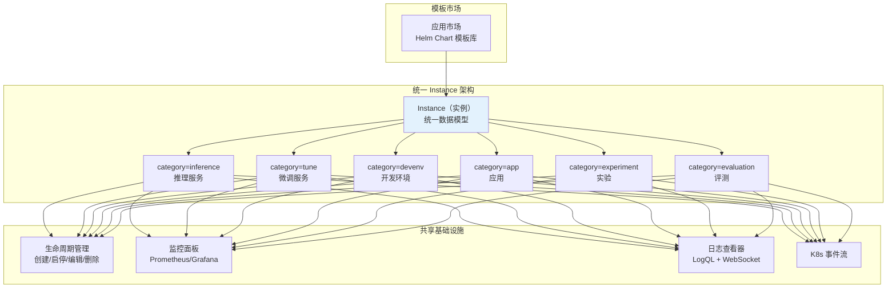
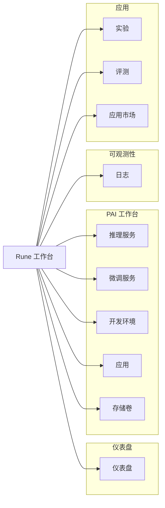
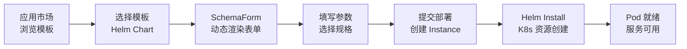
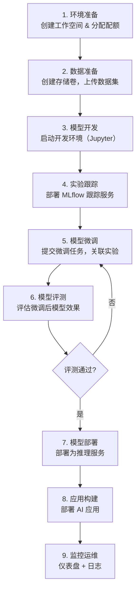

# Rune AI 工作台

## 简介

Rune AI 工作台是 Console 平台的核心模块，为 AI 工程师和研究者提供完整的 AI 工作负载全生命周期管理能力。从模型推理部署、微调训练、开发调试，到实验跟踪、模型评测和应用落地，Rune 覆盖了 AI 开发的每一个关键环节。

Rune 采用**统一的 Instance（实例）架构**和**模板驱动部署模型**，所有工作负载类型（推理、微调、开发环境、应用、实验、评测）共享相同的底层资源管理、生命周期控制和监控体系，大幅降低了用户的学习成本和运维复杂度。

### 设计理念

### 核心优势

- **统一架构**：所有工作负载类型共享 Instance 模型，操作方式一致，学习一次即可掌握全部功能
- **模板驱动**：基于 Helm Chart 的模板系统，通过 SchemaForm 动态生成配置表单，无需编写 YAML
- **多级资源管理**：集群 → 租户 → 工作空间三级配额体系，精细化的资源管控
- **多加速器支持**：支持 NVIDIA GPU、AMD GPU、华为 NPU、海光 DCU、寒武纪 MLU 等多种加速器
- **全链路可观测**：Prometheus 监控 + Loki 日志 + K8s 事件的完整可观测性方案

## 导航结构

进入 Rune 工作台后，左侧导航栏展示以下模块：

## 上下文选择

Rune 工作台中的资源操作需要选择正确的上下文：

1. **区域/集群**：顶部导航的区域选择器，选择目标计算集群
2. **工作空间**：紧挨区域选择器，选择具体的工作空间

> 💡 提示: 选择不同的区域和工作空间后，页面会自动刷新加载对应上下文的资源。所有工作负载（推理、微调、应用等）均在工作空间范围内运行，切换工作空间即可管理不同团队的资源。

---

## 统一 Instance 架构

Rune 平台的所有工作负载类型均基于统一的 **Instance** 数据模型，通过 `category` 字段区分不同类型。这意味着：

### 所有 Instance 类型共享的能力

| 能力 | 说明 |
|------|------|
| 模板部署 | 基于 Helm Chart 模板 + SchemaForm 动态表单 |
| 规格选择 | Flavor 规格（CPU/GPU/内存）|
| 生命周期 | 创建、启动、停止、编辑、删除 |
| 状态管理 | Installed → Healthy → Succeeded/Failed |
| 监控面板 | Prometheus 指标 + Grafana 风格面板 |
| 日志查看 | 实例级日志 + Pod 级日志 |
| K8s 事件 | Kubernetes 事件流 |
| Pod 管理 | Pod 列表、状态查看 |

### 各 Category 的独特特性

| Category | 独特特性 |
|----------|---------|
| `inference` | 网关注册、API 端点、模型名称展示 |
| `tune` | Web UI 访问、训练完成自动标记 Succeeded |
| `devenv` | Web UI 访问（Jupyter/VS Code） |
| `app` | PVC 列表、通用 Web 应用部署 |
| `experiment` | 实验端点 API、与微调任务集成 |
| `evaluation` | 评测 Web UI、基准测试结果 |

---

## 模板驱动部署模型

Rune 的所有实例部署都遵循统一的模板驱动流程：

1. **模板定义**：每个模板是一个 Helm Chart，包含 `values.schema.json` 定义可配置参数
2. **表单渲染**：Console 前端通过 SchemaForm 组件根据 Schema 动态生成配置表单
3. **参数填写**：用户在表单中填写参数（模型路径、超参数、资源规格等）
4. **实例创建**：提交后后端执行 Helm Install，在工作空间的 K8s Namespace 中创建资源
5. **状态同步**：系统持续同步 K8s 资源状态，展示实例的运行状况

---

## 功能模块总览

| 模块 | 说明 | Category | 权限要求 |
|------|------|----------|---------|
| [推理服务](./inference.md) | 部署模型推理 API，支持网关注册和多副本 | `inference` | ADMIN / DEVELOPER |
| [微调服务](./finetune.md) | 提交模型微调训练任务，支持 Web UI | `tune` | ADMIN / DEVELOPER |
| [开发环境](./devenv.md) | 启动 Jupyter/VS Code 交互式开发环境 | `devenv` | ADMIN / DEVELOPER |
| [应用管理](./app.md) | 部署各类 AI 应用，支持 PVC 管理 | `app` | ADMIN / DEVELOPER |
| [实验管理](./experiment.md) | 部署 MLflow/Aim 实验跟踪服务 | `experiment` | ADMIN / DEVELOPER |
| [评测管理](./evaluation.md) | 模型性能基准评测 | `evaluation` | ADMIN / DEVELOPER |
| [存储卷管理](./storage.md) | 管理 PVC 持久化存储卷 | — | ADMIN / DEVELOPER |
| [日志查看](./logging.md) | 日志查询和实时流 | — | ADMIN / DEVELOPER |
| [应用市场](./app-market.md) | 浏览和管理部署模板 | — | ADMIN / DEVELOPER |
| [工作空间管理](./workspace.md) | 管理工作空间和成员 | — | ADMIN |
| [配额管理](./quota.md) | 查看和管理资源配额 | — | ALL |
| [规格查看](./flavor.md) | 查看可用计算资源规格 | — | ALL |

---

## AI 开发全流程

Rune 平台覆盖 AI 开发的完整流程，以下是一个典型的工作流示例：

---

## 快速开始

### 首次使用

1. **选择上下文**：在顶部导航选择目标集群和工作空间
2. **浏览市场**：进入应用市场，了解可用的模板
3. **部署服务**：选择模板 → 填写参数 → 提交部署
4. **查看状态**：在对应的功能模块列表中查看实例状态
5. **访问服务**：实例就绪后，通过 Web 访问按钮或 API 端点使用服务

### 推荐学习路径

1. 先阅读[推理服务](./inference.md)文档，了解 Instance 架构的通用操作模式
2. 根据需求选择阅读[微调服务](./finetune.md)、[开发环境](./devenv.md)等专项文档
3. 了解[工作空间](./workspace.md)和[配额](./quota.md)的管理方式
4. 学习[日志](./logging.md)查看和故障排查方法

> 💡 提示: 由于所有工作负载类型共享统一的 Instance 架构，掌握了推理服务的操作流程后，微调、开发环境、应用等功能的使用方式非常类似，只需关注各自的独特特性即可。
