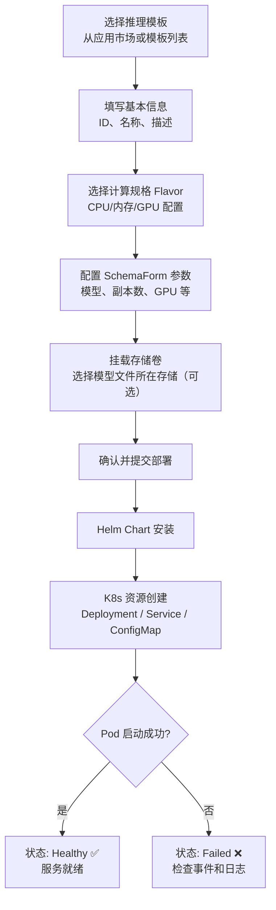
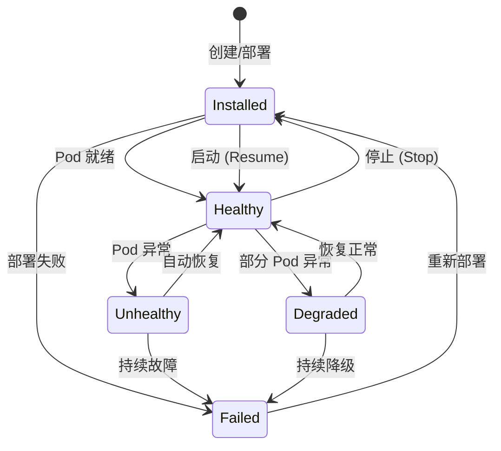
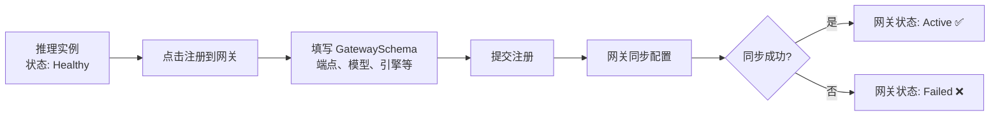

# 推理服务

## 功能概述

推理服务是 Rune 平台的核心功能之一，用于将已训练好的 AI 模型部署为在线推理（预测）服务。平台采用基于 Helm Chart 的模板驱动式部署架构，通过 SchemaForm 动态渲染部署表单，支持 vLLM、OpenAI 兼容接口等多种推理引擎，部署后可获得标准化的 API 端点供业务系统调用。

推理服务基于统一的 **Instance（实例）** 模型构建，所有推理实例共享相同的生命周期管理机制，并可通过网关注册功能将服务暴露给更广泛的使用者。

### 核心能力

- **模板驱动部署**：基于应用市场中的产品模板（Helm Chart）一键部署，无需手动编写 YAML
- **动态参数配置**：SchemaForm 根据模板的 `values.schema.json` 自动生成配置表单
- **完整生命周期管理**：支持创建、启动、停止、编辑、删除等全生命周期操作
- **网关注册**：将推理服务注册到 API 网关，支持多种访问级别和适配器配置
- **多维度监控**：集成 Prometheus 监控看板、日志查看器和 Kubernetes 事件流

## 进入路径

Rune 工作台 → 左侧导航 → **推理服务**

---

## 推理服务列表

列表页展示当前工作空间下所有推理服务实例，提供快速概览和操作入口。

### 列表列说明

| 列 | 说明 | 示例 |
|----|------|------|
| 名称 | 实例名称（即 K8s 资源名），点击可进入详情 | `llama3-70b-chat` |
| 状态 | 实例当前运行状态，以徽标形式展示 | 🟢 Healthy |
| 规格（Flavor） | 计算资源规格的可读描述 | `8C16G 1GPU` |
| 模型名称 | 当前部署的模型标识 | `Meta-Llama-3-70B` |
| 副本数 | 运行中的副本实例数 | `2` |
| 模板 | 使用的产品模板名称及版本 | `vLLM v1.2.0` |
| 创建时间 | 实例创建的时间戳 | `2025-06-15 10:30` |
| 操作 | 可执行的操作按钮组 | 启动 / 停止 / 删除 |

### 状态徽标说明

实例状态采用不同颜色的徽标展示，便于快速识别：

| 状态 | 颜色 | 含义 |
|------|------|------|
| Installed | 🔵 蓝色 | Helm Chart 已安装，资源正在创建中 |
| Healthy | 🟢 绿色 | 服务运行正常，所有 Pod 就绪 |
| Unhealthy | 🟡 黄色 | 部分 Pod 未就绪，服务可能受影响 |
| Degraded | 🟠 橙色 | 服务降级运行，功能受限 |
| Failed | 🔴 红色 | 部署失败或服务崩溃 |
| Succeeded | ⚪ 灰色 | 任务已完成（通常用于一次性任务） |

### 列表操作

- **搜索**：支持按实例名称进行关键字搜索
- **状态过滤**：下拉选择状态值，快速过滤特定状态的实例
- **刷新**：点击刷新按钮或启用自动刷新，获取最新状态
- **批量操作**：选中多个实例后可批量启动、停止或删除

---

## 创建推理服务

### 操作步骤

1. 点击列表页右上角的 **部署** 按钮
2. 在部署页面中选择推理模板（也可从应用市场一键跳转）
3. 填写基本信息和模板参数
4. 确认资源规格后提交

### 步骤一：填写基本信息

| 字段 | 类型 | 必填 | 说明 |
|------|------|------|------|
| ID（名称） | 文本 | ✅ | K8s 资源名，仅支持小写字母、数字和连字符，1-63 字符 |
| 显示名称 | 文本 | ✅ | 实例的可读名称，可包含中文 |
| 描述 | 文本域 | — | 对该推理服务的补充说明 |

> ⚠️ 注意: ID 字段一旦创建后不可修改，且在同一命名空间内必须唯一。请使用有意义的命名，例如 `llama3-70b-vllm`。

### 步骤二：配置模板参数（SchemaForm）

模板参数通过 **SchemaForm** 组件动态渲染。每个推理模板的 Helm Chart 中包含 `values.schema.json`，定义了该模板所需的全部可配置参数。SchemaForm 支持两种编辑模式：

#### 图形化模式

以直观的表单控件呈现参数，包括：
- **下拉选择器**：模型选择、GPU 类型等枚举参数
- **数字输入框**：副本数、GPU 数量等数值参数
- **文本输入框**：模型路径、端点名称等文本参数
- **开关控件**：特性开关（如量化开启/关闭）
- **嵌套表单**：复杂的多层参数结构

#### JSON 编辑模式

点击编辑器右上角的切换按钮可进入 JSON 原始编辑模式，适合高级用户直接修改 `values.yaml` 内容。

> 💡 提示: 两种模式的数据是实时同步的。在图形模式中修改参数后切换到 JSON 模式可检查实际值，反之亦然。

#### 常见模板参数示例

| 参数 | 说明 | 示例值 |
|------|------|--------|
| model | 要加载的模型名称或路径 | `/models/llama3-70b` |
| replicas | 服务副本数 | `2` |
| gpu_count | 每个副本使用的 GPU 数量 | `4` |
| tensor_parallel | 张量并行度 | `4` |
| max_model_len | 最大模型上下文长度 | `8192` |
| quantization | 量化方式 | `awq` / `gptq` / `none` |
| dtype | 计算精度 | `float16` / `bfloat16` |

### 部署流程

---

## 实例生命周期

推理服务实例遵循统一的 Instance 生命周期模型：

### 生命周期操作

| 操作 | 前置状态 | 目标状态 | 说明 |
|------|---------|---------|------|
| 创建（Create） | — | Installed | 提交部署配置，安装 Helm Chart |
| 启动（Resume） | Installed（已停止） | Healthy | 恢复已停止的实例，重新分配资源 |
| 停止（Stop） | Healthy / Unhealthy | Installed | 释放计算资源但保留配置，Pod 被清除 |
| 编辑（Edit） | 任意 | 不变 | 修改实例配置，部分参数需重启生效 |
| 删除（Delete） | 任意 | — | 彻底删除实例及关联的所有 K8s 资源 |

> 💡 提示: 停止操作会释放 GPU 等计算资源但保留 Helm Release 配置。当资源紧张时可暂时停止不常用的推理服务，需要时随时恢复。

---

## 管理推理服务

### 启动与停止

- **停止服务**：在列表中点击实例操作菜单 → **停止**，确认后实例状态变为 `Installed`，所有 Pod 被回收
- **启动服务**：对已停止的实例点击 **启动**，平台重新创建 Pod 并分配资源

> ⚠️ 注意: 停止和启动操作不会改变实例的配置参数，但会导致服务短暂不可用。请确保在业务低峰期进行操作。

### 编辑实例

在实例详情页或列表操作菜单中点击 **编辑**，可修改以下配置：

- 显示名称、描述
- SchemaForm 中的模板参数（如副本数、模型路径等）
- 挂载的存储卷

> ⚠️ 注意: 实例 ID 和所使用的模板不可修改。修改部分参数（如 GPU 数量）可能需要重启实例才能生效。

### 删除实例

删除操作将卸载 Helm Release 并清理所有关联的 Kubernetes 资源（Deployment、Service、ConfigMap 等）。

> ⚠️ 注意: 删除操作不可恢复。挂载的存储卷不会被删除，其中的模型文件仍然保留。

### 模型解密

部分加密模型需要先进行解密才能正常加载。在实例操作菜单中点击 **解密模型**，系统将使用预配置的密钥进行解密处理。

---

## 网关注册

网关注册功能允许将推理服务暴露到 API 网关，使其他用户或外部系统可以通过统一的网关入口调用模型推理接口。

### 注册流程

### GatewaySchema 配置字段

| 字段 | 类型 | 必填 | 说明 |
|------|------|------|------|
| endpoint | URL | ✅ | 推理服务的 API 端点地址，支持从实例端点自动补全 |
| accessLevel | 枚举 | ✅ | 访问级别：`public`（公开）/ `tenant`（租户内）/ `private`（私有） |
| models | 数组 | ✅ | 通过网关暴露的模型名称列表 |
| key | 文本 | — | API 认证密钥 |
| engine | 枚举 | ✅ | 推理引擎类型：`openai` / `vllm` |
| adapters | 数组 | — | LoRA 适配器配置列表 |

#### 访问级别详解

| 级别 | 含义 | 适用场景 |
|------|------|---------|
| `public` | 所有用户均可通过网关访问 | 通用模型服务，如基础 LLM |
| `tenant` | 仅同一租户内的用户可访问 | 租户专属的定制模型 |
| `private` | 仅创建者本人可访问 | 开发测试阶段的模型 |

#### 适配器（Adapters）配置

适配器用于加载 LoRA 微调权重，支持动态切换：

| 字段 | 说明 |
|------|------|
| name | 适配器名称，调用时通过此名称指定 |
| path | LoRA 权重文件的路径（通常挂载在存储卷中） |

### 网关状态

注册后，网关会持续同步和监控服务状态：

| 状态 | 含义 |
|------|------|
| Pending | 注册请求已提交，等待网关处理 |
| Active | 网关配置已生效，服务可通过网关访问 |
| Warning | 服务存在告警（如响应延迟过高） |
| Failed | 网关同步失败，需检查配置 |
| Syncing | 网关正在同步最新配置 |
| Paused | 网关路由已暂停/注销 |

### 注销网关

如需取消网关注册，在实例操作菜单中点击 **从网关注销**。注销后网关将停止路由流量到该实例。

---

## 推理服务详情

在列表中点击实例名称进入详情页，详情页包含多个功能标签页。

### 概览（Overview）

概览页包含两个核心区域：

#### ServiceInfoCard — 服务信息卡片

展示实例的关键信息摘要：

| 信息项 | 说明 |
|--------|------|
| 实例 ID | K8s 资源名称 |
| 显示名称 | 用户设置的可读名称 |
| 状态 | 当前运行状态 |
| 模板 | 使用的产品模板及版本 |
| 规格 | 计算资源规格描述（如 `8C16G 1GPU`） |
| 创建时间 | 实例创建的时间 |
| 端点地址 | 服务暴露的 API 端点列表 |

#### PodList — Pod 列表

以表格形式展示实例关联的所有 Kubernetes Pod：

- Pod 名称
- 运行状态（Running / Pending / Error / CrashLoopBackOff）
- 重启次数
- 所在节点
- 运行时长

### 监控（Monitoring）

集成 Prometheus 监控看板，展示实例的实时和历史性能指标：

- **GPU 利用率**：各 GPU 卡的使用率曲线
- **GPU 显存使用**：显存的使用量和剩余量
- **CPU 使用率**：CPU 核心的使用情况
- **内存使用率**：RSS 内存使用量
- **网络 I/O**：入站/出站流量
- **推理吞吐量**：每秒处理的请求数（RPS）
- **推理延迟**：P50 / P95 / P99 延迟分布

> 💡 提示: 监控页面的数据来源于集群中部署的 Prometheus 实例。首次加载可能需要几秒钟。支持自定义时间范围查询。

### 日志（Logging）

日志查看器（LogViewer）显示 Pod 容器的实时日志输出：

- 支持多容器切换
- 实时流式日志（Streaming）
- 日志搜索与高亮
- 日志下载

### 事件（Events）

Kubernetes 事件流，按时间倒序展示：

- Pod 调度事件（Scheduled / FailedScheduling）
- 镜像拉取事件（Pulling / Pulled / Failed）
- 容器启动事件（Started / BackOff）
- 健康检查事件（Unhealthy / Healthy）
- 资源配额事件（Quota exceeded）

> 💡 提示: 当实例状态为 Failed 时，事件页面通常包含最有价值的错误信息，是排查问题的首选入口。

---

## 权限要求

| 操作 | 所需角色 |
|------|---------|
| 查看列表和详情 | ADMIN / DEVELOPER / MEMBER |
| 部署新服务 | ADMIN / DEVELOPER |
| 编辑实例 | ADMIN / DEVELOPER |
| 启动/停止 | ADMIN / DEVELOPER |
| 删除实例 | ADMIN / DEVELOPER |
| 网关注册/注销 | ADMIN / DEVELOPER |
| 模型解密 | ADMIN / DEVELOPER |
| 查看监控和日志 | ADMIN / DEVELOPER / MEMBER |

---

## 故障排查

### 部署失败（状态 Failed）

1. **检查事件页面**：进入实例详情 → 事件标签，查看是否有资源不足、镜像拉取失败等错误
2. **检查日志**：进入日志标签，查看容器启动日志中的报错信息
3. **常见原因**：
   - GPU 资源配额不足：联系管理员扩展配额或选择较小规格
   - 镜像拉取失败：检查镜像仓库地址和拉取凭证配置
   - 模型文件缺失：检查存储卷中是否包含指定路径的模型文件
   - 端口冲突：检查服务端口配置是否与现有服务冲突

### 服务不健康（状态 Unhealthy / Degraded）

1. **查看 Pod 列表**：确认哪些 Pod 处于异常状态
2. **检查资源使用**：通过监控页面查看是否存在 GPU 显存溢出或 CPU 过载
3. **查看容器日志**：检查是否有 OOM（内存不足）或模型加载错误

### 网关注册失败

1. **检查端点地址**：确认推理服务的 API 端点可访问
2. **检查引擎类型**：确认 engine 参数与实际部署的推理引擎匹配
3. **检查模型名称**：确认 models 列表中的模型名称与实际加载的模型一致

---

## 最佳实践

- **合理选择规格**：根据模型大小选择合适的 GPU 显存。例如 70B 参数模型在 FP16 精度下约需 140GB 显存
- **使用多副本**：生产环境建议至少部署 2 个副本，确保高可用
- **启用量化**：对于资源受限的场景，可使用 AWQ 或 GPTQ 量化减少显存占用
- **合理设置访问级别**：开发阶段使用 `private`，测试通过后切换为 `tenant` 或 `public`
- **监控告警**：定期关注监控指标，特别是 GPU 显存使用率和推理延迟
- **及时停止闲置服务**：不使用的推理服务及时停止，释放 GPU 资源给其他用户
