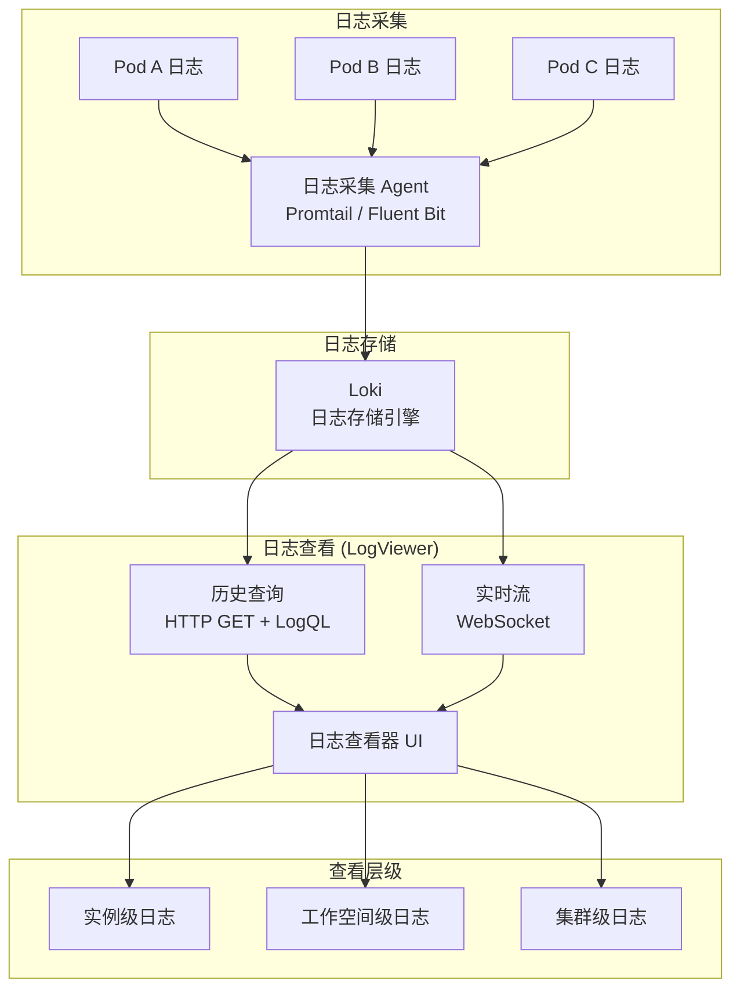
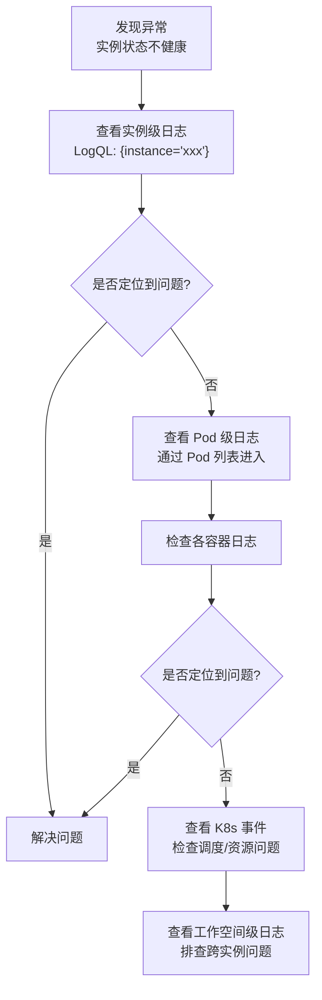

# 日志管理

## 功能概述

日志管理（Logging）是 Rune 平台中用于查看和分析工作负载运行日志的核心可观测性功能。平台提供了功能丰富的日志查看器（LogViewer），支持**历史日志查询**（基于 HTTP GET，采用 LogQL 语法）和**实时日志流**（基于 WebSocket 推送），覆盖实例级、工作空间级和集群级三个层级的日志查看需求。

无论是推理服务、微调任务、开发环境、应用还是实验/评测服务，所有 Instance 类型均支持日志查看。此外，用户还可以深入到单个 Pod 级别查看日志，便于精确排查问题。

### 核心能力

- **历史日志查询**：通过 HTTP GET 接口查询指定时间范围内的历史日志，支持 LogQL 语法
- **实时日志流**：通过 WebSocket 连接接收实时日志推送，自动滚动显示最新日志
- **标签过滤**：按 Pod、容器、命名空间等标签维度精准过滤日志
- **三级查看**：支持实例级、工作空间级、集群级三个层级的日志查看
- **Pod 级日志**：支持查看指定 Pod 内特定容器的日志

### 日志架构



## 进入路径

- **实例级日志**：实例详情页 → 日志标签页
- **工作空间级日志**：Rune 工作台 → 左侧导航 → **日志**
- **集群级日志**：BOSS → 集群管理 → 日志

---

## 日志查看器（LogViewer）


### 查看器配置

LogViewer 组件支持以下默认配置：

| 配置项 | 默认值 | 说明 |
|-------|--------|------|
| defaultLimit | 100 | 每次查询返回的最大日志条数 |
| showQueryBuilder | true | 是否显示查询构建器 |
| showStreamButton | true | 是否显示实时流开关按钮 |

### 界面组成

| 区域 | 功能 |
|------|------|
| 顶部工具栏 | 时间范围选择、查询输入框、刷新按钮、实时流开关 |
| 标签侧栏 | 标签（Label）选择面板，支持逐级过滤 |
| 日志主区域 | 日志内容展示区，按时间排序 |
| 底部状态栏 | 日志条数统计、加载状态 |

---

## 历史日志查询

历史日志通过 HTTP GET 接口查询，使用 **LogQL** 查询语法（兼容 Grafana Loki 语法）。

### LogQL 语法示例

#### 基础标签查询

```logql
# 查看指定 Pod 的日志
{pod="llama3-inference-0"}

# 查看指定容器的日志
{container="vllm", namespace="workspace-nlp"}

# 查看多个 Pod 的日志
{pod=~"llama3-inference-.*"}
```

#### 日志内容过滤

```logql
# 包含特定关键字
{pod="llama3-inference-0"} |= "error"

# 排除特定关键字
{pod="llama3-inference-0"} != "healthcheck"

# 正则匹配
{pod="llama3-inference-0"} |~ "ERROR|WARN"

# 多重过滤（AND 逻辑）
{pod="llama3-inference-0"} |= "request" |= "timeout"
```

#### JSON 日志解析

```logql
# 解析 JSON 日志中的字段
{pod="api-server-0"} | json | level="error"

# 按字段过滤
{pod="api-server-0"} | json | status_code >= 500
```

> 💡 提示: LogQL 语法与 Grafana Loki 的查询语言一致，如果您熟悉 PromQL 或 Loki，可以直接使用高级查询语法。对于简单的日志查看需求，使用标签过滤和关键字搜索即可。

### 时间范围选择

| 快捷选项 | 说明 |
|---------|------|
| 最近 15 分钟 | 最近 15 分钟的日志 |
| 最近 1 小时 | 最近 1 小时的日志 |
| 最近 3 小时 | 最近 3 小时的日志 |
| 最近 12 小时 | 最近 12 小时的日志 |
| 最近 24 小时 | 最近 24 小时的日志 |
| 自定义 | 自定义起止时间 |

---

## 实时日志流

点击 **实时流** 按钮开启 WebSocket 连接，接收实时日志推送。

### 实时流特性

| 特性 | 说明 |
|------|------|
| 协议 | WebSocket |
| 自动滚动 | 新日志到达时自动滚动到底部 |
| 暂停/恢复 | 支持暂停自动滚动，便于查看历史 |
| 标签过滤 | 实时流同样支持标签过滤 |
| 断线重连 | WebSocket 断开后自动重连 |

> ⚠️ 注意: 实时日志流会持续消耗网络带宽。在日志量非常大的场景下（如大量 Pod 同时输出日志），建议使用标签过滤精确关注目标 Pod，避免接收过多不相关日志。

---

## 标签过滤

标签（Labels）是日志的元数据维度，通过标签过滤可以精确定位目标日志。

### 常用标签

| 标签 | 说明 | 示例值 |
|------|------|--------|
| namespace | K8s 命名空间 | `workspace-nlp` |
| pod | Pod 名称 | `llama3-inference-0` |
| container | 容器名称 | `vllm`, `sidecar` |
| instance | 实例名称 | `llama3-inference` |
| node | K8s 节点名称 | `gpu-node-01` |

### 标签查询 API

每个日志层级提供以下标签相关 API：

| API | 说明 |
|-----|------|
| labels | 获取所有可用标签名列表 |
| label values | 获取指定标签的所有可选值 |
| series | 获取日志序列信息 |

### 使用标签过滤

1. 在日志查看器左侧的标签面板中选择标签名
2. 从标签值列表中选择一个或多个值
3. 日志查询条件自动更新
4. 点击查询或等待自动刷新

---

## 三级日志查看

### 实例级日志

- **入口**：实例（推理/微调/开发/应用/实验/评测）详情页 → 日志标签页
- **范围**：该实例关联的所有 Pod 日志
- **场景**：排查特定实例的运行异常

所有 Instance 类型均支持实例级日志查看：

| Instance 类型 | 说明 |
|--------------|------|
| 推理服务 | 查看推理引擎（vLLM 等）的运行日志 |
| 微调任务 | 查看训练过程的输出日志 |
| 开发环境 | 查看 Jupyter/VS Code 的启动和运行日志 |
| 应用 | 查看应用服务的运行日志 |
| 实验 | 查看实验跟踪服务（MLflow 等）的日志 |
| 评测 | 查看评测任务的执行日志 |

### Pod 级日志

- **入口**：实例详情页 → Pod 列表 → 点击 Pod 名称 → 日志
- **范围**：指定 Pod 内特定容器的日志
- **场景**：精确定位到某个 Pod 或容器的问题

> 💡 提示: 一个实例可能有多个 Pod（如多副本推理服务），每个 Pod 内可能有多个容器（如业务容器和 sidecar 容器）。当需要精确排查时，进入 Pod 级日志查看。

### 工作空间级日志

- **入口**：Rune 工作台 → 左侧导航 → 日志
- **范围**：当前工作空间（K8s Namespace）内所有 Pod 的日志
- **场景**：全局搜索某类错误、跨实例分析问题

### 集群级日志

- **入口**：BOSS → 集群管理 → 日志
- **范围**：整个集群所有命名空间的日志
- **场景**：平台管理员排查集群级别的问题

---

## 三级日志 API

每个层级提供相同结构的日志 API：

| API | 方法 | 说明 |
|-----|------|------|
| query | GET | 历史日志查询（支持 LogQL） |
| labels | GET | 获取可用标签列表 |
| label values | GET | 获取标签值列表 |
| series | GET | 获取日志序列信息 |
| stream | WebSocket | 实时日志流推送 |

### API 层级路径

| 层级 | 路径前缀 |
|------|---------|
| 实例级 | `/api/v1/.../instances/{instance}/logging/` |
| 工作空间级 | `/api/v1/.../workspaces/{workspace}/logging/` |
| 集群级 | `/api/v1/.../clusters/{cluster}/logging/` |

---

## 日志搜索与过滤技巧

### 常见搜索场景

| 场景 | 查询示例 | 说明 |
|------|---------|------|
| 查找错误日志 | `{pod="xxx"} \|= "error"` | 搜索包含 error 的日志 |
| 查找 OOM 异常 | `{pod="xxx"} \|~ "OOM\|OutOfMemory\|killed"` | 内存溢出相关 |
| 查找 GPU 错误 | `{pod="xxx"} \|~ "CUDA\|nccl\|GPU"` | GPU 相关错误 |
| 查找请求超时 | `{pod="xxx"} \|= "timeout"` | 超时相关日志 |
| 排除健康检查 | `{pod="xxx"} != "healthz" != "readyz"` | 过滤掉健康检查日志 |

### 日志分析流程



---

## 故障排查指南

### 常见日志问题及解决方案

| 问题 | 可能原因 | 排查方式 |
|------|---------|---------|
| 日志为空 | Pod 尚未启动或已被删除 | 检查 Pod 状态，确认时间范围 |
| 日志加载缓慢 | 查询范围过大 | 缩小时间范围，添加标签过滤 |
| 实时流断开 | WebSocket 连接超时 | 检查网络连接，刷新页面重试 |
| 找不到标签 | Pod 尚未产生日志 | 等待 Pod 启动并产生日志后刷新 |
| 日志显示乱码 | 日志编码问题 | 检查容器的日志输出编码设置 |

### 日志无法显示时的检查清单

1. ✅ 确认实例状态不是 `Installed`（Pod 可能还在创建中）
2. ✅ 确认时间范围包含了日志产生时间
3. ✅ 检查标签过滤是否过于严格
4. ✅ 尝试移除所有过滤条件，查看完整日志
5. ✅ 检查日志采集 Agent 是否正常运行

> ⚠️ 注意: 日志系统有存储时效限制。超过保留期限的历史日志将自动清理。具体保留期限取决于平台配置，通常为 7-30 天。

---

## 权限要求

| 操作 | 所需角色 |
|------|---------|
| 查看实例级日志 | ADMIN / DEVELOPER |
| 查看工作空间级日志 | ADMIN / DEVELOPER |
| 查看集群级日志 | 平台管理员（BOSS 端） |
| 使用实时日志流 | ADMIN / DEVELOPER |
