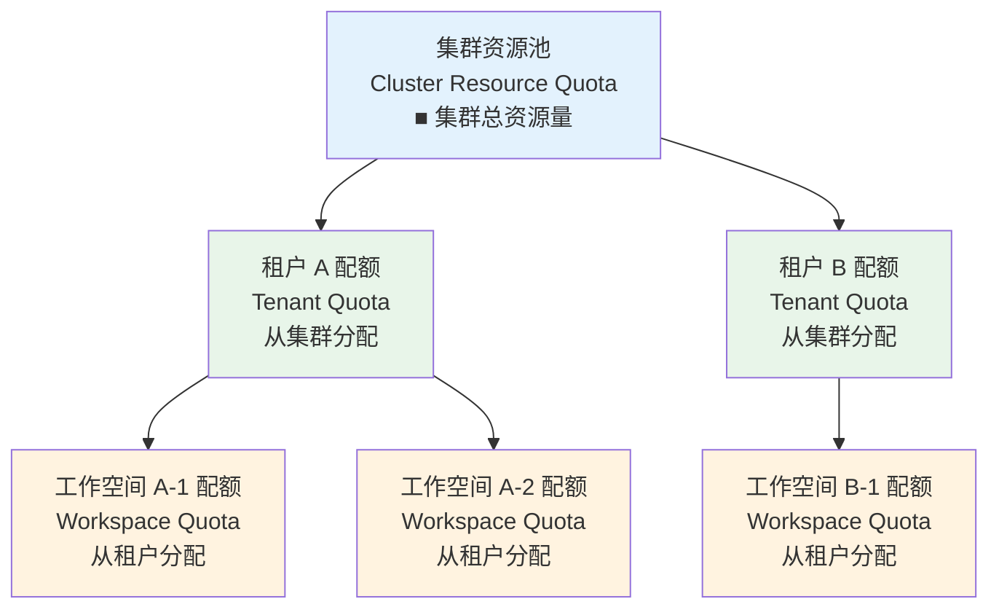
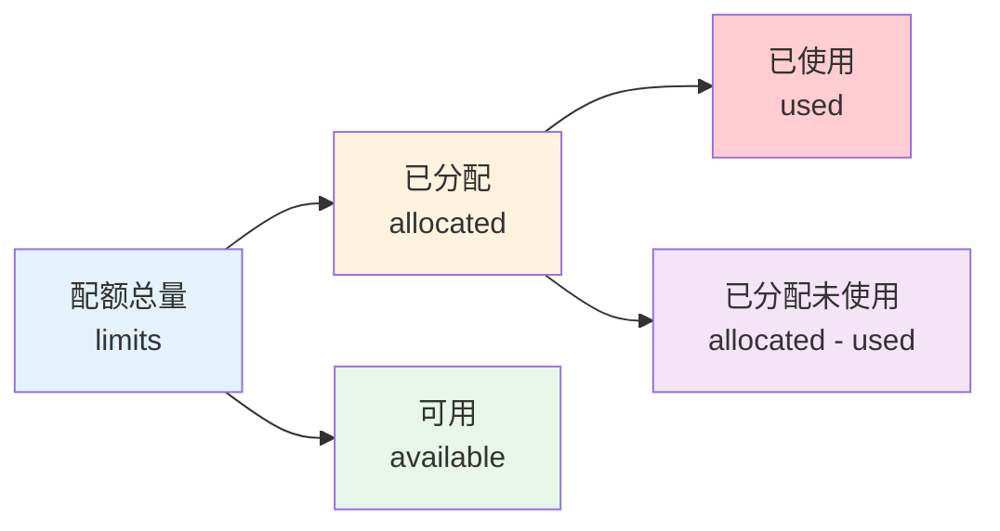

# 配额管理

## 功能概述

配额管理（Quota）是 Rune 平台中用于控制和分配计算资源使用上限的核心功能。平台采用**三级配额层级体系**——从集群（Cluster）到租户（Tenant）再到工作空间（Workspace）——实现资源的逐级分配和精细化管控。通过配额机制，平台管理员可以确保多租户环境下的资源公平分配，防止单个租户或工作空间过度占用集群资源。

### 核心能力

- **三级层级管理**：集群 → 租户 → 工作空间，逐级分配资源
- **多种资源类型**：支持 CPU、内存、GPU、vGPU、NPU、存储等多种资源类型
- **GPU 型号管理**：按 GPU 型号（NVIDIA A100、AMD MI300 等）独立管控配额
- **实时监控**：查看各级配额的已分配、已使用、可用量
- **超额保护**：资源使用达到配额上限时自动拒绝新的部署请求

### 三级配额层级

> 💡 提示: 集群级配额由平台管理员在 BOSS 端管理，租户级配额由平台管理员分配给各租户，工作空间级配额由租户管理员在 Console 端从租户配额中分配到各工作空间。

## 进入路径

- **租户配额查看**：`/rune/tenants/:tenant/quotas`
- **工作空间配额管理**：工作空间概览页 → 配额管理

---

## 配额资源类型

### QuotaResource 数据模型

每条配额记录包含以下核心字段：

| 字段 | 说明 | 示例值 |
|------|------|--------|
| resourceName | K8s 资源名称 | `cpu`, `memory`, `nvidia.com/gpu` |
| name | 资源显示名称 | `CPU`, `NVIDIA A100 GPU` |
| type | 资源分类 | `cpu`, `gpu`, `vgpu`, `storage` |
| model | 加速器型号 | `NVIDIA-A100`, `NVIDIA-H100` |
| vendor | 加速器厂商 | `nvidia`, `intel`, `ascend` |
| ratio | 资源超配比率 | `1.0`（不超配）、`1.5`（1.5倍超配） |
| candidates | 可选值列表 | 可选择的规格值 |
| default | 默认值 | 资源的默认分配量 |
| max | 最大值 | 允许分配的上限 |
| min | 最小值 | 最低分配量 |
| nodeSelector | 节点选择器 | 指定调度到特定节点 |

### 资源类型详解

| 类型 | 说明 | K8s 资源名 | 单位 |
|------|------|-----------|------|
| CPU | 中央处理器核心 | `cpu` | 核（Core） |
| 内存 | 运行时内存 | `memory` | GiB |
| GPU | 物理 GPU 卡 | `nvidia.com/gpu`, `amd.com/gpu` | 卡（Card） |
| vGPU | 虚拟 GPU（GPU 显存切分） | `nvidia.com/vgpu` | 虚拟卡 |
| NPU | 神经网络处理器 | `ascend.com/npu` | 卡 |
| 存储 | 持久化存储容量 | `requests.storage` | GiB |

### GPU 型号支持

平台支持多种 GPU/加速器厂商和型号：

| 厂商 | 加速器类型 | 典型型号 | vendor 值 |
|------|-----------|---------|-----------|
| NVIDIA | GPU | A100 40G/80G, H100, V100, A10, L40S, RTX 4090 | `nvidia` |
| AMD | GPU | MI300X, MI250X | `amd` |
| 华为 | NPU | Ascend 910B, Ascend 310P | `ascend` |
| 海光 | DCU | Z100, Z100L | `hygon` |
| 寒武纪 | MLU | MLU370, MLU590 | `cambricon` |
| Intel | GPU | Gaudi2, Gaudi3 | `intel` |

---

## 配额数据展示

### 配额响应模型

查询配额接口返回以下信息：

| 字段 | 说明 |
|------|------|
| cluster | 所属集群 |
| resourcePool | 资源池名称 |
| type | 资源类型（cpu/gpu/vgpu/storage） |
| model | 加速器型号 |
| vendor | 厂商 |
| config[] | 资源配置数组（包含 resourceName, min, max, default 等） |
| limits | 配额上限（最大可分配量） |
| requests | 配额请求量（实际请求的资源） |
| status.allocated | 已分配量（已分配给下级或实例的资源） |
| status.available | 可用量（尚未分配的剩余资源） |
| status.used | 已使用量（实际正在使用的资源） |
| status.usedLimits | 已用 Limits 量（正在使用的 Limits 值） |

### 配额状态解读

| 状态指标 | 计算方式 | 说明 |
|---------|---------|------|
| 已分配（allocated） | 已分配给下级的资源总和 | 租户级：已分配给工作空间的总量 |
| 可用（available） | limits - allocated | 还可以分配给下级的剩余量 |
| 已使用（used） | 实际运行中的 Pod 使用量 | 真实的资源消耗 |
| 使用率 | used / limits × 100% | 实际资源利用率 |

---

## 租户配额查看

在 Console 端，租户成员可以查看本租户在各集群中的配额分配情况。

### 配额列表

| 列 | 说明 |
|----|------|
| 集群 | 所属集群名称 |
| 资源池 | 资源池名称 |
| 资源类型 | CPU / GPU / 内存 / 存储 |
| GPU 型号 | GPU 型号（GPU 类型配额显示） |
| 已分配 | 已分配给工作空间的量 |
| 已使用 | 当前实际使用量 |
| 配额上限 | 管理员分配的最大可用量 |
| 使用率 | 使用进度条 |

> 💡 提示: 租户配额由平台管理员在 BOSS 端分配。如果需要增加配额，请联系平台管理员。

---

## 工作空间配额管理

租户管理员可以在工作空间级别创建和编辑配额，将租户配额分配到各工作空间。

### 创建工作空间配额

1. 进入工作空间概览页
2. 点击 **配额** 标签页
3. 点击 **创建配额** 按钮
4. 选择资源类型和设置配额值
5. 提交保存

### 配额创建表单

| 字段 | 说明 |
|------|------|
| 资源类型 | 选择要分配的资源类型（CPU / GPU / 内存等） |
| GPU 型号 | 若选择 GPU 类型，需指定具体型号 |
| Requests | 资源请求量（常规保证量） |
| Limits | 资源上限量（最大可用量） |

### 编辑配额

1. 在配额列表中找到要修改的配额项
2. 点击 **编辑** 按钮
3. 调整 Requests / Limits 值
4. 提交保存

> ⚠️ 注意: 工作空间的配额之和不能超过租户在该集群上的可用配额。创建或增加配额时，如果超过租户可用量，系统将提示错误。

---

## 三级配额 API

平台在三个层级均提供配额管理 API：

### 集群级（BOSS 端）

| API | 方法 | 说明 |
|-----|------|------|
| 集群资源配额列表 | GET | 查看集群资源池的总配额 |
| 集群资源配额详情 | GET | 查看特定资源池的详细配额 |

### 租户级

| API | 方法 | 说明 |
|-----|------|------|
| 租户配额列表 | GET | 查看租户在各集群的配额 |
| 租户配额详情 | GET | 查看特定集群的配额详情 |

### 工作空间级

| API | 方法 | 说明 |
|-----|------|------|
| 工作空间配额列表 | GET | 查看工作空间的配额 |
| 创建工作空间配额 | POST | 为工作空间分配配额 |
| 编辑工作空间配额 | PUT | 修改工作空间配额 |
| 删除工作空间配额 | DELETE | 移除工作空间配额 |

---

## 配额使用监控

### 监控指标

建议关注以下配额使用指标：

| 指标 | 建议阈值 | 说明 |
|------|---------|------|
| GPU 使用率 | > 80% 预警 | GPU 是最稀缺的资源，需重点关注 |
| CPU 使用率 | > 85% 预警 | CPU 使用率过高可能影响调度 |
| 内存使用率 | > 90% 预警 | 内存不足可能导致 OOM Kill |
| 存储使用率 | > 85% 预警 | 存储空间不足会导致写入失败 |

### 配额不足时的处理

当配额不足时，以下操作将受到影响：

1. **新实例部署被拒绝**：系统返回配额不足错误
2. **实例扩容受限**：无法增加副本数或升级规格
3. **PVC 创建失败**：存储配额不足时无法创建新的持久卷

处理方式：
- 清理不再使用的实例和存储卷，释放已用配额
- 联系租户管理员增加工作空间配额
- 联系平台管理员增加租户级配额

---

## 最佳实践

### 配额规划

1. **按需分配**：根据团队实际需求分配配额，避免过度预留导致资源闲置
2. **预留缓冲**：为每个工作空间预留 10-20% 的配额余量，应对突发需求
3. **分类管理**：将 GPU 密集型任务（推理、微调）与 CPU 密集型任务（数据处理）分配到不同工作空间

### 资源优化

1. **及时释放**：完成的微调任务及时删除，释放 GPU 配额
2. **规格选择**：选择适当的 Flavor 规格，避免过度分配资源
3. **定期审计**：定期检查各工作空间的配额使用情况，回收闲置配额

### GPU 配额管理

1. **按型号管理**：不同型号的 GPU 独立管理配额，如 A100 和 V100 分开计量
2. **优先级规划**：生产推理服务优先获取 GPU 配额，实验性任务在空闲时使用
3. **vGPU 利用**：对于显存需求较小的任务，使用 vGPU 提高资源利用率

---

## 权限要求

| 操作 | 所需角色 |
|------|---------|
| 查看租户配额 | ALL |
| 查看工作空间配额 | ALL |
| 创建/编辑工作空间配额 | ADMIN（租户管理员 / 工作空间管理员） |
| 删除工作空间配额 | ADMIN |
| 管理集群/租户级配额 | 平台管理员（BOSS 端） |
