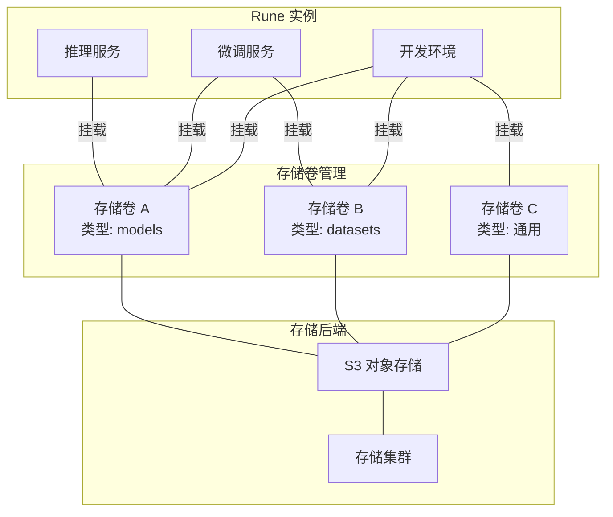
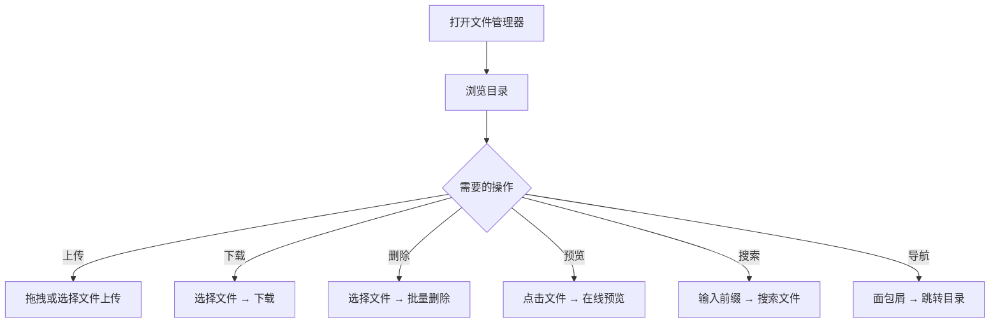
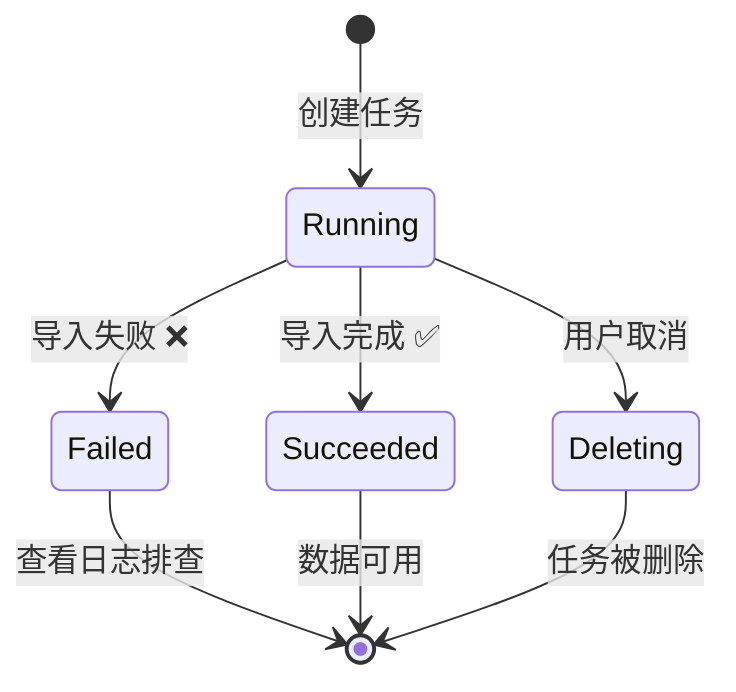

# 存储卷管理

## 功能概述

存储卷（StorageVolume）是 Rune 平台的持久化数据层，为推理服务、微调训练、开发环境等实例提供模型文件、数据集和工作产出的存储能力。每个存储卷底层对应一个 S3 兼容的对象存储空间，内置全功能文件管理器和多来源数据导入任务系统。

### 核心能力

- **类型化管理**：支持 models（模型）和 datasets（数据集）两种卷类型标签，便于分类管理
- **全功能文件管理器**：基于 S3 代理的 Web 文件浏览器，支持上传、下载、删除、预览、搜索等操作
- **多来源数据导入**：支持从 Git、HuggingFace、ModelScope、Python 环境、Moha 等多种来源导入数据
- **S3 账户管理**：内置 S3 AccessKey/SecretKey 管理，支持只读和读写权限
- **容量弹性扩展**：支持在线扩容（仅增大），无需中断服务
- **README 支持**：支持渲染和上传存储卷的 README.md 文档说明

### 架构概览

## 进入路径

Rune 工作台 → 左侧导航 → **存储卷**

---

## 存储卷列表

列表页展示当前工作空间下所有存储卷，提供快速概览和管理入口。

### 列表列说明

| 列 | 说明 | 示例 |
|----|------|------|
| 名称（name） | 存储卷名称，点击进入详情 | `llama3-weights` |
| 状态（status） | 存储卷状态 | 🟢 Bound |
| 存储集群（storage_cluster） | 所属存储集群名称 | `cluster-main` |
| 使用量/容量（usage_capacity） | 已使用空间/总容量 | `45Gi / 100Gi` |
| 文件数量（file_count） | 存储卷中的文件总数 | `1,234` |
| 挂载模式（mount_mode） | 读写或只读 | `ReadWrite` / `ReadOnly` |
| 卷类型（volume_type） | 存储卷类型标签 | `models` / `datasets` |
| 操作 | 可执行操作 | 文件管理 / 编辑 / 删除 |

### 状态说明

| 状态 | 含义 |
|------|------|
| Bound | 存储卷已绑定并就绪，可正常使用 |
| Pending | 存储卷正在创建中 |
| Failed | 存储卷创建或绑定失败 |

### 列表操作

- **搜索**：按名称关键字搜索存储卷
- **类型过滤**：按卷类型（models / datasets / 全部）过滤
- **刷新**：手动刷新列表获取最新状态

---

## 创建存储卷

### 操作步骤

1. 点击列表页右上角的 **创建** 按钮
2. 填写存储卷配置表单
3. 确认并提交

### 配置字段

| 字段 | 类型 | 必填 | 验证规则 | 说明 |
|------|------|------|---------|------|
| 名称（name） | 文本 | ✅ | 1-63 字符，仅小写字母、数字、连字符，符合 K8s 命名规范 | 存储卷唯一标识 |
| 存储集群（storageCluster） | 自动补全选择 | ✅ | 从可用存储集群中选择 | 目标存储集群 |
| 容量值（sizeValue） | 数字 | ✅ | ≥ 1 | 存储容量数值 |
| 容量单位（sizeUnit） | 选择 | ✅ | Mi / Gi / Ti | 存储容量单位 |
| 只读标志（readonly） | 单选 | ✅ | 读写 / 只读 | 是否设置为只读卷 |
| 卷类型（volumeType） | 单选 | ✅ | 未设置 / models / datasets | 存储卷类型标签 |
| 描述（description） | 文本域 | — | — | 存储卷补充说明 |

> 💡 提示: 名称必须符合 Kubernetes 命名规范 `[a-z0-9]([-a-z0-9]*[a-z0-9])?`，不能以连字符开头或结尾，且在同一命名空间内不能重复。

#### 卷类型说明

| 类型 | 含义 | 典型用途 |
|------|------|---------|
| 未设置 | 通用存储卷 | 代码、配置文件、混合用途 |
| models | 模型存储卷 | 存放预训练模型权重、微调输出权重 |
| datasets | 数据集存储卷 | 存放训练数据、验证数据、测试数据 |

> 💡 提示: 卷类型仅作为分类标签用于管理和组织，不会影响存储卷的实际行为。但在部署推理/微调实例时，模板可能会根据卷类型进行筛选推荐。

#### 只读模式说明

- **读写模式**（默认）：挂载的实例可以读取和写入文件
- **只读模式**：挂载的实例只能读取文件，无法修改或删除

> ⚠️ 注意: 只读标志通过 Label 存储在 StorageVolume 资源上。将已有读写卷切换为只读时，已挂载的实例可能需要重启才能生效。

---

## 文件管理器

文件管理器是存储卷的核心交互功能，通过 S3 代理提供 Web 端的文件浏览和操作能力。

> ⚠️ 注意: 仅**受管存储卷**（托管在平台存储集群上的卷）支持文件管理器功能。外部挂载的存储卷不提供此功能。

### 进入方式

- 在存储卷列表中点击操作列的 **文件管理** 按钮
- 在存储卷详情页中切换到 **文件管理** 标签页

### 功能详解

#### 文件浏览

- 以列表形式展示当前目录下的文件和子目录
- 支持面包屑导航，快速切换到上级目录
- 显示文件名、大小、修改时间等信息

#### 文件上传

- 支持拖拽上传和点击选择上传
- 支持多文件同时上传
- 上传进度实时显示

#### 文件下载

- 点击文件操作菜单中的 **下载** 按钮
- 支持单文件下载

#### 文件删除

- 支持批量选择后删除
- 删除操作需要确认，防止误操作

> ⚠️ 注意: 文件删除操作不可恢复，请谨慎操作。建议在删除前先下载备份重要文件。

#### 文件预览

- **文本文件**：在线预览文本内容（`.txt`、`.json`、`.yaml`、`.py`、`.md` 等）
- **图片文件**：在线预览图片（`.png`、`.jpg`、`.gif`、`.svg` 等）
- 其他格式文件不支持在线预览，需下载后查看

#### 文件搜索

- 支持按文件名前缀搜索
- 搜索输入框内置 **300ms 防抖**（debounce），避免频繁请求
- 搜索范围为当前目录及子目录

#### 路径导航

- **面包屑导航**：显示当前完整路径，点击任意层级可快速跳转
- **路径复制**：点击复制按钮可将当前路径复制到剪贴板，便于在其他地方引用

### 文件管理器操作汇总

---

## 存储卷详情

在列表中点击存储卷名称进入详情页。

### 基本信息

详情页展示存储卷的核心信息，部分字段支持在线编辑：

| 信息项 | 说明 | 是否可编辑 |
|--------|------|-----------|
| 名称 | 存储卷名称 | ❌ 不可修改 |
| 描述 | 补充说明文本 | ✅ 可编辑 |
| 容量 | 当前存储容量 | ✅ 仅支持扩容（增大），不可缩小 |
| 读写模式 | ReadWrite / ReadOnly | ✅ 可切换 |
| 卷类型 | models / datasets / 未设置 | ✅ 可切换 |
| 存储集群 | 所属存储集群 | ❌ 不可修改 |
| S3 地址 | S3 兼容的访问地址 | ❌ 只读 |
| Bucket 名称 | S3 存储桶名称 | ❌ 只读 |
| 状态 | 当前状态（Bound 等） | ❌ 只读 |

> ⚠️ 注意: 容量变更仅支持**扩容**操作。由于底层存储机制限制，已分配的空间无法缩小。请在创建时合理评估所需容量。

### S3 账户管理

每个存储卷包含一个或多个 S3 访问账户，用于通过 S3 兼容接口直接访问存储内容：

| 字段 | 说明 |
|------|------|
| accessKey | S3 Access Key ID |
| secretKey | S3 Secret Access Key（默认隐藏，点击显示） |
| role | 账户角色（读写/只读） |

- 密钥信息默认以 `***` 形式隐藏，点击"显示"按钮查看完整密钥
- 支持复制密钥到剪贴板

> 💡 提示: S3 账户可用于在外部工具（如 `s3cmd`、`rclone`、`boto3`）中直接访问存储卷文件，适合需要批量操作或自动化的场景。

### README.md 支持

存储卷详情页支持 README.md 文档的渲染和管理：

- 如果存储卷根目录下存在 `README.md` 文件，详情页将自动渲染展示
- 支持上传新的 `README.md` 文件，用于描述存储卷的内容、用途和使用方法
- Markdown 渲染支持标准语法（标题、列表、代码块、表格、图片等）

> 💡 提示: 建议为每个重要的存储卷编写 README.md，描述存储的模型或数据集的来源、版本、格式和使用说明，方便团队协作。

---

## 存储卷任务

存储卷任务（Storage Jobs）允许从多种外部来源自动化导入数据到存储卷中。这是批量获取模型权重、数据集和依赖环境的核心功能。

### 进入方式

在存储卷详情页中切换到 **任务** 标签页。

### 任务类型

平台支持以下 5 种数据导入来源：

#### 1. Git 仓库

从 Git 仓库克隆代码或数据：

| 字段 | 类型 | 必填 | 说明 |
|------|------|------|------|
| url | 文本 | ✅ | Git 仓库地址（HTTPS） |
| branch | 文本 | — | 分支名称（默认 main） |
| username | 文本 | — | 认证用户名（私有仓库） |
| password | 密码 | — | 认证密码或 Token |

#### 2. HuggingFace

从 HuggingFace Hub 下载模型或数据集：

| 字段 | 类型 | 必填 | 说明 |
|------|------|------|------|
| type | 枚举 | ✅ | 资源类型：model / dataset |
| repo | 文本 | ✅ | 仓库 ID（如 `meta-llama/Llama-3-8B`） |
| branch | 文本 | — | 分支/版本（默认 main） |
| token | 密码 | — | HuggingFace API Token（门控模型需要） |

#### 3. ModelScope

从 ModelScope（魔搭社区）下载模型或数据集：

| 字段 | 类型 | 必填 | 说明 |
|------|------|------|------|
| type | 枚举 | ✅ | 资源类型：model / dataset |
| repo | 文本 | ✅ | 仓库 ID（如 `ZhipuAI/chatglm3-6b`） |
| branch | 文本 | — | 分支/版本 |
| token | 密码 | — | ModelScope API Token |

#### 4. Python 环境

配置 Python 虚拟环境和依赖包：

| 字段 | 类型 | 必填 | 说明 |
|------|------|------|------|
| reset | 布尔 | — | 是否重置现有环境 |
| requires | 文本 | — | pip requirements 内容 |
| version | 文本 | — | Python 版本要求 |
| pip | 文本 | — | pip 镜像源配置 |
| condas | 文本 | — | conda 频道配置 |

#### 5. Moha（平台内部）

从 Moha 内部仓库导入模型或数据集：

| 字段 | 类型 | 必填 | 说明 |
|------|------|------|------|
| type | 枚举 | ✅ | 资源类型：model / dataset |
| visibility | 枚举 | — | 可见性：public / private |
| repo | 文本 | ✅ | 仓库 ID |
| branch | 文本 | — | 分支/版本 |
| token | 密码 | — | 认证 Token |
| endpoint | 文本 | — | Moha 服务端点地址 |

### 任务生命周期

### 任务状态说明

| 状态 | 含义 |
|------|------|
| Running | 任务正在执行中 |
| Succeeded | 任务已成功完成 |
| Failed | 任务失败，需查看日志排查原因 |
| Deleting | 任务正在被删除 |

### 任务列表

| 列 | 说明 |
|----|------|
| 任务名称 | 唯一标识 |
| 类型 | 任务来源类型（Git / HuggingFace / ModelScope / PythonEnv / Moha） |
| 状态 | 运行状态 |
| 创建时间 | 任务创建时间 |
| 操作 | 查看日志 / 删除 |

### 创建任务操作步骤

1. 进入存储卷详情页 → **任务** 标签
2. 点击 **创建任务** 按钮
3. 选择任务类型（Git / HuggingFace / ModelScope / PythonEnv / Moha）
4. 填写对应的配置字段
5. 确认并提交

> 💡 提示: 从 HuggingFace 下载门控模型（如 Llama 系列）需要提供有权限的 API Token。请先在 HuggingFace 官网同意模型许可协议并生成 Access Token。

> ⚠️ 注意: 大型模型文件（如 70B 参数模型可能超过 140GB）的下载耗时较长。请确保存储卷容量充足，并遵循网络带宽的限制。任务运行期间请勿删除存储卷。

---

## 容量监控

存储卷的容量使用情况通过 Prometheus 指标进行监控：

- **已使用容量**：当前存储卷中所有文件的总大小
- **总容量**：存储卷的分配容量上限
- **使用率**：已使用容量 / 总容量的百分比
- **文件数量**：存储卷中的文件总数

> 💡 提示: 当使用率超过 80% 时，建议及时扩容或清理不再需要的文件，避免写入失败。

---

## 权限要求

| 操作 | 所需角色 |
|------|---------|
| 查看存储卷列表 | ADMIN / DEVELOPER / MEMBER |
| 创建存储卷 | ADMIN / DEVELOPER |
| 编辑存储卷（描述/容量/类型） | ADMIN / DEVELOPER |
| 删除存储卷 | ADMIN / DEVELOPER |
| 文件管理（上传/下载/删除） | ADMIN / DEVELOPER |
| 创建/删除任务 | ADMIN / DEVELOPER |

---

## 故障排查

### 存储卷创建失败

1. **检查名称格式**：确认名称符合 K8s 命名规范（1-63 字符，仅小写字母数字连字符）
2. **检查存储集群**：确认目标存储集群可用且有足够容量
3. **检查配额**：确认工作空间的存储配额是否充足

### 文件上传失败

- 检查文件大小是否超过限制
- 确认网络连接稳定
- 检查存储卷剩余容量是否充足
- 尝试刷新页面后重新上传

### 存储任务失败

- **Git 克隆失败**：检查仓库 URL 是否正确、认证信息是否有效
- **HuggingFace 下载失败**：检查 repo ID 是否正确、Token 是否有权限、网络是否可达
- **ModelScope 下载失败**：与 HuggingFace 类似，检查认证和网络
- **Python 环境配置失败**：检查 requirements 格式是否正确、包版本是否兼容

### 挂载到实例后无法写入

- 确认存储卷是否设置为只读模式
- 检查挂载路径的权限设置
- 确认实例中的用户是否有写入权限

---

## 最佳实践

- **合理规划容量**：根据存储内容预估容量。例如，7B 参数模型约 13-15GB（FP16），70B 参数模型约 130-140GB
- **使用类型标签**：为存储卷设置正确的 models / datasets 类型，便于分类管理和在部署时快速选择
- **编写 README**：为每个存储卷编写 README.md，记录来源、版本、格式等信息
- **定期清理**：删除不再需要的模型检查点和临时文件，释放存储空间
- **利用 S3 API**：对于大量文件的批量操作，使用 S3 账户通过 `rclone`、`s3cmd` 等工具直接访问，效率更高
- **避免频繁扩缩容**：由于容量只能增大不能缩小，建议在创建时预留适当的空间余量
- **使用只读模式保护数据**：对于共享的模型权重等重要数据，设置为只读模式防止意外修改
- **利用存储任务导入数据**：优先使用存储任务自动化导入，避免手动上传大文件带来的不稳定性
