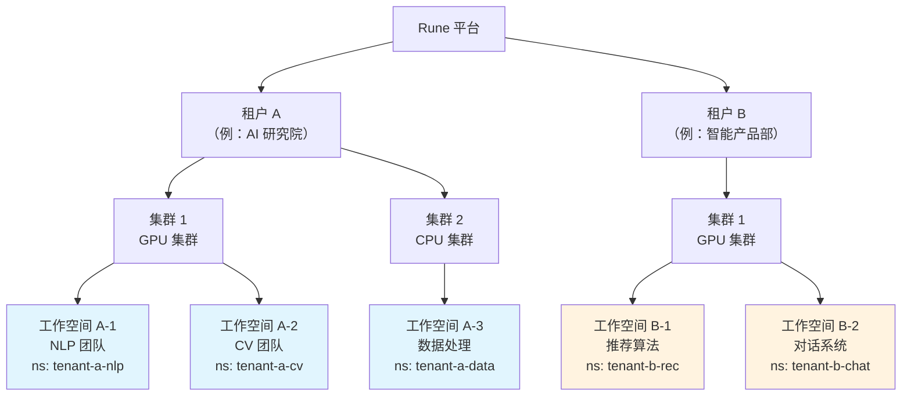
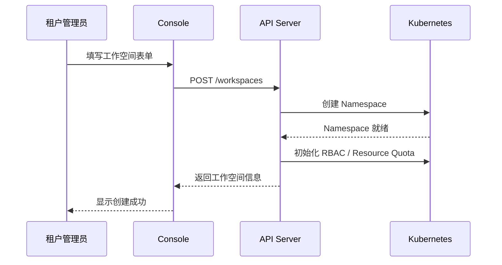
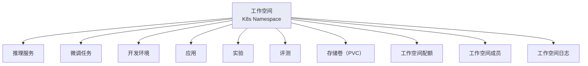
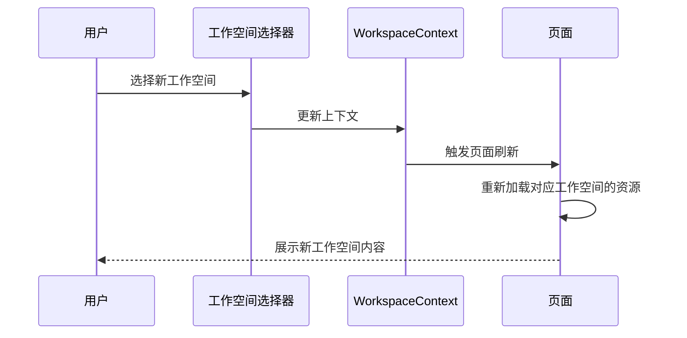
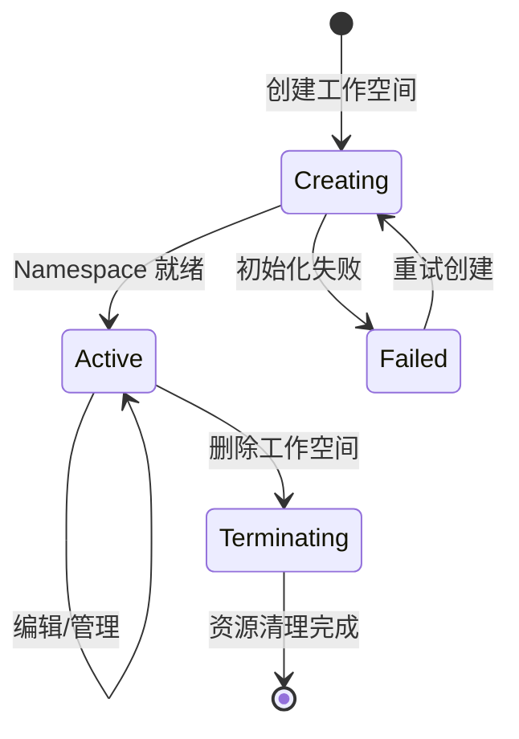

# 工作空间管理

## 功能概述

工作空间（Workspace）是 Rune 平台中最小的资源隔离单元，也是用户日常使用 AI 工作负载的基本操作范围。每个工作空间绑定到一个特定的**租户（Tenant）**和**集群（Cluster）**，并拥有独立的 Kubernetes 命名空间（Namespace），实现资源、权限和网络的完全隔离。

在多租户架构中，组织通过租户划分不同的业务线或部门，每个租户可以在多个集群中创建多个工作空间。工作空间内的所有资源——推理服务、微调任务、开发环境、应用、存储卷等——都在其独立的命名空间中运行，互不干扰。

### 核心能力

- **资源隔离**：每个工作空间绑定独立的 K8s Namespace，实现计算、存储和网络隔离
- **成员管理**：独立的成员和角色体系，精细化的权限控制
- **配额管理**：从租户配额中分配资源配额到工作空间级别
- **上下文切换**：通过顶部上下文选择器在不同工作空间间快速切换
- **生命周期管理**：完整的创建、编辑、删除等生命周期操作

### 多租户层级架构

## 进入路径

Rune 工作台 → 工作空间管理（通过 URL 直接访问）

路径：`/rune/tenants/:tenant/clusters/:cluster/workspaces`

---

## 工作空间列表

列表页展示当前租户在指定集群下的所有工作空间，提供概览和管理入口。

### 列表列说明

| 列 | 说明 | 示例 |
|----|------|------|
| 名称 | 工作空间显示名称，点击进入概览 | `NLP 研发组` |
| ID | 工作空间唯一标识 | `nlp-team` |
| 状态 | 工作空间当前状态 | 🟢 Active |
| 集群 | 所属集群名称 | `gpu-cluster-bj` |
| Namespace | 绑定的 K8s 命名空间 | `tenant-a-nlp` |
| 创建时间 | 创建时间戳 | `2025-05-01 09:00` |
| 操作 | 可执行操作 | 概览 / 编辑 / 删除 |

### 工作空间状态

| 状态 | 含义 |
|------|------|
| Active | 工作空间正常运行，可承载工作负载 |
| Creating | 工作空间正在创建中（K8s Namespace 正在初始化） |
| Failed | 工作空间创建失败 |
| Terminating | 工作空间正在删除中 |

---

## 创建工作空间

### 操作步骤

1. 点击列表页右上角的 **创建** 按钮
2. 填写工作空间信息
3. 提交创建

### 表单字段

| 字段 | 类型 | 必填 | 说明 |
|------|------|------|------|
| 名称 | 文本 | ✅ | 工作空间的显示名称，支持中文，供界面展示 |
| ID | 文本 | ✅ | 工作空间的唯一标识符，仅支持小写字母、数字和连字符 |
| 集群 | 选择 | ✅ | 工作空间所属的目标集群 |
| 描述 | 文本域 | — | 工作空间的用途描述 |

### 创建流程

> ⚠️ 注意: 工作空间 ID 一旦创建不可修改，它将作为 K8s Namespace 名称的组成部分。请使用有意义且简短的命名，如 `nlp-team`、`cv-prod`。

> 💡 提示: 创建工作空间后，系统会自动为其创建对应的 K8s Namespace，并初始化必要的 RBAC 规则。工作空间状态变为 Active 后即可开始使用。

---

## 资源隔离机制

工作空间通过 Kubernetes Namespace 实现多维度的资源隔离：

### 隔离维度

| 维度 | 隔离方式 | 说明 |
|------|---------|------|
| 计算资源 | ResourceQuota | 通过 K8s ResourceQuota 限制工作空间的 CPU/GPU/内存使用上限 |
| 存储资源 | PVC + StorageClass | 每个工作空间的存储卷在独立 Namespace 中 |
| 网络隔离 | NetworkPolicy | 不同工作空间之间的网络默认隔离（依赖集群配置） |
| 权限隔离 | RBAC | 工作空间成员仅能访问本空间内的资源 |
| 实例隔离 | Namespace 隔离 | 所有 Instance（推理/微调/开发/应用等）运行在工作空间 Namespace 中 |

### 工作空间内的资源

以下资源全部存在于工作空间范围内：

---

## 工作空间概览

点击工作空间名称进入概览页，展示工作空间的全面信息：

### 基本信息

| 字段 | 说明 |
|------|------|
| 名称 | 工作空间显示名称 |
| ID | 唯一标识符 |
| 集群 | 所属集群 |
| Namespace | K8s 命名空间名称 |
| 状态 | 当前状态（phase + message） |
| 描述 | 工作空间描述 |
| 创建时间 | 创建时间戳 |

### 资源使用概览

- **CPU 使用**：已使用 / 配额上限，进度条展示
- **内存使用**：已使用 / 配额上限，进度条展示
- **GPU 使用**：已使用 / 配额上限，按 GPU 型号分组展示
- **存储使用**：已使用 / 配额上限

### 实例统计

展示工作空间内各类实例的数量统计卡片：

| 实例类型 | 统计内容 |
|---------|---------|
| 推理服务 | 总数 / 运行中 |
| 微调任务 | 总数 / 运行中 / 已完成 |
| 开发环境 | 总数 / 运行中 |
| 应用 | 总数 / 运行中 |
| 实验 | 总数 / 运行中 |
| 评测 | 总数 / 运行中 |

---

## 工作空间配额

管理工作空间可用的资源配额。配额从租户级别向下分配到工作空间级别。

### 配额列表

| 字段 | 说明 |
|------|------|
| 资源类型 | CPU / GPU / vGPU / 内存 / 存储 |
| GPU 型号 | GPU 型号（如 NVIDIA-A100） |
| 已使用 | 工作空间当前使用量 |
| 已分配 | 分配给工作空间的配额上限 |
| 使用率 | 当前使用占比 |

### 创建/编辑配额

1. 点击 **创建配额** 或已有配额行的 **编辑** 按钮
2. 选择资源类型（CPU / GPU / 存储等）
3. 设置配额上限值
4. 提交保存

> ⚠️ 注意: 工作空间配额不能超过租户在该集群上的可用配额。如果租户配额不足，请联系平台管理员在 BOSS 端增加租户配额。

> 💡 提示: 当工作空间的资源使用量达到配额上限时，新的实例部署请求将被拒绝。请合理规划配额，为突发需求预留一定余量。

---

## 工作空间成员

工作空间独立管理其成员和角色，实现细粒度的权限控制。

### 成员列表

| 字段 | 说明 |
|------|------|
| 用户名 | 成员的用户名 |
| 用户信息 | 显示名称、邮箱等 |
| 角色 | 在工作空间中的角色（可多个） |
| 加入时间 | 加入工作空间的时间 |
| 操作 | 编辑角色 / 移除成员 |

### 成员角色

| 角色 | 说明 | 权限范围 |
|------|------|---------|
| ADMIN | 工作空间管理员 | 全部操作：成员管理、配额管理、所有实例操作 |
| DEVELOPER | 开发者 | 实例的创建、编辑、启停、删除；查看配额和成员 |
| MEMBER | 普通成员 | 仅查看：列表查看、详情查看，无编辑权限 |

### 添加成员

1. 点击 **添加成员** 按钮
2. 搜索并选择用户（从租户级别的用户列表中选择）
3. 分配一个或多个角色
4. 点击确认添加

### 编辑成员角色

1. 在成员列表中找到目标成员
2. 点击 **编辑** 按钮
3. 修改角色分配
4. 保存更改

### 移除成员

1. 在成员列表中找到目标成员
2. 点击 **移除** 按钮
3. 确认移除操作

> ⚠️ 注意: 移除成员后，该用户将立即失去对工作空间内所有资源的访问权限。请谨慎操作。

### 成员 API

平台提供完整的成员管理 API：

| API | 方法 | 说明 |
|-----|------|------|
| 成员列表 | GET | 获取工作空间所有成员 |
| 成员详情 | GET | 获取指定成员信息 |
| 更新成员 | PUT | 修改成员角色等信息 |
| 删除成员 | DELETE | 从工作空间移除成员 |
| 角色列表 | GET | 获取工作空间可用的角色列表 |

---

## 工作空间切换

在日常使用中，用户可能属于多个工作空间。平台通过上下文提供器（`useWorkspaceContext`）实现工作空间的快速切换。

### 切换方式

1. **顶部导航栏**：点击顶部的工作空间选择器，从下拉列表中选择目标工作空间
2. **URL 直接访问**：通过修改 URL 中的工作空间参数直接跳转

### 切换行为

> 💡 提示: 切换工作空间后，左侧导航中的所有功能模块（推理、微调、开发环境等）都会自动加载新工作空间下的资源数据。上下文选择器中同时展示区域/集群选择，需确保集群选择与工作空间匹配。

---

## K8s Namespace 绑定

每个工作空间在创建时会自动绑定一个 Kubernetes Namespace，其内部属性包括：

| 属性 | 说明 |
|------|------|
| tenant | 所属租户标识 |
| cluster | 所属集群标识 |
| namespace | K8s Namespace 名称 |
| status.phase | 工作空间状态阶段（Active / Creating / Failed / Terminating） |
| status.message | 状态附加信息，当状态异常时展示原因 |

### Namespace 命名规则

系统根据租户 ID 和工作空间 ID 自动生成 Namespace 名称，确保全局唯一性。用户无需手动管理 Namespace。

---

## 工作空间生命周期

| 阶段 | 说明 |
|------|------|
| Creating | 系统正在创建 K8s Namespace 和初始化 RBAC 规则 |
| Active | 工作空间就绪，可正常使用 |
| Failed | 创建失败，需检查错误信息 |
| Terminating | 正在删除工作空间及其下所有资源 |

> ⚠️ 注意: 删除工作空间将同时删除其下的**所有资源**，包括推理服务、微调任务、开发环境、应用、存储卷等。此操作不可逆，请务必确认后再执行。

---

## 最佳实践

### 工作空间规划

1. **按团队划分**：每个独立团队创建一个工作空间，便于成员管理和资源核算
2. **按环境划分**：生产和开发使用不同工作空间，避免实验性工作负载影响生产服务
3. **按项目划分**：大型项目可以创建专属工作空间，集中管理项目相关的所有 AI 资源

### 成员管理

1. **最小权限原则**：仅为用户分配必要的角色，避免过度授权
2. **定期审查**：定期检查成员列表，及时移除不再需要访问的用户
3. **角色分层**：工作空间管理员负责资源管理和成员管理，开发者负责具体的 AI 任务

### 配额管理

1. **合理分配**：根据团队实际需求分配配额，避免过度集中或分散
2. **监控使用率**：定期关注配额使用率，使用率过高时及时扩容或优化
3. **预留缓冲**：为突发任务预留 10-20% 的配额余量

### 命名规范

- 工作空间 ID 建议使用：`{团队}-{环境}` 格式，如 `nlp-dev`, `cv-prod`
- 简短、有意义、全小写，避免特殊字符

---

## 权限要求

| 操作 | 所需角色 |
|------|---------|
| 查看工作空间列表 | ALL |
| 创建工作空间 | ADMIN（租户管理员） |
| 编辑工作空间 | ADMIN |
| 删除工作空间 | ADMIN |
| 查看概览/配额/统计 | ALL |
| 管理配额 | ADMIN |
| 添加/编辑/移除成员 | ADMIN |
