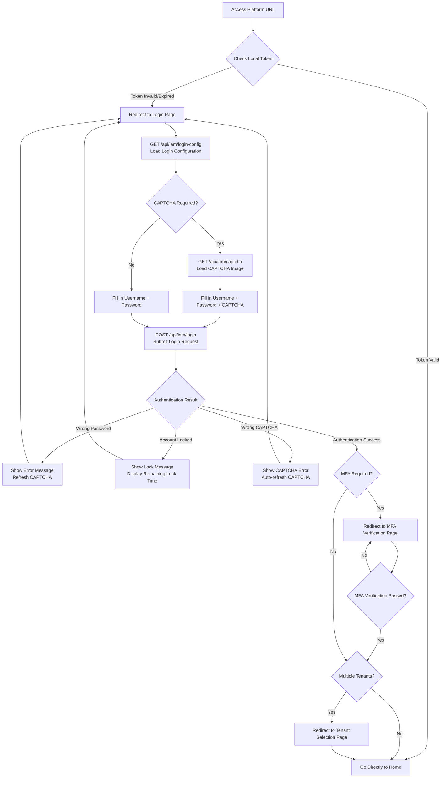

# Login

## Feature Overview

Rune Console uses a unified authentication system — Console (user portal) and BOSS (admin portal) share the same identity authentication service. After logging in with a username/password, the system issues a JWT (JSON Web Token) access token, which is included in all subsequent API requests for identity verification. During the login process, the system dynamically adjusts the login flow based on platform configuration, such as whether to display a CAPTCHA or whether MFA is required.

## Access Path

- Directly visit the Console or BOSS URL; unauthenticated users are automatically redirected to the login page
- Console login URL: `https://your-domain/console/auth/sign-in`
- BOSS login URL: `https://your-domain/boss/auth/sign-in`

> 💡 Tip: If you directly access a protected page in the browser (e.g., `/console/rune/instances`), the system will record that URL as the "post-login redirect target" and automatically return you to that page after successful login, saving you from navigating manually.

## Page Description

The login page defaults to a two-column layout: the left side is the brand display area, and the right side is the login form. On mobile devices, the page automatically switches to a single-column layout showing only the login form.

### Login Configuration Loading

When the page loads, the front-end calls the `GET /api/iam/login-config` endpoint to retrieve the platform login configuration. The response determines the login page behavior:

| Configuration | Description |
|---------------|-------------|
| Registration allowed | Determines whether the "Register" link is visible |
| CAPTCHA enabled | Determines whether a CAPTCHA input field appears in the login form |
| MFA enforced | Determines whether an additional MFA verification code is required after login |
| Password reset allowed | Determines whether the "Forgot Password" link is visible |
| Platform name and logo | Used for the brand display area on the login page |

> 💡 Tip: The above configurations are managed by the system administrator in the BOSS admin's "Platform Settings". If you notice the login page is missing a registration link or forgot password link, please contact the system administrator to verify the platform configuration.

### Login Form

| Field | Type | Required | Description |
|-------|------|----------|-------------|
| Username/Email | Text input | ✅ | Enter your registered username or email address; case-insensitive |
| Password | Password input | ✅ | Enter your account password; click the eye icon to toggle between plain text and masked display |
| CAPTCHA | Text input + CAPTCHA image | Conditional | Only shown when the platform has CAPTCHA enabled; see the "CAPTCHA Handling" section below |
| Remember Me | Checkbox | — | When checked, extends the login session validity (default 7 days → 30 days) |

### CAPTCHA Handling

When the platform has CAPTCHA login enabled, an additional CAPTCHA input area appears in the login form:

1. **CAPTCHA loading**: On page load, the system automatically calls `GET /api/iam/captcha` to fetch the CAPTCHA image, returning a Base64-encoded image and a `captchaId`
2. **Enter CAPTCHA**: The user must type the characters shown in the image (typically a 4-6 character alphanumeric combination) into the CAPTCHA input field
3. **Refresh CAPTCHA**: Click the CAPTCHA image to refresh and get a new one; the `captchaId` is updated accordingly
4. **CAPTCHA expiry**: The CAPTCHA is valid for approximately **2 minutes**; after expiry, click to refresh and get a new one
5. **Submit verification**: The login request `POST /api/iam/login` submits the `captchaId` along with the user-entered CAPTCHA to the back-end for verification

> ⚠️ Note: CAPTCHAs are case-sensitive. If the image is too blurry to read, click the image to refresh and get a new CAPTCHA.

### Steps

1. Open the platform URL in your browser (Console or BOSS)
2. Wait for the page to load; the login configuration is automatically retrieved
3. Enter your account in the "Username/Email" field
4. Enter your password in the "Password" field
5. If a CAPTCHA is displayed on the page, enter the characters from the CAPTCHA image
6. Check "Remember Me" as needed
7. Click the **Login** button
8. After successful login:
   - If the platform has MFA enabled and you have an MFA device bound → redirect to the [MFA Verification Page](./mfa.md)
   - If you belong to only one tenant → go directly to the console home page
   - If you belong to multiple tenants → redirect to the [Tenant Selection Page](./select-tenant.md)
   - If you have not joined any tenant → guided to register or join a tenant

### Additional Actions

- **Forgot Password**: Click the "Forgot Password?" link below the login form to enter the [Password Reset Flow](./reset-password.md)
- **Register Account**: Click the "Don't have an account? Register" link to go to the [Registration Page](./register.md) (only visible when the platform allows registration)

## Login Flow

## Error Handling and Common Issues

### Common Error Messages

| Error Message | Cause | Solution |
|---------------|-------|----------|
| Incorrect username or password | Entered credentials do not match | Verify your username and password; note that passwords are case-sensitive |
| CAPTCHA error | Entered CAPTCHA does not match the image | Carefully check the CAPTCHA image, noting case sensitivity; or click the image to refresh |
| CAPTCHA expired | CAPTCHA exceeded its validity period (~2 minutes) | Click the CAPTCHA image to get a new one |
| Account locked | Too many consecutive failed login attempts | Wait for the lock period to expire (default 15 minutes), or contact the admin to unlock |
| Account disabled | The admin has disabled this account | Contact the system administrator or tenant administrator |
| Network request failed | Network connection error or service unavailable | Check your network connection and try again later |

### Account Lockout Mechanism

To prevent brute-force attacks, the platform implements the following security policies:

- After **5** consecutive failed login attempts, the account will be temporarily locked
- The default lock duration is **15 minutes**, during which the account cannot log in
- Lock count and duration are configured by the system administrator in the BOSS admin
- Administrators can manually unlock locked accounts in the BOSS admin

> ⚠️ Note: Account lockout is account-based, not IP-based. Even if you switch to a different device, a locked account remains locked for the duration of the lock period.

## Session Management

### JWT Token Mechanism

After successful login, the system returns a JWT Token, which the front-end stores in the browser's `localStorage`:

- **Access Token**: Used for API request authentication; has a shorter validity period (default 2 hours)
- **Refresh Token**: Used to refresh the Access Token; has a longer validity period (default 7 days; 30 days when "Remember Me" is checked)
- When the Token expires, the front-end automatically uses the Refresh Token to obtain a new Access Token, seamlessly to the user
- When the Refresh Token also expires, the user is redirected to the login page to re-authenticate

### Session Invalidation Scenarios

The following situations will invalidate your current session, requiring re-login:

1. Both Access Token and Refresh Token have expired
2. An administrator has reset your password in the admin panel
3. An administrator has disabled your account
4. You actively clicked "Log Out"
5. An administrator changed the platform security policy (e.g., forced all users to re-login)

### Logging Out

Click "Log Out" in the avatar menu in the upper right corner. The system will:

1. Clear locally stored Tokens
2. Notify the back-end to invalidate the current Token
3. Redirect back to the login page

## Browser Compatibility

| Browser | Minimum Version | Notes |
|---------|-----------------|-------|
| Google Chrome | 90+ | ✅ Recommended |
| Microsoft Edge | 90+ | ✅ Recommended |
| Mozilla Firefox | 88+ | ✅ Supported |
| Apple Safari | 14+ | ✅ Supported |
| Internet Explorer | — | ❌ Not supported |

> 💡 Tip: For the best experience, we recommend using the latest version of Chrome or Edge. If you encounter display issues, try updating your browser version or clearing the browser cache first.

## Important Notes

- Entering the wrong password consecutively will trigger account lockout; please verify carefully before logging in
- Login sessions have a validity period; you will need to re-login after expiry
- We recommend using a strong password and enabling [MFA](./mfa.md) to enhance account security
- Do not check "Remember Me" on public devices; be sure to log out when finished
- If you notice suspicious login activity on your account, immediately change your password and contact the administrator
