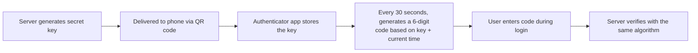
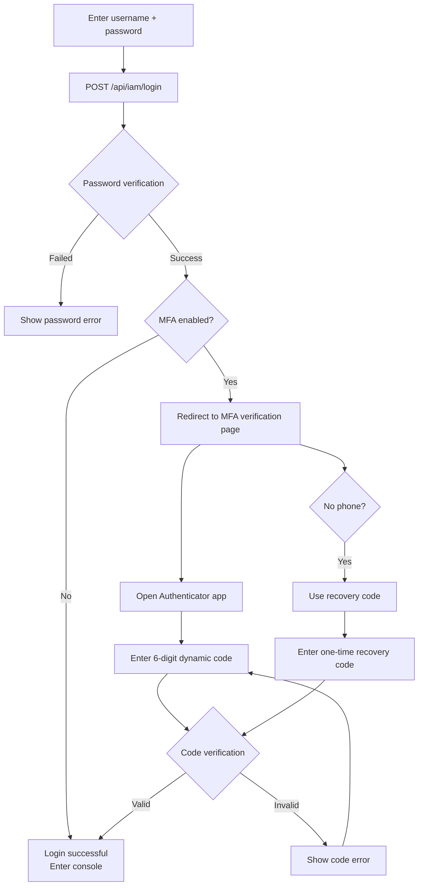

# Multi-Factor Authentication (MFA)

## Feature Overview

Multi-Factor Authentication (MFA) is a security mechanism that adds an extra verification step on top of traditional username + password authentication. Rune Console supports TOTP-based (Time-based One-Time Password) MFA. Once MFA is enabled, logging in requires not only a password but also a 6-digit dynamic verification code generated by an Authenticator app, significantly enhancing account security.

### What is TOTP?

TOTP is a time-based dynamic password generation algorithm. Here's how it works:

- The server and the Authenticator app share the same secret key
- Both parties use the same algorithm to generate a 6-digit code based on "key + current time"
- The code refreshes every **30 seconds**
- Even if your password is leaked, an attacker cannot obtain the dynamic code without your phone, so your account remains secure

> 💡 Tip: TOTP is an industry-standard two-factor authentication method widely adopted by major platforms such as Google, GitHub, and AWS. It is proven to be secure and reliable.

## MFA Activation Policies

MFA can be activated in two ways in Rune Console:

### User Self-Activation

- Users can enable MFA at any time in their Personal Center without administrator intervention
- Suitable for security-conscious users who want to proactively strengthen their accounts
- Once enabled, users can disable it themselves (requires verifying the current dynamic code)

### Administrator-Enforced Activation

- System administrators can enable the "Enforce MFA" policy in the BOSS admin under "Platform Settings"
- Once enabled, all users must complete MFA binding during their next login
- Users who have not bound MFA will be forced to the MFA setup page after login and cannot access the console until binding is complete
- Administrators can also enforce MFA for specific roles (e.g., administrator roles)

> ⚠️ Note: When the "Enforce MFA" policy is enabled on the platform, all users must bind MFA to use the platform normally. Please prepare an Authenticator app in advance.

## Access Path

- Personal Center → Security Settings → MFA
- URL: `/console/iam/security`
- Enforced MFA: Automatically redirected to the MFA setup page after login

## Recommended Authenticator Apps

Before enabling MFA, please install one of the following Authenticator apps on your phone:

| App Name | Platform | Description |
|----------|----------|-------------|
| Google Authenticator | iOS / Android | Made by Google; simple and easy to use; recommended |
| Microsoft Authenticator | iOS / Android | Made by Microsoft; supports cloud backup |
| Authy | iOS / Android / Desktop | Supports multi-device sync and encrypted cloud backup |
| 1Password | iOS / Android / Desktop | Password manager with built-in TOTP support |

> 💡 Tip: We recommend using an app that supports cloud backup (such as Microsoft Authenticator or Authy) in case of device loss. If using Google Authenticator, be sure to save the recovery codes.

## Enable MFA

### Page Description

The MFA setup uses a step-by-step guided (Stepper) interface to walk you through the binding process.

### Step 1: Generate QR Code

1. Go to **Personal Center** → **Security Settings** (or automatically redirected in enforced MFA scenarios)
2. Click the **"Enable MFA"** button
3. The system calls the `POST /api/iam/init-mfa` endpoint; the server generates a TOTP secret key
4. The page renders a QR code via Canvas, and displays the secret key text (Secret Key) below it

Interface components:

| Area | Description |
|------|-------------|
| QR Code Image | A QR code rendered on Canvas containing the TOTP key information |
| Secret Key Text | The plaintext key contained in the QR code; click to copy; used for manual entry |
| Instructions | Guides the user to scan the code with an Authenticator app |

> 💡 Tip: If your phone cannot scan the QR code (e.g., you're using a desktop Authenticator), click the "Can't scan?" link, then manually copy the secret key text displayed on the page and choose "Manual Entry" in your Authenticator app.

### Step 2: Scan the QR Code

1. Open the Authenticator app on your phone
2. Select "Add Account" or tap the "+" icon in the app
3. Choose the "Scan QR Code" option
4. Use your phone's camera to scan the QR code displayed on the page
5. After successful scanning, the Authenticator app will automatically add a new entry showing:
   - **Account name**: Your username
   - **Service name**: Rune Console (or the platform's custom name)
   - **6-digit dynamic code**: Refreshes every 30 seconds, usually with a countdown ring nearby
6. Click the **"Next"** button on the page

### Step 3: Verify Dynamic Code

1. Check the current 6-digit dynamic code displayed in your Authenticator app
2. Enter the 6-digit number in the verification code input field on the page
3. Click the **"Verify"** button
4. The system calls the `POST /api/iam/verify-mfa` endpoint to verify the entered code
5. Once verified, MFA binding is successful

> ⚠️ Note: The dynamic code refreshes every 30 seconds. If the code changes just as you're entering it, please enter the newest code. If verification fails repeatedly, check whether your phone's system time is accurate — TOTP code generation strictly depends on time synchronization.

### Step 4: Save Recovery Codes

After successful verification, the system displays a set of recovery codes:

- Recovery codes are typically **8-10** single-use backup codes
- Each code can only be used once
- Used for emergency login when the device is lost
- The page provides "Copy" and "Download" buttons

> ⚠️ Note: **Please be sure to securely save the recovery codes!** This is the only way to recover account access if you lose your device. We recommend saving recovery codes in a secure offline location (e.g., printed and stored in a safe). Do not save them on your phone.

### Complete Activation

Click the **"Done"** button — MFA is now enabled. Starting from your next login, you will need to provide both a password and a dynamic verification code.

## Logging In with MFA

After enabling MFA, the login flow adds an extra verification step:

### Steps

1. Enter your username and password normally on the login page
2. Click the "Login" button
3. After password verification passes, the system redirects to the **MFA Verification Page**
4. Open the Authenticator app on your phone
5. Find the Rune Console entry
6. Check the current 6-digit dynamic code
7. Enter the code in the MFA verification page input field
8. Click the **"Verify"** button
9. After verification passes, you enter the console

### MFA Login Flow Diagram

### Login with Recovery Code

If you cannot use the Authenticator app (e.g., your phone is not nearby), you can log in with a recovery code:

1. On the MFA verification page, click the **"Use Recovery Code"** link
2. Enter one of the previously saved recovery codes
3. Click **"Verify"**
4. After verification passes, you log in normally

> ⚠️ Note: Each recovery code can only be used once. After use, the code is automatically invalidated. When the remaining recovery code count is low, we recommend rebinding MFA or generating new recovery codes as soon as possible.

## Disable MFA

If you wish to turn off MFA (provided the platform has not enforced MFA), follow these steps:

1. Go to **Personal Center** → **Security Settings**
2. Click **"Disable MFA"** in the MFA section
3. The system displays a confirmation dialog
4. Enter the current **6-digit dynamic code** from your Authenticator app to confirm your identity
5. Click **"Confirm Disable"**
6. MFA is now disabled; future logins will no longer require a dynamic verification code

> ⚠️ Note: If the platform has the "Enforce MFA" policy enabled, you will not be able to disable MFA. The disable button will appear grayed out and unclickable, with a message "The platform requires all users to enable MFA."

## Device Loss and Recovery

### With Recovery Codes

If you have securely saved your recovery codes:

1. Log in using a recovery code (see "Login with Recovery Code" above)
2. After logging in, go to **Personal Center** → **Security Settings**
3. First disable the current MFA
4. Re-enable MFA and scan the new QR code with your new device
5. Save the new recovery codes

### Without Recovery Codes

If you have lost both your device and recovery codes:

1. **Contact the tenant administrator or system administrator**
2. The administrator can reset your MFA binding in the admin panel
   - System administrator path: BOSS → User Management → Find your account → Reset MFA
   - Tenant administrator path: Console → Member Management → Find you → Reset MFA
3. After MFA is reset, you can log in with just your password
4. After logging in, we recommend immediately rebinding MFA

> 💡 Tip: When an administrator resets MFA, they may require identity verification (such as in-person confirmation or email verification) to prevent someone from impersonating you to request a reset.

### Switching Devices

If you've gotten a new phone but still have access to the old one:

1. Log in normally using the Authenticator code on the old phone
2. Go to Personal Center → Security Settings
3. Disable the current MFA (requires the code from the old phone)
4. Re-enable MFA and scan the new QR code with the new phone
5. Confirm that the new phone can generate codes normally
6. Save the new recovery codes
7. Delete the corresponding entry from the Authenticator app on the old phone

## FAQ

### Verification Code Keeps Failing

The most common cause is **inaccurate phone time**. The TOTP algorithm relies on precise time synchronization:

- **Solution**: Enable "Set time automatically" in your phone settings (i.e., use network time)
- **Google Authenticator specific**: The app settings have a "Time correction for codes" option
- **Time tolerance**: The system typically allows a ±30 second time deviation, but verification will fail beyond this range

### No Corresponding Entry in Authenticator After MFA Binding

- The scan may not have been saved successfully
- Re-enter Security Settings, disable and re-enable MFA, and scan again

### Can MFA Be Used on Multiple Devices?

- When generating the QR code in Step 1, you can scan the same QR code with multiple devices simultaneously
- All devices that scanned the QR code will generate the same verification codes
- You can also manually enter the secret key text into a desktop Authenticator app

## Important Notes

- Please securely store your recovery codes — they are the only way to recover your account if you lose your device
- We recommend backing up the MFA key on multiple trusted devices
- If you lose both your device and recovery codes, you need to contact the platform administrator to reset MFA
- Ensure your phone time is synchronized with network time; otherwise, verification codes may fail
- After disabling MFA, all existing recovery codes and keys become invalid
- Re-enabling MFA generates entirely new keys and recovery codes
