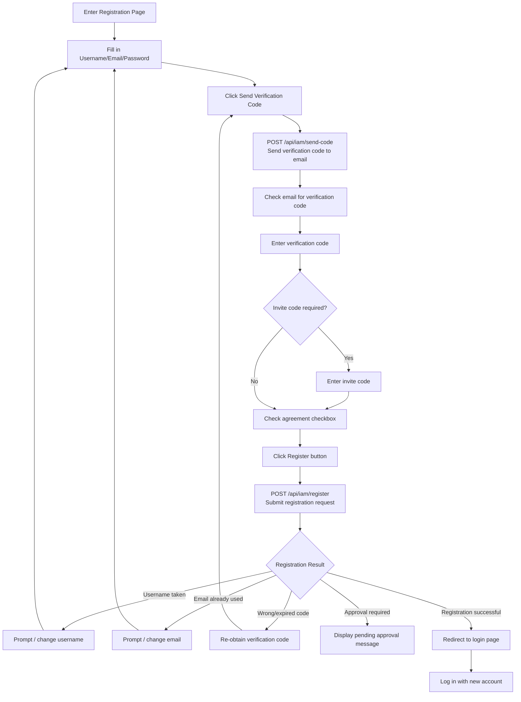

# Registration

## Feature Overview

New users can create a Rune Console platform account through the registration page. Whether registration is available depends on the system administrator's platform configuration — the administrator can choose to open registration, restrict it to invite codes only, or disable it entirely. After registration, depending on the platform policy, administrator approval may be required before the account is activated.

## Prerequisites

Before starting registration, please confirm the following:

- **Platform registration is open**: The system administrator has enabled user registration in the BOSS admin. If the login page does not have a "Register" link, it means the platform currently does not allow self-registration — please contact the administrator to obtain an account
- **Valid email or phone number**: A verification code needs to be received during registration, so please ensure you can access the email or phone number you provide
- **Invite code (if required)**: Some platform configurations require an invite code for registration — please obtain one from the administrator in advance

> 💡 Tip: The platform's registration policy is configured by the system administrator in the BOSS admin under "Platform Settings". If you are unable to register, please contact your organization administrator to learn about the registration process.

## Access Path

- Login page → Click the "Don't have an account? Register" link
- Direct URL: `https://your-domain/console/auth/sign-up`

## Page Description

The registration page uses a clean single-column form layout centered on the page. The platform logo and name are displayed above the form, with a link to return to the login page below.

### Registration Form

| Field | Type | Required | Validation Rules | Description |
|-------|------|----------|------------------|-------------|
| Username | Text input | ✅ | 3-32 characters, only lowercase letters, numbers, underscores, and hyphens; must start with a letter | Unique identifier on the platform; **cannot be changed** once created |
| Email | Email input | ✅ | Standard email format (`user@domain.com`) | Used for receiving verification codes, notification emails, and password resets |
| Phone Number | Phone input | Depends on config | Must include country code (e.g., `+86`), 11 digits | Some platforms require a phone number |
| Password | Password input | ✅ | Minimum 8 characters, must include uppercase letters, lowercase letters, and numbers | Login password; click the eye icon to view in plain text |
| Confirm Password | Password input | ✅ | Must exactly match the password field | Prevents password input errors |
| Email Verification Code | Text input | ✅ | 6-digit number | Obtained from your email after clicking "Send Verification Code" |
| Invite Code | Text input | Depends on config | — | Only displayed when the platform requires invite code registration |

### Username Naming Rules

Your username is your unique identifier on the platform. Please follow these rules:

- **Length**: 3 to 32 characters
- **Allowed characters**: Lowercase English letters (`a-z`), numbers (`0-9`), underscores (`_`), hyphens (`-`)
- **Starting character**: Must start with an English letter
- **Uniqueness**: Usernames are globally unique across the platform and cannot duplicate existing users
- **Immutable**: Usernames cannot be changed after creation — please choose carefully

> ⚠️ Note: Once set, your username cannot be changed. It will serve as your permanent identifier on the platform. Please use a meaningful and memorable name.

### Password Strength Requirements

Registration passwords must meet the following security requirements:

| Requirement | Description |
|-------------|-------------|
| Minimum length | At least **8** characters |
| Uppercase letter | At least **1** uppercase letter (A-Z) |
| Lowercase letter | At least **1** lowercase letter (a-z) |
| Number | At least **1** number (0-9) |
| Special character | Recommended (e.g., `!@#$%^&*`); required under some platform configurations |

The form displays a real-time password strength indicator bar (Weak / Medium / Strong) as you type. We recommend achieving "Strong" level.

> 💡 Tip: Good password practices: avoid using character combinations identical to your username or email; avoid common words (e.g., `password123`); use a password manager to generate and store complex passwords.

### Verification Code Process

1. After filling in your email, click the **Send Verification Code** button on the right side of the email input field
2. The system calls `POST /api/iam/send-code` to send an email containing a 6-digit verification code to your email
3. After sending, the button displays a **60-second countdown**; you cannot resend until the countdown finishes
4. The verification code is valid for approximately **5 minutes**; you need to request a new one after it expires
5. If you haven't received the verification code email after a long time, check your spam/junk folder

> ⚠️ Note: If you still haven't received the verification code after multiple attempts, please verify that the email address is correct, or contact the system administrator to confirm that the email service is functioning properly.

## Steps

1. Click the "Don't have an account? Register" link on the login page to go to the registration page
2. Enter your desired username in the "Username" field
3. Enter a valid email address in the "Email" field
4. Fill in the password and confirm password, ensuring they meet the password strength requirements
5. Click **Send Verification Code** and check your email for the verification code email
6. Enter the 6-digit verification code you received in the "Verification Code" field
7. If an invite code field is displayed on the page, enter the invite code you obtained
8. Read and check "I have read and agree to the Terms of Service and Privacy Policy"
9. Click the **Register** button to submit your registration

## Registration Flow

## Registration Approval Flow

Under some platform configurations, new users cannot use their account immediately after registration and require administrator approval:

### No Approval Required (Auto-Activation)

1. User submits the registration form
2. The system creates the account immediately after verifying the information
3. The account is in an active state; the user can log in directly
4. Redirects to the login page

### Administrator Approval Required

1. User submits the registration form
2. The system creates the account but marks it as "Pending Approval"
3. The page displays "Your registration request has been submitted. Please wait for administrator approval."
4. The system administrator reviews the pending approval list in BOSS admin's User Management
5. After the administrator approves, the system sends an email notification to the user
6. The user can log in after receiving the notification

> 💡 Tip: If you haven't received an approval notification for an extended period after submitting your registration, please contact your organization administrator to check the approval progress.

### Invite Code Registration

When the platform has invite code registration mode enabled:

1. The administrator generates invite codes in the BOSS admin and distributes them to designated personnel
2. The user enters the invite code in the registration form
3. The system validates the invite code (whether it exists, has expired, or has been used)
4. After validation passes, registration is completed and the invite code is marked as used

## Common Error Messages

| Error Message | Cause | Solution |
|---------------|-------|----------|
| Username already taken | The username has been registered by another user | Choose a different username |
| Email already registered | The email address is already associated with another account | Use a different email, or recover the existing account via "Forgot Password" |
| Verification code error | The entered code does not match the one sent | Check whether the verification code from the email was entered correctly |
| Verification code expired | The code has exceeded its 5-minute validity period | Click "Send Verification Code" again to get a new code |
| Invalid invite code | The invite code does not exist, has expired, or has been used | Contact the administrator to obtain a new valid invite code |
| Insufficient password strength | The password does not meet complexity requirements | Add the missing character types according to the password strength requirements |
| Passwords do not match | The confirm password does not match the password field | Re-enter the confirm password to ensure it matches the password |

## Important Notes

- Usernames **cannot be changed** once set — please consider carefully before registering
- Email verification codes are valid for approximately 5 minutes; please complete registration promptly after obtaining one
- Passwords must meet minimum strength requirements; we recommend using strong passwords to ensure account security
- If a verification code expires, you can click "Resend" to get a new one
- After registration, you do not belong to any tenant by default — you need to create a new tenant or join an existing one to use platform features
- Each email can only register one account
