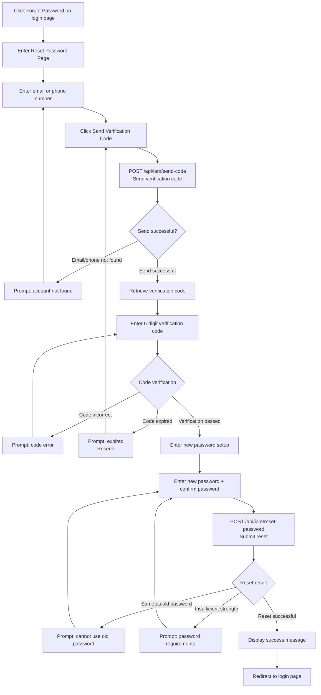

# Reset Password

## Feature Overview

When you have forgotten your Rune Console login password, you can reset it via email or phone number verification. The reset process confirms your identity by sending a verification code to the email or phone number you registered with. After verification, you can set a new password. Once the reset is successful, all existing login sessions will be immediately invalidated, and you will need to log in again with the new password.

## Access Path

- Login page → Click the "Forgot Password?" link
- Direct URL: `https://your-domain/console/auth/reset-password`

## Page Description

The reset password page uses a step-by-step form design, requiring you to complete two steps in sequence: identity verification and password setting.

### Step 1: Identity Verification

First, you need to verify your identity to confirm you are the legitimate owner of the account.

| Field | Type | Required | Description |
|-------|------|----------|-------------|
| Email/Phone Number | Text input | ✅ | Enter the email address or phone number bound during registration |
| Verification Code | Text input | ✅ | Enter the 6-digit verification code you received |

**Verification Code Sending Process:**

1. Enter the email address or phone number used during registration in the input field
2. Click the **Send Verification Code** button on the right
3. The system calls the `POST /api/iam/send-code` endpoint to send a verification code to the target email/phone
4. The button enters a **60-second countdown**; you cannot resend during the countdown
5. Check your email inbox (or phone messages) to retrieve the 6-digit verification code
6. Enter the received verification code in the verification code input field

> 💡 Tip: If using email to receive the verification code, also check your spam/junk mail folder. The verification code email sender is typically the platform's configured system email address.

> ⚠️ Note: The verification code is valid for approximately **5 minutes**. Please complete the subsequent steps promptly after receiving the code. If the code has expired, click "Resend" to get a new one.

### Step 2: Set New Password

After identity verification passes, you'll enter the new password setup page.

| Field | Type | Required | Validation Rules | Description |
|-------|------|----------|------------------|-------------|
| New Password | Password input | ✅ | At least 8 characters, including uppercase and lowercase letters and numbers | Set your new login password |
| Confirm Password | Password input | ✅ | Must exactly match the new password | Re-enter the new password to confirm |

**New Password Requirements:**

| Requirement | Description |
|-------------|-------------|
| Minimum length | At least **8** characters |
| Uppercase letter | At least **1** uppercase letter (A-Z) |
| Lowercase letter | At least **1** lowercase letter (a-z) |
| Number | At least **1** number (0-9) |
| Password history | The new password cannot be the same as a recently used password |

> ⚠️ Note: A password strength indicator bar is provided next to the password input field. We recommend setting a password with "Strong" strength to ensure account security.

## Steps

### Complete Operation Flow

1. Click the "Forgot Password?" link on the login page
2. Enter the reset password page
3. Enter the email or phone number bound during registration in the "Email/Phone Number" field
4. Click the **Send Verification Code** button
5. Check your email inbox or phone messages to get the 6-digit verification code
6. Enter the received verification code in the "Verification Code" field
7. Click the **Next** or **Verify** button
8. After the system verifies successfully, you'll enter the new password setup page
9. Enter a new password in the "New Password" field (must meet password strength requirements)
10. Re-enter the new password in the "Confirm Password" field
11. Click the **Reset Password** button
12. After successful reset, the page displays a success message and automatically redirects to the login page
13. Log in with your new password

### Reset Password Flow Diagram

## Effects After Successful Reset

After a successful password reset, the following take effect:

1. **All sessions immediately invalidated**: Your login status on all devices and browsers will be cleared
2. **All Tokens invalidated**: Previously issued JWT Tokens (both Access Token and Refresh Token) will all become invalid
3. **Re-login required**: You need to log in again with the new password on all devices
4. **MFA unaffected**: If you have MFA enabled, the MFA binding is not affected by the password reset
5. **API Keys unaffected**: Existing API Keys will not be invalidated by the password reset

> 💡 Tip: If you suspect your account has been compromised, after resetting the password we recommend also reviewing and updating your MFA settings and API Keys.

## Common Error Messages

| Error Message | Cause | Solution |
|---------------|-------|----------|
| Email not registered | The entered email address is not in the system | Verify the email address is correct, or try another email used during registration |
| Verification code error | The entered code does not match the one sent | Carefully verify the code from the email/SMS |
| Verification code expired | The code has exceeded its 5-minute validity period | Click "Resend" to get a new verification code |
| New password cannot be the same as old password | The new password duplicates a recently used password | Set a password that has not been used before |
| Insufficient password strength | The password does not meet complexity requirements | Increase password length or add missing character types |
| Passwords do not match | The confirm password does not match the new password | Re-enter the confirm password |
| Verification code sent too frequently | Multiple code requests in a short period | Wait for the 60-second countdown to finish before trying again |

## Unable to Receive Verification Code

If you cannot receive a verification code through your registered email or phone number, here are possible causes and solutions:

### Email Unavailable

- **Email deactivated**: If the registered email account has been cancelled or deactivated, you will be unable to receive the verification code
- **Corporate email reclaimed**: After leaving a company, the corporate email may have been reclaimed
- **Solution**: Contact the system administrator to reset your password directly through the admin panel

### Phone Number Changed

- **Number cancelled**: The original phone number has been reclaimed by the carrier
- **Number transferred**: The phone number has been transferred to another person
- **Solution**: Contact the system administrator, provide identity verification, and have the administrator assist with the reset

### Verification Email Blocked

- Check your spam/junk mail folder
- Add the system email sender address to your whitelist
- Contact your IT department to confirm whether the corporate email gateway is blocking verification code emails

> 💡 Tip: If none of the above methods resolve the issue, please contact the system administrator. Administrators can directly reset your password in the BOSS admin's User Management without requiring a verification code.

## Security Recommendations

- After resetting your password, we recommend logging in on all commonly used devices to confirm the new password works
- Check your account's login history after resetting the password to confirm there are no suspicious login records
- If you reset your password due to a suspected account breach, we also recommend enabling [MFA](./mfa.md) for enhanced security
- Do not use the same password as other platforms
- We recommend using a password manager to securely store passwords

## Important Notes

- Verification codes are valid for approximately 5 minutes; please use them promptly after receiving
- The new password cannot be the same as recently used passwords
- All existing login sessions will be immediately invalidated after a successful reset
- You cannot resend a verification code within 60 seconds
- Multiple incorrect verification code entries may trigger security restrictions, requiring you to wait a period before trying again
