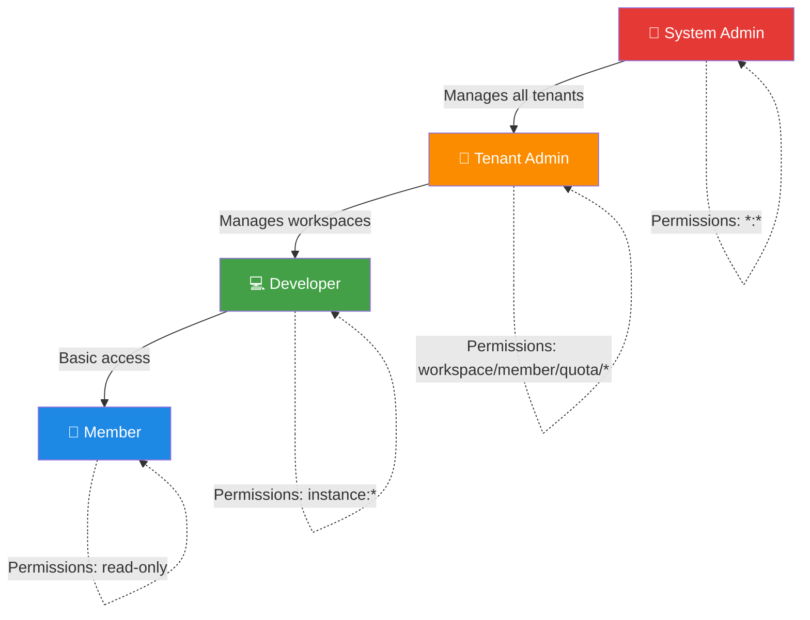
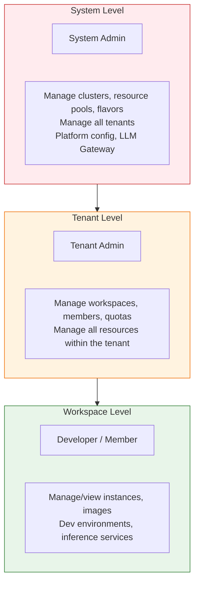
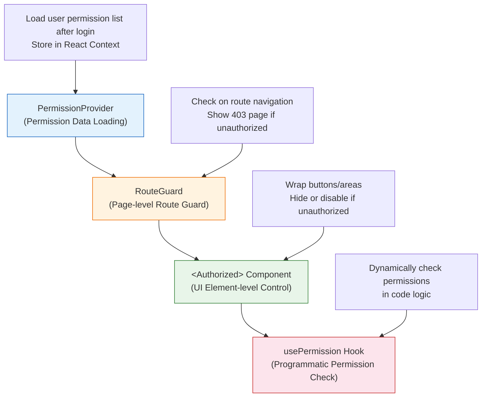

# Roles and Permissions

## Feature Overview

Rune Console employs a Role-Based Access Control (RBAC) system. The platform comes with four predefined roles, each with different permission scopes and operable resources. On the front-end, permissions manifest as navigation menu visibility, UI element visibility, and action button enabling/disabling. However, the actual security control is always enforced by the back-end API — even if front-end restrictions are bypassed to call the API directly, unauthorized requests will still be rejected.

## Role System Overview



### Three-Level Permission Scope

The Rune Console permission system is divided into three tiers, progressively narrowing from top to bottom:



| Scope | Description | Roles Involved |
|-------|-------------|----------------|
| **System Level** | Entire platform scope, across all tenants | System Admin |
| **Tenant Level** | Within a single tenant | Tenant Admin |
| **Workspace Level** | Within a single workspace | Developer, Member |

> 💡 Tip: Higher-level roles automatically inherit all permissions of lower levels. For example, a Tenant Admin has all Developer and Member permissions within their tenant scope.

## Detailed Role Descriptions

### System Admin

- **Scope**: Entire platform (system level)
- **Permission Range**: `*:*` (all operations on all resources)
- **Access Interface**: Console + BOSS

The System Admin is the platform's super user with full access to all features.

**Available Operations:**

| Operation Category | Specific Operations |
|--------------------|---------------------|
| Cluster Management | Add/edit/delete compute clusters, view cluster status and monitoring |
| Resource Pool Management | Create/configure resource pools, allocate resources to tenants |
| Flavor Management | Define instance flavors (GPU type, memory, CPU, etc.) |
| Tenant Management | Create/disable/delete tenants, approve tenant registrations, allocate quotas |
| User Management | Manage all platform users, reset passwords, reset MFA |
| System Templates | Manage system-level image templates (available to all tenants) |
| LLM Gateway | Configure model gateway, API Keys, audit logs, content moderation |
| Platform Configuration | Login policies, registration policies, MFA policies, platform theme |
| System Images | Manage system-preset images |
| App Market | Manage applications in the system-level app market |

**Example Operations:**

```
# Example operations a System Admin can perform
*:*                    → All operations on all resources
cluster:create         → Create a new cluster
resource-pool:update   → Edit resource pool configuration
tenant:delete          → Delete a tenant
user:reset-password    → Reset user password
gateway:config         → Configure LLM Gateway
```

> ⚠️ Note: The System Admin has the highest privileges — please assign this role carefully. We recommend having only 1-2 System Admins on the platform, with MFA enforced.

### Tenant Admin

- **Scope**: Designated tenant (tenant level)
- **Permission Range**: Full management permissions within the tenant
- **Access Interface**: Console

The Tenant Admin is responsible for managing all resources and members within a tenant.

**Permission Details:**

| Permission Expression | Description | Included Operations |
|-----------------------|-------------|---------------------|
| `workspace:*` | All workspace operations | `create`, `list`, `get`, `update`, `delete` |
| `member:*` | All member management operations | `create`, `list`, `get`, `update`, `delete`, `invite` |
| `quota:*` | All quota operations | `list`, `get`, `update`, `allocate` |
| `instance:*` | All instance operations | `create`, `list`, `get`, `update`, `delete`, `start`, `stop` |
| `image:*` | All image operations | `create`, `list`, `get`, `update`, `delete`, `push`, `pull` |
| `template:*` | All template operations | `create`, `list`, `get`, `update`, `delete` |
| `volume:*` | All storage volume operations | `create`, `list`, `get`, `update`, `delete`, `mount` |

**Can do:**

- ✅ Create and manage workspaces
- ✅ Invite new members and assign roles
- ✅ Allocate and adjust quotas
- ✅ Create, start/stop, and delete all types of instances
- ✅ Manage images, templates, and storage volumes within the tenant
- ✅ View tenant-level usage statistics and monitoring data

**Cannot do:**

- ❌ Manage compute clusters and resource pools (system level)
- ❌ Create or manage other tenants
- ❌ Access the BOSS admin interface
- ❌ Configure platform-level settings (login policies, MFA policies, etc.)
- ❌ Manage LLM Gateway configuration

**Example Operations:**

```
# Typical Tenant Admin operations
workspace:create       → Create a new workspace
member:invite          → Invite a new member to the tenant
quota:allocate         → Allocate GPU quota to a workspace
instance:delete        → Delete an unused instance
image:push             → Upload a custom image
```

### Developer

- **Scope**: Designated tenant (workspace level)
- **Permission Range**: Full instance operation permissions + read-only access to other resources
- **Access Interface**: Console

The Developer is the primary user of the platform, capable of creating and managing their own compute instances.

**Permission Details:**

| Permission Expression | Description | Included Operations |
|-----------------------|-------------|---------------------|
| `workspace:list` | List workspaces | `list` |
| `workspace:get` | View workspace details | `get` |
| `instance:*` | All instance operations | `create`, `list`, `get`, `update`, `delete`, `start`, `stop` |
| `image:list` | List images | `list` |
| `image:get` | View image details | `get` |
| `template:list` | List templates | `list` |
| `template:get` | View template details | `get` |

**Can do:**

- ✅ Create all types of instances (inference services, fine-tuning tasks, dev environments, etc.)
- ✅ Start, stop, and restart own instances
- ✅ Delete instances they created
- ✅ Browse available images and templates
- ✅ View workspace information
- ✅ Use applications from the App Market

**Cannot do:**

- ❌ Create or delete workspaces
- ❌ Invite or remove members
- ❌ Adjust quotas
- ❌ Manage images (upload/delete custom images)
- ❌ Manage templates
- ❌ Manage storage volumes

**Example Operations:**

```
# Typical Developer operations
instance:create        → Create a new dev environment instance
instance:start         → Start a stopped instance
instance:stop          → Stop a running instance
image:list             → Browse available image list
template:get           → View template details
```

### Member

- **Scope**: Designated tenant (workspace level)
- **Permission Range**: Read-only access to resources
- **Access Interface**: Console (read-only)

The Member is the least privileged role, with read-only access to resource information and no write operations.

**Permission Details:**

| Permission Expression | Description | Included Operations |
|-----------------------|-------------|---------------------|
| `workspace:list` | List workspaces | `list` |
| `workspace:get` | View workspace details | `get` |
| `instance:list` | List instances | `list` |
| `instance:get` | View instance details | `get` |
| `image:list` | List images | `list` |
| `image:get` | View image details | `get` |

**Can do:**

- ✅ View workspace list and details
- ✅ View instance list and details (status, logs, etc.)
- ✅ Browse available image list

**Cannot do:**

- ❌ Create/start/stop/delete any instances
- ❌ Manage workspaces
- ❌ Manage members
- ❌ Upload or manage images
- ❌ Perform any write operations

> 💡 Tip: The Member role is suitable for personnel who need to view project progress but do not need to directly operate resources, such as project managers, product managers, and auditors.

## Role Comparison Overview

The following table summarizes the permission comparison across the four roles for each resource:

| Resource | Operation | System Admin | Tenant Admin | Developer | Member |
|----------|-----------|:------------:|:------------:|:---------:|:------:|
| **Cluster** | Create/Edit/Delete | ✅ | ❌ | ❌ | ❌ |
| **Resource Pool** | Create/Edit/Delete | ✅ | ❌ | ❌ | ❌ |
| **Tenant** | Create/Manage | ✅ | ❌ | ❌ | ❌ |
| **Platform Settings** | Configure | ✅ | ❌ | ❌ | ❌ |
| **LLM Gateway** | Configure | ✅ | ❌ | ❌ | ❌ |
| **Workspace** | Create/Edit/Delete | ✅ | ✅ | ❌ | ❌ |
| **Workspace** | View | ✅ | ✅ | ✅ | ✅ |
| **Members** | Invite/Manage | ✅ | ✅ | ❌ | ❌ |
| **Quota** | Allocate/Adjust | ✅ | ✅ | ❌ | ❌ |
| **Instance** | Create/Start-Stop/Delete | ✅ | ✅ | ✅ | ❌ |
| **Instance** | View | ✅ | ✅ | ✅ | ✅ |
| **Image** | Upload/Delete | ✅ | ✅ | ❌ | ❌ |
| **Image** | View | ✅ | ✅ | ✅ | ✅ |
| **Template** | Create/Edit/Delete | ✅ | ✅ | ❌ | ❌ |
| **Template** | View | ✅ | ✅ | ✅ | ✅ |
| **Storage Volume** | Create/Mount/Delete | ✅ | ✅ | ❌ | ❌ |

## Permission Expression Format

Rune Console uses a concise text format to express permissions:

```
[service:]<resource>:<action>
```

### Format Description

| Part | Required | Description | Example |
|------|----------|-------------|---------|
| `service` | Optional | Service prefix to distinguish different microservices | `compute`, `gateway` |
| `resource` | Required | Resource type | `instance`, `workspace`, `member` |
| `action` | Required | Operation type | `create`, `list`, `get`, `update`, `delete` |

### Permission Expression Examples

```
# Basic format
instance:create          → Create instance
workspace:list           → List workspaces
member:delete            → Delete member

# With service prefix
compute:instance:create  → Create instance in compute service
gateway:config:update    → Update configuration in gateway service

# Wildcards
instance:*               → All operations on instances
*:*                      → All operations on all resources
workspace:list/get       → List and view workspaces
```

### Wildcard Matching Rules

Permission validation uses wildcard matching:

| Expression | Match Scope | Description |
|------------|-------------|-------------|
| `*:*` | All operations on all resources | System Admin permissions |
| `instance:*` | All operations on instances | Includes create, list, get, update, delete, etc. |
| `workspace:list/get` | List and view workspaces | Multiple actions separated by `/` |

Validation logic: When a user performs an operation, the system checks whether the user role's permission list contains a matching expression. Matching rules:

1. Exact match: `instance:create` matches `instance:create` ✅
2. Resource wildcard: `instance:*` matches `instance:create` ✅
3. Full wildcard: `*:*` matches any permission expression ✅
4. No match: `instance:list` does not match `instance:create` ❌

## Front-end Permission Control Mechanism

Rune Console implements multi-layered permission control on the front-end, filtering from top to bottom to ensure different roles see the appropriate interface:



### 1. PermissionProvider (Permission Data Layer)

- After user login, the system retrieves the current user's roles and permission list
- Permission data is shared across the entire application via React Context
- Permissions are automatically reloaded when switching tenants or workspaces

### 2. RouteGuard (Page-level Route Guard)

- Each route can be configured with required permissions
- When a user navigates to a page, the RouteGuard checks whether they have the corresponding permission
- Unauthorized access shows a 403 Forbidden page instead of a blank page or error
- Example: Accessing the "Member Management" page requires `member:list` permission

### 3. `<Authorized>` Component (UI Element-level Control)

- Used to wrap UI elements that require permission control (buttons, menu items, action areas, etc.)
- When unauthorized, the element can either be hidden or set to a disabled state
- Example: The "Create Instance" button is only visible to users with `instance:create` permission

### 4. `usePermission` Hook (Programmatic Permission Check)

- Checks whether the user has a specific permission via code within component logic
- Returns a boolean value for conditional rendering and logic branching
- Example: `const canCreate = usePermission('instance:create')`

> ⚠️ Note: Front-end permission control is purely a UI experience optimization to prevent users from seeing buttons or pages they cannot operate. Actual security control is always enforced by the back-end API — even if front-end code is tampered with, the back-end will still reject unauthorized requests.

### Navigation Menu Filtering

The left navigation bar automatically filters visible menu items based on user role:

| Menu Item | System Admin | Tenant Admin | Developer | Member |
|-----------|:------------:|:------------:|:---------:|:------:|
| Overview / Dashboard | ✅ | ✅ | ✅ | ✅ |
| Inference Services | ✅ | ✅ | ✅ | ❌ |
| Fine-tuning Services | ✅ | ✅ | ✅ | ❌ |
| Dev Environments | ✅ | ✅ | ✅ | ❌ |
| Apps | ✅ | ✅ | ✅ | ❌ |
| Experiments | ✅ | ✅ | ✅ | ❌ |
| Evaluations | ✅ | ✅ | ✅ | ❌ |
| App Market | ✅ | ✅ | ✅ | ❌ |
| Log Viewer | ✅ | ✅ | ✅ | ❌ |
| Member Management | ✅ | ✅ | ❌ | ❌ |
| Workspace Management | ✅ | ✅ | ❌ | ❌ |
| Quota Management | ✅ | ✅ | ❌ | ❌ |
| BOSS Admin | ✅ | ❌ | ❌ | ❌ |

## Role Assignment and Changes

### Who Can Assign Roles

| Operation | Roles That Can Execute |
|-----------|------------------------|
| Assign/change System Admin | System Admin |
| Assign/change Tenant Admin | System Admin, Tenant Admin |
| Assign/change Developer | Tenant Admin |
| Assign/change Member | Tenant Admin |

### How to Change User Roles

**Tenant Admin adjusting member roles within the tenant:**

1. Go to Console → Member Management
2. Find the target user
3. Click the "Edit" button
4. Select the new role from the role dropdown
5. Click "Save"

**System Admin adjusting system roles:**

1. Go to BOSS → User Management
2. Find the target user
3. Edit the user role

### Role Changes Take Effect

When role changes take effect:

- If the user is currently online, the permission change does not take effect immediately
- The user needs to **refresh the page** or **re-login** for the new permissions to load
- We recommend notifying the user to refresh the page after changing important permissions

## Permission Refresh Timing

The following scenarios trigger a re-fetch of permission data:

| Scenario | Description |
|----------|-------------|
| After user login | Initial permission data is loaded upon successful login |
| When switching tenants | You may have different roles in different tenants |
| When switching workspaces | Workspace-level may have additional permission configurations |
| After role change | An administrator has changed your role (requires page refresh) |
| Manual page refresh | Browser refresh re-fetches permission data |

## Practical Scenario Examples

### Scenario 1: AI Team Daily Usage

- **Zhang San** (Tenant Admin): Creates workspaces "Model Training" and "Inference Deployment", invites team members, allocates GPU quotas
- **Li Si** (Developer): Creates fine-tuning tasks in the "Model Training" workspace, deploys inference services
- **Wang Wu** (Developer): Manages inference instances in the "Inference Deployment" workspace, debugs dev environments
- **Zhao Liu** (Member — Product Manager): Views instance status and usage across workspaces

### Scenario 2: Multi-Tenant Management

- **Admin A** (System Admin): Creates tenants "R&D Department" and "Product Department", allocates cluster resources
- **Admin B** (Tenant Admin — R&D Dept): Manages the R&D Department's workspaces and members
- **Admin C** (Tenant Admin — Product Dept): Manages the Product Department's workspaces and members
- **Developer D**: Belongs to both "R&D Department" (Developer role) and "Product Department" (Member role)

> 💡 Tip: A single user can have different roles in different tenants. When switching tenants, the interface automatically adjusts based on your role in the target tenant.

## Important Notes

- Front-end permissions are purely UI experience optimizations; actual security is enforced by the back-end API
- If you notice permission anomalies, try refreshing the page or re-logging in to reload permissions
- Contact the corresponding tenant administrator or system administrator for higher permissions
- Role changes require a page refresh or re-login to take effect
- The System Admin role should be assigned carefully; we recommend enabling MFA for enhanced security
