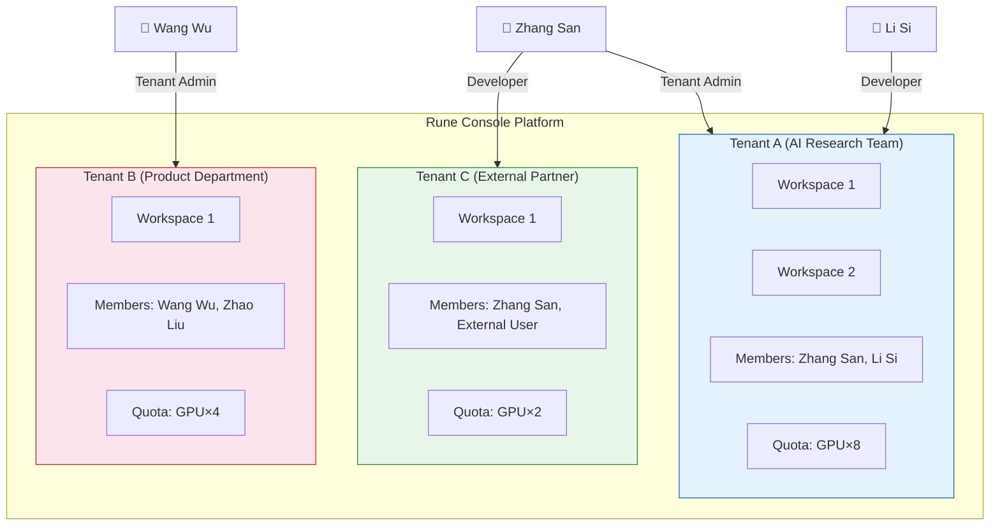
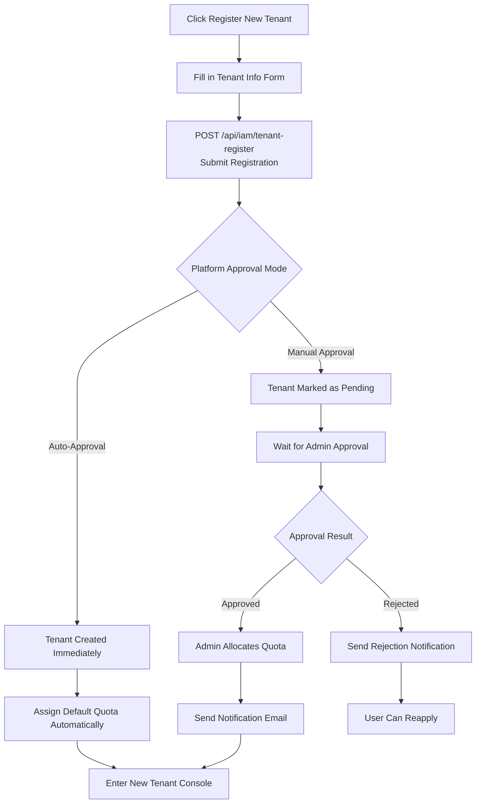

# Select / Register Tenant

## Feature Overview

Rune Console uses a multi-tenant architecture where each tenant is an independent resource isolation unit with its own workspaces, members, quotas, and resources. After login, if a user belongs to multiple tenants or has not yet joined any tenant, the system guides the user to select a target tenant or register a new one. The concept of a tenant is similar to an "organization" or "team" — data and resources are completely isolated between different tenants.

## Multi-Tenant Concept

As shown above, a user can belong to multiple tenants simultaneously and may have different roles in different tenants. For example, Zhang San is a Tenant Admin in "AI Research Team" but only a Developer in "External Partner."

> 💡 Tip: Resources are completely isolated between tenants. Instances, datasets, models, and other resources created in Tenant A are invisible and inaccessible in Tenant B.

## Access Path

- Automatic redirect after login (when the user belongs to multiple tenants)
- URL: `/auth/select-tenant`
- Avatar menu → "Switch Tenant"

## Select a Tenant

### Page Description

After successful login, if you belong to multiple tenants, the system displays the tenant selection page. This page shows all tenants you have access to in a card list format.

### Tenant Card Information

Each tenant card displays the following information:

| Information | Description |
|-------------|-------------|
| Tenant Name | The display name of the tenant |
| Tenant ID | The unique identifier of the tenant |
| Your Role | Your role in this tenant (Tenant Admin / Developer / Member) |
| Member Count | Total number of members in the tenant |
| Tenant Status | Active / Disabled / Pending Approval |

### Steps

1. After successful login, the system automatically calls `GET /api/iam/current/tenants` to retrieve your tenant list
2. The page displays all tenants you have access to in a card list format
3. Browse the tenant list and confirm your role in each tenant
4. Click on the target tenant card to enter that tenant's console

> 💡 Tip: If you belong to only one tenant, the system automatically skips this page and goes directly to that tenant's console home page.

### Search and Filter

When you belong to many tenants, you can quickly find the right one using:

- **Search box**: Enter the tenant name or ID for a fuzzy search
- **Sorting**: Sorted by most recent access time, with frequently used tenants appearing first

## Register a New Tenant

If you don't have a tenant yet, or wish to create a new independent workspace, you can register a new tenant on the tenant selection page.

### Page Description

### Registration Form

Click the **"Register New Tenant"** button on the tenant selection page to enter the tenant registration form:

| Field | Type | Required | Validation Rules | Description |
|-------|------|----------|------------------|-------------|
| Tenant Name | Text input | ✅ | 2-64 characters | The display name of the tenant; may include non-ASCII characters |
| Tenant ID | Text input | ✅ | 3-32 characters, only lowercase letters, numbers, and hyphens; must start with a letter | The unique identifier of the tenant; **cannot be changed** once created |
| Description | Text area | — | Maximum 256 characters | Description of the tenant's purpose or team |
| Contact Email | Email input | Depends on config | Standard email format | Management contact email for the tenant |

> ⚠️ Note: The Tenant ID cannot be changed after creation. It will appear in API calls and resource identifiers, so please use a meaningful and short English name. Examples: `ai-research-team`, `product-dept`.

### Steps

1. Click the **"Register New Tenant"** button on the tenant selection page
2. Fill in the tenant name (for display purposes)
3. Set the tenant ID (unique identifier, cannot be changed)
4. Optionally fill in the description and contact email
5. Click the **"Submit Registration"** button
6. The system calls `POST /api/iam/tenant-register` to submit the tenant registration request

### Registration Result Handling

The handling after tenant registration submission depends on the platform configuration:

**Auto-Approval Mode:**
1. The tenant is created immediately upon submission
2. You automatically become the "Tenant Admin" of the new tenant
3. The system automatically enters the new tenant's console
4. You can start inviting members and configuring workspaces

**Manual Approval Mode:**
1. The tenant is marked as "Pending Approval" upon submission
2. The page displays "Your tenant registration request has been submitted. Please wait for system administrator approval."
3. The system administrator reviews the tenant registration request in the BOSS admin
4. After approval, the system administrator allocates resource quotas to the tenant
5. The system sends an email/notification to inform you of the approval result
6. After receiving the notification, you can log in again and see the new tenant in your tenant list

> 💡 Tip: Newly created tenants have no resource quota by default. In manual approval mode, the administrator allocates an initial quota during approval; in auto-approval mode, the system allocates a preset default quota. If you need more resources, please contact the system administrator to adjust the quota.

## Switch Tenant

After logging in and entering a tenant, you can switch to another tenant at any time without logging out.

### Switch via Avatar Menu

1. Click the user avatar area in the upper right corner of the page
2. In the dropdown menu that appears, you can see the current tenant name and role
3. Click the **"Switch Tenant"** option
4. The system shows a tenant selection popup listing all tenants you have access to
5. Click the target tenant to switch

### What Happens When Switching Tenants

After switching tenants, the system performs the following operations:

1. **Context update**: Current tenant information, workspace list, and quota information all switch to the target tenant
2. **Permission reload**: Your role and permissions are reloaded based on the target tenant's settings
3. **Navigation menu refresh**: The left navigation bar is re-filtered based on your role in the new tenant
4. **Page redirect**: Automatically redirects to the new tenant's console home page
5. **Workspace reset**: If the target tenant has multiple workspaces, you may need to select a workspace

> ⚠️ Note: After switching tenants, pages previously opened under the old tenant may become invalid. If you are in the middle of an operation (e.g., creating an instance), please complete or cancel the operation before switching tenants.

### Quick Switch

- In the avatar dropdown menu, recently used tenants appear at the top of the list
- You can use the search box to quickly find the target tenant

## Roles and Permissions Across Tenants

The same user can have different roles in different tenants:

| Scenario | Description |
|----------|-------------|
| Tenant Admin in Tenant A | Full management permissions for that tenant |
| Developer in Tenant B | Can create and manage instances, but cannot manage members and quotas |
| Member in Tenant C | Can only view resources; cannot perform write operations |

When you switch to a different tenant, the interface automatically adjusts the visible feature menus and available operations based on your role in that tenant.

> 💡 Tip: If you need higher permissions in a specific tenant, please contact that tenant's administrator to adjust your role.

## FAQ

### No Tenants After Login

If you are a newly registered user, you may not have joined any tenant yet. In this case, you have two options:

1. **Register a new tenant**: Create a tenant of your own
2. **Contact an administrator**: Ask an existing tenant's administrator to add you as a member

### Tenant Shows as "Disabled"

If a tenant in the tenant list shows a "Disabled" status:

- The tenant has been disabled by the system administrator
- You cannot select and enter a disabled tenant
- Please contact the system administrator for details

### Cannot Find a Previous Tenant

If you are sure you belong to a certain tenant but it does not appear in the list:

- The tenant administrator may have removed you from that tenant
- The tenant may have been deleted or disabled
- Please contact the relevant tenant administrator or system administrator

## Important Notes

- Resources are completely isolated between different tenants; data is not shared
- You may have different roles and permissions in different tenants
- After switching tenants, the workspace and resource context are reloaded
- Tenant IDs cannot be changed once created — please set them carefully
- New tenants require administrator quota allocation before they can be used normally
