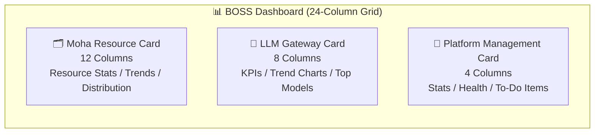
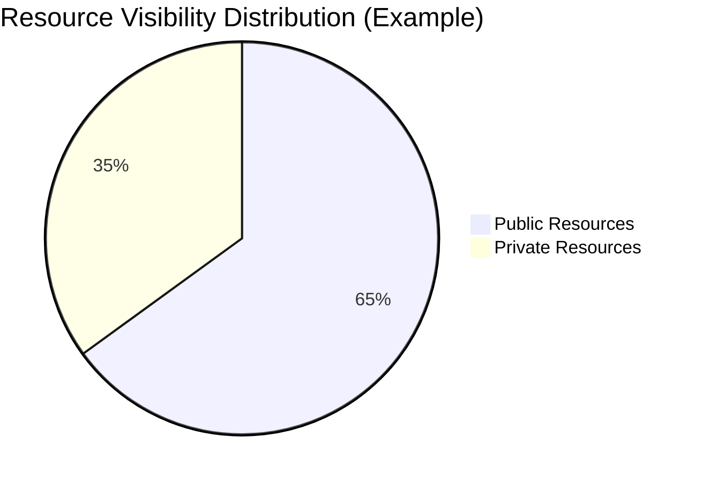
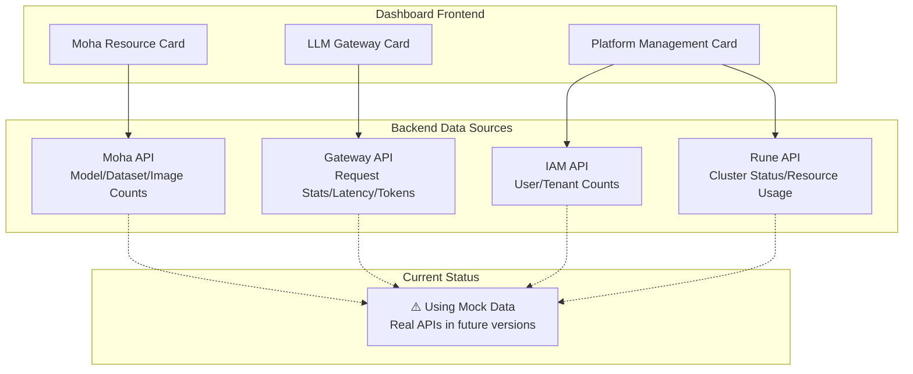

# Platform Dashboard

## Feature Overview

The BOSS Dashboard is the **landing page** that system administrators see upon entering the admin portal, providing platform-wide operational awareness. The dashboard presents the most critical operational data through three themed cards — **Moha Resource Card**, **LLM Gateway Card**, and **Platform Management Card** — helping administrators quickly grasp resource usage, gateway operational status, and overall platform health.

## Access Path

BOSS → Home / Dashboard

Path: `/boss/dashboard`

## Page Layout

The dashboard uses a responsive grid layout with three cards distributed by column width:

| Card | Column Width | Position | Core Content |
|------|-------------|----------|--------------|
| Moha Resource Card | 12 Columns | Left | Model/Dataset/Workspace/Image stats, trending lists, public/private distribution |
| LLM Gateway Card | 8 Columns | Center | Total requests/avg latency/total tokens/error rate, 24h trend chart, Top 5 models |
| Platform Management Card | 4 Columns | Right | Tenant/cluster/user counts, resource health, pending items |

> 💡 Tip: The current dashboard data is **mock data** (simulated data) used to demonstrate the dashboard's layout and interaction design. Future versions will connect to real backend APIs, at which point all metrics will update in real time.

---

## Moha Resource Card

The Moha Resource Card occupies **12 columns** (the left half of the page) and is the largest card on the dashboard, providing a comprehensive view of Moha data repository resources.

### Resource Total Statistics

The top of the card displays four counters showing core resource totals:

| Metric | Icon | Description |
|--------|------|-------------|
| **Model Count** | 🤖 | Total number of all model repositories on the platform |
| **Dataset Count** | 📊 | Total number of all datasets on the platform |
| **Workspace Count** | 💻 | Total number of all Space workspaces |
| **Image Count** | 🐳 | Total number of images in the image registry |

Each counter shows the **public count** and **private count** for that resource type, providing an intuitive view of resource openness.

### Trending Resource Lists

The middle section of the card displays **trending resource rankings** for each resource category, sorted by recent downloads, visits, or citations:

- **Trending Models** — Models most used or downloaded by users recently
- **Trending Datasets** — Datasets most cited or downloaded recently
- **Trending Spaces** — Space applications with the highest recent traffic

Each trending item includes the resource name, owning organization, trend arrow (↑/↓), and change magnitude.

### Public/Private Distribution

The bottom of the card uses a distribution bar or pie chart to show the **public vs. private** ratio for each resource type, helping administrators understand the platform's resource openness:

> 💡 Tip: If the proportion of private resources is too high, it may indicate that the platform's resource-sharing culture needs improvement; conversely, if there are too many public resources, data security compliance should be monitored.

---

## LLM Gateway Card

The LLM Gateway Card occupies **8 columns** and focuses on displaying real-time operational data for the LLM Gateway, helping administrators monitor model service availability and performance.

### Four Core KPIs

The top of the card displays four indicator cards showing core gateway operational metrics, each with a **trend arrow** (compared to the previous period):

| KPI Metric | Unit | Trend | Description |
|------------|------|-------|-------------|
| **Total Requests** | Count | ↑/↓ | Total API request count within the statistical period |
| **Average Latency** | ms | ↑/↓ | Average response latency across all requests |
| **Total Tokens** | Count | ↑/↓ | Total tokens consumed within the statistical period |
| **Error Rate** | % | ↑/↓ | Percentage of requests returning non-2xx responses |

Trend arrow color guide:
- 🟢 **Green up arrow**: Request/token volume growth (indicates increased usage, positive)
- 🔴 **Red up arrow**: Latency/error rate increase (indicates quality degradation, requires attention)
- 🟢 **Green down arrow**: Latency/error rate decrease (indicates quality improvement)

### 24-Hour Trend Chart

The middle section displays an **area chart** showing request volume distribution over a 24-hour time axis. Through the trend chart, administrators can:

- Identify **peak request periods** (e.g., weekday mornings 9-11 AM)
- Discover **abnormal request spikes** (e.g., sudden large volumes of requests)
- Assess whether **service capacity** meets peak demand

### Top 5 Popular Models

The bottom of the card displays the top **5 models** ranked by request volume:

| Rank | Display Field | Description |
|------|--------------|-------------|
| 1-5 | Model Name | The model identifier being called |
| — | Request Share | Percentage of total requests for this model |
| — | Progress Bar | Visual representation of request share |

> ⚠️ Note: The gateway card currently uses mock data. After connecting to real data, KPI metrics and trend charts will support custom time range filtering.

---

## Platform Management Card

The Platform Management Card occupies **4 columns** (far right of the page), displaying platform infrastructure and management status in a compact format.

### Platform Statistics

The top of the card displays three core platform entity counts:

| Metric | Description |
|--------|-------------|
| **Tenant Count** | Total number of tenants created on the platform |
| **Cluster Count** | Total number of connected Kubernetes clusters |
| **User Count** | Total number of registered users on the platform |

### Resource Health

The middle section uses progress bars or gauge displays to show the health of key infrastructure metrics:

| Metric | Healthy Range | Warning Range | Critical Range |
|--------|--------------|---------------|----------------|
| **CPU Usage** | 0%-60% | 60%-85% | >85% |
| **Memory Usage** | 0%-70% | 70%-90% | >90% |
| **Resource Capacity** | 0%-75% | 75%-90% | >90% |

Health status is displayed with color coding:
- 🟢 **Green**: Healthy status, resources are sufficient
- 🟡 **Yellow**: Warning status, requires attention
- 🔴 **Red**: Critical status, requires immediate action

### Pending Items

The bottom of the card lists items currently awaiting administrator action, such as:

- Pending tenant approval requests
- Clusters with connection errors
- Tenants approaching quota limits
- Expired API Keys

> 💡 Tip: Pending items are clickable and navigate directly to the corresponding management pages, helping administrators respond quickly.

---

## Dashboard Data Architecture

## FAQ

### Why isn't the dashboard data real-time?

The current version of the dashboard uses mock (simulated) data for display purposes, to validate the dashboard's layout design and interaction experience. Future versions will gradually connect to real backend APIs, at which point data will automatically update according to the configured refresh interval.

### Can the cards be customized?

The layout and content of the current three cards are fixed. The **Dynamic Dashboard** feature in platform settings can be used to create more flexible custom monitoring panels, supporting the free addition and arrangement of chart components.

### How to determine if the platform is healthy?

Focus on the following signals:
1. **Resource health** indicators are all green
2. **Gateway error rate** is below 1%
3. **Average latency** is within a reasonable range (recommended < 500ms)
4. **Pending items** count is 0

> ⚠️ Note: Even if the dashboard shows everything is normal, it is recommended to regularly visit each management module for in-depth checks. The dashboard shows summary information and cannot cover all details.
