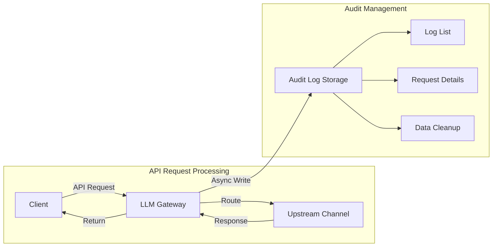
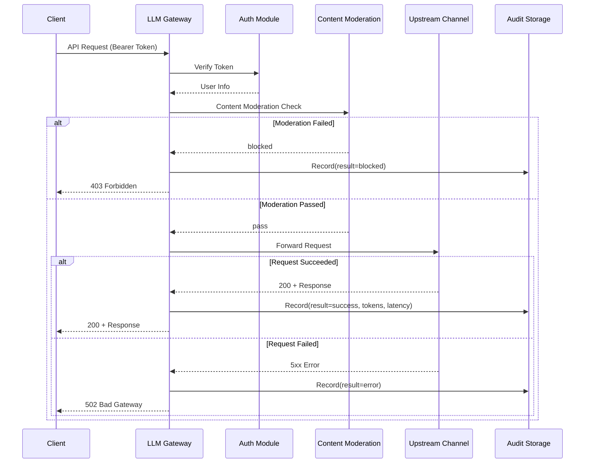

# Audit Logs

## Feature Overview

Audit Logs are the LLM Gateway's **core security and compliance feature**, providing a complete record of detailed information for every API request passing through the gateway, including requester identity, model used, Token consumption, processing results, and complete request/response payloads. Audit logs provide reliable data support for security reviews, troubleshooting, compliance audits, and usage analysis.

> 💡 Tip: The audit feature is controlled by the `auditEnabled` switch in [Gateway Configuration](./config.md). It is recommended to keep the audit feature enabled at all times in production environments to meet security compliance requirements.

## Access Path

BOSS → LLM Gateway → **Audit Logs**

Path: `/boss/gateway/audit`

API base path: `/api/airouter/v1/audit`

## Audit Data Flow



## Filter Conditions

The top of the page provides multi-dimensional filters for precisely locating target audit records:


| Filter | Type | Description |
|--------|------|-------------|
| User | Dropdown | Filter by requesting user |
| Token | Dropdown | Filter by API Token used |
| Provider | Dropdown | Filter by upstream model provider |
| Model | Dropdown | Filter by requested model name |
| Time Range | Date Range Picker | Filter by request occurrence time |
| Result | Dropdown | Filter by processing result: `success` / `error` |

> 💡 Tip: When troubleshooting specific user issues, it is recommended to combine the "User" and "Time Range" filters to quickly locate all request records for that user within the specified period.

## Audit Record List


| Column | Field Name | Description | Notes |
|--------|-----------|-------------|-------|
| Request ID | `requestId` | Unique request identifier | Click to navigate to details page; requests with sensitive information show a ⚠️ warning icon |
| Request Time | `requestStarted` | Request timestamp | Precise to milliseconds |
| Username/User ID | `username` / `userId` | Request initiator | Shows both username and ID |
| Token ID | `tokenId` | API Token used | Truncated display (first 8 characters only) |
| Tenant ID | `tenantId` | Associated tenant identifier | — |
| Channel Name | `channelName` | Channel name routed to | — |
| Model | `model` | Requested model name | — |
| Result | `result` | Request processing result | Color-coded label |
| Total Tokens | `totalTokens` | Total Tokens consumed by this request | Prompt + Completion |
| Actions | — | View Details | — |

### Result Status Color Coding

| Result | Color | Enum Value | Description |
|--------|-------|------------|-------------|
| Success | 🟢 Green | `success` | Request processed successfully and returned results |
| Error | 🔴 Red | `error` | Error occurred during request processing |
| Blocked | 🟠 Orange | `blocked` | Blocked by content moderation policy |
| Quota Exceeded | 🔴 Red | `quota_exceeded` | Exceeded Token usage quota |

### Sensitive Content Warning

When request content triggers [Content Moderation](./moderation.md) policy detection, a ⚠️ warning icon appears next to the audit record's Request ID, alerting administrators that the request involves sensitive content.

> ⚠️ Note: A sensitive content marker does not mean the request was necessarily blocked. Depending on the moderation policy's Action configuration (log/replace/block), some requests may only have logs recorded or content replaced before being allowed through.

## Audit Details Page

Click the Request ID to enter the details page and view complete information for the request:


### Basic Information

| Field | Description |
|-------|-------------|
| Request ID | Unique identifier |
| User | Requesting user (username + ID) |
| Token | API Token used (full ID) |
| Tenant | Associated tenant |
| Channel | Channel used for routing |
| Model | Requested model |
| Result | Processing result (color-coded label) |
| Request Time | Request start time |
| Response Time | Response completion time |
| Latency | End-to-end latency (milliseconds) |

### Token Statistics

| Field | Description |
|-------|-------------|
| Prompt Tokens | Input Token count |
| Completion Tokens | Output Token count |
| Total Tokens | Total Token count |

### Request Payload

Displays the complete API request body, typically containing:

```json
{
  "model": "gpt-4",
  "messages": [
    {"role": "system", "content": "You are a helpful assistant."},
    {"role": "user", "content": "...user's complete input..."}
  ],
  "temperature": 0.7,
  "max_tokens": 2048
}
```

### Response Payload

Displays the complete API response body, including the model's output content and usage statistics.

> ⚠️ Note: Request and response payloads may contain user privacy information or sensitive content. Ensure that only authorized personnel can access the audit details page and follow data security policies.

## Data Cleanup

Over time, audit log data will continue to grow. Administrators can periodically clean up expired audit records to free storage space.

**API Endpoint**: `DELETE /api/airouter/v1/audit/cleanup?before=<ISO8601DateTime>`

**Parameters**:

| Parameter | Type | Description |
|-----------|------|-------------|
| `before` | ISO 8601 Date | Clean up all audit records before this time |

**Example**:

```bash
# Clean up audit records older than 90 days
DELETE /api/airouter/v1/audit/cleanup?before=2025-11-27T00:00:00Z
```

> ⚠️ Note: Data cleanup operations are irreversible. It is recommended to export audit data that needs to be retained before cleanup. According to compliance requirements, audit logs typically need to be retained for 180 days or more.

## Audit Flow



## API Reference

| Operation | Method | Endpoint | Description |
|-----------|--------|----------|-------------|
| Query Audit Records | GET | `/api/airouter/v1/audit/records` | Paginated query with multi-condition filtering |
| Get Record Details | GET | `/api/airouter/v1/audit/records/:id` | Get complete details of a single record |
| Cleanup History | DELETE | `/api/airouter/v1/audit/cleanup?before=` | Batch cleanup records before specified date |

## Permission Requirements

Requires the **System Administrator** role. Audit logs contain users' complete request and response data, which is highly sensitive information viewable only by system administrators.
