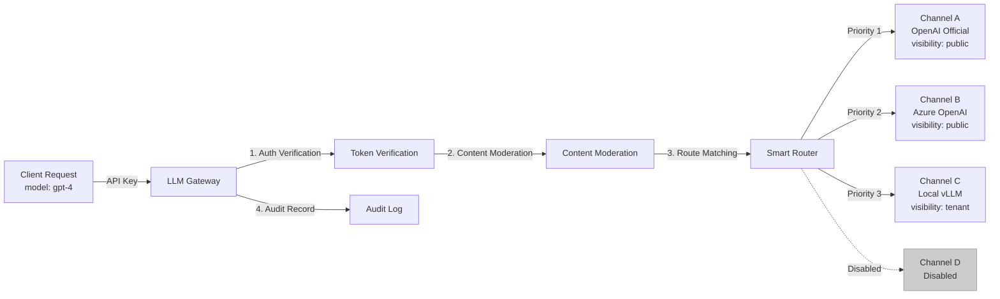
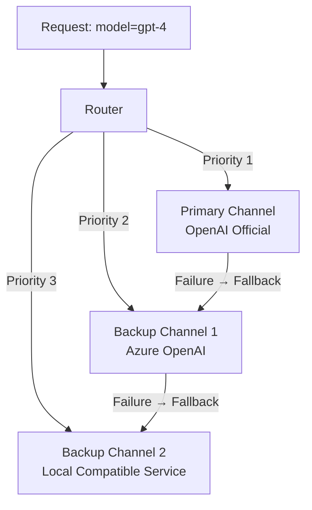

# Model Channel Management

## Feature Overview

Model Channels are a core concept of the LLM Gateway — each channel represents an **upstream model service endpoint**, which can be an external API provider (such as OpenAI, Alibaba Cloud DashScope), a third-party platform, or an internally deployed inference service. The gateway intelligently distributes user API requests to appropriate channels for processing based on routing strategies.

The channel management page allows system administrators to configure and manage all upstream model channels, including adding, editing, enabling/disabling, visibility control, and routing priority settings.

> 💡 Tip: Channels are the bridge connecting client requests to upstream inference services. Properly configuring multiple channels enables load balancing, fault tolerance, and unified multi-model access.

## Access Path

BOSS → LLM Gateway → **Model List**

Path: `/boss/gateway/channels`

## Channel Routing Architecture



## Channel List


| Column | Field | Description | Notes |
|--------|-------|-------------|-------|
| Visibility + Name | `visibility` + `name` | Channel name with colored visibility label prefix | Label colors: `public`=green(success), `tenant`=orange(warning), `private`=default |
| Provider + API URL | `provider` + `apiBase` | Model provider name and API base URL | — |
| Supported Models | `supportedModels` | List of models supported by the channel | Displayed using `CollapseItem` folding for multiple models |
| RPM | `rateLimitRPM` | Requests per minute limit | 0 means unlimited |
| TPM | `rateLimitTPM` | Tokens per minute limit | 0 means unlimited |
| Enabled Status | `enabled` | Whether the channel is enabled | Displayed using `Label` component |
| Tenant/Workspace | `tenant` / `workspace` | Associated tenant and workspace | Only has values for tenant/private visibility |
| Creator | `owner` | Channel creator | — |
| Created At | `createdAt` | Channel creation time | Timestamp format |
| Actions | — | Enable/Disable, Change Visibility, Edit, Delete | — |

### Visibility Label Colors

| Visibility | Label Color | Meaning |
|------------|-------------|---------|
| `public` | 🟢 Green (success) | Public channel, available to all users |
| `tenant` | 🟠 Orange (warning) | Tenant-level channel, available only to specified tenant |
| `private` | ⚪ Default | Private channel, available only to specified workspace |

## Filter Conditions

The page provides the following filters to quickly locate target channels:

| Filter | Description | Options |
|--------|-------------|---------|
| Visibility | Filter by visibility level | `public` / `tenant` / `private` |
| Provider | Filter by model provider | See supported list below |

## Supported Model Providers

The platform has built-in support for the following 9 model providers:

| Provider | Identifier | Description | API Format |
|----------|-----------|-------------|------------|
| **OpenAI** | `openai` | OpenAI official API | OpenAI standard |
| **OpenAI Compatible** | `openai-compatible` | Third-party services compatible with OpenAI format | OpenAI standard |
| **Alibaba Cloud DashScope** | `dashscope` | Alibaba Cloud large model service | DashScope |
| **Baidu ERNIE** | `baidu` | Baidu ERNIE Bot API | Baidu proprietary |
| **Moonshot** | `moonshot` | Kimi large model API | OpenAI compatible |
| **Zhipu AI** | `zhipu` | Zhipu GLM series API | Zhipu proprietary |
| **SiliconFlow** | `siliconflow` | SiliconFlow inference platform | OpenAI compatible |
| **OpenRouter** | `openrouter` | OpenRouter aggregation platform | OpenAI compatible |
| **Volcengine (Doubao)** | `doubao` | ByteDance Doubao large model | Volcengine |

> 💡 Tip: For inference services deployed within the platform (such as vLLM, TGI), typically select the `openai-compatible` provider type, as these services generally provide OpenAI-compatible API interfaces.

## Create Channel

Click the **Add Channel** button to open the creation form:


### Basic Information

| Field | Type | Required | Description |
|-------|------|----------|-------------|
| Name | Text | ✅ | Unique channel name |
| Description | Textarea | — | Channel description |
| Provider | Select | ✅ | Model provider (9 options) |
| API URL | URL | ✅ | Inference service API base URL |
| API Keys | Password List | — | Upstream service API Keys (supports multiple, used in round-robin) |

### Visibility & Ownership

| Field | Type | Required | Description |
|-------|------|----------|-------------|
| Visibility | Select | ✅ | `public` / `tenant` / `private` |
| Tenant | Tenant Selector | Conditional | Required when visibility is `tenant` or `private` |
| Workspace | Workspace Selector | Conditional | Required when visibility is `private` |
| Enabled | Toggle | ✅ | Whether to enable immediately after creation |
| Priority | Number | — | Routing priority (higher number = higher priority) |

### Model Configuration

| Field | Type | Required | Description |
|-------|------|----------|-------------|
| Supported Models | Tag Input | ✅ | List of model names supported by the channel |
| Model Alias Mapping | Key-Value Table | — | Map requested model names to actual model names |

**Model Alias Mapping** (`modelAliasMap`) example:

```json
{
  "gpt-4": "gpt-4-turbo-preview",
  "claude-3": "claude-3-opus-20240229"
}
```

When a user requests `gpt-4`, the gateway maps it to `gpt-4-turbo-preview` before sending to the upstream channel.

### Model Metadata

| Field | Type | Description |
|-------|------|-------------|
| `supportsThinking` | Boolean | Whether the model supports chain-of-thought (Thinking/Reasoning) |
| `maxContextTokens` | Number | Maximum context Token count for the model |

### Rate Limiting

| Field | Type | Description |
|-------|------|-------------|
| RPM | Number | Maximum requests per minute for the channel (0 = unlimited) |
| TPM | Number | Maximum Tokens per minute for the channel (0 = unlimited) |

> ⚠️ Note: Channel RPM/TPM limits protect upstream services from overload and are independent from API Key rate limiting — they form two separate rate limiting layers.

### Advanced Configuration

| Field | Type | Description |
|-------|------|-------------|
| Engine | Text | Inference engine identifier |
| Adapters | List | Request/response adapter configuration |

## Channel Operations

### Enable / Disable

Click the enable/disable toggle in the list to quickly control channel availability:

- **Disable**: The channel will no longer receive routed requests; in-progress requests are not affected
- **Enable**: The channel resumes receiving routed requests

> 💡 Tip: When temporarily maintaining upstream services, disable the corresponding channel first, then re-enable after maintenance completes to avoid routing user requests to unavailable services.

### Change Visibility

Click **Change Visibility** in the action menu to open a selection dialog for switching the channel's visibility level:

- **public → tenant**: From public to tenant-level, requires specifying the associated tenant
- **tenant → private**: From tenant-level to private, requires specifying the associated workspace
- **private → public**: From private to public

> ⚠️ Note: After narrowing the visibility scope, users who could previously use the channel will no longer be able to route to it.

### Edit

Modify all editable fields of the channel, including API URL, API Keys, model list, etc.

### Delete

Delete the channel after confirming in the dialog.

> ⚠️ Note: After deleting a channel, requests using that channel's models may fail because there are no available channels. Before deleting, confirm that other channels can provide service for the same models.

## Channel Data Structure

The complete Channel object contains the following fields:

```typescript
interface Channel {
  id: string;                    // Channel unique ID
  name: string;                  // Channel name
  description: string;           // Description
  provider: string;              // Model provider
  apiBase: string;               // API base URL
  apiKeys: string[];             // API Key list (round-robin)
  owner: string;                 // Creator
  tenant: string;                // Associated tenant
  workspace: string;             // Associated workspace
  visibility: 'public' | 'tenant' | 'private'; // Visibility
  priority: number;              // Routing priority
  enabled: boolean;              // Whether enabled
  supportedModels: string[];     // Supported models list
  modelAliasMap: Record<string, string>; // Model alias mapping
  modelMetadata: {               // Model metadata
    supportsThinking: boolean;
    maxContextTokens: number;
  };
  rateLimitRPM: number;          // RPM limit
  rateLimitTPM: number;          // TPM limit
  engine: string;                // Inference engine
  adapters: any[];               // Adapter list
}
```

## Best Practices

### Multi-Channel Redundancy

Configure multiple channels for critical models, leveraging the gateway's [fault tolerance mechanism](./config.md#fault-tolerance-configuration) for automatic failover:



### Internal/External Channel Distribution

Use visibility and priority to achieve reasonable distribution between internal and external services:

- **Public Channels**: For all users, using external APIs (e.g., OpenAI)
- **Tenant Channels**: For specific tenants, using tenant-dedicated inference services
- **Private Channels**: For specific workspaces, using internally deployed inference instances

## Permission Requirements

Requires the **System Administrator** role. System administrators can create and manage all channels. Channels created via inference service registration (from the Console side) also appear in this list.
