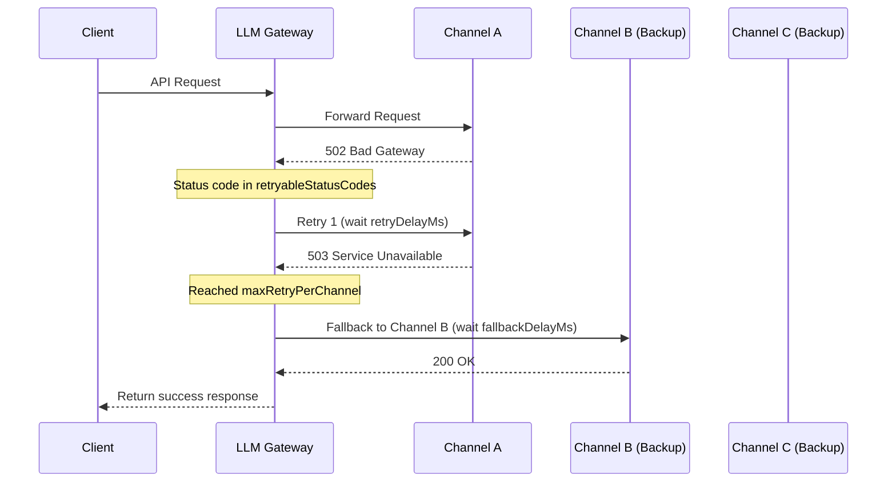

# Gateway Configuration

## Feature Overview

The Gateway Configuration page provides centralized management of LLM Gateway global runtime parameters. Administrators can configure key parameters for the gateway's core feature switches, cache policies, routing rules, fault tolerance, security policies, and more. All configuration changes take effect in real-time.

Gateway configuration is the core control center for LLM Gateway behavior. Proper configuration can significantly improve the gateway's performance, security, and reliability.

> ⚠️ Note: Gateway configuration changes immediately affect all API requests passing through the gateway. It is recommended to modify critical configurations during off-peak hours and observe for a period after changes to confirm no anomalies.

## Access Path

BOSS → LLM Gateway → **Gateway Configuration**

Path: `/boss/gateway/config`

## Configuration Architecture Overview

```mermaid
graph TB
    subgraph Config["Gateway Global Configuration"]
        Core["Core Feature Switches"]
        Cache["Cache Configuration"]
        Routing["Routing Configuration"]
        Fallback["Fault Tolerance Configuration"]
        Security["Security Policies"]
    end

    Core --> RateLimit["Rate Limiting Switch"]
    Core --> Audit["Audit Switch"]
    Core --> Moderation["Moderation Switch"]
    Core --> Billing["Billing Switch"]
    Core --> BillingOverdraft["Allow Overdraft"]

    Cache --> ChannelCache["Channel Cache"]
    Cache --> UserCache["User-Tenant Cache"]
    Cache --> BillingCache["Billing Cache"]
    Cache --> TokenCache["Token Cache"]

    Routing --> Preferred["Preferred Providers"]
    Routing --> Blocked["Blocked Providers"]

    Fallback --> FallbackSwitch["Fallback Switch"]
    Fallback --> Retry["Retry Strategy"]
    Fallback --> FallbackCount["Fallback Count"]

    Security --> Whitelist["IP Whitelist"]
```



## Core Feature Switches

Core feature switches control the enable/disable status of each gateway subsystem.


| Configuration | Field Name | Type | Default | Description |
|--------------|-----------|------|---------|-------------|
| **Rate Limiting Switch** | `rateLimitEnabled` | Boolean | `true` | Whether to enable API request rate limiting (RPM/TPM). When disabled, rate limiting rules for all Tokens and channels will not take effect. |
| **Audit Switch** | `auditEnabled` | Boolean | `true` | Whether to enable request audit logging. When disabled, detailed API request information will no longer be recorded in audit logs. |
| **Moderation Switch** | `moderationEnabled` | Boolean | `true` | Whether to enable content safety moderation. When disabled, all content moderation policies will be suspended. |
| **Billing Switch** | `billingEnabled` | Boolean | `false` | Whether to enable Token usage billing. When enabled, Token usage will be tracked and limited by tenant/user dimension. |
| **Allow Overdraft** | `billingAllowOverdraft` | Boolean | `false` | When billing is enabled, whether to allow continued use beyond quota. When enabled, users can exceed limits, but overdraft records will be generated. |

> 💡 Tip: During the platform initialization phase, it is recommended to disable billing (`billingEnabled=false`) first, and enable billing and quota management after the business stabilizes.

> ⚠️ Note: Disabling audit and moderation switches reduces the platform's security compliance capability. Unless there is a clear reason, it is recommended to keep them enabled.

## Cache Configuration

The gateway uses in-memory caching to improve query performance and reduce frequent access to backend databases. Properly configuring cache TTL achieves a balance between performance and data consistency.


| Configuration | Field Name | Type | Default | Description |
|--------------|-----------|------|---------|-------------|
| **Channel Cache Switch** | `cacheChannelEnabled` | Boolean | `true` | Whether to cache channel information |
| **Channel Cache TTL** | `cacheChannelTTL` | Duration | `5m` | Channel information cache validity period |
| **User-Tenant Cache Switch** | `cacheUserTenantEnabled` | Boolean | `true` | Whether to cache user-tenant associations |
| **User-Tenant Cache TTL** | `cacheUserTenantTTL` | Duration | `5m` | User-tenant cache validity period |
| **Billing Cache Switch** | `cacheBillingEnabled` | Boolean | `true` | Whether to cache billing quota information |
| **Billing Cache TTL** | `cacheBillingTTL` | Duration | `1m` | Billing quota cache validity period |
| **Token Cache TTL** | `cacheTokenTTL` | Duration | `5m` | API Token cache validity period |
| **Token Binding Cache TTL** | `cacheTokenBindingTTL` | Duration | `5m` | Cache validity period for Token-to-user/tenant bindings |

> 💡 Tip: The shorter the cache TTL, the better the data consistency (changes to channels/Tokens take effect faster), but the greater the database query pressure. Recommendations:
> - Production: Channel cache 5-10 minutes, Token cache 5 minutes
> - Development/Testing: Cache 1 minute or disable caching for easier debugging

### Cache Rebuild

After modifying core data such as channels or users, if you need changes to take effect immediately without waiting for cache expiration, you can manually trigger a cache rebuild.

**Operation**: Click the **Rebuild Cache** button on the page

**API Endpoint**: `POST /api/airouter/v1/cache/rebuild`

**Response**:

```json
{
  "channels": 42,    // Number of channels reloaded
  "users": 156       // Number of users reloaded
}
```

> ⚠️ Note: There may be brief performance fluctuations during cache rebuild. In high-concurrency scenarios, it is recommended to perform this during off-peak hours.

## Routing Configuration

Routing configuration controls the gateway's routing preferences in multi-channel environments, affecting which upstream channel requests are dispatched to.


| Configuration | Field Name | Type | Description |
|--------------|-----------|------|-------------|
| **Preferred Providers** | `routingPreferredProviders` | String[] | List of preferred providers for routing. When multiple channels support the requested model, requests are preferentially routed to provider channels in this list. |
| **Blocked Providers** | `routingBlockedProviders` | String[] | List of blocked providers. Even if a channel exists, requests will not be routed to providers in this list. |

**Configuration Example**:

```yaml
# Prefer self-hosted inference services, avoid external APIs
routingPreferredProviders: ["local-inference", "siliconflow"]
routingBlockedProviders: ["openai"]
```

> 💡 Tip: Preferred provider settings are not exclusive — when preferred provider channels are unavailable, requests will still be routed to other available channels. Blocked providers are a hard restriction; channels from blocked providers will never be routed to.

## Fault Tolerance Configuration

Fault tolerance configuration defines the gateway's retry and fallback strategies when upstream channel requests fail, ensuring high availability of API services.


| Configuration | Field Name | Type | Default | Description |
|--------------|-----------|------|---------|-------------|
| **Fallback Switch** | `fallbackEnabled` | Boolean | `true` | Whether to enable fault tolerance mechanism |
| **Retryable Status Codes** | `retryableStatusCodes` | Number[] | `[500, 502, 503, 504, 429]` | List of HTTP status codes that trigger retries |
| **Max Retry Per Channel** | `maxRetryPerChannel` | Number | `2` | Maximum retries for the same channel (0-5) |
| **Max Fallback Count** | `maxFallbackCount` | Number | `3` | Maximum times to switch to backup channels (0-10) |
| **Retry Delay** | `retryDelayMs` | Number | `100` | Wait interval for same-channel retries (milliseconds) |
| **Fallback Delay** | `fallbackDelayMs` | Number | `200` | Wait interval for channel switching (milliseconds) |

### Fault Tolerance Flow



> ⚠️ Note: Fault tolerance mechanisms increase total request latency. In latency-sensitive scenarios, consider reducing the values of `maxRetryPerChannel` and `maxFallbackCount`.

> 💡 Tip: Status code `429` (Too Many Requests) is included in the retryable list by default because rate limiting is typically temporary, and retrying later usually succeeds.

## Security Policies

### Global IP Whitelist

Configure the IP address whitelist for accessing the LLM Gateway API. When enabled, only IP addresses or CIDR ranges in the whitelist can access the gateway.


| Configuration | Field Name | Type | Description |
|--------------|-----------|------|-------------|
| **Global Whitelist** | `globalWhitelist` | String[] | List of IP addresses or CIDR ranges |

**Supported Formats**:

| Format | Example | Description |
|--------|---------|-------------|
| Single IPv4 | `192.168.1.100` | Exact match for one IP |
| IPv4 CIDR | `10.0.0.0/8` | Match all IPs within CIDR range |
| Single IPv6 | `::1` | IPv6 loopback address |
| IPv6 CIDR | `2001:db8::/32` | IPv6 network range |

> ⚠️ Note: When entering CIDR, the system automatically performs CIDR normalization validation. If the entered IP address is not the network address of the CIDR range (e.g., entering `192.168.1.100/24` instead of `192.168.1.0/24`), the system will display a normalization warning suggesting the correct network address.

> ⚠️ Note: Before configuring the whitelist, ensure that the management node's IP is included; otherwise, it may prevent administrators from accessing the gateway API as well.

## Configuration Best Practices

### Production Environment Recommended Configuration

| Configuration Group | Recommended Setting | Reason |
|--------------------|-------------------- |--------|
| Rate Limiting | ✅ Enabled | Prevent API abuse |
| Audit | ✅ Enabled | Meet compliance requirements |
| Moderation | ✅ Enabled | Content safety assurance |
| Billing | Enable as needed | Enable after commercial launch |
| Channel Cache TTL | 5-10 minutes | Balance performance and consistency |
| Billing Cache TTL | 1 minute | Quota data needs higher consistency |
| Fault Tolerance Retries | 2 times | Avoid excessive latency |
| Max Fallback | 3 times | Ensure availability |

### Development Environment Recommended Configuration

| Configuration Group | Recommended Setting | Reason |
|--------------------|-------------------- |--------|
| Rate Limiting | ❌ Disabled | Avoid rate limiting blocking development debugging |
| Audit | ✅ Enabled | Facilitate issue troubleshooting |
| Moderation | ❌ Disabled | Simplify debugging flow |
| Cache TTL | 1 minute | Quickly see configuration change effects |
| Fault Tolerance | ✅ Enabled | Verify fault tolerance logic |

### Configuration Change Checklist

Before modifying gateway configuration, confirm the following checklist:

1. ✅ Do you understand the impact scope of the configuration item
2. ✅ Are you operating during off-peak hours
3. ✅ When modifying the whitelist, have you included the management node IP
4. ✅ Do you need to manually rebuild the cache
5. ✅ After modification, have you observed the request success rate and latency for a period

## FAQ

### How long do configuration changes take to take effect?

Core feature switches and security policy changes take effect **immediately**. Cache-related configuration changes require waiting for the current cache to expire or manually triggering a cache rebuild to fully take effect.

### How much latency does fault tolerance retry add?

Worst-case additional latency = `maxRetryPerChannel × retryDelayMs + maxFallbackCount × fallbackDelayMs`. With default values (2 retries × 100ms + 3 fallbacks × 200ms), the maximum additional latency is approximately 800ms.

### What if IP whitelist misconfiguration prevents access?

If an administrator cannot access the gateway API due to whitelist misconfiguration, recovery can be done through:
1. Directly access the API service Pod via Kubernetes
2. Modify configuration using kubectl
3. Or contact operations staff to fix from within the cluster

## Permission Requirements

Requires the **System Administrator** role. Gateway configuration changes affect the entire platform's API service behavior and can only be performed by system administrators.
