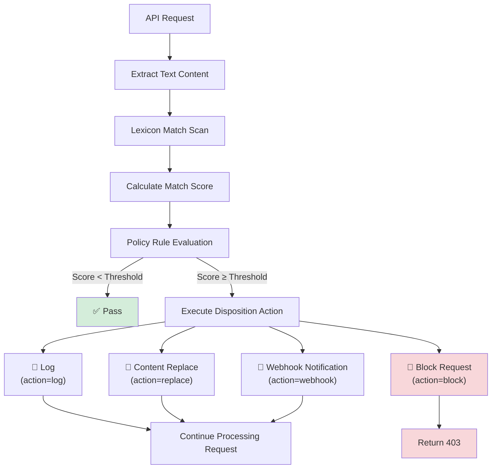
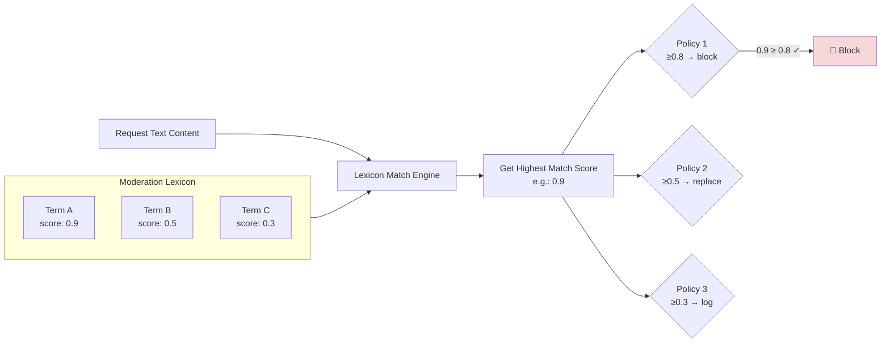

# Content Moderation

## Feature Overview

Content Moderation is the LLM Gateway's **content safety defense line**, performing real-time content safety checks on API requests and responses passing through the gateway. The system works through two coordinating mechanisms — **Moderation Policies** and **Moderation Lexicon** — to detect, log, replace, and block sensitive content.

Content Moderation includes two management modules:

- **Moderation Policies**: Define moderation rules, judgment thresholds, and disposition actions
- **Moderation Lexicon**: Manage sensitive terms, categories, and scores

> 💡 Tip: The content moderation feature is globally enabled/disabled via the `moderationEnabled` switch in [Gateway Configuration](./config.md). When disabled, all moderation policies will be suspended, but policy configurations are not lost.

## Access Path

BOSS → LLM Gateway → **Moderation Policies** / **Moderation Lexicon**

Path: `/boss/gateway/moderation`

## Moderation Processing Flow



---

## Moderation Policies

### Overview

Moderation policies define the complete rule chain of **what content, at what severity, should be handled how**. Each policy contains matching rules, judgment thresholds, and disposition actions.

### Policy List


| Column | Description | Notes |
|--------|-------------|-------|
| Name | Policy name + description | Name and description shown in the same column |
| Operator + Threshold | Match judgment condition | e.g., `≥ 0.8` (triggers when score is greater than or equal to 0.8) |
| Disposition Action | Action to execute when triggered | `log` / `replace` / `webhook` / `block` |
| Priority | Policy execution priority | Higher number = higher priority |
| Enabled Status | Whether enabled | Toggle state |
| Updated At | Last modified time | Timestamp |
| Actions | Enable/Disable, Edit, Delete | — |

#### Filtering

- **Enabled Status**: Filter the policy list by enabled / disabled status

### Create Policy

Click the **Create Policy** button to open the creation form:


#### Basic Information

| Field | Type | Required | Description |
|-------|------|----------|-------------|
| Name | Text | ✅ | Unique policy name |
| Description | Textarea | — | Policy description |
| Priority | Number | ✅ | Execution priority (higher number executes first) |
| Enabled | Toggle | ✅ | Whether to enable immediately after creation |

#### Matching Rules

| Field | Type | Required | Description |
|-------|------|----------|-------------|
| Operator | Select | ✅ | Comparison operator (e.g., `≥`, `>`, `=`, etc.) |
| Threshold | Number | ✅ | Trigger threshold (e.g., `0.8`), compared against lexicon match score |

**Matching Logic**: When the sensitive term match score satisfies the `operator` `threshold` condition, the policy's disposition action is triggered. For example, "score ≥ 0.8" means triggering when the match score reaches 0.8 or above.

#### Disposition Actions

Policies support the following four disposition actions:

| Action | Identifier | Description | Request Continues? |
|--------|-----------|-------------|-------------------|
| **Log** | `log` | Only records to audit log, does not affect request | ✅ Continues |
| **Content Replace** | `replace` | Replaces matched sensitive content then continues processing | ✅ Continues (content modified) |
| **Webhook Notification** | `webhook` | Calls external Webhook notification then continues processing | ✅ Continues |
| **Block Request** | `block` | Directly blocks request, returns 403 error | ❌ Terminated |

> 💡 Tip: It is recommended to use a tiered strategy — use `log` to observe low-risk content, `replace` to sanitize medium-risk content, and `block` to directly block high-risk content.

### Policy Rule Configuration (PolicyRuleConfig)

Different rule parameters need to be configured depending on the selected disposition action:

#### Replace Configuration

| Field | Type | Description |
|-------|------|-------------|
| `maskChar` | Text | Mask character used for replacement (e.g., `*`) |
| `maskMode` | Select | Mask mode |

**Mask Modes**:

| Mode | Identifier | Effect Example |
|------|-----------|----------------|
| Character-by-character | `char_repeat` | `sensitive` → `*********` |
| Fixed length | `fixed_length` | `sensitive` → `****` (fixed 4 chars) |
| Single character | `single_char` | `sensitive` → `*` |

#### Webhook Configuration

| Field | Type | Description |
|-------|------|-------------|
| `webhookUrl` | URL | Webhook callback URL |
| `webhookMethod` | Select | HTTP method (GET/POST) |
| `webhookHeaders` | Key-Value | Custom request headers |
| `webhookTimeout` | Number | Request timeout (seconds) |
| `webhookResponse` | Text | Expected response format |

#### Notification Configuration

| Field | Type | Description |
|-------|------|-------------|
| `notification` | Toggle | Whether to send email notification |
| `notifyEmails` | Email List | Notification email recipient list |

> 💡 Tip: Webhook and email notifications can be enabled simultaneously. For high-risk policies, it is recommended to configure email notifications so the security team can respond promptly.

### Enable / Disable Policy

Click the enable/disable toggle in the list to quickly switch policy status:

- **Disable**: Policy execution is suspended, but configuration is preserved and can be re-enabled at any time
- **Enable**: Policy takes effect immediately and begins participating in content moderation

### Edit Policy

Modify all editable fields of the policy (name, description, threshold, action, rule configuration, etc.).

### Delete Policy

After clicking the **Delete** button, the system requires **secondary confirmation — entering the policy name** to execute the deletion.

> ⚠️ Note: Policy deletion requires **manually entering the policy name** in the confirmation dialog for secondary verification to prevent accidental deletion. This operation is irreversible.

---

## Moderation Lexicon

### Overview

The Moderation Lexicon manages the platform's sensitive term database. Each term entry includes the keyword text, match score, category, and tags. The lexicon is the foundational data source for moderation policy matching.

### Lexicon List


| Column | Description | Notes |
|--------|-------------|-------|
| Term | `term` | Sensitive term text |
| Score | `score` | Match score (0-1), compared against policy thresholds |
| Category | `category` | Term category | Displayed using `Chip` labels |
| Tags | `tags` | Custom tags | Displayed using `Chip` (outlined style), supports multiple |
| Updated At | `updatedAt` | Last modified time | — |
| Actions | — | Edit / Delete | Supports batch selection |

### Create Term

Click the **Create** button to add a new sensitive term:

| Field | Type | Required | Description |
|-------|------|----------|-------------|
| Term | Text | ✅ | Sensitive term text |
| Score | Number | ✅ | Match score (between 0-1), higher score indicates higher risk |
| Category | Text/Select | — | Term category (e.g., violence, pornography, politics, fraud, etc.) |
| Tags | Tag Input | — | Custom tags, supports multiple |

**Score Design Recommendations**:

| Score Range | Risk Level | Recommended Policy Action |
|-------------|-----------|--------------------------|
| 0.0 - 0.3 | Low risk | `log` (record only) |
| 0.3 - 0.6 | Medium risk | `replace` (sanitize) |
| 0.6 - 0.8 | High risk | `webhook` (notify + record) |
| 0.8 - 1.0 | Critical risk | `block` (block directly) |

### Batch Import

Click the **Import** button to open `LexiconImportDialog` for batch importing sensitive terms from a file.

**Supported Import Format**:

```json
[
  {
    "term": "sensitive_term_1",
    "score": 0.9,
    "category": "violence",
    "tags": ["tag1", "tag2"]
  },
  {
    "term": "sensitive_term_2",
    "score": 0.7,
    "category": "fraud",
    "tags": ["tag3"]
  }
]
```

> 💡 Tip: During batch import, if a term already exists, its score, category, and tags will be updated.

### Export

Click the **Export** button to export the current lexicon in JSON format for backup or migration to other environments.

### Edit Term

Click the **Edit** button for a term to modify score, category, and tags.

### Delete Term

Two deletion methods are supported:

- **Single delete**: Click the delete button on a term row
- **Batch delete**: Select multiple terms via checkboxes, then click the batch delete button

> ⚠️ Note: Deleting terms immediately affects moderation policy matching behavior. If you're unsure whether a term still needs to be retained, it is recommended to lower its score rather than deleting it directly.

---

## Policy and Lexicon Collaboration



**Execution Logic**:

1. Scan the request text against the lexicon to find all matching sensitive terms
2. Take the highest score among matched terms
3. Evaluate policies in order from highest to lowest priority
4. The first policy whose condition is met triggers its disposition action
5. If the action is `block`, terminate immediately; other actions execute and continue evaluation

> 💡 Tip: Policy priority determines the evaluation order. It is recommended to set `block` policies to the highest priority to ensure critical-risk content is blocked first.

## Best Practices

### Tiered Protection Strategy

It is recommended to set up multi-tiered moderation policies:

| Priority | Policy Name | Threshold | Action | Purpose |
|----------|------------|-----------|--------|---------|
| 100 | Critical Violation Block | ≥ 0.9 | `block` | Block critical-risk content |
| 80 | High Risk Notification | ≥ 0.7 | `webhook` | Notify security team |
| 60 | Medium Risk Replacement | ≥ 0.5 | `replace` | Sanitize sensitive content |
| 40 | Low Risk Logging | ≥ 0.3 | `log` | Record for manual review |

### Lexicon Maintenance

1. **Regular Updates**: Periodically update the sensitive term library based on business needs and compliance requirements
2. **Category Management**: Use categories and tags to organize terms for easier maintenance
3. **Score Calibration**: Adjust term scores based on actual false positive/false negative situations
4. **Backup Export**: Regularly export lexicon JSON files as backups

### Monitoring & Tuning

1. Monitor `blocked` results in [Audit Logs](./audit.md) to analyze whether there are false blocks
2. View the trend of blocked request proportion through [Operations Overview](./operations.md)
3. Adjust policy thresholds and lexicon scores based on actual business feedback

## Permission Requirements

Requires the **System Administrator** role. Management of moderation policies and lexicon involves the platform's content safety system and can only be operated by system administrators.
