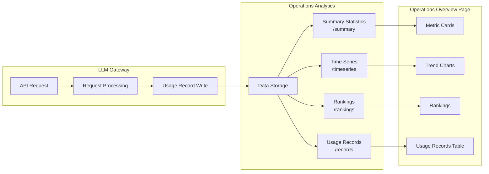

# Operations Overview

## Feature Overview

Operations Overview is the LLM Gateway's **comprehensive operations analytics dashboard**, providing platform administrators with multi-dimensional operational data including API call volume, Token consumption, request latency, user rankings, and more. Through rich visualization charts and detailed usage records, administrators can gain deep insights into platform usage, identify performance bottlenecks, and optimize resource allocation.

> 💡 Tip: Operations Overview page data comes from the gateway's real-time statistics engine, supporting time series analysis at three granularity levels — minute, hour, and day — to meet operational analysis needs across different scenarios.

## Access Path

BOSS → LLM Gateway → **Operations Overview**

Path: `/boss/gateway/operations`

## Data Flow Architecture

## Filters

The top of the page provides multi-dimensional filters supporting flexible combined queries:

| Filter | Type | Description |
|--------|------|-------------|
| Time Range | Date Range Picker | Select the start and end time for statistics, supports quick options (Today, Last 7 Days, Last 30 Days) |
| Tenant | Dropdown | Filter usage data for a specific tenant |
| Token | Dropdown | Filter usage data for a specific API Token |
| User | Dropdown | Filter usage data for a specific user |
| Provider | Dropdown | Filter for a specific model provider (e.g., OpenAI, DashScope, etc.) |

> 💡 Tip: Multiple filter conditions can be combined. For example, selecting a specific tenant + Last 7 Days quickly shows that tenant's API usage over the past week.

## Summary Metrics

The top of the page displays three core summary metrics in card format:

| Metric | Field Name | Description | Display Format |
|--------|-----------|-------------|----------------|
| **Total Tokens** | `totalTokens` | Total Token consumption within the filtered time range | Number (auto-converted to K/M units) |
| **Total Requests** | `requestCount` | Total API request count within the filtered time range | Number |
| **Average Latency** | `averageLatencyMillis` | Average response latency of all requests | Milliseconds (ms) |

> 💡 Tip: Summary metrics are calculated in real-time based on filter conditions. When the average latency increases significantly, it may indicate the downstream inference service is under heavy load, and channel health status should be monitored.

## Trend Charts

### Request Volume & Token Usage Trends

The middle of the page displays usage trends over time using an **Area Chart**, supporting hourly granularity:

The chart contains two data series:

| Data Series | Color | Description |
|-------------|-------|-------------|
| **Requests** | Primary color | API request count per hour |
| **Tokens** | Secondary color | Total Token consumption per hour |

Chart interactions:
- **Hover tooltip**: Hovering displays detailed values for that time point
- **Zoom**: Supports box-select zoom for fine-grained data viewing
- **Time granularity**: Automatically adjusts based on selected time range (minute/hour/day)

### Top 10 User Rankings

The right side displays the top 10 users by Token consumption:

| Column | Description |
|--------|-------------|
| Rank | Rank number 1-10 |
| User | Username / User ID |
| Total Tokens | Total Token consumption for the user |

Rankings data is sorted by `total_tokens` in descending order, helping administrators quickly identify high-consumption users.

> 💡 Tip: Rankings support switching between different dimensions, allowing you to view ranking data by Token, tenant, user, channel, provider, model, and other dimensions.

## Usage Records Table

The bottom of the page displays a detailed API usage records table, recording complete information for each API request:

| Column | Field Name | Description | Notes |
|--------|-----------|-------------|-------|
| Occurred At | `occurredAt` | Request timestamp | Precise to seconds |
| User ID | `userId` | User identifier who initiated the request | — |
| Token Name | `tokenName` | API Token name used | — |
| Request ID | `requestId` | Unique request identifier | Can be used to correlate audit logs |
| Tenant ID | `tenantId` | Associated tenant identifier | — |
| Channel Name | `channelName` | Channel name routed to | — |
| Model | `model` | Requested model name | — |
| Prompt Tokens | `promptTokens` | Input Token count | — |
| Completion Tokens | `completionTokens` | Output Token count | — |
| Latency | `latencyMillis` | Request latency (milliseconds) | — |
| Result | `result` | Request processing result | Color-coded label, see below |

### Result Status Color Coding

| Result | Color | Description |
|--------|-------|-------------|
| `success` | 🟢 Green | Request completed successfully |
| `blocked` | 🟠 Orange | Blocked by content moderation policy |
| `quota_exceeded` | 🔴 Red | Exceeded quota limit |
| `error` | 🔴 Red | Request processing error |

> ⚠️ Note: If a large number of `blocked` status records appear, check whether [Content Moderation Policies](./moderation.md) are configured too strictly; a large number of `quota_exceeded` records indicates the need to check user or tenant Token quota settings.

## API Reference

The Operations Overview page uses the following API endpoints to retrieve data:

| Operation | Method | Endpoint | Description |
|-----------|--------|----------|-------------|
| Usage Records List | GET | `/api/airouter/v1/usage/records` | Paginated query of usage records |
| Summary Statistics | GET | `/api/airouter/v1/usage/summary` | Get summary metrics |
| Time Series | GET | `/api/airouter/v1/usage/timeseries` | Get time series data |
| Rankings | GET | `/api/airouter/v1/usage/rankings` | Get rankings data |

### Time Series Parameters

`/api/airouter/v1/usage/timeseries` supports the `interval` parameter to control data aggregation granularity:

| Value | Description | Use Case |
|-------|-------------|----------|
| `minute` | Aggregate by minute | View real-time traffic fluctuations |
| `hour` | Aggregate by hour | View daily usage trends (default) |
| `day` | Aggregate by day | View long-term usage trends |

### Rankings Dimensions

`/api/airouter/v1/usage/rankings` supports the `dimension` parameter to specify the ranking dimension:

| Value | Description |
|-------|-------------|
| `token` | Rank by API Token |
| `tenant` | Rank by tenant |
| `user` | Rank by user |
| `channel` | Rank by channel |
| `provider` | Rank by provider |
| `model` | Rank by model |

## Operations Analysis Scenarios

### Cost Analysis

Filter by specific tenant or user to view their Token consumption trends, and combine with model pricing to calculate usage costs.

### Capacity Planning

Monitor request volume trends and average latency changes. When request volume continues to grow and latency increases, consider:
- Scaling downstream inference services
- Adding more channels for load distribution
- Adjusting routing strategies

### Anomaly Detection

Watch for the following anomaly signals:
- Sudden appearance of large numbers of `error` or `blocked` records in a time period
- Sudden spike in average latency
- Abnormal surge in Token consumption for a specific user

## Data Export

Usage records support export functionality. Administrators can export filtered records to files for offline analysis and report generation.

## Metric Definitions

### Prompt Tokens vs Completion Tokens

| Type | Description | Cost Impact |
|------|-------------|-------------|
| Prompt Tokens | Token count of user input (including system prompt and context) | Typically 30-60% of total Tokens |
| Completion Tokens | Token count of model-generated output | Typically costs more than Prompt Tokens |
| Total Tokens | Sum of both | Determines billing amount |

### Latency Analysis

| Latency Range | Rating | Possible Causes |
|---------------|--------|-----------------|
| < 500ms | Excellent | Local inference, lightweight model |
| 500ms - 2s | Normal | Remote API, moderate complexity request |
| 2s - 10s | High | Long text generation, high model load |
| > 10s | Needs attention | Service overload, network issues |

## Common Operations Scenarios

### Monthly Operations Report

1. Set time range to the entire previous month
2. View summary metrics: total requests, total Token consumption, average latency
3. View user rankings to identify top users
4. View rankings by tenant dimension to analyze each tenant's usage
5. Export usage records for detailed analysis

### Anomalous Traffic Monitoring

1. Set time granularity to "minute"
2. Watch for sudden spikes or drops in request volume
3. Check for large numbers of `error` or `quota_exceeded` statuses
4. Correlate with audit logs to investigate root causes

### User Usage Analysis

1. Select a specific user filter
2. View the user's Token consumption trend
3. Analyze model usage distribution
4. Evaluate whether quota adjustments are needed

## Permission Requirements

Requires the **System Administrator** role. Operations Overview data involves sensitive usage information across the entire platform and is only viewable by system administrators.
