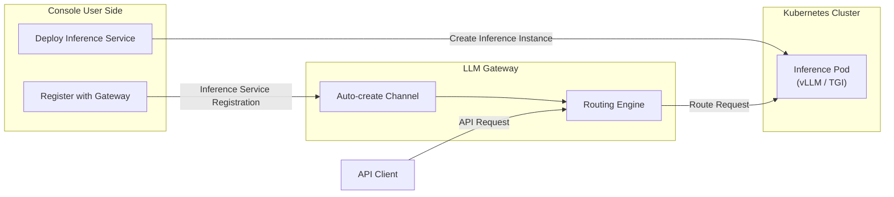
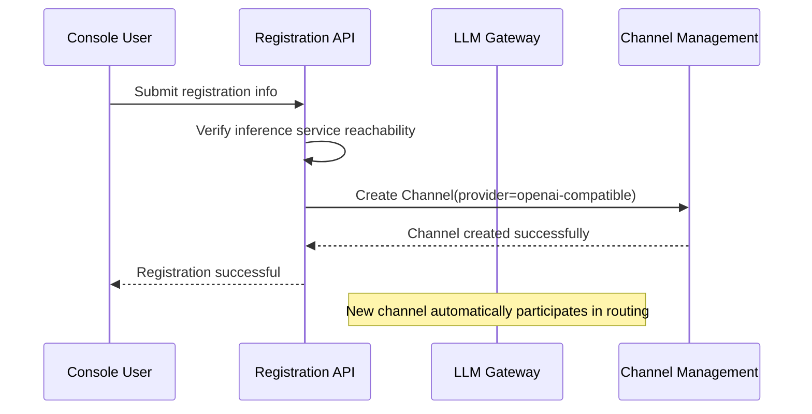

# Inference Service Registration

## Feature Overview

Inference Service Registration is the bridge connecting **Rune Inference Services** and the **LLM Gateway**. After users deploy inference services (such as vLLM, TGI inference instances) in the Console, they can register them with the LLM Gateway, enabling the inference service to provide services through the gateway's unified API endpoint.

After registration is complete, the inference service automatically creates a corresponding [Channel](./channels.md) in the gateway, thereby being incorporated into the gateway's routing, load balancing, rate limiting, audit, and content moderation systems.

> 💡 Tip: Inference service registration simplifies the "deploy inference service → register with gateway → provide API externally" workflow. Users don't need to manually configure channel parameters — the system automatically completes the association.

## Overall Architecture

## Access Path

BOSS → LLM Gateway → **Inference Service Registration**

Path: `/boss/service-registrations`

## Registration List

The registration list displays all inference services registered to the gateway from the Console side:

| Column | Description | Notes |
|--------|-------------|-------|
| Name | Registration name | Specified by the user during registration |
| Service Endpoint | Internal address of the inference service | Cluster-internal Service URL |
| Model Name | Model name exposed in the gateway | Users call using this name |
| Associated Channel | Auto-created gateway channel | Links to channel details |
| Tenant/Workspace | Registration source | — |
| Status | Registration status | Enabled / Disabled |
| Created At | Registration time | Timestamp format |
| Actions | View Details / Edit / Delete | — |

## Registration Flow

### User-Side Flow

Inference service registration is typically initiated by users in the Console:

1. User deploys an inference service instance in the Console
2. The inference service starts and passes health checks
3. User clicks the "Register with Gateway" action
4. Fills in registration information (model name, description, etc.)
5. Submits registration; the system automatically creates a channel in the gateway

### Registration Information

| Field | Type | Required | Description |
|-------|------|----------|-------------|
| Name | Text | ✅ | Registration name for identification |
| Service Endpoint | URL | ✅ | Kubernetes Service internal address of the inference service |
| Model Name | Text | ✅ | Model name exposed in the gateway (users call using this name) |
| Description | Textarea | — | Registration description |

> 💡 Tip: The service endpoint is typically the cluster-internal address of a Kubernetes Service (e.g., `http://my-inference-svc.namespace.svc.cluster.local:8080/v1`), automatically generated by the system when deploying the inference service.

### Association with Channels

After successful registration, the system automatically creates a corresponding gateway Channel with the following parameter mapping:

| Registration Field | Channel Field | Description |
|-------------------|---------------|-------------|
| Service Endpoint | `apiBase` | API base URL |
| Model Name | `supportedModels` | Supported models list |
| Tenant | `tenant` | Channel tenant |
| Workspace | `workspace` | Channel workspace |
| — | `provider` | Automatically set to `openai-compatible` |
| — | `visibility` | Set to `tenant` or `private` based on workspace |

## Manage Registrations

### View Details

Click the registration name to view detailed information:

- **Basic Information**: Name, service endpoint, model name, creation time
- **Associated Channel**: View the auto-created channel configuration
- **Inference Service Status**: Running status of the underlying inference service

### Edit Registration

You can modify the registration's description and some configuration. Changes are synchronized to the associated channel.

### Enable / Disable

- **Disable**: Suspends the registration; the associated channel is also disabled, and requests will no longer be routed to this inference service
- **Enable**: Restores the registration and associated channel

### Delete Registration

Deleting a registration also deletes the associated gateway channel.

> ⚠️ Note: Deleting a registration does not delete the underlying inference service instance. To clean up completely, also delete the corresponding inference service in the Console.

## Administrator Perspective

As a platform administrator, on this page you can:

1. **Global View**: View inference services registered by all tenants to understand the overall deployment status of inference services on the platform
2. **Status Control**: Disable or delete a registration when necessary to control its exposure to the gateway
3. **Troubleshooting**: When API request routing is abnormal, check whether the registered service endpoint is available
4. **Capacity Assessment**: Understand the number and types of inference services registered by each tenant/workspace

> 💡 Tip: Channels created by registration also appear in the [Channel Management](./channels.md) list, where administrators can further adjust routing priority, rate limiting parameters, and other configurations.

## Permission Requirements

Requires the **System Administrator** role. System administrators can view and manage inference service registrations across all tenants. Users on the Console side can only manage their own registrations.
