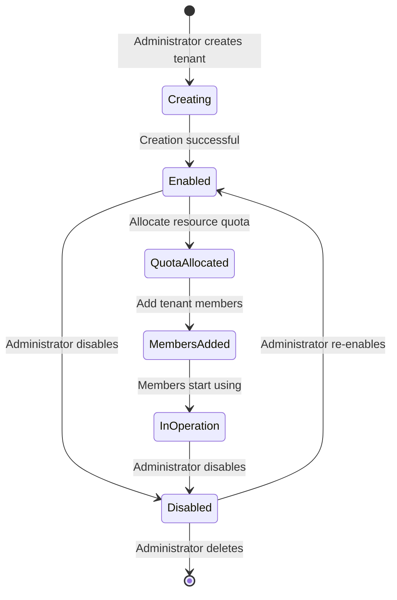
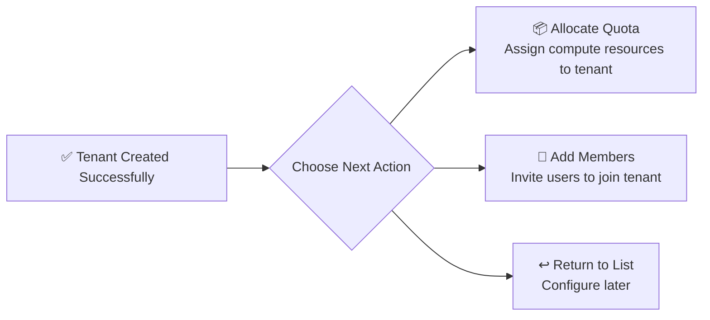
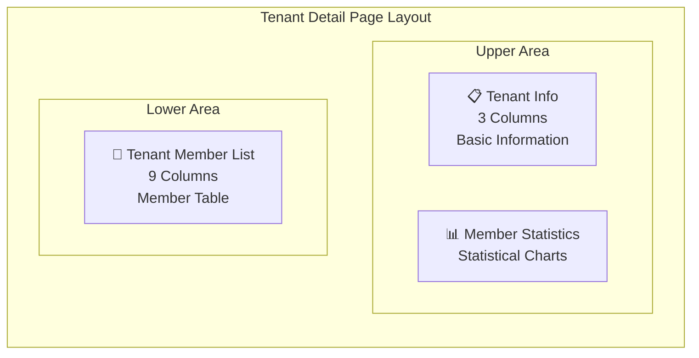
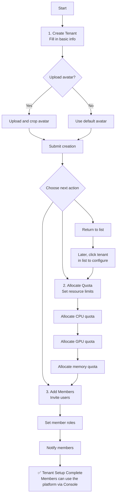

# Tenant Management

## Feature Overview

A Tenant is the **organizational isolation unit** of the Rune platform and serves as the foundational boundary for resource allocation, permission management, and billing. Each tenant has its own member system, resource quotas, and workspaces. System administrators manage the full lifecycle of all tenants through the BOSS Tenant Management module, including **creating tenants**, **editing information**, **managing members**, **enabling/disabling**, and more.

## Access Path

BOSS → Account Center → **Tenant Management**

Path: `/boss/iam/tenants`

## Tenant Lifecycle



---

## Tenant List


The tenant list displays summary information for all tenants on the platform in a table format.

### Column Descriptions

| Column | Field Name | Display | Description |
|--------|-----------|---------|-------------|
| **Name** | `name` | Avatar + Tenant Name (Link) | Displays tenant avatar and name. Click the name to enter the tenant detail page. Tenant ID is shown below the name |
| **Email** | `email` | Text | Tenant's administrative contact email |
| **Members** | `userCount` | Number | Total number of members in the tenant |
| **Created At** | `creationTimestamp` | Formatted Time | Tenant creation time |
| **Actions** | — | Action Buttons | Edit, View Details |

> 💡 Tip: Click the link in the tenant name column to jump directly to that tenant's detail overview page to quickly view member distribution and resource usage.

---

## Create Tenant


### Steps

1. On the tenant list page, click the **Create Tenant** button in the upper right corner
2. Fill in the tenant information in the popup creation form
3. Click the **Create** button to submit

### Form Fields

| Field | Field Name | Type | Required | Validation Rules | Description |
|-------|-----------|------|----------|-----------------|-------------|
| **Avatar** | `avatar` | Image Upload | — | Max 3MB, supports cropping | Tenant's avatar icon. After upload, the display area can be adjusted in the crop dialog |
| **Tenant ID** | `id` | IdField | ✅ | Uniqueness check, only lowercase letters, numbers, and hyphens | Tenant's unique identifier, **cannot be modified after creation**, used for API calls and internal system references |
| **Email** | `email` | Email Input | ✅ | Must conform to standard email format | Tenant's administrative contact email |
| **Phone** | `phone` | Phone Input | ✅ | 6-16 digit number (regex: `^\d{6,16}$`) | Tenant's administrative contact phone |
| **Description** | `description` | Textarea (4 rows) | — | No special restrictions | Supplementary description, such as organization type, business focus, etc. |

### Avatar Upload Notes

- Supports JPG / PNG / GIF formats
- File size must not exceed **3MB**
- After upload, a **cropping tool** will appear to adjust the avatar display area and scale
- If no avatar is uploaded, the system will use a default tenant icon


### Post-Creation Actions

After successful tenant creation, the system will display a **follow-up action guide** with three quick options:



| Option | Description |
|--------|-------------|
| **Allocate Quota** | Navigate to tenant resources page to allocate CPU / GPU / memory quotas for the new tenant |
| **Add Members** | Navigate to tenant member management page to invite users and assign roles |
| **Return to List** | Return to the tenant list page for later configuration |

> 💡 Tip: Newly created tenants have no resource quotas or members by default. It is recommended to immediately allocate quotas and add at least one tenant administrator after creation, otherwise tenant members will be unable to use any compute resources.

### Corresponding API

```
POST /api/iam/tenant-register
```

---

## Edit Tenant

### Steps

1. Find the target tenant in the tenant list
2. Click the **Edit** button on that tenant's row
3. Modify information in the popup edit form
4. Click the **Save** button to submit changes

### Editable Fields

| Field | Editable | Description |
|-------|----------|-------------|
| **Avatar** | ✅ | Can re-upload and crop avatar |
| **Tenant ID** | ❌ Not editable | Locked after creation |
| **Email** | ✅ | Can modify administrative contact email |
| **Phone** | ✅ | Can modify administrative contact phone |
| **Description** | ✅ | Can modify tenant description |

### Avatar Update API

```
PUT /api/iam/tenants/:id/avatar
```

> ⚠️ Note: The Tenant ID is the tenant's unique identifier. Once set at creation time, it cannot be changed. To change the Tenant ID, the tenant must be deleted and recreated, which will result in the loss of all member relationships and resource allocations under the original tenant.

---

## Enable / Disable Tenant

Administrators can temporarily disable a tenant. After disabling, all members under that tenant will be unable to access the tenant's resources.

| Operation | Effect | Corresponding API |
|-----------|--------|-------------------|
| **Disable** | All members under the tenant cannot access tenant resources; in-progress tasks are not affected | `PUT /api/iam/tenants/:id/disable` |
| **Enable** | Restore tenant access permissions | `PUT /api/iam/tenants/:id/enable` |

> ⚠️ Note: In the current version, the tenant enable/disable feature is **under development**, and the corresponding buttons may not yet be displayed in the interface. This feature will be officially available in a future version.

---

## Tenant Detail Page

Click the tenant name to enter the tenant detail page. The detail page uses a multi-area layout to display comprehensive tenant information.

Path: `/boss/iam/tenants/:id`


### Page Layout

The detail page is divided into three main areas:



### Tenant Info Area (TenantInfo)

Located on the upper left (3 columns), displays basic tenant information:

| Display Item | Description |
|-------------|-------------|
| Tenant Avatar | Large avatar display |
| Tenant Name | Tenant display name |
| Tenant ID | Tenant unique identifier |
| Email | Administrative contact email |
| Phone | Administrative contact phone |
| Description | Tenant description |
| Created At | Tenant creation time |
| Status | Current enabled/disabled status |

### Member Statistics Area (TenantMemberStats)

Located on the upper right, displays member count distribution by role in chart form:

- **Administrator** count
- **Regular Member** count
- Role distribution chart (e.g., pie or donut chart)

### Tenant Member List (TenantMembers)

Located in the lower area (9 columns), displays all members in the tenant in table format:

| Column | Field Name | Display | Description |
|--------|-----------|---------|-------------|
| **Name** | `name` | Avatar + Display Name | Member's username, with avatar icon |
| **Email** | `email` | Text | Member's registered email |
| **Role** | `role` | Translated Label | Role in the tenant (translated to current language) |
| **Joined At** | `joinedAt` | Formatted Time | Time the member joined the tenant |
| **Actions** | — | Action Buttons | Edit Role, Remove Member |

---

## Tenant Member Management

Path: `/boss/iam/tenants/:id/members`


### Add Member

1. In the member list area of the tenant detail page, click the **Add Member** button
2. Search for and select the user to add in the popup dialog
3. Assign a role within that tenant for the user
4. Click **Confirm** to complete the addition

| Field | Description |
|-------|-------------|
| User | Search and select from the platform user list; supports search by username or email |
| Role | Select the user's role within the tenant (e.g., Tenant Administrator, Regular Member) |

> 💡 Tip: A user can belong to multiple tenants simultaneously and can have different roles in different tenants.

### Edit Member Role

1. Find the target member in the member list
2. Click the **Edit Role** button
3. Modify the role in the popup selection box
4. Click **Save** to confirm changes

### Remove Member

1. Find the member to remove in the member list
2. Click the **Delete** button
3. Confirm the removal in the confirmation dialog

> ⚠️ Note: Removing a member will immediately revoke that user's access to all resources under the tenant. If the member is the only administrator in the tenant, the system will block the deletion and prompt you to designate another administrator first.

---

## Complete Tenant Creation Flow



## API Reference

| Operation | Method | Path | Description |
|-----------|--------|------|-------------|
| Get Tenant List | `GET` | `/api/iam/tenants` | Supports pagination and search parameters |
| Get Single Tenant | `GET` | `/api/iam/tenants/:id` | Returns detailed tenant information |
| Create Tenant | `POST` | `/api/iam/tenant-register` | Create a new tenant |
| Update Tenant | `PUT` | `/api/iam/tenants/:id` | Update basic tenant information |
| Delete Tenant | `DELETE` | `/api/iam/tenants/:id` | Requires confirmation |
| Upload Avatar | `PUT` | `/api/iam/tenants/:id/avatar` | Max 3MB |
| Enable Tenant | `PUT` | `/api/iam/tenants/:id/enable` | Restore access |
| Disable Tenant | `PUT` | `/api/iam/tenants/:id/disable` | Suspend access |
| Get Member List | `GET` | `/api/iam/tenants/:id/members` | Tenant members |
| Add Member | `POST` | `/api/iam/tenants/:id/members` | Invite user |
| Update Member Role | `PUT` | `/api/iam/tenants/:id/members/:uid` | Modify role |
| Remove Member | `DELETE` | `/api/iam/tenants/:id/members/:uid` | Remove member |

## Best Practices

### Tenant Planning Recommendations

- **Organize tenants by organizational structure**: It is recommended that each department or team corresponds to one tenant, avoiding cross-department tenant sharing that leads to resource and permission confusion
- **Set quotas reasonably**: Allocate resource quotas based on actual team needs, avoiding over-allocation that wastes resources or under-allocation that hinders usage
- **Designate multiple administrators**: Each tenant should have at least 2 administrators to avoid losing tenant management when a single administrator leaves

### Naming Conventions

- Tenant IDs should use meaningful abbreviations, such as `team-ai-research`, `dept-engineering`
- Maintain consistent naming styles for ease of management and lookup

### Security Recommendations

1. **Regularly review the member list** and remove members who no longer need access
2. **Use the principle of least privilege**, granting only necessary roles
3. **Monitor quota usage** and adjust promptly to avoid resource shortages or waste

## Permission Requirements

| Operation | Required Role |
|-----------|---------------|
| View Tenant List | System Administrator |
| Create Tenant | System Administrator |
| Edit Tenant | System Administrator |
| Enable/Disable Tenant | System Administrator |
| Manage Tenant Members | System Administrator |
| Delete Tenant | System Administrator |
