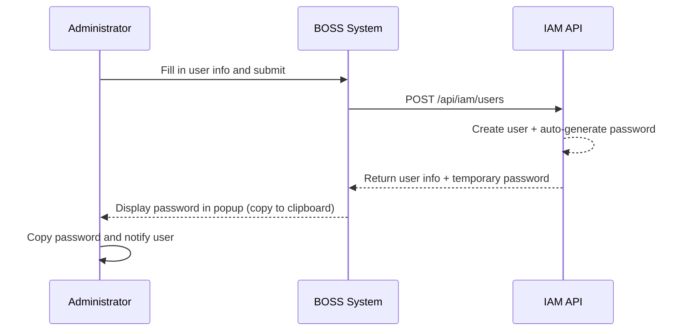
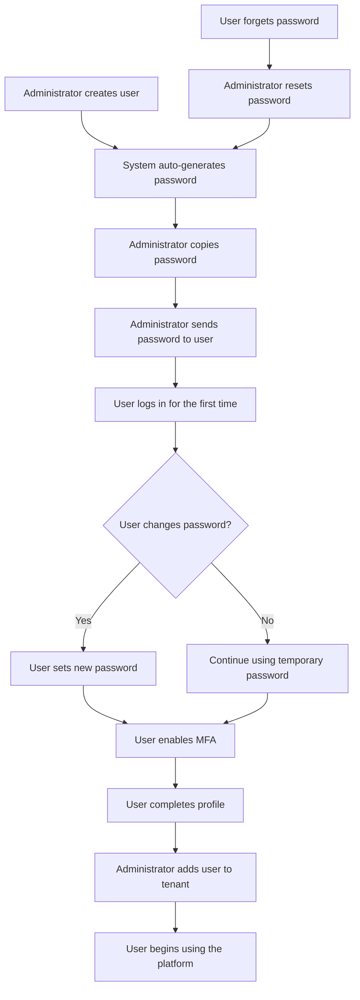

# User Management

## Feature Overview

User Management is one of the core modules in the BOSS Account Center. System administrators can perform full lifecycle management of all registered users on the platform, including **creating users**, **editing information**, **resetting passwords**, **deleting users**, and more. Users are the foundational unit of the platform's identity system, each identified by a unique username and associated with contact information such as email and phone number.

## Access Path

BOSS → Account Center → **User Management**

Path: `/boss/iam/users`

## User List


The user list displays all platform users in a table format, supporting keyword search and pagination.

### Column Descriptions

| Column | Field Name | Display | Description |
|--------|-----------|---------|-------------|
| **Username** | `name` | Avatar + Display Name | The user's unique identifier (login name), with avatar icon and `displayName` |
| **Email** | `email` | Text | User's registered email address |
| **Phone** | `phone` | Text | User's phone number |
| **MFA Status** | `mfa.enabled` | Icon | Whether multi-factor authentication is enabled ✅/❌ |
| **Created At** | `creationTimestamp` | Formatted Time | User account creation time |
| **Actions** | — | Action Buttons | Edit, Reset Password, Delete |

### Search and Filtering

In the search box at the top of the list, you can search for users by the following fields:

- **Username** — Exact or fuzzy match
- **Email** — Exact or fuzzy match
- **Display Name** — Fuzzy match

> 💡 Tip: Search supports real-time filtering. After entering keywords, the list will automatically refresh with matching results without needing to manually click a search button.

---

## Create User


### Steps

1. On the user list page, click the **Create User** button in the upper right corner
2. Fill in the user information in the popup form
3. Click the **Create** button to complete the operation

### Form Fields

| Field | Field Name | Type | Required | Validation Rules | Description |
|-------|-----------|------|----------|-----------------|-------------|
| **Username** | `name` | Text Input | ✅ | Uniqueness check, only alphanumeric and hyphens allowed | User's unique login identifier, **cannot be modified after creation** |
| **Display Name** | `displayName` | Text Input | — | No special restrictions | User's display name, can be changed by the user in personal settings |
| **Email** | `email` | Email Input | ✅ | Must conform to standard email format (RFC 5322) | User's contact email |
| **Phone** | `phone` | Phone Input | ✅ | Must conform to phone number format | User's contact phone number |

### Automatic Password Generation

> ⚠️ Note: When creating a user, **you do not need to set a password manually**. The system will automatically generate a strong random password and display it in a popup after successful creation.

The password display popup after successful creation includes:

- The automatically generated temporary password (displayed in plain text)
- **Copy to clipboard** button
- Security reminder: It is recommended to immediately send the password to the user and remind them to change it upon first login




> 💡 Tip: The auto-generated password is only displayed once at creation time. If the administrator closes the popup without copying the password, a new one can only be generated via the "Reset Password" function.

---

## Edit User


### Steps

1. Find the target user in the user list
2. Click the **Edit** button on that user's row
3. Modify the information in the popup edit form
4. Click the **Save** button to submit changes

### Editable Fields

| Field | Editable | Description |
|-------|----------|-------------|
| **Username** (`name`) | ❌ Not editable | User's unique identifier, locked after creation, displayed as disabled in the form |
| **Display Name** (`displayName`) | ✅ | Can modify the user's display name |
| **Email** (`email`) | ✅ | Can modify the user's email, must conform to email format |
| **Phone** (`phone`) | ✅ | Can modify the user's phone number, must conform to phone format |

> 💡 Tip: Editing user information does not affect the user's password or MFA settings. To change passwords, use the "Reset Password" function.

### Corresponding API

```
PUT /api/iam/users/:name
```

---

## Reset Password

When a user forgets their password or an account needs a security reset, administrators can reset the user's password.

### Steps

1. Find the target user in the user list
2. Click **Reset Password** in the action menu of that user's row
3. The system will automatically generate a new random password
4. View and copy the new password in the popup
5. Securely send the new password to the user

### Password Reset Notes

- After resetting the password, all active sessions of the user will **not** be immediately terminated
- The new password is also auto-generated and can be obtained via the clipboard copy button
- It is recommended to notify the user to change their password immediately after logging in

### Corresponding API

```
PUT /api/iam/users/:name/password
```

> ⚠️ Note: The password reset operation cannot be undone. After resetting, the old password will become invalid immediately. Please ensure the new password has been securely communicated to the user.

---

## Delete User

### Steps

1. Find the user to delete in the user list
2. Click **Delete** in the action menu of that user's row
3. The system displays a **confirmation dialog** showing the username and requiring confirmation
4. Click **Confirm Delete** to complete the operation


### Deletion Impact

> ⚠️ Note: Deleting a user is an **irreversible** operation. After deletion:
> - The user will be unable to log in to the platform
> - The user's memberships in all tenants will be removed
> - Resources created by the user (models, datasets, etc.) will not be automatically deleted, but ownership will be marked as deleted user
> - All API Keys of the user will be invalidated

### Corresponding API

```
DELETE /api/iam/users/:name
```

---

## MFA Status Description

The **MFA Status** column in the user list shows whether a user has enabled Multi-Factor Authentication:

| Status | Icon | Description |
|--------|------|-------------|
| Enabled | ✅ | User has bound an MFA device (e.g., TOTP authenticator), dynamic verification code required at login |
| Not Enabled | ❌ | User logs in with password only, MFA not configured |

> 💡 Tip: MFA status is managed by users in their Console personal security settings. Administrators can only view MFA status in BOSS and cannot enable or disable MFA on behalf of users. For security reasons, administrators are encouraged to promote MFA adoption through announcements or notifications.

---

## User Management Workflow



## API Reference

| Operation | Method | Path | Description |
|-----------|--------|------|-------------|
| Get User List | `GET` | `/api/iam/users` | Supports pagination and search parameters |
| Get Single User | `GET` | `/api/iam/users/:name` | Returns detailed user information |
| Create User | `POST` | `/api/iam/users` | Auto-generates password |
| Update User | `PUT` | `/api/iam/users/:name` | Updates basic user information |
| Delete User | `DELETE` | `/api/iam/users/:name` | Requires confirmation |
| Reset Password | `PUT` | `/api/iam/users/:name/password` | Auto-generates new password |

## Best Practices

### User Naming Conventions

- Use **employee IDs** or **email prefixes** as usernames to ensure global uniqueness
- Usernames should only contain lowercase letters, numbers, and hyphens (`-`)
- Avoid using Chinese characters or special characters in usernames

### Security Recommendations

1. **Regularly review the user list** and promptly delete accounts of departed personnel
2. **Encourage users to enable MFA** to enhance account security
3. **Use secure channels for password delivery** (such as encrypted email or enterprise IM private chat), avoid sending in plain text
4. **Avoid shared accounts** — each person should use an independent user account

### Bulk Operation Recommendations

The current version does not support bulk user creation or import. For bulk creation of many users, it is recommended to:

1. Write a script to call the API `/api/iam/users` in batch
2. Record all auto-generated passwords and notify users collectively

## Permission Requirements

| Operation | Required Role |
|-----------|---------------|
| View User List | System Administrator |
| Create User | System Administrator |
| Edit User | System Administrator |
| Reset Password | System Administrator |
| Delete User | System Administrator |
