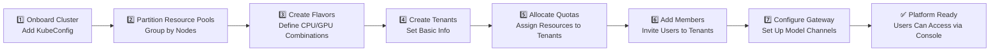

# BOSS Admin Portal Overview

## Introduction

**BOSS** (Backend Operation & Service System) is the **administrator-exclusive portal** of the Rune platform, providing system administrators with global management capabilities over the entire platform. Compared to the Console for regular users, BOSS handles core management responsibilities including platform infrastructure management, user identity governance, resource allocation, LLM gateway operations, and global configuration.

BOSS is the central control system for platform operations — all cluster onboarding, tenant creation, resource quotas, gateway policies, model repository management, and more are performed here.

## Who Should Use BOSS

| Role | Use Case | Recommended Entry |
|------|----------|-------------------|
| **System Administrator** | Platform infrastructure management, cluster onboarding, resource allocation | BOSS |
| **Operations Engineer** | Cluster monitoring, log troubleshooting, node management | BOSS |
| **Security Administrator** | User management, MFA policies, audit logs | BOSS |
| **Gateway Administrator** | API Key management, model channels, content moderation | BOSS |
| **Regular Developer** | Model training, inference deployment, development environments | Console |
| **Tenant Administrator** | Workspace management, member management | Console |

> 💡 Tip: BOSS and Console share the same account system, but BOSS is only accessible to users with the **System Administrator** role. Regular users accessing the BOSS URL will see a 403 Forbidden page.

## Access Path

Visit `https://your-domain/boss/` and log in with a system administrator account to enter the BOSS portal.

## Differences Between BOSS and Console

| Dimension | BOSS Admin Portal | Console |
|-----------|-------------------|---------|
| **Target Users** | System administrators, operations staff | Developers, tenant administrators |
| **Access Permissions** | System administrators only | All registered users |
| **Management Scope** | Platform-wide, cross-tenant | Current tenant/workspace |
| **Cluster Management** | Full cluster lifecycle management | View assigned resources only |
| **User Management** | Create/edit/delete any user | Manage personal profile |
| **Tenant Management** | Create/configure/enable/disable all tenants | Manage current tenant members |
| **Resource Management** | Global management of resource pools, flavors, quotas | Use resources within quota |
| **Gateway Management** | Channel configuration, moderation policies, audit | Call gateway via API Key |
| **Data Repository** | Manage all platform models/datasets/images | Use within permissions |

## Module Architecture

```mermaid
graph TB
    BOSS["🏢 BOSS Admin Portal"]
    
    BOSS --> Dashboard["📊 Platform Dashboard"]
    BOSS --> IAM["👥 Account Center (IAM)"]
    BOSS --> RuneAdmin["⚙️ Rune Compute Management"]
    BOSS --> Gateway["🔑 LLM Gateway Management"]
    BOSS --> Moha["📚 Moha Data Repository"]
    BOSS --> Settings["🛠️ Platform Settings"]
    
    Dashboard --> MohaCard["Moha Resource Card"]
    Dashboard --> GatewayCard["Gateway Operations Card"]
    Dashboard --> MgmtCard["Platform Management Card"]
    
    IAM --> Users["User Management"]
    IAM --> Tenants["Tenant Management"]
    
    RuneAdmin --> Clusters["Cluster Management"]
    RuneAdmin --> ResPools["Resource Pools"]
    RuneAdmin --> Flavors["Flavor Management"]
    RuneAdmin --> Systems["System Instances"]
    RuneAdmin --> SysMarket["System Market"]
    RuneAdmin --> Templates["Product Templates"]
    RuneAdmin --> TenantRes["Tenant Resources"]
    
    Gateway --> Ops["Operations Overview"]
    Gateway --> ApiKeys["API Key Management"]
    Gateway --> Channels["Model Channels"]
    Gateway --> Moderation["Content Moderation"]
    Gateway --> GWConfig["Gateway Configuration"]
    Gateway --> Audit["Audit Logs"]
    
    Moha --> Models["Model Repository"]
    Moha --> Datasets["Datasets"]
    Moha --> Images["Image Registry"]
    Moha --> Spaces["Space Apps"]
    Moha --> Mirrors["Data Mirrors"]
    
    Settings --> Platform["Platform Settings"]
    Settings --> Members["System Members"]
    Settings --> RuneSet["Rune Settings"]
    Settings --> MohaSet["Moha Settings"]
    Settings --> ChatSet["ChatApp Settings"]
    Settings --> DynDash["Dynamic Dashboard"]

    style BOSS fill:#1a73e8,color:#fff
    style Dashboard fill:#e8f0fe
    style IAM fill:#fce8e6
    style RuneAdmin fill:#e6f4ea
    style Gateway fill:#fef7e0
    style Moha fill:#f3e8fd
    style Settings fill:#e8eaed
```

## Typical Administrator Workflow

The following is a typical workflow for system administrators to complete platform initialization in BOSS:

> 💡 Tip: It is recommended to complete platform initialization in the order above. Clusters are the foundation of all compute resources, tenants are the basic organizational unit for users, and the gateway is the entry point for AI model services.

## Top Navigation

BOSS has 6 module quick links at the top for fast switching between management modules:

| Navigation Link | Target Path | Description |
|-----------------|-------------|-------------|
| Home | `/boss/dashboard` | Platform dashboard, global status overview |
| Rune | `/boss/rune/clusters` | Compute cluster management module |
| Moha | `/boss/moha/models` | Data repository management module |
| LLM Gateway | `/boss/gateway/operations` | Gateway operations management module |
| Account Center | `/boss/iam/users` | User and tenant management |
| Platform Settings | `/boss/settings/platform` | Global platform configuration |

## Sidebar Navigation Structure

The sidebar is organized by functional domain, providing quick access to all management pages:

### 📊 Overview
- **Dashboard** — Platform-wide statistics and health status

### 🔑 LLM Gateway
- **Operations Overview** — Gateway request volume, latency, and other operational metrics
- **API Key** — Manage all platform API Keys
- **Model List** — Manage available model channels
- **Moderation Policies** — Configure content safety moderation rules
- **Moderation Lexicon** — Manage sensitive word lexicon
- **Gateway Configuration** — Gateway global parameter configuration
- **Audit Logs** — Complete audit records of gateway requests

### 📚 Data Repository
- **Model Repository** — Manage platform model resources
- **Datasets** — Manage training datasets
- **Image Registry** — Manage container runtime images
- **Space** — Manage Space applications
- **Mirrors** — Manage data mirror synchronization

### ⚙️ Rune
- **Cluster Management** — Manage Kubernetes compute clusters
- **Tenant Resources** — Manage tenant quotas and resource allocation
- **Templates** — Manage system applications and product templates

### 👥 Account Center
- **User Management** — Manage all platform user accounts
- **Tenant Management** — Manage all tenant organizations

### 🛠️ Platform Management
- **System Members** — Manage system-level administrators
- **Platform Settings** — Logo, domain, and other basic configurations
- **Rune Settings** — Compute platform specific configuration
- **Moha Settings** — Data repository specific configuration
- **ChatApp Settings** — Chat application specific configuration
- **Dynamic Dashboard** — Custom monitoring panel templates

## Permission Requirements

| Operation | Required Role | Description |
|-----------|---------------|-------------|
| Access BOSS | System Administrator | Basic access permission |
| Cluster Management | System Administrator | Full cluster CRUD |
| User Management | System Administrator | Create / edit / delete users |
| Tenant Management | System Administrator | Create / configure / enable/disable tenants |
| Gateway Management | System Administrator | Channel / moderation / configuration management |
| Platform Settings | System Administrator | Global configuration changes |

> ⚠️ Note: If you are not a system administrator but need to access BOSS, please contact an existing system administrator to assign the appropriate role. Unauthorized access to BOSS will return a **403 Forbidden** page.

## Quick Start

If you are using BOSS for the first time, it is recommended to read the documentation in the following order:

1. [Platform Dashboard](./dashboard.md) — Understand the platform's global status
2. [Cluster Management](./rune/clusters.md) — Onboard compute clusters
3. [Resource Pool Management](./rune/resource-pools.md) — Partition cluster resources
4. [Flavor Management](./rune/flavors.md) — Define compute flavors
5. [Tenant Management](./iam/tenants.md) — Create and configure tenants
6. [User Management](./iam/users.md) — Manage platform users
