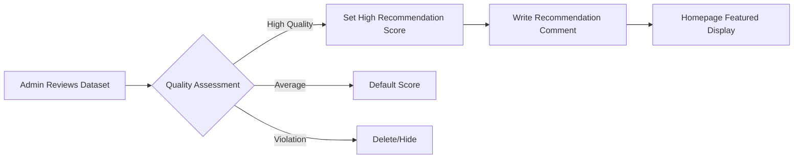
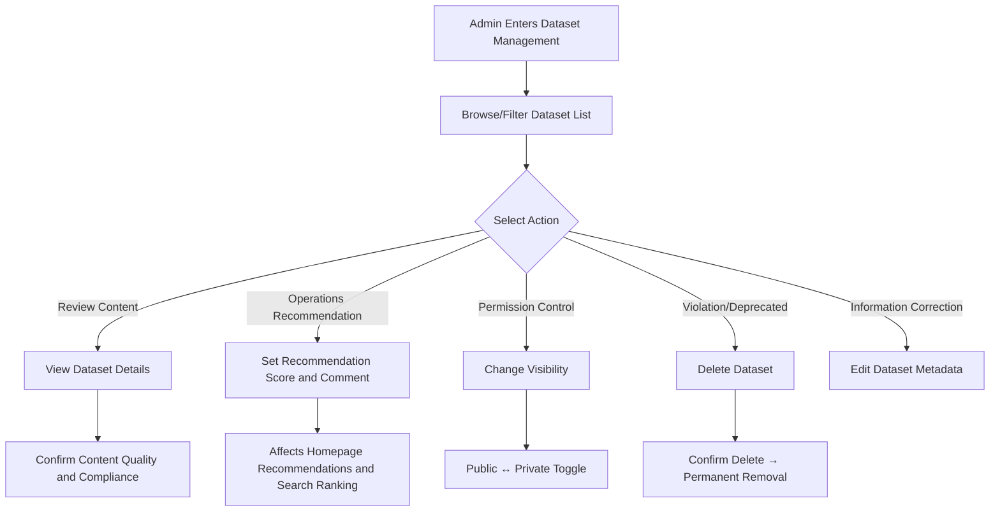

# Dataset Management

## Feature Overview

Dataset Management on the BOSS side provides **platform-level** global management capabilities for dataset repositories. System administrators can view and manage dataset repositories created by all tenants, users, and organizations on the platform (including private datasets), performing visibility changes, recommendation scoring, content review, and other management operations.

> 💡 Tip: Dataset Management shares the same Data Repository Management interface as Model Repository Management, switchable via top tabs. Datasets also support task category tags and recommendation scoring features.

## Access Path

BOSS → Data Repository → **Datasets**

Path: `/boss/moha/datasets`

## Page Description

### Data Tab

Dataset Management is located under the **Datasets** tab of the BOSS Data Repository Management page, alongside Models, Image Registry, Workspaces, Spaces, etc.

### Filter Bar

The top of the page provides a FilterBar component for multi-dimensional quick filtering:

- **Name Search**: Fuzzy search by dataset name
- **Tenant/Organization Filter**: Filter by associated tenant or organization
- **Visibility Filter**: Public / Private
- **Task Category Filter**: Filter by applicable task category (e.g., text classification, image annotation, etc.)
- **License Filter**: Filter by open source license type

### Dataset List Table

| Column | Description | Details |
|--------|-------------|---------|
| Name | Dataset name | Format: `organization/dataset-name`. May include a **mirror tag** (🔄 indicating mirror sync origin) and description |
| Tenant/Organization | Associated tenant or organization | Shows organization avatar and name |
| Visibility | Public / Private | Shows public (🌐) or private (🔒) icon with creator username |
| Task Category | Dataset task classification | Tags such as: text classification, image recognition, speech-to-text, translation, etc. |
| Library/Framework | Compatible frameworks | Framework and loading library compatibility tags |
| License | Open source license | Such as: Apache-2.0, CC-BY-4.0, custom license, etc. |
| Recommendation Score | Admin recommendation score | Contains recommendation score and comment, affects platform homepage recommendation ranking |
| Encryption Status | Whether encrypted | Indicates whether dataset files have encrypted storage enabled |
| Actions | Management action buttons | Edit, Delete, Change Visibility, Manage Recommendation |

> ⚠️ Note: Datasets with mirror tags are synced from external platforms and their content is periodically auto-updated. Manual edits may be overwritten.

## Management Operations

### Edit Dataset

Click the **Edit** button in the actions column to modify dataset basic information:

- Dataset description
- Task category tags
- Compatible framework/library tags
- License information

### Change Visibility

Administrators can switch any dataset between **Public** and **Private**:

- **Set to Public**: The dataset becomes visible and downloadable to all platform users
- **Set to Private**: The dataset becomes visible only to the associated organization/user

> ⚠️ Note: Visibility changes take effect immediately. Training tasks currently using the dataset will not be affected, but other users will be unable to create new references to the dataset.

### Recommendation Management

Recommendation management controls the display priority of quality datasets on the platform homepage and in search:

| Field | Description |
|-------|-------------|
| Recommendation Score | Numeric score; higher scores are displayed more prominently |
| Recommendation Comment | Recommendation rationale for the dataset, visible on the user side |

### Delete Dataset

Click the **Delete** button; after confirmation, the following are permanently removed:

- Dataset repository and all version files
- Associated download records and statistics
- This operation is irreversible

> ⚠️ Note: Before deleting a dataset, it is recommended to confirm that no running training tasks reference the dataset, as this could cause task failures.

### View Dataset Details

Click the dataset name to enter the details page to view:

- Dataset file list and version history
- README document rendering preview
- Dataset card information (size, format, sample count, etc.)
- Download statistics

## Dataset Management Flow

## Permission Requirements

Requires the **System Administrator** role to access the BOSS Dataset Management page.

> 💡 Tip: Regular users and tenant administrators should manage their dataset repositories through Console → Moha → Datasets.
