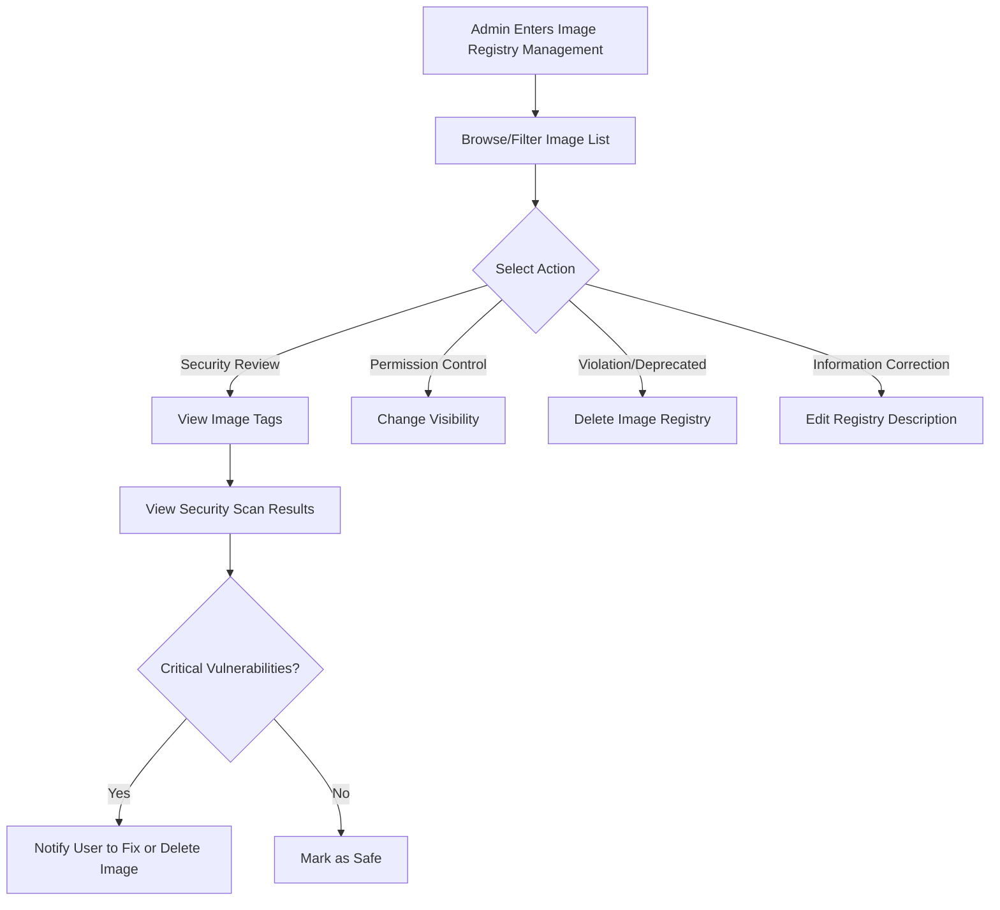

# Image Registry Management

## Feature Overview

Image Registry Management on the BOSS side provides **platform-level** global management capabilities for container image registries. System administrators can view and manage container image registries created by all tenants, users, and organizations on the platform, including viewing image tags, security scan results, modifying visibility, and deleting violating images.

> 💡 Tip: Image registries here refer to Container Images used as runtime environments for AI training and inference tasks. This is different from Data Mirrors (sync functionality).

## Access Path

BOSS → Data Repository → **Image Registry**

Path: `/boss/moha/images`

## Page Description

### Data Tab

Image Registry Management is located under the **Image Registry** tab of the BOSS Data Repository Management page, alongside Models, Datasets, Workspaces, Spaces, etc.

### Filter Bar

The top of the page provides a FilterBar component supporting multi-dimensional filtering:

- **Name Search**: Fuzzy search by image registry name
- **Tenant/Organization Filter**: Filter by associated tenant or organization
- **Visibility Filter**: Public / Private

### Image Registry List Table

| Column | Description | Details |
|--------|-------------|---------|
| Name | Image registry name | Format: `organization/image-name` with description |
| Tenant/Organization | Associated tenant or organization | Shows organization avatar and name |
| Visibility | Public / Private | Shows public (🌐) or private (🔒) icon with creator username |
| License | Image license | Image usage license type |
| Encryption Status | Whether encrypted | Indicates whether the image has encrypted storage enabled |
| Actions | Management action buttons | Edit, Delete, Change Visibility |

> ⚠️ Note: Image registries, unlike models and datasets, do not support recommendation scoring or task category tags.

## Management Operations

### View Image Tags

Click the image registry name to enter the details page to view all image tags in the registry:

| Information | Description |
|-------------|-------------|
| Tag Name | Image version tag, e.g., `latest`, `v1.0`, `cuda11.8-py3.10` |
| Image Size | Compressed size of the image for that tag |
| Push Time | Last push/update time for the tag |
| Digest | SHA256 digest of the image content |

### Security Scan Results

Administrators can view image security scan results to understand vulnerability information in the image:

| Scan Information | Description |
|-----------------|-------------|
| Vulnerability Level | Critical, High, Medium, Low |
| Vulnerability Count | Statistics by severity level |
| Scan Time | Time of the most recent automatic scan |
| Fix Recommendations | Remediation guidance provided for some vulnerabilities |

> 💡 Tip: Security scans are automatically triggered by the platform. Administrators can decide based on scan results whether to allow the image to continue in use, or notify users to fix vulnerabilities.

### Edit Image Registry

Click the **Edit** button to modify the image registry's:

- Registry description
- License information

### Change Visibility

Administrators can switch image registries between **Public** and **Private**:

- **Set to Public**: All users can pull the image
- **Set to Private**: Only the associated organization/user can pull it

> ⚠️ Note: Changing visibility immediately affects other users' image pull permissions. Running containers that reference the image are not affected (the image is cached), but new deployment requests will be restricted.

### Delete Image Registry

Click the **Delete** button to display a confirmation dialog. After deletion:

- The image registry and all tags are permanently removed
- Runtime environment configurations referencing the image become invalid
- This operation is **irreversible**

## Image Registry Management Flow

## Common Scenarios

| Scenario | Action |
|----------|--------|
| Image found with critical vulnerabilities | Notify user to fix or delete image; set to private to restrict use |
| User requests to make their image public | Review image content then change visibility to public |
| Clean up deprecated images | Check references then delete unused images to free storage space |
| Audit image security compliance | Batch review security scan results, investigate high-risk images |

> 💡 Tip: It is recommended to regularly scan all public images for security vulnerabilities, with special attention to Critical and High severity levels.

## Permission Requirements

Requires the **System Administrator** role to access the BOSS Image Registry Management page.

> 💡 Tip: Regular users and tenant administrators should manage their container images through Console → Moha → Image Registry.
