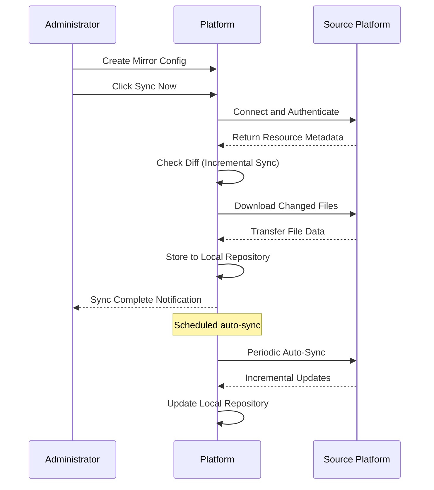

# Data Mirror Management

## Feature Overview

Data Mirror Management on the BOSS side provides **platform-level** data mirror (sync) management capabilities. Data mirrors are used to sync model and dataset resources from external platforms (such as HuggingFace, ModelScope) to the local platform, providing users with fast and stable data access. System administrators can create, manage, and monitor the sync status of data mirrors.

> 💡 Tip: "Data Mirrors" are a sync mechanism, not container images. By configuring mirror sources and sync targets, resources from external platforms are automatically synced to the local platform, similar to Git's mirror repository feature.

## Access Path

BOSS → Data Repository → **Data Mirrors**

Path: `/boss/moha/mirrors`

## Page Description


### Data Tab

Data Mirror Management is located under the **Data Mirrors** tab of the BOSS Data Repository Management page, alongside Models, Datasets, Image Registry, Workspaces, Spaces, etc.

### Filter Bar

The top of the page provides a FilterBar component for quick filtering:

- **Name Search**: Fuzzy search by mirror name
- **Source Platform Filter**: HuggingFace / ModelScope / Other
- **Sync Status Filter**: Idle / Syncing / Completed / Failed / Stopped
- **Resource Type Filter**: Model / Dataset

### Mirror List Table

| Column | Description | Details |
|--------|-------------|---------|
| Name | Mirror name | Usually matches the source resource path, e.g., `meta-llama/Llama-2-7b` |
| Source Platform | Source of the mirror | Auto-detected as HuggingFace / ModelScope / custom URL |
| Source URL | URL of the original resource | Complete source URL |
| Resource Type | Model / Dataset | Specifies the mirror's resource type |
| Sync Status | Current sync status | See status descriptions below |
| Last Sync Time | Completion time of the last sync | Timestamp |
| Local Repository | Local storage target repository | Format: `organization/repo-name`, the local repository synced to |
| Actions | Management action buttons | Sync Now, Stop Sync, Edit, Delete |

### Sync Statuses

| Status | Description | Icon |
|--------|-------------|------|
| Idle | Mirror created, not yet synced or waiting for next scheduled sync | ⏳ |
| Syncing | Currently syncing data from the source | 🔄 |
| Completed | Last sync completed successfully | ✅ |
| Failed | Last sync failed, check error logs | ❌ |
| Stopped | Manually stopped, will not auto-sync | ⏹️ |

### Source Auto-Detection

When creating a mirror, the system automatically detects the source platform based on the URL:

| URL Pattern | Detected as |
|-------------|-------------|
| `huggingface.co/*` or `hf.co/*` | HuggingFace |
| `modelscope.cn/*` | ModelScope |
| Other URLs | Custom Source |

## Mirror Data Structure

```yaml
mirror:
  name: "meta-llama/Llama-2-7b"        # Mirror name
  source_url: "https://huggingface.co/meta-llama/Llama-2-7b"  # Source URL
  source_platform: "huggingface"        # Auto-detected source platform
  resource_type: "model"                # Resource type: model/dataset
  local_repo: "platform-org/Llama-2-7b" # Local storage target repository
  sync_config:
    schedule: "0 2 * * *"               # Cron expression, sync at 2 AM daily
    include_lfs: true                   # Whether to include LFS large files
    branch: "main"                      # Branch to sync
  status:
    state: "completed"                  # Current status
    last_sync: "2024-01-15T02:15:30Z"   # Last sync time
    last_error: null                    # Last error message
    files_synced: 156                   # Number of files synced
    total_size: "13.5 GB"               # Total data size
```

## Management Operations

### Create Mirror

Click the **Create Mirror** button to fill in mirror configuration:

1. **Source URL**: Enter the resource URL from the source platform
2. **Resource Type**: Select Model or Dataset (auto-detected but can be overwritten)
3. **Local Target Repository**: Select or create the local storage target repository
4. **Sync Configuration** (optional):
   - Scheduled sync: Cron expression for periodic auto-sync
   - LFS files: Whether to include large files
   - Sync branch: Specify the branch to sync

> 💡 Tip: New mirrors do not automatically start syncing after creation. Click the "Sync Now" button to initiate the first sync.

### Sync Now

Click the **Sync Now** button to immediately trigger a sync:

- Connects to the source platform and pulls the latest data
- Incremental sync, only downloading changed files
- Sync progress and logs can be viewed in real time

### Stop Sync

For mirrors with **Syncing** status, click the **Stop Sync** button:

- Immediately interrupts the current sync process
- Already synced data is retained
- Mirror status changes to **Stopped**

> ⚠️ Note: Stopping mid-sync may result in incomplete data. It is recommended to re-initiate a full sync after stopping.

### Edit Mirror

Click the **Edit** button to modify mirror configuration:

- Scheduled sync settings
- LFS file inclusion settings
- Local target repository
- Source URL (modifying the source URL triggers a full re-sync)

### Delete Mirror

Click the **Delete** button; after confirmation:

- Mirror configuration is removed
- **Local synced data is retained** (already stored in the local repository)
- Scheduled sync tasks are canceled

> 💡 Tip: Deleting a mirror only removes the mirror sync configuration. The synced resources (local repository) are not automatically deleted. If you also need to delete the local data, go to Model/Dataset Management to delete the corresponding repository.

## Mirror Sync Flow



## Common Scenarios

| Scenario | Action |
|----------|--------|
| Need to sync popular models locally | Create mirror, set HuggingFace URL, sync now |
| Sync task failed | Check error logs, common causes include network issues or auth failures |
| Modify sync schedule | Edit mirror, update Cron expression |
| Source resource no longer needed | Delete mirror config (local data retained) |
| Source URL changed | Edit mirror and update the source URL |
| Want to sync only specific branches | Edit mirror and modify the sync branch setting |
| Scheduled sync not running as expected | Check Cron expression format and platform scheduler status |

## Permission Requirements

Requires the **System Administrator** role to access the BOSS Data Mirror Management page.

> 💡 Tip: Data Mirror Management is a BOSS-exclusive feature. Console-side users cannot directly create or manage mirrors; they can only use the resources that have been synced to local repositories.
