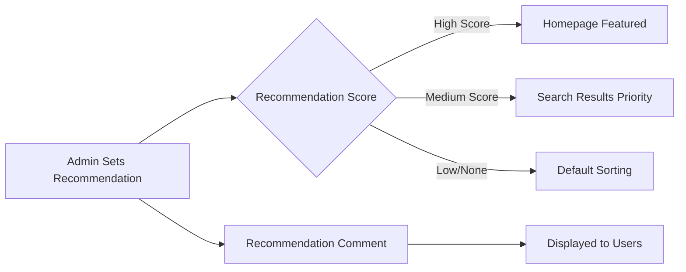
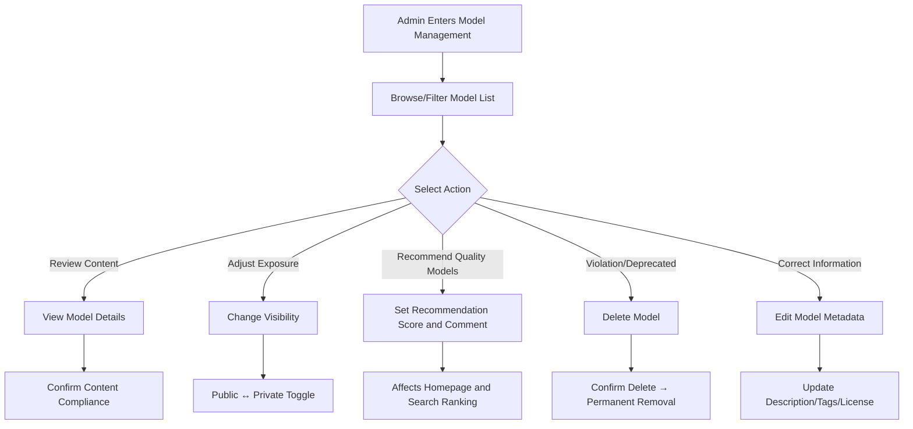

# Model Repository Management

## Feature Overview

Model Repository Management on the BOSS side provides **platform-level** global management capabilities for model repositories. Unlike Console-side Moha Model Management, the BOSS side is designed for system administrators who can view, review, and manage model repositories created by **all tenants, users, and organizations** — including private models. Administrators can perform advanced management operations such as visibility changes, recommendation scoring, and encryption status review.

> 💡 Tip: BOSS Model Repository Management is the core entry point for platform operations. Console-side users can only see models they have permission to access, while BOSS administrators can view all models across the entire platform.

## Access Path

BOSS → Data Repository → **Models**

Path: `/boss/moha/models`

## Differences from Console Moha View

| Dimension | BOSS Model Management | Console Model Management |
|-----------|----------------------|-------------------------|
| Data Scope | All platform models (including private) | Only models the current user/organization has permission to access |
| Visibility Management | Can modify public/private status of any model | Can only manage models they created |
| Recommendation Management | Can set recommendation scores and comments | Not available |
| Encryption Status | Can view and manage encryption status labels | View only |
| Deletion Permission | Can delete any model repository | Can only delete own models |

## Page Description

### Data Tab

Model Repository Management is located under the **Models** tab of the BOSS Data Repository Management page, alongside Datasets, Image Registry, Workspaces, Spaces, etc.

### Filter Bar

The top of the page provides a FilterBar component supporting multi-dimensional filtering:

- **Name Search**: Fuzzy search by model name
- **Tenant/Organization Filter**: Filter by associated tenant or organization
- **Visibility Filter**: Public / Private
- **Task Category Filter**: Filter by applicable task category (e.g., text generation, image classification, etc.)
- **Framework Filter**: Filter by model framework (e.g., PyTorch, TensorFlow)

### Model List Table

| Column | Description | Details |
|--------|-------------|---------|
| Name | Model name | Format: `organization/model-name`. May include a **mirror tag** (🔄 indicating mirror sync origin) and a description beside the name |
| Tenant/Organization | Associated tenant or organization | Shows organization avatar and name |
| Visibility | Public / Private | Shows public (🌐) or private (🔒) icon with creator username |
| Task Category | Model task classification | Tags such as: text generation, image classification, speech recognition, etc. |
| Library/Framework | Technical framework | Such as: PyTorch, TensorFlow, JAX, Transformers, etc. |
| License | Open source license | Such as: Apache-2.0, MIT, custom license, etc. |
| Recommendation Score | Admin recommendation score | Contains recommendation score and comment, used for platform homepage display sorting |
| Encryption Status | Whether encrypted | Indicates whether model files have encrypted storage enabled |
| Actions | Management action buttons | Edit, Delete, Change Visibility, Manage Recommendation |

> ⚠️ Note: The mirror tag indicates the model was synced from an external platform (such as HuggingFace, ModelScope) via mirror sync. Editing of such models may be restricted.

## Management Operations

### Edit Model

Click the **Edit** button in the actions column to modify model basic information:

- Model description
- Task category
- Framework/library tags
- License information

### Change Visibility

Administrators can switch any model between **Public** and **Private**:

- **Set to Public**: The model becomes visible to all platform users
- **Set to Private**: The model becomes visible only to the associated organization/user

> ⚠️ Note: After changing a public model to private, other users who have already referenced the model may be affected. Please proceed with caution.

### Recommendation Management

Recommendation management is a BOSS-exclusive feature for controlling model display in platform homepage and search results:

| Field | Description |
|-------|-------------|
| Recommendation Score | Numeric score; higher scores rank higher in recommendation lists |
| Recommendation Comment | Administrator's recommendation rationale, displayed to users for reference |

### Delete Model

Click the **Delete** button to display a confirmation dialog. After deletion:

- The model repository and all version files are permanently removed
- Inference services referencing this model may fail
- This operation is irreversible

### View Model Details

Click the model name to enter the details page to view:

- Model file list and version history
- README document rendering
- Model card information
- Download statistics and usage

## Data Management Flow

## Common Scenarios

| Scenario | Action |
|----------|--------|
| Discovered a violating model | Set to private or delete directly |
| Promote quality open source model | Set high recommendation score and write recommendation comment |
| User reports incorrect model information | Edit model's task category, framework tags, or license |
| Review encrypted model | View encryption status indicator, confirm encryption policy compliance |
| Mirror model has issues | Check mirror tag, go to Mirror Management to view sync status |

## Permission Requirements

Requires the **System Administrator** role to access the BOSS Model Repository Management page.

> 💡 Tip: Regular users and tenant administrators should manage their model repositories through Console → Moha → Models.
