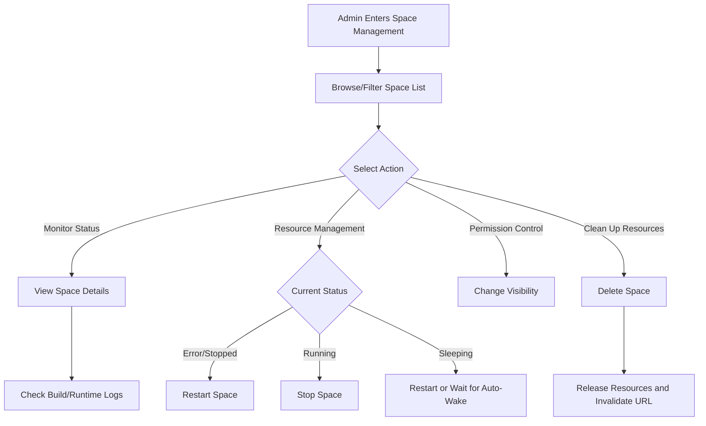

# Space Management

## Feature Overview

Space Management on the BOSS side provides **platform-level** global management capabilities for Spaces. Spaces are interactive visual web applications (similar to HuggingFace Spaces) typically built with Gradio, Streamlit, and other frameworks for model demonstration, testing, and sharing. System administrators can view and manage Spaces created by all tenants, users, and organizations on the platform, including monitoring deployment status, restarting, stopping, changing visibility, and more.

> 💡 Tip: Spaces are a Moha-specific resource that provides interactive demonstration capabilities for models and datasets, different from Rune's DevEnv or training tasks. They focus on showcasing and experience rather than development and training.

## Access Path

BOSS → Data Repository → **Spaces**

Path: `/boss/moha/spaces`

## Page Description

### Data Tab

Space Management is located under the **Spaces** tab of the BOSS Data Repository Management page, alongside Models, Datasets, Image Registry, Workspaces, etc.

### Filter Bar

The top of the page provides a FilterBar component for quick filtering:

- **Name Search**: Fuzzy search by Space name
- **Tenant/Organization Filter**: Filter by associated tenant or organization
- **Visibility Filter**: Public / Private
- **Status Filter**: Filter by deployment status

### Space List Table

| Column | Description | Details |
|--------|-------------|---------|
| Name | Space name | Format: `organization/space-name` with description |
| Tenant/Organization | Associated tenant or organization | Shows organization avatar and name |
| Visibility | Public / Private | Shows public (🌐) or private (🔒) icon |
| Deployment Status | Current deployment running status | See deployment status descriptions below |
| Framework | Space application framework | Gradio / Streamlit / Docker / Static, etc. |
| Hardware | Computing resource specification | CPU/GPU type and allocation |
| Actions | Management action buttons | View Details, Restart, Stop, Change Visibility, Delete |

### Deployment Statuses

| Status | Description | Icon |
|--------|-------------|------|
| Building | Space image is being built | 🔨 |
| Running | Space is running normally, accessible for use | ✅ |
| Stopped | Space is stopped, requires manual restart | ⏹️ |
| Error | Build or startup failed, check logs | ❌ |
| Sleeping | Space auto-suspended due to inactivity period | 😴 |

> 💡 Tip: Sleeping Spaces are auto-suspended by the platform after a period of no user access. Sleeping Spaces automatically wake up when users access them.

## Management Operations

### View Space Details

Click the Space name to enter the details page to view:

- Space application preview (embedded web page)
- Build logs and runtime logs
- Configuration information (framework, hardware, environment variables)
- File list (application code, dependency configuration)
- Access statistics

### Restart Space

For Spaces in **Stopped**, **Error**, or **Sleeping** status, click the **Restart** button:

- Re-pulls code and dependency configurations
- Rebuilds the container image (if code changed)
- Starts the application process

> ⚠️ Note: Restarting a Space triggers a rebuild, which may take several minutes. If the Space encounters persistent build failures, check the build logs to troubleshoot.

### Stop Space

For Spaces in **Running** status, click the **Stop** button:

- Immediately stops the application process
- Releases occupied computing resources
- Space status changes to **Stopped**

> ⚠️ Note: Stopping a Space immediately terminates the application service. Users accessing the Space at that time will lose their connection.

### Change Visibility

Administrators can switch Spaces between **Public** and **Private**:

- **Set to Public**: All users can access and use the Space
- **Set to Private**: Only the associated organization/user can access it

### Delete Space

Click the **Delete** button; after confirmation:

- Space application and configuration are permanently removed
- Occupied resources are released
- Access URL becomes invalid
- This operation is **irreversible**

## Space Management Flow

## Common Scenarios

| Scenario | Action |
|----------|--------|
| Space stuck in Error status for extended time | View build logs, contact the user to fix, or delete the Space |
| Resource shortage on the platform | Stop Spaces with low traffic to free resources |
| Quality demo Space discovered | Set to public so more users benefit |
| Request to troubleshoot Space issues | View runtime logs to help diagnose |
| Space auto-suspended due to inactivity | Expected behavior, auto-wakes on access; or manually restart |

## Permission Requirements

Requires the **System Administrator** role to access the BOSS Space Management page.

> 💡 Tip: Regular users and tenant administrators should manage their Spaces through Console → Moha → Spaces.
