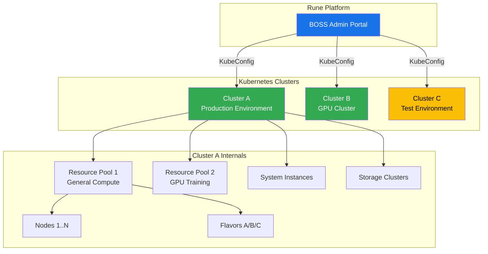
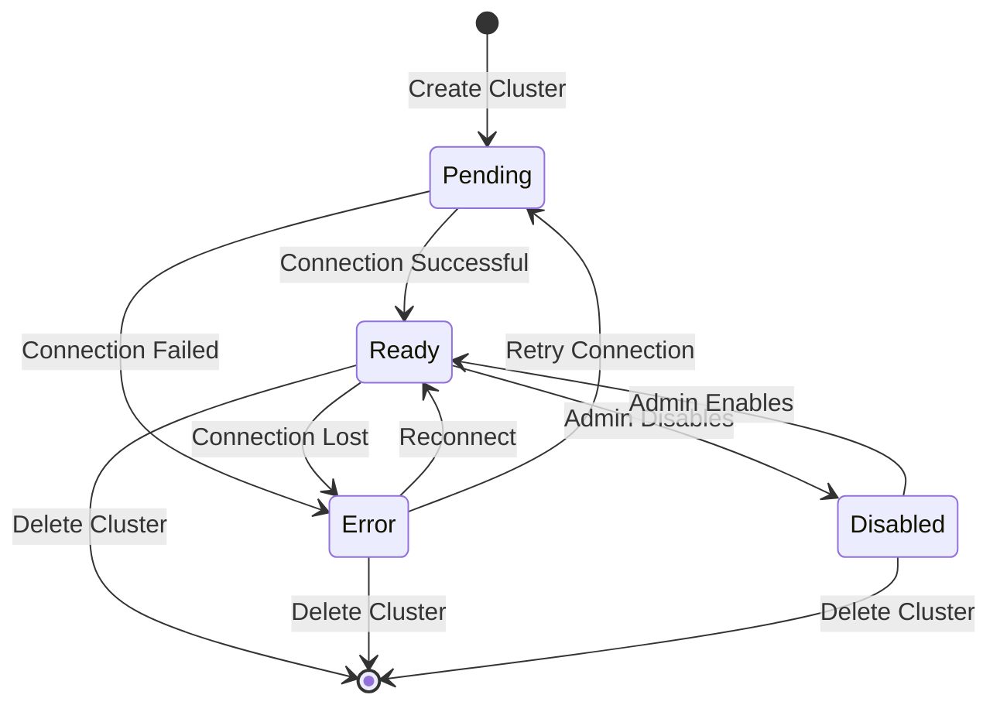
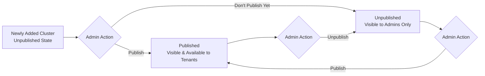
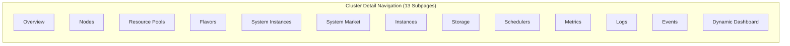
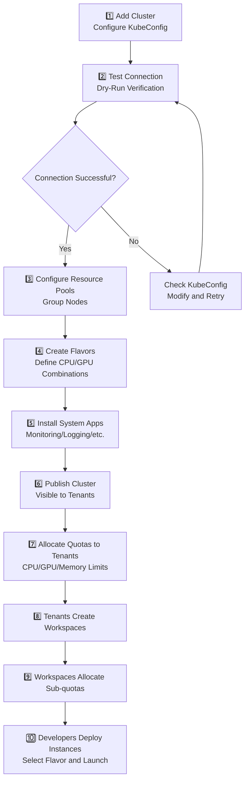

# Cluster Management

## Feature Overview

Cluster Management is the most critical infrastructure management feature in BOSS. All computing power on the Rune platform comes from Kubernetes clusters connected through BOSS. System administrators can perform full lifecycle management of clusters here, including **adding clusters**, **connection testing**, **publishing**, **detail monitoring**, and **terminal operations**.

Each cluster contains **13 detail subpages**, covering everything from node management, resource pools, and flavor configuration to monitoring metrics, log queries, and event tracking — serving as the core entry point for infrastructure operations.

## Access Path

BOSS → Rune → **Cluster Management**

Path: `/boss/rune/clusters`

## Cluster Architecture Overview



---

## Cluster List


The cluster list displays all connected Kubernetes clusters in a table format.

### Column Descriptions

| Column | Field Name | Display | Description |
|--------|-----------|---------|-------------|
| **Name** | `name` | Link Text | Cluster name, click to enter cluster detail page |
| **Version** | `gitVersion` | Text Label | Kubernetes version number (e.g., `v1.28.4`), from cluster status info |
| **Published** | `published` | Icon | Whether the cluster is published ✅/❌, only published clusters are visible to tenants |
| **Connection Status** | `connect_status` | ObjectStatus Label | Real-time cluster connection status, displayed as colored labels |
| **Created At** | `creationTimestamp` | Formatted Time | Time the cluster was added to the platform |
| **Actions** | — | Action Buttons | Test Connection, Publish/Unpublish, Terminal, Edit, Delete |

### Cluster Connection Status

Connection status is displayed through the `ObjectStatus` component as colored labels:

| Status | Color | Meaning |
|--------|-------|---------|
| **Ready** | 🟢 Green | Cluster connection is normal, all services available |
| **Pending** | 🟡 Yellow | Cluster is connecting or initializing |
| **Error** | 🔴 Red | Cluster connection failed or encountered an error |
| **Disabled** | ⚪ Gray | Cluster has been manually disabled |
| **Unknown** | 🔵 Blue | Unable to retrieve cluster status |

### Cluster Status Lifecycle



---

## Add Cluster


### Steps

1. On the cluster list page, click the **Add Cluster** button in the upper right corner
2. Fill in the cluster information in the popup form
3. It's recommended to click **Test Connection** first to confirm the configuration is correct
4. Click the **Create** button to complete the addition

### Form Fields

| Field | Field Name | Type | Required | Description |
|-------|-----------|------|----------|-------------|
| **Cluster ID** | `id` | IdField | ✅ | Unique cluster identifier, cannot be modified after creation. Recommend using meaningful short identifiers like `prod-gpu-01` |
| **Cluster Name** | `name` | Text Input | ✅ | Display name for the cluster, used in the UI |
| **Description** | `description` | Textarea (4 rows) | — | Supplementary description, such as purpose, location, etc. |
| **Cluster Type** | `type` | Fixed Value | — | Fixed as **Kubernetes** (currently only K8s clusters are supported) |
| **KubeConfig** | `kube.config` | Textarea (8 rows, monospace) | ✅ | Kubernetes cluster connection configuration, i.e., kubeconfig YAML content |

### KubeConfig Configuration

KubeConfig is the core configuration for connecting to a Kubernetes cluster and must contain the following key information:

```yaml
apiVersion: v1
kind: Config
clusters:
  - cluster:
      server: https://your-k8s-api-server:6443
      certificate-authority-data: <base64-encoded-ca-cert>
    name: my-cluster
contexts:
  - context:
      cluster: my-cluster
      user: admin
    name: my-context
current-context: my-context
users:
  - name: admin
    user:
      client-certificate-data: <base64-encoded-cert>
      client-key-data: <base64-encoded-key>
```

> ⚠️ Note: The certificates and keys in KubeConfig are highly sensitive information. Please ensure:
> - Use a dedicated service account, not a personal account
> - Grant minimum necessary permissions
> - Do not transmit KubeConfig content through insecure channels

---

## Test Connection (Dry-Run)

When creating or editing a cluster, you can verify the KubeConfig configuration through the **Test Connection** feature.

### How to Use

1. Fill in the KubeConfig in the cluster create/edit form
2. Click the **Test Connection** button
3. The system will attempt to connect to the cluster in Dry-Run mode
4. The connection test result is displayed

### Test Results

| Result | Status | Description |
|--------|--------|-------------|
| ✅ Connection Successful | Success | KubeConfig is valid, cluster API can be accessed normally |
| ❌ Connection Failed | Failed | Error information displayed, such as expired certificate, unreachable address, etc. |
| ⚠️ Partially Available | Warning | Connectable but insufficient permissions, recommend checking RBAC configuration |

> 💡 Tip: It is strongly recommended to perform a connection test before creating a cluster. If you skip the test and create directly, the cluster may be in an Error state, requiring subsequent KubeConfig modifications to reconnect.

---

## Publish / Unpublish

A cluster's **publish status** determines whether it is visible to tenants and available for resource allocation.

| Action | Effect |
|--------|--------|
| **Publish** | Cluster becomes visible to tenants; tenant administrators can allocate resources and deploy instances on it |
| **Unpublish** | Cluster is hidden from tenants; already deployed instances are not affected, but new deployments are not allowed |



> 💡 Tip: It is recommended to publish new clusters only after completing connection testing, resource pool configuration, and flavor setup, to avoid tenants seeing clusters that are not yet ready.

---

## kubectl Terminal

BOSS provides a built-in **kubectl terminal** feature that allows administrators to execute kubectl commands directly in the browser against a cluster, without needing to configure kubeconfig locally.


### How to Use

1. In the cluster list, click the **Terminal** button in the target cluster's action column
2. The system opens a web terminal at the bottom of the page or in a new window
3. The terminal is automatically configured with the target cluster's connection context
4. You can directly execute `kubectl` commands

### Common Command Examples

```bash
# Check cluster node status
kubectl get nodes

# View pods across all namespaces
kubectl get pods -A

# Check cluster resource usage
kubectl top nodes

# View events in a specific namespace
kubectl get events -n rune-system
```

> ⚠️ Note: Commands executed in the terminal have cluster administrator privileges. Please operate with caution. Avoid executing destructive commands (such as `kubectl delete`) on production clusters; test on test clusters first.

---

## Edit Cluster

1. Click the **Edit** button in the action column of the cluster list
2. You can modify the cluster name, description, and KubeConfig
3. After modifying KubeConfig, it is recommended to perform a connection test again
4. Click **Save** to submit the changes

> 💡 Tip: Cluster ID and type cannot be modified after creation. To switch clusters, it is recommended to create a new cluster, migrate resources, then delete the old cluster.

---

## Delete Cluster

1. Click the **Delete** button in the action column of the cluster list
2. The system displays a confirmation dialog
3. Confirm to execute the deletion

> ⚠️ Note: Deleting a cluster is an **irreversible** operation. Before deletion, please ensure:
> - No running instances on the cluster
> - All important data has been migrated
> - All tenants using the cluster have been notified
> - All resource pools and quotas associated with the cluster have been released

---

## Cluster Detail Page

Click a cluster name to enter the cluster detail page. The detail page provides comprehensive cluster management and monitoring through **13 subpages**.

Path: `/boss/rune/clusters/:cluster`


### Subpage Navigation



---

### 1. Overview

Path: `/boss/rune/clusters/:cluster/overview`


The cluster overview displays core cluster information in a **dynamic dashboard** format, including:

| Area | Content |
|------|---------|
| Basic Info | Cluster name, ID, version, type, creation time, connection status |
| Resource Summary | Total nodes, total CPU, total memory, total GPU count |
| Usage | Current CPU/memory/GPU usage rates and trends |
| Node Status Distribution | Ready/NotReady/Unknown node counts |

The overview page panel layout can be customized through dynamic dashboard configuration.

### Cluster Data Model

The complete data structure of a cluster resource object:

| Field | Path | Description |
|-------|------|-------------|
| Cluster Type | `type` | Fixed as Kubernetes |
| Published | `published` | Boolean |
| KubeConfig | `kube.config` | Cluster connection configuration |
| Namespace | `kube.namespace` | Default operation namespace |
| Service Address | `kube.service` | In-cluster service address |
| Port | `kube.port` | Service port |
| Connection Status | `status.connected` | Whether connected |
| Phase | `status.phase` | Current status phase |
| K8s Version | `status.version.gitVersion` | Kubernetes version |
| Vendor | `status.version.vendor` | Cluster vendor identifier |
| Build Date | `status.version.buildDate` | Version build date |
| Agent Version | `status.agentVersion` | Rune Agent version |
| Status Conditions | `status.conditions` | Detailed status condition list |

---

### 2. Nodes

Path: `/boss/rune/clusters/:cluster/nodes`


Displays detailed information for all Kubernetes nodes in the cluster:

| Column | Description |
|--------|-------------|
| Node Name | Node's hostname |
| Status | Ready / NotReady / SchedulingDisabled |
| Role | master / worker |
| IP Address | Node's internal IP |
| CPU | Total / Used / Allocatable |
| Memory | Total / Used / Allocatable |
| GPU | GPU model and count (if applicable) |
| Pod Count | Number of currently running Pods |
| Labels | Node label list |
| Taints | Node taint configuration |

> 💡 Tip: Node labels are the basis for resource pool partitioning. Administrators can add custom labels to nodes via kubectl, then use label selectors in resource pools to filter nodes.

---

### 3. Resource Pools

Path: `/boss/rune/clusters/:cluster/resource-pools`

Manage resource pools in the cluster. Resource pools are a mechanism for logically grouping nodes to achieve resource isolation.

See [Resource Pool Management](./resource-pools.md) for detailed documentation.

---

### 4. Flavors

Path: `/boss/rune/clusters/:cluster/flavors`

Manage available compute flavors in the cluster. Flavors define the CPU/GPU/memory combinations available when deploying instances.

See [Flavor Management](./flavors.md) for detailed documentation.

---

### 5. System Instances

Path: `/boss/rune/clusters/:cluster/systems`


Manage cluster-level system applications — the foundational service components that support platform operations:

- **View** the list of deployed system instances
- **Install** new system applications (such as monitoring components, log collectors, etc.)
- **Upgrade** the version of installed system instances
- **Uninstall** system instances that are no longer needed
- View system instance **running status** and **resource usage**

---

### 6. System Market

Path: `/boss/rune/clusters/:cluster/system-market`


The System Market is the platform's **system application template marketplace**, where administrators can deploy system applications to clusters with one click from the template library:

- Browse available system application templates
- View template details (description, versions, configuration parameters)
- One-click **deploy to the current cluster**
- Customize configuration parameters during deployment

> 💡 Tip: Templates in the System Market are managed globally by the platform. Administrators can manage all available system application templates in BOSS → Rune → Templates.

---

### 7. Instances

Path: `/boss/rune/clusters/:cluster/instances`


Displays all running workload instances on the cluster (including instances from all tenants):

| Column | Description |
|--------|-------------|
| Instance Name | Name of the workload |
| Tenant | Tenant the instance belongs to |
| Workspace | Workspace the instance belongs to |
| Type | Dev Environment / Training Task / Inference Service |
| Status | Running / Pending / Failed |
| Resources | CPU/GPU/Memory used |
| Created At | Instance creation time |

> ⚠️ Note: This page displays instances from all tenants on the cluster. Administrators can perform global monitoring but should not arbitrarily operate on other tenants' instances.

---

### 8. Storage Clusters

Path: `/boss/rune/clusters/:cluster/storages`


Manage and view storage cluster configurations associated with the cluster:

- Storage cluster connection information
- Storage capacity and usage
- StorageClass configuration
- PV/PVC usage status

---

### 9. Schedulers

Path: `/boss/rune/clusters/:cluster/schedulers`

View and configure cluster scheduler resources and policies:

- View scheduler list and status
- Configure scheduling policy parameters
- Scheduler resource allocation and priority configuration

---

### 10. Metrics

Path: `/boss/rune/clusters/:cluster/metrics`


Cluster resource monitoring dashboard with visual charts showing key metrics:

| Metric Category | Chart Content |
|----------------|---------------|
| **CPU** | Total CPU, usage rate, allocation rate, usage trends |
| **Memory** | Total memory, usage rate, allocation rate, usage trends |
| **GPU** | GPU count, utilization, VRAM usage, temperature |
| **Network** | Network I/O rate, packet loss rate |
| **Disk** | Disk I/O, storage usage rate |

Supported features:
- Custom time range (1 hour / 6 hours / 24 hours / 7 days / 30 days)
- Auto-refresh (configurable interval)
- Chart zoom
- Data export

---

### 11. Logs

Path: `/boss/rune/clusters/:cluster/logs`


**Loki**-based cluster-level log query system:

- **Log Search**: Supports keyword search and regular expressions
- **Label Filtering**: Filter by namespace, Pod, container, and other labels
- **Time Range**: Custom log query time intervals
- **Real-time Tailing**: Supports real-time tail mode to view latest logs
- **Log Download**: Export query results as files

> 💡 Tip: The log feature depends on a Loki log collection system deployed in the cluster. If the log page shows no data, check whether the Loki component has been installed through the System Market.

---

### 12. Events

Path: `/boss/rune/clusters/:cluster/events`

View Kubernetes events in the cluster:

| Column | Description |
|--------|-------------|
| Type | Normal / Warning |
| Reason | Event reason (e.g., Scheduled, Pulled, Created, Started, Failed) |
| Object | K8s object associated with the event |
| Message | Detailed event information |
| Count | Number of times the event occurred |
| First Seen | Time the event first occurred |
| Last Seen | Time the event most recently occurred |

Supports filtering by time range and event type.

---

### 13. Dynamic Dashboard

Path: `/boss/rune/clusters/:cluster/dynamic-dashboard`


The Dynamic Dashboard is a customizable monitoring panel editor where administrators can create personalized cluster monitoring views as needed:

- **Add panels**: Select from predefined chart types
- **Remove panels**: Remove unnecessary charts
- **Edit panels**: Modify chart data sources, styles, and display parameters
- **Drag and arrange**: Freely adjust panel positions and sizes
- **Save layout**: Save the current dashboard configuration

---

## Cluster Resource Management Flow

The complete resource management flow from cluster onboarding to tenant usage:



## API Reference

| Operation | Method | Path | Description |
|-----------|--------|------|-------------|
| Get Cluster List | `GET` | `/api/rune/clusters` | Supports pagination and status filtering |
| Get Cluster Details | `GET` | `/api/rune/clusters/:id` | Includes status information |
| Create Cluster | `POST` | `/api/rune/clusters` | Requires KubeConfig |
| Update Cluster | `PUT` | `/api/rune/clusters/:id` | Can update KubeConfig |
| Delete Cluster | `DELETE` | `/api/rune/clusters/:id` | Irreversible operation |
| Test Connection | `POST` | `/api/rune/clusters/:id/dry-run` | Dry-Run verification |
| Publish Cluster | `PUT` | `/api/rune/clusters/:id/publish` | Visible to tenants |
| Unpublish Cluster | `PUT` | `/api/rune/clusters/:id/unpublish` | Hidden from tenants |
| kubectl Exec | `POST` | `/api/rune/clusters/:id/exec` | Execute kubectl commands |

## Best Practices

### Cluster Planning Recommendations

- **Separate production and test**: It is recommended to connect separate production and test clusters to avoid test tasks affecting production workloads
- **Partition by resource type**: GPU-intensive and CPU-intensive workloads should use different clusters
- **Reserve resource headroom**: Cluster resource usage should be kept below 80%, reserving capacity for burst demand

### KubeConfig Security

1. Use a **dedicated service account** to connect to clusters, do not use personal kubeconfig
2. Regularly **rotate credentials** to avoid certificate expiration causing connection interruptions
3. Ensure the service account has **necessary and minimal RBAC permissions**

### Monitoring and Alerting

1. **Regularly check** cluster connection status, ensuring all clusters are in Ready state
2. **Configure resource alerts** to notify administrators when CPU/memory/GPU usage exceeds thresholds
3. **Monitor cluster events**, especially Warning-type events that may indicate potential issues

## Permission Requirements

| Operation | Required Role |
|-----------|---------------|
| View Cluster List | System Administrator |
| Add Cluster | System Administrator |
| Test Connection | System Administrator |
| Publish/Unpublish | System Administrator |
| kubectl Terminal | System Administrator |
| Edit Cluster | System Administrator |
| Delete Cluster | System Administrator |
| View Cluster Details (all subpages) | System Administrator |
