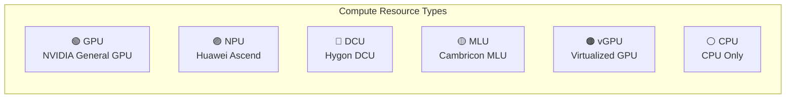
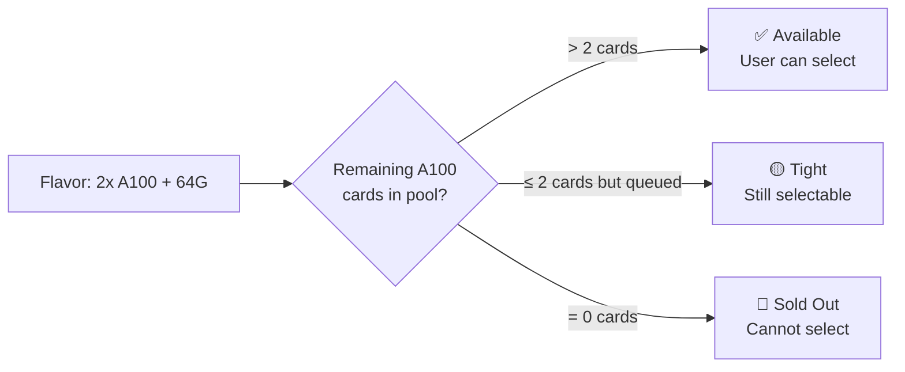
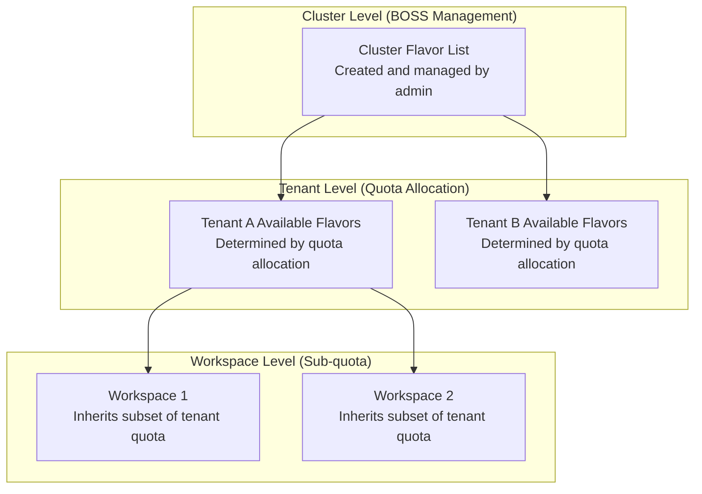

# Flavor Management (Admin)

## Feature Overview

Flavors define the **compute resource combinations** available when deploying instances — including CPU core count, memory capacity, GPU/NPU type and quantity, etc. Administrators create, configure, and manage platform-wide flavors through BOSS Flavor Management. These flavors are ultimately presented as options to tenant users, who select appropriate flavors when creating development environments, training tasks, or inference services.

> 💡 Tip: Flavor Management in BOSS is the **administrator view**, with full management capabilities including create, edit, enable/disable, etc. Regular users in the Console can only **view and select** enabled flavors and cannot create or modify them.

## Access Path

BOSS → Cluster Details → **Flavors**

Path: `/boss/rune/clusters/:cluster/flavors`

## Admin View vs User View

| Dimension | BOSS Admin View | Console User View |
|-----------|----------------|-------------------|
| **Permissions** | Create / Edit / Enable / Disable / Delete | View and select only |
| **Visible Scope** | All flavors (including disabled) | Only enabled flavors with quota |
| **Resource Pool Association** | Can configure resource pool bindings | Resource pool info not visible |
| **Sold Out Status** | Can view sold out reasons and adjust | Only sees "unavailable" marker |
| **Multi-level Scope** | Can configure cluster→tenant→workspace visibility | Only sees flavors available in current workspace |

---

## Flavor List


The flavor list displays all created flavors in the current cluster in table format.

### Column Descriptions

| Column | Field Name | Display | Description |
|--------|-----------|---------|-------------|
| **Name** | `name` | Text + Description | Flavor name with description below |
| **Resource Type** | `type` | QuotaResourceType Label | Resource category, such as GPU, NPU, DCU, etc. |
| **Resource Model** | `model` | QuotaResourceModel Label | Specific hardware model, such as A100, H100, etc. |
| **Resource Configuration** | `resources` | FlavorResources Tag Group | Multiple tags showing CPU/memory/GPU and other resource configuration details |
| **Resource Pool** | `resourcePool` | Link | Name of the resource pool associated with the flavor, click to navigate to pool details |
| **Enabled Status** | `enabled` | Toggle/Label | Whether the flavor is enabled; disabled flavors are not shown to users |
| **Actions** | — | Action Buttons | Enable/Disable, Edit, Delete |

### Resource Configuration Tags (FlavorResources)

The resource configuration column displays the specific flavor configuration as colored tag groups:

```
[CPU: 16 Cores]  [Memory: 64Gi]  [GPU: 2x A100]  [VRAM: 160GB]
```

Each tag contains the resource category and quantity, with colors differentiated by resource type for easy identification.

---

## Filtering


The flavor list provides a **FlavorFilterBar** component supporting multi-dimensional filtering:

### Filter Conditions

| Filter | Type | Options | Description |
|--------|------|---------|-------------|
| **Status** | Dropdown | Available / Unavailable | Filter by whether the flavor is currently allocatable |
| **Resource Type** | Dropdown | GPU / NPU / DCU / MLU / vGPU / CPU | Filter by compute resource type |
| **Resource Model** | Dropdown | Changes dynamically based on type | Filter by specific hardware model |
| **Resource Pool** | Dropdown | All resource pools in current cluster | Filter by associated resource pool |
| **Keyword** | Text Input | Free input | Fuzzy search by name |

> 💡 Tip: Multiple filter conditions can be combined. For example, selecting "Resource Type: GPU" + "Status: Available" quickly finds all available GPU flavors.

---

## Create Flavor


### Steps

1. On the flavor list page, click the **Create Flavor** button in the upper right corner
2. Configure flavor parameters in the popup form
3. Click the **Create** button to complete the operation

### Form Fields

| Field | Field Name | Type | Required | Description |
|-------|-----------|------|----------|-------------|
| **Name** | `name` | Text Input | ✅ | Flavor name, recommend descriptive naming like `gpu-a100-2x-64g` |
| **Description** | `description` | Textarea | — | Detailed description of the flavor, such as applicable scenarios |
| **Resource Type** | `type` | Dropdown | ✅ | Compute resource type (see resource type table below) |
| **Resource Model** | `model` | Dropdown | ✅ | Specific hardware model (changes dynamically based on type) |
| **CPU** | `cpu` | Number Input | ✅ | Number of CPU cores |
| **Memory** | `memory` | Number + Unit | ✅ | Memory size (e.g., `64Gi`) |
| **GPU/Accelerator Count** | `accelerator` | Number Input | — | Number of GPU/NPU accelerator cards |
| **Resource Pool** | `resourcePool` | Dropdown | ✅ | Associated resource pool, determines which nodes instances will be scheduled to |
| **Enabled Status** | `enabled` | Toggle | — | Whether to enable immediately after creation, enabled by default |

---

## Resource Type Details

The Rune platform supports multiple compute resource types, covering mainstream AI acceleration hardware:

| Resource Type | Type ID | Description | Typical Models |
|--------------|---------|-------------|----------------|
| **GPU** | `GPU` | NVIDIA GPU general-purpose compute accelerator | A100, H100, V100, A10, L40S, RTX 4090 |
| **NPU** | `NPU` | Huawei Ascend AI processor | Ascend 910B, Ascend 310P |
| **DCU** | `DCU` | Hygon DCU accelerator | DCU Z100 |
| **MLU** | `MLU` | Cambricon MLU intelligent accelerator | MLU370-X8, MLU590 |
| **vGPU** | `vGPU` | Virtualized GPU (GPU slicing) | vGPU (based on NVIDIA MIG or time-sharing) |
| **CPU** | `CPU` | CPU-only compute resources | General x86/ARM CPU |



> 💡 Tip: The resource type determines which nodes a flavor can be scheduled to. Administrators must ensure that nodes in the selected resource pool have the corresponding accelerator drivers and device plugins installed.

---

## Enable / Disable Flavors

Administrators can control the enabled status of flavors to manage their visibility to users.

| Action | Effect |
|--------|--------|
| **Enable** | Flavor is visible to users with quota; users can select it to deploy instances |
| **Disable** | Flavor is hidden from all users; it will not appear in flavor selection lists. Running instances using this flavor are not affected |

### Scenarios for Disabling Flavors

- Temporarily disable corresponding flavors during hardware maintenance or failure
- Flavor configuration is incorrect and needs modification (disable → modify → re-enable)
- Temporarily remove some flavors from availability during resource shortages

> ⚠️ Note: Disabling a flavor does not affect instances already created with that flavor that are running. However, users will be unable to create new instances using a disabled flavor.

---

## Sold Out Mechanism

When all physical resources for a flavor have been allocated (quota is exhausted), the system automatically marks the flavor as **sold out**:



| Status | Display | User Action |
|--------|---------|-------------|
| **Available** | Displayed normally | Can select this flavor to deploy instances |
| **Sold Out** | Marked as unavailable, grayed out | Cannot select; must wait for resource release or contact admin to scale up |

> 💡 Tip: Sold out status is automatically determined by the system based on actual resource usage. Administrators do not need to set it manually. When instances release resources, the sold out status is automatically cleared.

---

## Multi-level Scope

Flavor visibility and availability follow a **cluster → tenant → workspace** multi-level scope configuration system:



| Level | Manager | Description |
|-------|---------|-------------|
| **Cluster Level** | System Administrator (BOSS) | Creates flavors on the cluster, defining all possible resource combinations in the system |
| **Tenant Level** | System Administrator (BOSS) | By selecting flavors when allocating quotas to tenants, determines which flavors tenants can use |
| **Workspace Level** | Tenant Administrator (Console) | By selecting flavors when allocating sub-quotas in workspaces, determines which flavors workspace members can use |

> ⚠️ Note: Even if a flavor is enabled at the cluster level, if the administrator hasn't allocated that flavor in the tenant quota, tenant users cannot see or use it. Flavor availability must be authorized at each level.

---

## Edit Flavor

1. Click the **Edit** button in the flavor list
2. You can modify the flavor's description, resource configuration, associated resource pool, etc.
3. Click **Save** to complete the modification

> ⚠️ Note: Modifying a flavor does not affect running instances already created with that flavor. Changes only apply to newly created instances. It is recommended to disable the flavor before modification and re-enable it after completion.

---

## Delete Flavor

1. Click the **Delete** button in the flavor list
2. The system displays a confirmation dialog
3. Confirm to execute the deletion

> ⚠️ Note: Before deleting a flavor, please ensure:
> - No tenant quotas reference this flavor
> - No workspaces are using this flavor
> - The flavor has been disabled

---

## Best Practices

### Naming Conventions

Descriptive naming including key resource information is recommended:

| Recommended Name | Description |
|-----------------|-------------|
| `gpu-a100-1x-32g` | 1x A100 GPU + 32GB memory |
| `gpu-a100-8x-256g` | 8x A100 GPU + 256GB memory |
| `cpu-16c-64g` | 16-core CPU + 64GB memory |
| `npu-910b-4x-128g` | 4x Ascend 910B NPU + 128GB memory |

### Flavor Design Recommendations

1. **Cover common scenarios**: Provide at least small (dev/debug), medium (small-scale training), and large (large-scale training) tiers of flavors
2. **Avoid too many flavors**: Keep the number of flavors to 10-15 or fewer; too many flavors increase user selection difficulty
3. **Match resource pools**: Ensure flavor resource requirements match the actual configurations of nodes in the resource pool
4. **Set reasonable CPU/memory ratios**: For GPU flavors, recommend CPU:GPU ratio of 8:1 or 16:1, memory:GPU ratio of 32GB:1 or higher

### Capacity Management

1. **Monitor sold out rate**: If a flavor is frequently sold out, it indicates supply-demand imbalance for that resource type; consider adding nodes or creating smaller-granularity flavors
2. **Regularly review utilization**: Low-utilization flavors can be considered for consolidation or deletion
3. **Plan scaling ahead**: When GPU utilization exceeds 70%, start planning new hardware procurement

## Permission Requirements

| Operation | Required Role |
|-----------|---------------|
| View Flavor List | System Administrator |
| Create Flavor | System Administrator |
| Edit Flavor | System Administrator |
| Enable/Disable Flavor | System Administrator |
| Delete Flavor | System Administrator |
