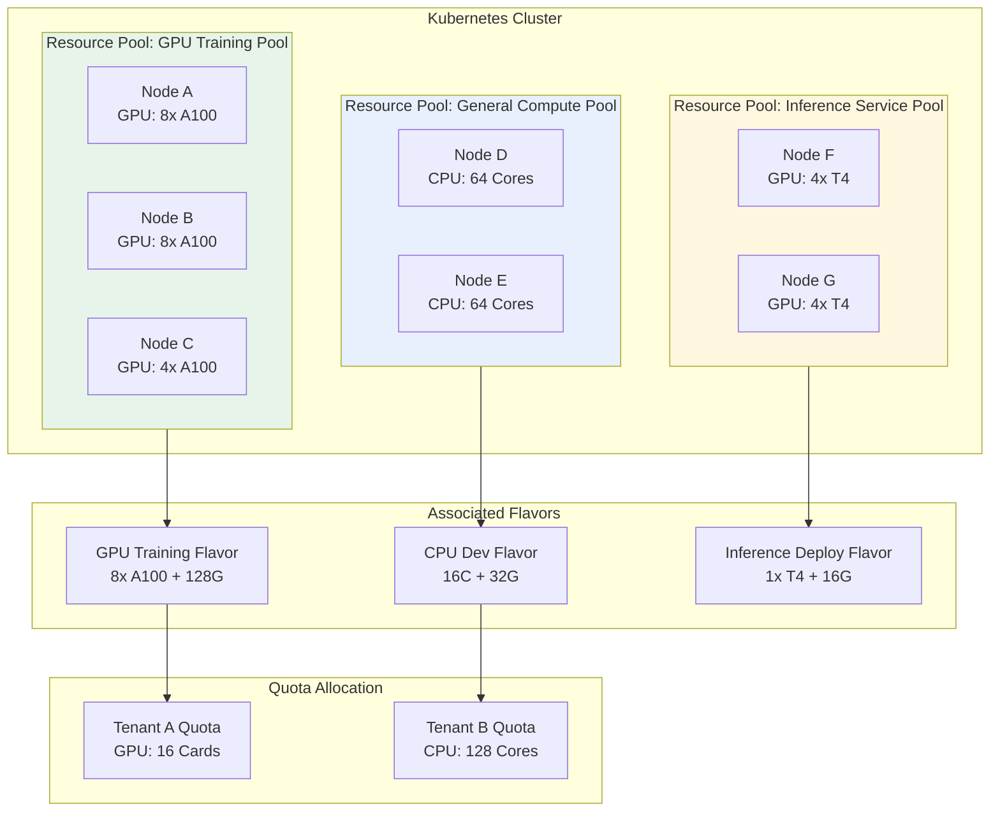
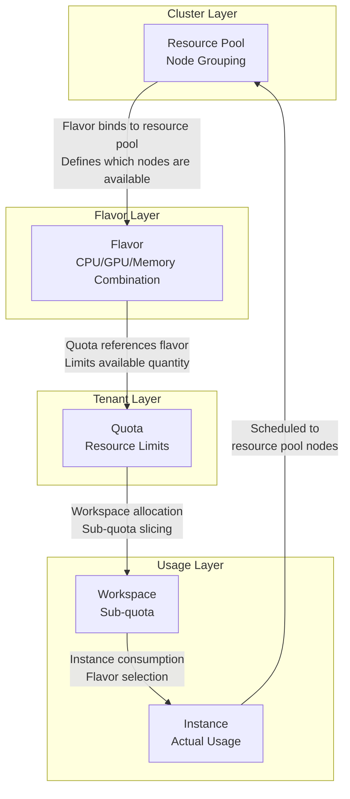

# Resource Pool Management

## Feature Overview

Resource Pools are the core mechanism in the Rune platform for **compute resource isolation and scheduling control**. By partitioning cluster nodes into different resource pools, administrators can achieve node-level resource grouping, ensuring that different types of workloads run on appropriate nodes.

For example, in a cluster, GPU-equipped nodes can be placed in a "GPU Training Pool" while regular CPU nodes go into a "General Compute Pool", achieving physical isolation between training tasks and inference services.

## Access Path

BOSS → Cluster Details → **Resource Pools**

Path: `/boss/rune/clusters/:cluster/resource-pools`

## Resource Pools in the Platform



---

## Resource Pool List


The resource pool list displays all created resource pools in the current cluster in table format.

### Column Descriptions

| Column | Field Name | Display | Description |
|--------|-----------|---------|-------------|
| **Name** | `name` | Text + Description + StatusWrapped | Resource pool name with description below. The name includes a status wrapper component showing the pool's current state |
| **Nodes** | `nodes` | CollapseItem List | List of nodes in the resource pool, displayed in a collapsible format. Click to expand and view all nodes |
| **Created At** | `creationTimestamp` | Formatted Time | Resource pool creation time |
| **Actions** | — | Action Buttons | Edit, Delete |

> 💡 Tip: The nodes column uses a collapsible display format (CollapseItem). When a resource pool contains many nodes, only the first few node names are shown by default. Click "expand" to view the complete list.

---

## Create Resource Pool


### Steps

1. On the resource pool list page, click the **Create Resource Pool** button in the upper right corner
2. Fill in the resource pool information in the popup form
3. Select the nodes to include in the resource pool from the node list
4. Click the **Create** button to complete the operation

### Form Fields

| Field | Field Name | Type | Required | Description |
|-------|-----------|------|----------|-------------|
| **Name** | `name` | Text Input | ✅ | Unique identifier name for the resource pool |
| **Description** | `description` | Textarea | — | Description of the resource pool, such as its purpose |
| **Node Selection** | `nodes` | Node Multi-select List | ✅ | Select nodes from available cluster nodes to include in this resource pool |

### Node Selection

When creating a resource pool, the system lists all available nodes in the current cluster. Administrators can select nodes through:

- **Individual selection**: Check target nodes in the node list
- **Select all**: Select all available nodes
- **Search filter**: Search by node name then select

### Resource Pool Data Structure

```json
{
  "name": "gpu-training-pool",
  "description": "A100 GPU Training Resource Pool",
  "nodes": [
    { "name": "gpu-node-01" },
    { "name": "gpu-node-02" },
    { "name": "gpu-node-03" }
  ]
}
```

> ⚠️ Note: Each node can only belong to one resource pool. If a node is already used by another resource pool, it will not appear in the available node list when creating a new resource pool.

---

## Edit Resource Pool

1. Click the **Edit** button in the resource pool list
2. You can modify the resource pool's description and node list
3. You can add new nodes or remove existing nodes
4. Click **Save** to complete the modification

> 💡 Tip: When editing nodes in a resource pool, removing a node will not affect workloads already running on that node, but new workloads will no longer be scheduled to the removed node.

---

## Delete Resource Pool

1. Click the **Delete** button in the resource pool list
2. The system displays a confirmation dialog
3. Confirm to execute the deletion

> ⚠️ Note: Before deleting a resource pool, please ensure:
> - No critical workloads are running on nodes in the resource pool
> - No flavors reference this resource pool
> - No quota allocations depend on this resource pool
> After deletion, nodes in the resource pool will return to an "unassigned" state and can be selected by other resource pools.

---

## Relationship Between Resource Pools, Flavors, and Quotas

Resource pools, flavors, and quotas are the three core concepts of Rune platform resource management, with close relationships between them:



| Concept | Purpose | Relationship |
|---------|---------|-------------|
| **Resource Pool** | Groups cluster nodes | Flavors reference resource pools, determining which nodes to deploy on |
| **Flavor** | Defines CPU/GPU/memory combinations | Bound to specific resource pools, limiting available physical resources |
| **Quota** | Limits the resource ceiling a tenant can use | References flavors, defines quota quantities |
| **Workspace Quota** | Subdivides tenant quota for workspaces | Cannot exceed total tenant quota |
| **Instance** | Actually consumes resources | Selects a flavor, scheduled to corresponding resource pool nodes |

> 💡 Tip: When creating a flavor, you need to specify the associated resource pool, which determines which nodes instances created with that flavor will be scheduled to run on.

---

## Best Practices

### Resource Pool Partitioning Strategies

| Strategy | Applicable Scenario | Example |
|----------|-------------------|---------|
| **By Hardware Type** | Cluster contains heterogeneous hardware | GPU Pool, CPU Pool, High Memory Pool |
| **By Business Usage** | Need to isolate different workload types | Training Pool, Inference Pool, Dev Pool |
| **By Tenant Isolation** | Need physical-level tenant isolation | Tenant A Dedicated Pool, Tenant B Dedicated Pool |
| **By Priority** | Differentiate tasks with different priorities | High Priority Pool (SLA guaranteed), Elastic Pool |

### Naming Recommendations

- Use meaningful names, such as `gpu-a100-training`, `cpu-general`
- Maintain consistent naming styles
- Include hardware type or usage information in the name

### Capacity Planning

1. **Reserve system resources**: Each node should reserve 10%-15% of resources for Kubernetes system components
2. **Avoid single points of failure**: Each resource pool should contain 2 or more nodes to prevent a single node failure from making the entire pool unavailable
3. **Monitor utilization**: Regularly check overall resource pool utilization; when usage consistently exceeds 80%, consider scaling up

## Permission Requirements

| Operation | Required Role |
|-----------|---------------|
| View Resource Pool List | System Administrator |
| Create Resource Pool | System Administrator |
| Edit Resource Pool | System Administrator |
| Delete Resource Pool | System Administrator |
