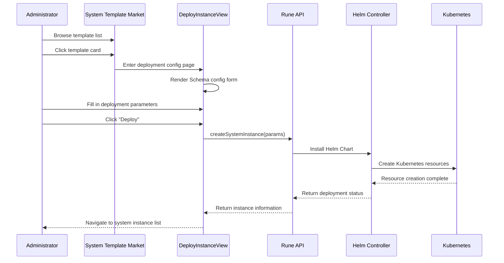

# System Template Market

## Feature Overview

The System Template Market is a cluster-level **infrastructure app store** that provides platform administrators with pre-built system-level application templates. Administrators can browse, filter, and deploy various infrastructure components needed by the cluster with one click, such as monitoring systems, log pipelines, object storage, and more.

Templates in the System Template Market consist of published product templates with `domain=system` from [Template Management](./templates.md). Each template is backed by a verified Helm Chart package.

> 💡 Tip: The System Template Market is different from the user-facing "App Market" — system templates focus on cluster infrastructure components and are only visible to system administrators; the user App Market is available to all users, providing inference, fine-tuning, and other business application templates.

## Access Path

BOSS → Rune → Clusters → Select Cluster → **System Templates**

Path: `/boss/rune/clusters/:cluster/system-market`

## Template Browsing

The System Template Market uses the `ProductListView` component to display all available system templates in **card format**. Each card contains:

- **Template Icon**: Visual identification of the template type
- **Template Name**: Such as Prometheus, Grafana, MinIO, etc.
- **Template Description**: Brief explanation of the template's functions and purpose
- **Category Tags**: Category classification (monitoring, logging, storage, etc.)
- **Latest Version**: The latest version number available for deployment

### Template Categories

System templates cover the following infrastructure categories:

| Category | Description | Typical Templates |
|----------|-------------|-------------------|
| Monitoring | Metrics collection, alerting, and visualization | Prometheus, Grafana, Alertmanager |
| Logging | Log collection, aggregation, and query | Loki, Promtail, Fluentd |
| Storage | Object storage and data persistence | MinIO, NFS Provisioner |
| Networking | Traffic management and ingress control | Ingress NGINX, Cert Manager |
| GPU (Accelerator) | GPU driver and device management | GPU Operator, Device Plugin |
| Security | Certificate management and secret storage | Cert Manager, Vault |

> 💡 Tip: The template list is maintained and published by platform administrators in [Template Management](./templates.md). If a needed component template is missing from the market, please contact the template administrator to create and publish it.

## One-click Deployment Flow

### Steps

1. **Select Template**: Click on the target template card in the template market
2. **View Template Details**: Read the README documentation and version notes to understand the template's functions and usage
3. **Select Version**: Choose the version to deploy from the available version list
4. **Fill in Configuration Parameters**: Fill in deployment parameters according to the template Schema form (namespace, replicas, storage size, etc.)
5. **Submit Deployment**: Click the "Deploy" button. The system creates a system instance via the `createSystemInstance` API
6. **Wait for Ready**: After deployment completes, navigate to the [System Instances](./systems.md) list to check the running status

### Deployment Flow Diagram

### Deployment Configuration Details

The deployment configuration page (`DeployInstanceView`) dynamically generates forms based on the template-defined Schema. Common configuration items include:

| Configuration | Description | Example |
|--------------|-------------|---------|
| Instance Name | System instance name | `prometheus-cluster01` |
| Namespace | Kubernetes namespace for deployment | `monitoring` |
| Replicas | Pod replica count | `1` ~ `3` |
| Storage Size | Persistent volume size | `10Gi` ~ `500Gi` |
| Resource Limits | CPU / memory requests and limits | `cpu: 500m, memory: 2Gi` |
| Custom Configuration | Template-specific business configuration | Varies by template |

> ⚠️ Note: Deployment parameters are determined by the template's Schema definition, and configurable items vary between templates. Please carefully read the template README to understand the meaning of each parameter. Incorrect configuration may cause deployment failure or functional anomalies.

## Template Details

Clicking a template card shows the template's detailed information:

### README Documentation

Detailed usage documentation for the template, rendered in Markdown format, typically containing:

- Component feature introduction
- Architecture description
- Configuration parameter table
- Usage examples
- Precautions and known limitations

### Version List

Displays all published versions of the template, including:

| Field | Description |
|-------|-------------|
| Version Number | Chart version number (SemVer) |
| App Version | Upstream application version number |
| Changelog | Change description for the version |
| Release Date | Version release date |

> 💡 Tip: It is recommended to prioritize the latest stable version for deployment. If you need to use a specific version, you can expand the version in the version list to view its changelog and confirm the changes.

## Common Deployment Scenarios

### New Cluster Initialization

After a new cluster is added to the platform, the recommended order for deploying system components is:

1. **Ingress Controller** — Traffic ingress (skip if already available)
2. **Cert Manager** — TLS certificate management
3. **Prometheus + Grafana** — Monitoring stack
4. **Loki + Promtail** — Logging stack
5. **MinIO** — Object storage (model/dataset storage)
6. **GPU Operator** — Required for GPU clusters

### Component Upgrades

When a template releases a new version, you can update the deployed instance version through the [System Instances](./systems.md) page.

## Differences from User App Market

| Comparison | System Template Market | User App Market |
|------------|----------------------|-----------------|
| Target Role | System administrators | Regular users |
| Template Domain | `domain=system` | `domain=user` |
| Deployment Scope | Cluster level | Workspace level |
| Typical Templates | Monitoring, logging, storage | Inference, fine-tuning, dev environments |
| Entry Point | BOSS → Cluster → System Templates | Console → App Market |

## Permission Requirements

Requires the **System Administrator** role. Only system administrators can browse the System Template Market and deploy system instances.
