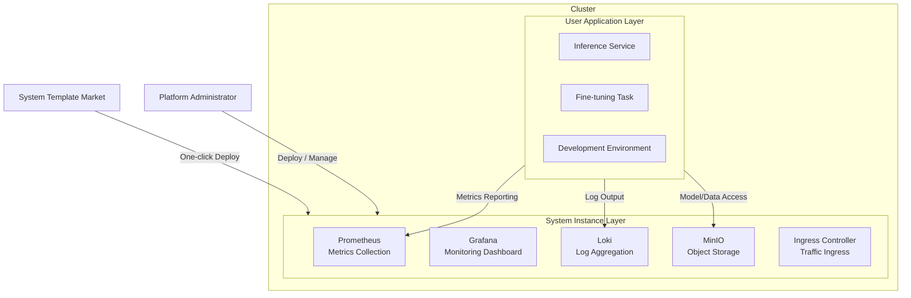
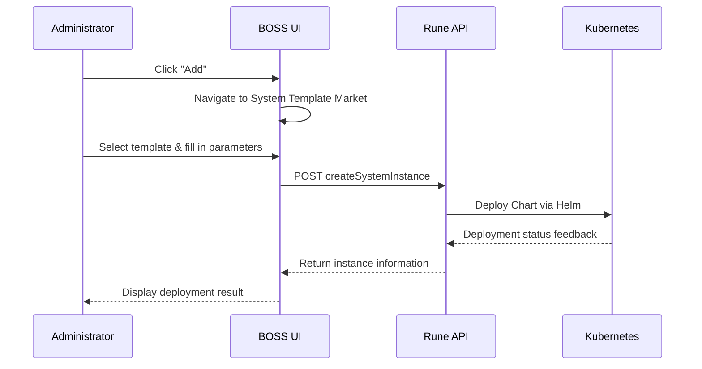

# System Instance Management

## Feature Overview

System Instances are **infrastructure-level components** deployed in clusters that provide critical supporting services for the platform's operation. Unlike user applications, system instances serve the operational and management needs of the entire cluster, including but not limited to:

- **Metrics Collection**: Prometheus, Node Exporter, and other metrics collection components
- **Visualization Dashboards**: Grafana monitoring dashboards
- **Log Collection & Query**: Loki, Promtail log pipelines
- **Object Storage**: MinIO distributed storage
- **Networking & Ingress**: Ingress Controller, Cert Manager
- **GPU Management**: GPU Operator, Device Plugin

System instances are deployed with one click from templates in the [System Template Market](./system-market.md), with lifecycle management based on Helm Charts under the hood.

> 💡 Tip: System instances are only visible to platform administrators. Regular users cannot view or operate cluster-level system components.

## Access Path

BOSS → Rune → Clusters → Select Cluster → **System Instances**

Path: `/boss/rune/clusters/:cluster/systems`

## Overall Architecture

## System Instance List

The system instance list is rendered using the `InstanceListView` component with a fixed `category='system'` filter, displaying only system-level instances.

| Column | Description | Notes |
|--------|-------------|-------|
| Name | Instance name (with icon) | Click to enter instance details |
| Status | Running status | Running / Pending / Failed / Stopped, etc. |
| Template | Name of the system template used for deployment | Links to template details |
| Version | Currently deployed Chart version | — |
| Created At | Instance deployment time | Timestamp format |
| Actions | View Details / Delete | — |

> ⚠️ Note: Deleting a system instance may cause cluster monitoring or logging functions to become unavailable. Please confirm there are no dependencies before performing the delete operation.

## Deploy System Instance

### Deploy from System Template Market

1. On the system instance list page, click the **Add** button
2. The system will navigate to the [System Template Market](./system-market.md) page
3. Select the target template in the template market (e.g., Prometheus)
4. Fill in deployment parameters (namespace, configuration items, etc.)
5. Submit the deployment and wait for the instance to start

> 💡 Tip: Before deployment, confirm that the cluster has sufficient available resources (CPU, memory). Monitoring components in particular typically require significant memory quota.

### Deployment Flow

## Manage System Instances

### View Details

Click on the instance name to enter the details page, where you can view:

- **Basic Information**: Instance name, associated cluster, deployment template, version number, creation time
- **Running Status**: Current Pod count, replica status, resource utilization
- **Pod List**: Running status of each Pod, node location, restart count
- **Event Log**: Kubernetes event stream to help troubleshoot startup failures and other issues
- **Configuration Details**: Currently active Helm values configuration

### Delete Instance

1. On the list page or details page, click the **Delete** action
2. Confirm deletion in the confirmation dialog
3. The system will uninstall the instance via Helm uninstall and clean up related resources

> ⚠️ Note: Delete operations are irreversible. For storage components (such as MinIO), data within them will be **permanently lost** after deletion. It is recommended to back up data beforehand.

## Common System Components

| Component | Purpose | Typical Resource Requirements |
|-----------|---------|------------------------------|
| **Prometheus** | Metrics collection and storage, provides PromQL query capability | CPU: 500m, Memory: 2Gi+ |
| **Grafana** | Monitoring data visualization dashboards, supports custom Dashboards | CPU: 200m, Memory: 512Mi |
| **Loki** | Lightweight log aggregation system, integrates with Grafana | CPU: 500m, Memory: 1Gi+ |
| **Promtail** | Log collection agent, pushes logs to Loki | CPU: 100m, Memory: 128Mi |
| **MinIO** | S3-compatible high-performance object storage | CPU: 500m, Memory: 1Gi+ |
| **Ingress NGINX** | Kubernetes Ingress controller | CPU: 200m, Memory: 256Mi |
| **Cert Manager** | Automatic TLS certificate management and issuance | CPU: 100m, Memory: 128Mi |
| **GPU Operator** | NVIDIA GPU driver and device plugin management | Depends on GPU count |

> 💡 Tip: The resource requirements above are reference values. Actual requirements depend on cluster scale and load. For production environments, it is recommended to adjust resource quotas based on actual monitoring data.

## Troubleshooting

When a system instance status is abnormal, follow these steps to troubleshoot:

1. **Check Pod Status**: Go to instance details and check if Pods are in `CrashLoopBackOff` or `Pending` state
2. **View Event Log**: Look for events like `FailedScheduling` (insufficient resources), `ImagePullBackOff` (image pull failure), etc.
3. **Check Resource Quotas**: Confirm that remaining cluster resources meet the component requirements
4. **View Container Logs**: Check container output logs via Pod details to identify specific errors
5. **Check Storage Volumes**: For storage components, confirm that PVCs are properly bound

## Differences from App Market Instances

| Comparison | System Instance | App Instance |
|------------|----------------|--------------|
| Deployment Source | System Template Market | User App Market |
| Scope | Cluster level | Workspace level |
| Visibility | System administrators only | Tenant/workspace users |
| Purpose | Infrastructure support | Business applications (inference/fine-tuning, etc.) |
| Management Path | BOSS → Cluster → System Instances | Console → Apps |

## Permission Requirements

Requires the **System Administrator** role. Only users with this role can view, deploy, and manage cluster-level system instances.
