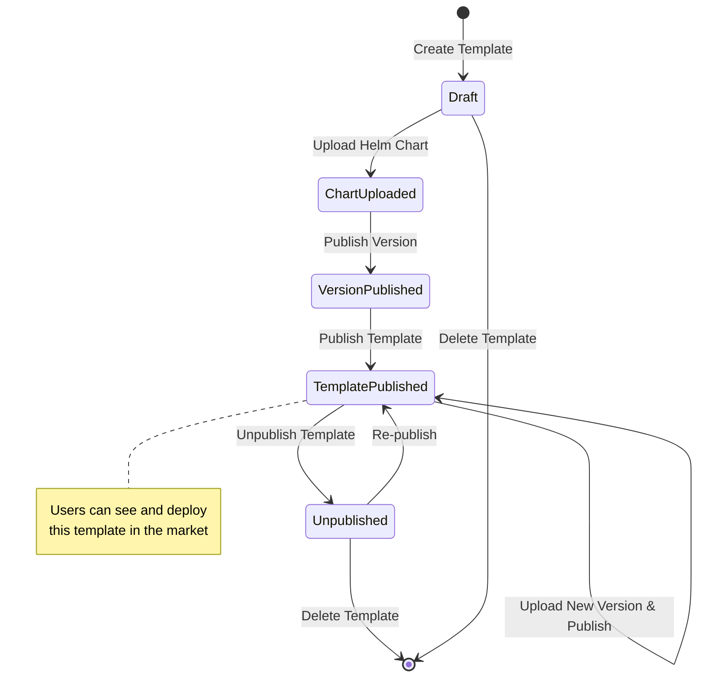
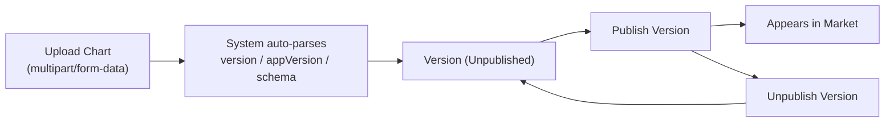

# Product Template Management

## Feature Overview

Product Templates are the foundational units for application deployment on the Rune platform. A template defines the deployment configuration specification for an application, including the Helm Chart package, configuration form Schema, README documentation, version history, and more. Once published, templates appear in the App Market or System Template Market for users or administrators to deploy with one click.

The template management page allows system administrators to perform full lifecycle management of all product templates on the platform: create, edit, upload Charts, version management, publish/unpublish, and delete.

> 💡 Tip: Templates are divided into two domains: **System templates** appear in the cluster's System Template Market for administrators to deploy infrastructure; **User templates** appear in the user-facing App Market for deploying inference, fine-tuning, and other business applications.

## Access Path

BOSS → Rune → **Templates**

Path: `/boss/rune/products`

API base path: `/api/cloud/admin-products`

## Template Lifecycle



## Template List


The template list displays all product templates in table format, with search and filter support.

| Column | Description | Notes |
|--------|-------------|-------|
| Name | Template name (avatar + link + ID) | Includes template icon; click name to go to details; hover to show template ID |
| Domain | Template domain | `system` or `user` |
| Category | Template category | 8 categories, see table below |
| Published | Whether published to market | ✅ Yes / ❌ No |
| Created At | Template creation timestamp | — |
| Actions | Publish/Unpublish, Edit, Delete | — |

### Template Categories

The platform supports the following 8 template categories, covering all AI platform scenarios:

| Category | Identifier | Description | Typical Templates |
|----------|-----------|-------------|-------------------|
| Inference | `inference` | Model inference service deployment | vLLM, TGI, Triton |
| Fine-tuning | `tune` | Model fine-tuning training tasks | LLaMA-Factory, DeepSpeed |
| System | `system` | Cluster infrastructure components | Prometheus, Grafana, MinIO |
| Storage | `storage` | Data storage and management | MinIO, NFS |
| Instant Messaging | `im` | Communication and collaboration services | — |
| Application | `app` | General application deployment | Custom business applications |
| Experiment | `experiment` | Experiment management and tracking | MLflow, Weights & Biases |
| Evaluation | `evaluation` | Model evaluation and benchmarking | — |

### Domain Types

| Domain | Description | Visibility |
|--------|-------------|------------|
| `system` | System templates | Visible to administrators only, appears in cluster's System Template Market |
| `user` | User templates | Visible to all users, appears in user-facing App Market |

## Operation Details

### Publish / Unpublish

- **Publish Template**: Makes the template visible, appearing in the corresponding market. Requires confirmation dialog before execution.
- **Unpublish Template**: Hides the template from the market. Already deployed instances are not affected. Requires confirmation dialog before execution.

> ⚠️ Note: Before publishing a template, ensure there is at least one published version; otherwise, users cannot deploy it properly.

### Create Template

Click the **Create** button to open the creation form:

| Field | Type | Required | Description |
|-------|------|----------|-------------|
| Name | Text | ✅ | Unique template name, cannot be modified after creation |
| Display Name | Text | ✅ | Name displayed in the market |
| Domain | Select | ✅ | `system` or `user` |
| Category | Select | ✅ | One of 8 categories |
| Description | Textarea | — | Brief template description |
| Icon | Image Upload | — | Template avatar, uploaded to `/api/iam/products/:product/avatar` |
| README | Markdown Editor | — | Detailed product introduction document |


### Edit Template

Click the **Edit** button in the list to modify the template's display name, description, category, README, and other fields.

> 💡 Tip: The unique template name (ID) and domain type cannot be modified after creation. If changes are needed, create a new template and migrate.

### Delete Template

Click the **Delete** button and confirm in the dialog to delete the template along with all its versions and Chart packages.

> ⚠️ Note: Delete operations are irreversible. If there are instances deployed based on this template, deleting the template will not affect running instances, but it will no longer be possible to perform new deployments or upgrades based on this template.

## Version Management

Enter the template details page and switch to the **Versions** tab to manage all versions of the template.


### Version Data Structure

Each template version (`TemplateVersion`) contains the following fields:

| Field | Description |
|-------|-------------|
| `name` | Version name |
| `version` | Chart version number (SemVer format) |
| `appVersion` | Upstream application version number |
| `chart` | Associated Helm Chart |
| `changelog` | Version changelog |
| `releaseNote` | Release notes |
| `url` | Chart package download URL |
| `schema` | Configuration form JSON Schema |
| `i18nSchema` | Multi-language Schema (internationalization) |
| `metadata` | Additional metadata |
| `raw` | Raw Chart information |
| `readme` | Version-specific README |
| `values` | Default values.yaml content |

### Upload Helm Chart

The core of a version is the Helm Chart package. The upload operation uses `multipart/form-data` format:

**API Endpoint**: `POST /api/cloud/admin-products/:product/charts`

**Request Format**:
```
Content-Type: multipart/form-data

file: <chart.tgz>    // Helm Chart archive (.tgz format)
```

**Chart Package Requirements**:

- Must be in standard Helm Chart package format (`.tgz`)
- The `name` in Chart.yaml should match the template name
- Should include `values.yaml` (default configuration) and `values.schema.json` (configuration form Schema)
- README.md will be automatically extracted as version documentation

> 💡 Tip: After uploading a Chart, the system automatically parses the version number, app version, Schema, README, and default values — no manual input required.

### Publish / Unpublish Version

- **Publish Version**: Makes the version selectable in the market. A template can have multiple published versions simultaneously.
- **Unpublish Version**: Hides the version from the market. Users will no longer be able to select this version for new deployments.

### Version Management Flow



## Template Details Page

Click the template name to enter the details page, which contains the following tabs:

### Overview

- Template basic information (name, category, domain, status)
- README document rendering (Markdown)
- Template icon

### Versions

- Version list (version number, app version, status, release date)
- Version details (changelog, releaseNote, values, schema)
- Chart upload entry
- Version publish/unpublish operations

### Schema & Values

- **Schema**: JSON Schema defines the configuration form structure during deployment. The system automatically generates a visual configuration form based on the Schema
- **i18nSchema**: Multi-language Schema, supporting internationalization of configuration forms
- **Values**: Default Helm values configuration. Users can modify these as a base during deployment

## API Reference

| Operation | Method | Endpoint |
|-----------|--------|----------|
| Get Template List | GET | `/api/cloud/admin-products` |
| Create Template | POST | `/api/cloud/admin-products` |
| Get Template Details | GET | `/api/cloud/admin-products/:product` |
| Update Template | PUT | `/api/cloud/admin-products/:product` |
| Delete Template | DELETE | `/api/cloud/admin-products/:product` |
| Publish Template | POST | `/api/cloud/admin-products/:product/publish` |
| Unpublish Template | POST | `/api/cloud/admin-products/:product/unpublish` |
| Upload Chart | POST | `/api/cloud/admin-products/:product/charts` |
| Get Chart List | GET | `/api/cloud/admin-products/:product/charts` |
| Delete Chart | DELETE | `/api/cloud/admin-products/:product/charts/:chart` |
| Get Version List | GET | `/api/cloud/admin-products/:product/versions` |
| Publish Version | POST | `/api/cloud/admin-products/:product/versions/:version/publish` |
| Unpublish Version | POST | `/api/cloud/admin-products/:product/versions/:version/unpublish` |
| Upload Template Icon | POST | `/api/iam/products/:product/avatar` |

## Best Practices

1. **Naming Conventions**: Template names should use lowercase letters and hyphens (e.g., `prometheus-stack`) for compatibility with Helm and Kubernetes
2. **Version Management**: Follow SemVer semantic versioning conventions; bump the major version for breaking changes
3. **Schema Design**: Provide reasonable default values and validation rules for configuration forms to reduce deployment errors
4. **README Documentation**: Provide detailed descriptions of template purpose, configuration parameters, deployment prerequisites, and precautions
5. **Accurate Categorization**: Ensure template categories match actual usage for easy market filtering
6. **Test Verification**: Before publishing a new version, it is recommended to verify the deployment flow on a test cluster first

## FAQ

### Version doesn't show after uploading Chart?

Confirm that the Chart.yaml format is correct and the `version` field follows SemVer conventions (e.g., `1.0.0`).

### Users can't see the template after publishing?

Check the following:
1. Whether the template has been published (`published=yes`)
2. Whether there is at least one published version
3. Whether the template domain is `user` (system templates do not appear in the user market)

### How to update the template version of a deployed instance?

After uploading and publishing a new Chart version, deployed instances will not automatically upgrade. Users need to manually perform a version upgrade on the instance management page.

## Permission Requirements

Requires the **System Administrator** role. Only system administrators can create, edit, publish, and delete product templates.
