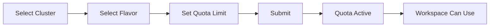
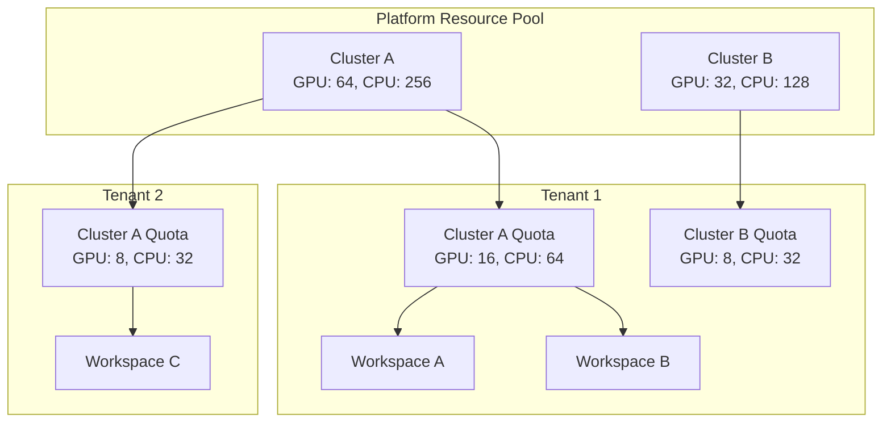

# Tenant Resource Management

## Feature Overview

Rune Tenant Resource Management is an **extended view** of IAM Tenant Management, adding cluster resource quota, workspace management, and tenant-level flavor management capabilities on top of the standard tenant information. Through this page, platform administrators can comprehensively manage and control each tenant's resource allocation and usage across clusters.

Unlike [IAM Tenant Management](../iam/tenants.md), Rune Tenant Management focuses on the **compute resource layer** — administrators allocate GPU, CPU, memory, and other quotas to tenants here, manage workspaces and flavors, and ensure resources are reasonably distributed among multiple tenants.

> 💡 Tip: The Rune tenant list reuses IAM tenant list data and extends it with a **TenantQuota** column that intuitively displays each tenant's resource quota allocation across clusters.

## Access Path

BOSS → Rune → **Tenant Resources**

Path: `/boss/rune/tenants`

## Tenant List


The tenant list adds a TenantQuota column (width 600px) on top of the standard IAM tenant list to display each tenant's resource quota overview.

| Column | Description | Notes |
|--------|-------------|-------|
| Tenant Name | Tenant display name | Click to enter tenant resource details |
| Tenant ID | Tenant unique identifier | — |
| Members | Number of users in the tenant | — |
| Resource Quota | Resource quota overview by cluster | **TenantQuota component**, 600px width, showing GPU/CPU/memory quotas per cluster |
| Created At | Tenant creation time | — |
| Actions | Overview / Quota Management / Workspaces / Flavors | — |

### TenantQuota Column

The TenantQuota column directly displays each tenant's allocated resource quotas across clusters in a compact format within the list, for example:

```
ClusterA: GPU 8/16 | CPU 32/64 | Mem 128/256Gi
ClusterB: GPU 4/8  | CPU 16/32 | Mem 64/128Gi
```

> 💡 Tip: The values in the quota column follow the format "Used / Total Quota", making it easy for administrators to quickly identify each tenant's resource utilization rate.

## Tenant Detail Sub-pages

Click the tenant name or action button to enter tenant resource details, which contains the following four sub-pages:

### Overview

Path: `/boss/rune/tenants/:tenant`


The overview page is composed of four components that provide a comprehensive view of the tenant's resource usage:

| Component | Description |
|-----------|-------------|
| **TenantInfo** | Tenant basic information: name, ID, description, creation time, administrator, etc. |
| **TenantWorkspaces** | List of workspaces under the tenant with status summary |
| **TenantQuota** | Resource quota usage details by cluster (in chart format) |
| **TenantEvents** | Recent tenant-related event stream (creation/modification/quota adjustments, etc.) |

### Quota Management

Path: `/boss/rune/tenants/:tenant/quotas`


The quota management page allows administrators to allocate and adjust resource quotas for tenants across different clusters.

#### Filtering

- **Cluster Filter**: Select a target cluster from the dropdown to view quotas for that cluster
- **FlavorFilterBar**: Filter quotas by flavor to quickly locate quotas for specific resource types

#### Quota List

| Field | Description |
|-------|-------------|
| Cluster | Cluster name the quota belongs to |
| Flavor | Associated Flavor (GPU type, specifications, etc.) |
| Quota Limit | Maximum available quantity for the resource type |
| Used | Currently occupied quantity |
| Utilization | Percentage display |
| Actions | Edit / Delete |

#### Create Quota

1. Click the **Create Quota** button
2. Select the target cluster
3. Select the flavor
4. Set the quota limit (maximum usable quantity)
5. Click submit



#### Edit Quota

Click the **Edit** button in the quota list to adjust the quota limit.

> ⚠️ Note: When reducing the quota limit, if current usage already exceeds the new limit, existing workloads will not be affected. However, the tenant will be unable to request new resources until usage drops below the quota.

#### Delete Quota

Click the **Delete** button and confirm to remove the quota restriction.

> ⚠️ Note: After deleting a quota, the tenant will not be able to use the corresponding flavor in that cluster, which may cause existing workload scheduling failures.

### Workspace Management

Path: `/boss/rune/tenants/:tenant/workspaces`


Workspaces are resource isolation units within a tenant. Administrators can create, manage, and delete workspaces here.

#### Workspace List

| Column | Description | Notes |
|--------|-------------|-------|
| Name | Workspace name + description | Name and description displayed in the same column |
| Namespace | Kubernetes Namespace | Auto-generated K8s namespace |
| Status | Workspace status | Active / Terminating, etc. |
| Created At | Workspace creation time | Timestamp format |
| Actions | Edit / Delete / Quota Management | — |

#### Create Workspace

| Field | Type | Required | Description |
|-------|------|----------|-------------|
| Name | Text | ✅ | Workspace name (English, lowercase letters and hyphens) |
| Description | Textarea | — | Workspace description |

#### Edit Workspace

You can modify the workspace's description.

#### Delete Workspace

> ⚠️ Note: Deleting a workspace will also delete all resources in that namespace (app instances, tasks, data, etc.). This operation is irreversible.

#### Workspace Quota Management

Click the **Quota Management** action for a workspace to allocate sub-quotas carved from the tenant quota, enabling fine-grained resource allocation within the tenant.

### Flavor Management

Path: `/boss/rune/tenants/:tenant/flavors`


Tenant-level flavor management controls which flavors a tenant can use.

> 💡 Tip: This manages the list of flavors **visible** to the tenant. Only flavors enabled here will be available for tenant users to select when creating applications. For global flavor management, see [Flavor Management](./flavors.md).

## Resource Allocation Architecture



## Typical Operation Flows

### New Tenant Resource Initialization

1. Create the tenant in [IAM Tenant Management](../iam/tenants.md)
2. Go to Rune Tenant Resource Management and find the newly created tenant
3. **Create Quota**: Allocate resource quotas for the tenant in target clusters
4. **Enable Flavors**: Enable available flavors for the tenant
5. **Create Workspace**: Create at least one workspace for the tenant
6. **Allocate Workspace Quota**: Allocate sub-quotas from the tenant quota to workspaces

### Resource Scaling

1. Go to the target tenant's quota management page
2. Edit the quota that needs scaling and increase the limit
3. Notify the tenant administrator that the new quota is active

## FAQ

### What is the relationship between tenant quota and workspace quota?

Tenant quota is the total quota at the cluster dimension. Workspace quota is a sub-quota carved from the tenant quota. The sum of all workspace quotas should not exceed the tenant quota limit.

### Can I reduce the quota when the tenant has running tasks?

Yes, you can reduce it, but running tasks will not be affected. The tenant will be unable to create new workloads until current usage drops below the new quota.

### Is the quota automatically released when a workspace is deleted?

Yes, when a workspace is deleted, its occupied quota is automatically released back to the tenant quota pool.

## Permission Requirements

Requires the **System Administrator** role. System administrators can view all tenants' resource allocations and manage quotas and workspaces.
