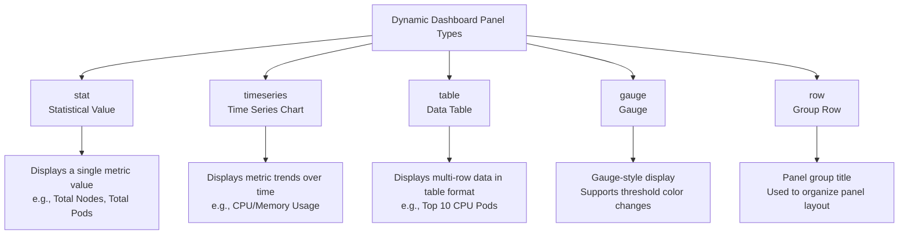
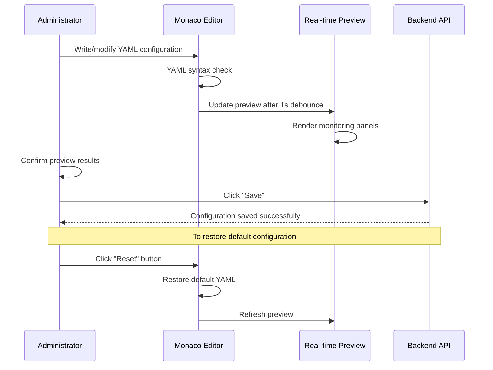

# Dynamic Dashboard

## Feature Overview

Dynamic Dashboard provides a visual cluster monitoring panel editor based on **YAML configuration**. Administrators can use the built-in Monaco code editor to write YAML configurations that define monitoring panel types, query expressions, and layouts, with **real-time preview** to instantly see the results. The system provides a default Kubernetes cluster overview configuration, and administrators can fully customize the monitoring content.

> 💡 Tip: Dynamic Dashboard is similar to the concept of a Grafana Dashboard, but uses a simpler YAML configuration approach — no additional Grafana service deployment is needed to achieve cluster monitoring visualization.

## Access Path

BOSS → Cluster Details → **Dynamic Dashboard**

Path: `/boss/rune/clusters/:cluster/dynamic-dashboard`

## Page Description


The page uses a two-column layout:

| Area | Description |
|------|-------------|
| **Left**: YAML Editor | A YAML configuration editor based on Monaco Editor with syntax highlighting and auto-indentation |
| **Right**: Real-time Preview | Monitoring panel preview rendered in real time based on the YAML configuration |

> 💡 Tip: After editor content changes, the preview area automatically updates after a **1-second (1000ms)** debounce delay to avoid frequent rendering overhead.

## YAML Editor (Monaco Editor)

### Editor Features

- **Syntax Highlighting**: YAML syntax coloring
- **Auto-Indentation**: Maintains YAML indentation structure
- **Error Hints**: Real-time annotation of YAML syntax errors
- **Real-time Preview**: Auto-refreshes preview 1 second after modifications
- **Full-screen Editing**: Supports editor area expansion


### Reset Button

The page provides a **Reset** button that restores the system default YAML configuration when clicked:

> ⚠️ Note: The reset operation overwrites all custom configurations in the current editor, restoring the default Kubernetes cluster overview configuration. This operation cannot be undone — please ensure you have backed up your custom configuration before resetting.

---

## Panel Types

Dynamic Dashboard supports the following panel types:



### stat (Statistical Value)

Displays a single aggregated value, suitable for showing the current value of key metrics.

```yaml
- title: "Total Nodes"
  type: stat
  query: "count(kube_node_info)"
```

| Property | Description |
|----------|-------------|
| title | Panel title |
| type | `stat` |
| query | Prometheus query expression |
| unit | Value unit (optional, e.g., `cores`, `bytes`) |

### timeseries (Time Series Chart)

Displays a trend line chart of metrics over time, suitable for monitoring change trends.

```yaml
- title: "Node CPU Usage"
  type: timeseries
  query: "avg(rate(node_cpu_seconds_total{mode!='idle'}[5m])) by (instance)"
```

| Property | Description |
|----------|-------------|
| title | Panel title |
| type | `timeseries` |
| query | Prometheus query expression |
| legend | Legend format (optional) |

### table (Data Table)

Displays multi-row, multi-column data in table format, suitable for leaderboard-style displays.

```yaml
- title: "Top 10 CPU Usage Pods"
  type: table
  query: "topk(10, sum(rate(container_cpu_usage_seconds_total[5m])) by (pod))"
```

| Property | Description |
|----------|-------------|
| title | Panel title |
| type | `table` |
| query | Prometheus query expression |
| columns | Column configuration (optional) |

### gauge (Gauge)

Displays in a gauge/ring chart style with threshold configuration for color changes.

```yaml
- title: "Node Disk Usage"
  type: gauge
  query: "1 - (node_filesystem_avail_bytes / node_filesystem_size_bytes)"
  thresholds:
    - value: 0.7
      color: green
    - value: 0.9
      color: yellow
    - value: 1.0
      color: red
```

| Property | Description |
|----------|-------------|
| title | Panel title |
| type | `gauge` |
| query | Prometheus query expression |
| thresholds | Threshold configuration array |

#### Threshold Configuration

Thresholds are used for color changes in gauge panels, set in ascending order:

| Threshold Range | Color | Meaning |
|-----------------|-------|---------|
| `< 70%` | 🟢 Green | Normal range |
| `70% ~ 90%` | 🟡 Yellow | Warning range |
| `≥ 90%` | 🔴 Red | Critical range |

> 💡 Tip: The `value` field in threshold configuration uses decimals to represent percentages — 0.7 means 70%, 0.9 means 90%. Colors support common color names.

### row (Group Row)

Used to group panels by displaying a title row to organize panel layout.

```yaml
- title: "Node Monitoring"
  type: row
```

---

## Default Configuration

The system provides a default **Kubernetes Cluster Overview** dashboard configuration with the following panels:

### Overview Statistics (stat panel group)

| Panel | Metric | Type |
|-------|--------|------|
| Total Nodes | Total Nodes | stat |
| Total Pods | Total Pods | stat |
| Total CPU Cores | Total CPU Cores | stat |
| Total Memory | Total Memory | stat |

### Trend Monitoring (timeseries panel group)

| Panel | Metric | Type |
|-------|--------|------|
| Node CPU Usage | CPU usage trend per node | timeseries |
| Node Memory Usage | Memory usage trend per node | timeseries |

### Leaderboard (table panel)

| Panel | Metric | Type |
|-------|--------|------|
| Top 10 CPU Usage Pods | Top 10 pods sorted by CPU usage | table |

### Health Metrics

| Panel | Metric | Type |
|-------|--------|------|
| Pod Restart Rate | Pod restart count statistics | stat |
| Node Disk Usage | Disk usage percentage per node | gauge (with thresholds) |


---

## Custom Examples

### Adding a GPU Monitoring Panel

```yaml
- title: "GPU Monitoring"
  type: row

- title: "GPU Utilization"
  type: timeseries
  query: "avg(DCGM_FI_DEV_GPU_UTIL) by (gpu, instance)"
  legend: "{{instance}} - GPU{{gpu}}"

- title: "GPU Memory Usage"
  type: gauge
  query: "DCGM_FI_DEV_FB_USED / (DCGM_FI_DEV_FB_USED + DCGM_FI_DEV_FB_FREE)"
  thresholds:
    - value: 0.7
      color: green
    - value: 0.9
      color: yellow
    - value: 1.0
      color: red
```

### Adding a Network Traffic Panel

```yaml
- title: "Network Monitoring"
  type: row

- title: "Node Network Receive Traffic"
  type: timeseries
  query: "rate(node_network_receive_bytes_total{device='eth0'}[5m])"

- title: "Node Network Transmit Traffic"
  type: timeseries
  query: "rate(node_network_transmit_bytes_total{device='eth0'}[5m])"
```

---

## Editing Flow



## Important Notes

> ⚠️ Note: The `query` field in YAML configuration uses PromQL (Prometheus Query Language) syntax. Ensure query expressions are correct and the corresponding metrics exist in the target Prometheus instance; otherwise, panels will display empty data.

> 💡 Tip: Before editing complex configurations, it is recommended to copy and save the current configuration as a backup. If editing errors cause panels to fail to render, use the **Reset** button to restore the default configuration and start customizing again.

## Permission Requirements

Requires the **System Administrator** role to edit Dynamic Dashboard configurations.
