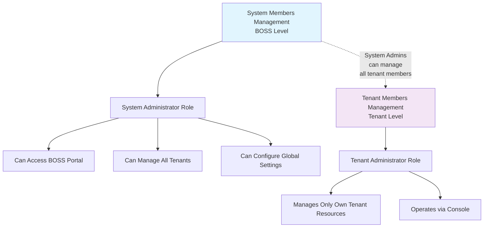
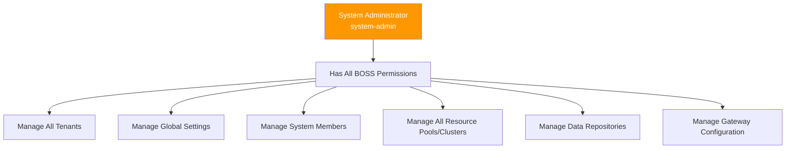
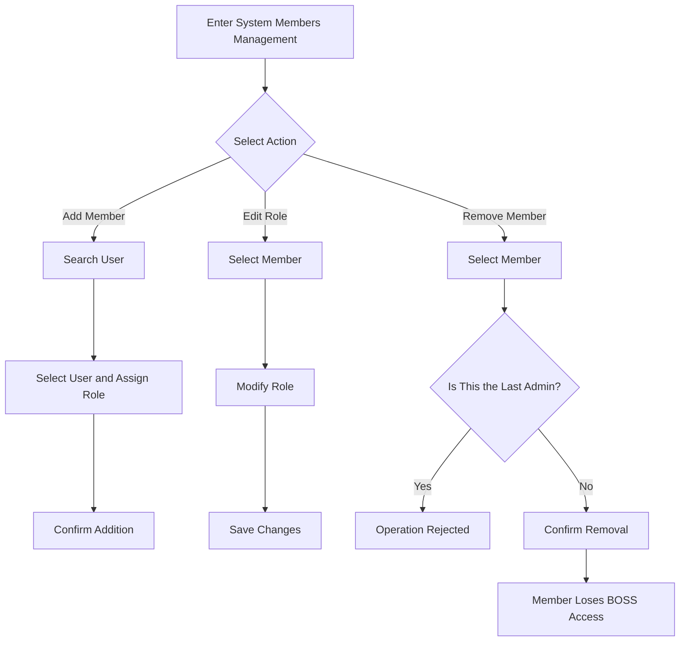

# System Members Management

## Feature Overview

System Members Management is used to maintain the list of members with **system-level administrative privileges**. These members can access the BOSS management portal and perform all platform management operations, including tenant management, resource scheduling, global configuration, and more. System Members Management is independent from tenant-level member management and represents the highest permission tier of the platform.

> 💡 Tip: System members (system administrators) have the highest platform privileges and can manage all tenants and resources. Strictly control the number and selection of system members, following the principle of least privilege.

## Access Path

BOSS → Platform Settings → **System Members**

Path: `/boss/settings/members`

## Relationship with Tenant-Level Member Management

| Dimension | System Members Management (BOSS) | Tenant Members Management (Console) |
|-----------|--------------------------------|-------------------------------------|
| Management Level | Platform-level | Tenant-level |
| Entry Point | BOSS → Platform Settings → System Members | Console → IAM → Tenant Members |
| Role Scope | System roles (e.g., system-admin) | Tenant roles (e.g., tenant-admin, member) |
| Permission Scope | All platform resources | Only own tenant resources |
| API Path | `/api/iam/members` | `/api/iam/tenants/:id/members` |

## Page Description

### Member List Table

| Column | Description | Details |
|--------|-------------|---------|
| Name | Member username | Displays user avatar and username |
| Email | Member email | The email address used during registration |
| Role | System role | Role name is displayed with i18n translation via the `role:` namespace |
| Joined At | Time of becoming a system member | Corresponds to the `creationTimestamp` (`joinedAt`) field |
| Actions | Management buttons | Edit role, Remove member |

> 💡 Tip: The Role column displays translated role names. For example, the `system-admin` role in the system is translated to the localized display name via the `role:` namespace.

## Management Operations

### Add System Member

Click the **Add Member** button and operate in the popup dialog:

1. **Search User**: Enter a username or email to search registered users
2. **Select User**: Choose the user to add from the search results
3. **Assign Role**: Select a system role for the user
4. **Confirm**: Click confirm to complete the addition

> ⚠️ Note: Only users already registered on the platform can be added as system members. To add a new user, first create a user account through BOSS → IAM → User Management.

### Edit Role

Click the **Edit** button in the member list to modify the member's system role:

1. Select a new role from the role dropdown
2. Confirm the change

Role data is retrieved via the `/api/iam/roles` endpoint for available system roles.

### Remove Member

Click the **Delete** button in the member list to display a confirmation dialog:

1. Confirm the member information to be removed
2. Click **Confirm** to complete the removal

After removing a system member:

- The user loses access to the BOSS management portal
- The user's regular account is unaffected; they can still use the platform normally via Console
- The user's roles in various tenants are unaffected

> ⚠️ Note: The system must retain at least **one system administrator**. Attempting to remove the last system administrator will be rejected.

## Role Hierarchy

> 💡 Tip: Currently, System Members Management primarily manages the "System Administrator" role. Future versions may introduce more granular system roles (such as a read-only audit role), at which point the role hierarchy will become richer.

## API Endpoints

| Endpoint | Method | Description |
|----------|--------|-------------|
| `/api/iam/members` | `GET` | Get system member list |
| `/api/iam/members` | `POST` | Add system member |
| `/api/iam/members/:id` | `PUT` | Modify member role |
| `/api/iam/members/:id` | `DELETE` | Remove system member |
| `/api/iam/roles` | `GET` | Get available system roles |

## Best Practices

1. **Principle of Least Privilege**: Only assign the system administrator role to essential personnel
2. **Regular Review**: Periodically review the system member list and remove those who no longer need administrative access
3. **At Least Two Members**: It is recommended to maintain at least two system administrators to avoid platform management lockout if one becomes unavailable
4. **Track Changes**: Use audit logs to track the addition and removal of system members

## Member Management Flow

## FAQ

| Issue | Solution |
|-------|----------|
| Cannot remove the last administrator | The system enforces at least one administrator; add a new administrator before removing the current one |
| Cannot find user to add | Confirm the user is registered on the platform, or create the account through User Management first |
| Member role displayed in English | Check if the `role:` namespace translation configuration is complete |

## Permission Requirements

Requires the **System Administrator** role to access the System Members Management page.

> ⚠️ Note: System Members Management itself also requires system administrator privileges. Ensure at least one trusted administrator holds this permission to avoid loss of administrative access.
