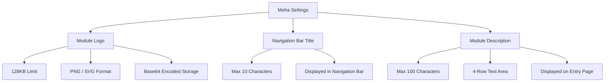

# Moha Settings

## Feature Overview

Moha Settings is used to customize the branding of the **Moha Model Hub** subsystem, including the module Logo, navigation bar title, and module description. Its configuration structure is identical to Rune Settings. Configuration is saved under the `config.moha` namespace and changes are immediately reflected in the Moha module's navigation bar and entry page.

> 💡 Tip: Moha Settings, Rune Settings, and ChatApp Settings share the same configuration structure but are saved in separate namespaces without affecting each other.

## Access Path

BOSS → Platform Settings → **Moha Settings**

Path: `/boss/settings/moha`

## Page Description


## Configuration Items

### Module Logo

| Property | Description |
|----------|-------------|
| Field Name | `logo` |
| File Size Limit | Maximum **128KB** |
| Encoding | **Base64** encoded storage |
| Supported Formats | **PNG**, **SVG** |
| Purpose | Displayed in the Moha module's navigation bar and entry page |

Steps:

1. Click the Logo upload area
2. Select a local PNG or SVG file (no larger than 128KB)
3. Preview the Logo effect
4. Confirm and click **Save**

> ⚠️ Note: The module Logo is stored directly in the configuration database as Base64 with a 128KB size limit. Please use SVG vector format or compressed PNG to control file size.

### Navigation Bar Title

| Property | Description |
|----------|-------------|
| Field Name | `navbar_title` |
| Maximum Length | **10 characters** |
| Purpose | Title text displayed next to the Logo in the Moha module navigation bar |

The default value is "Moha". Administrators can customize it to match the organization or product name, such as "Model Hub", "AI Asset Library", etc.

### Module Description

| Property | Description |
|----------|-------------|
| Field Name | `description` |
| Maximum Length | **100 characters** |
| Input Rows | **4-row** text area |
| Purpose | Introductory text displayed on the Moha module's entry page or about page |

The description text explains the Moha module's purpose, for example: "Moha Model Hub provides enterprise-grade model, dataset, and image hosting services..."

## Configuration Storage

All Moha settings are saved under the `config.moha` namespace:

```yaml
# config.moha namespace
logo: "data:image/svg+xml;base64,PHN2ZyB..."    # Base64 encoded Logo
navbar_title: "Moha"                              # Navigation bar title
description: "Moha Model Hub provides..."         # Module description
```

## Settings Effect Preview

After saving, the following locations in the Moha module are affected:

| Display Location | Affected Configuration |
|------------------|----------------------|
| Top-left of navigation bar | Logo + Navigation bar title |
| Module entry homepage | Logo + Description |
| Browser tab | Navigation bar title (as tab prefix) |
| Platform module switch menu | Logo + Navigation bar title |


> 💡 Tip: After saving changes, users who already have the Moha module open need to refresh the page to see the latest configuration.

## Steps

1. Navigate to BOSS → Platform Settings → Moha Settings
2. Modify the Logo, title, and description as needed
3. Preview the changes on the page
4. Click the **Save** button to submit changes
5. Confirm changes have taken effect (refresh the Moha module page to verify)

> ⚠️ Note: Logo files exceeding 128KB will be rejected. SVG format is recommended as it is typically only a few KB in size and displays clearly at all resolutions.

## Configuration Structure Overview



## FAQ

| Issue | Solution |
|-------|----------|
| Logo upload failed | Check if file size exceeds 128KB and if the format is PNG or SVG |
| Title truncated | Reduce character count to 10 or fewer |
| Changes not taking effect | Confirm you clicked Save, then refresh the Moha module page |
| Logo appears blurry | Consider using SVG vector format instead of PNG |

## Permission Requirements

Requires the **System Administrator** role to access the Moha Settings page.
