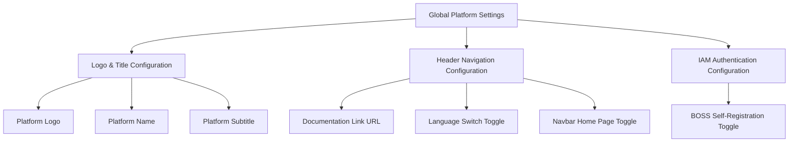
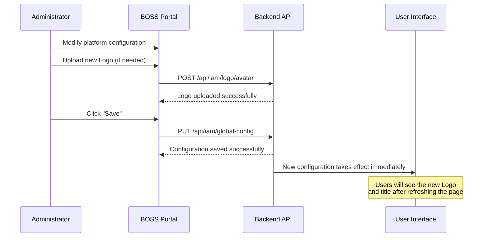

# Global Platform Settings

## Feature Overview

Global Platform Settings is the core configuration page of the BOSS management portal. Administrators can customize the platform's branding (Logo, name, subtitle), header navigation behavior, IAM authentication policies, and other global parameters. All settings take effect immediately across all user interfaces upon saving.

> 💡 Tip: Modifications to platform settings affect the interface experience for all users. Please confirm your changes before saving. Some configurations may require users to refresh the page to see the effects.

## Access Path

BOSS → Platform Settings → **Platform Settings**

Path: `/boss/settings/platform`

## Settings Structure Overview



## Page Description


---

## Logo & Title Configuration (LogoAndTitleConfig)

Logo & Title Configuration controls the platform's branding, including content displayed on the login page, navigation bar, and browser tab.

### Platform Logo

| Property | Description |
|----------|-------------|
| File Size Limit | Maximum **3MB** |
| Supported Formats | **PNG**, **SVG** |
| Upload Method | Click the upload area to select a file; supports cropping adjustment |
| API Endpoint | `POST /api/iam/logo/avatar` |

Steps:

1. Click the Logo upload area
2. Select a local PNG or SVG file (no larger than 3MB)
3. Adjust the Logo display area in the cropping dialog
4. Confirm the crop and click **Save**


> ⚠️ Note: It is recommended to use PNG or SVG format with a transparent background to ensure good display across different themes (light/dark).

### Platform Name

| Property | Description |
|----------|-------------|
| Field Name | `title` |
| Maximum Length | **10 characters** |
| Purpose | Displayed next to the Logo in the navigation bar and in the browser tab title |

### Platform Subtitle

| Property | Description |
|----------|-------------|
| Field Name | `subTitle` |
| Maximum Length | **10 characters** |
| Purpose | Displayed as descriptive text below the Logo on the login page |

> 💡 Tip: The character limit for name and subtitle is 10 characters. Chinese characters also count as 1 character each. Keep the name concise and impactful.

---

## Header Navigation Configuration (HeaderConfig)

Header Navigation Configuration controls the behavior and feature toggles of the platform's top navigation bar.

### Documentation Link URL

| Property | Description |
|----------|-------------|
| Field Name | `documentUrl` |
| Type | URL text input |
| Purpose | Sets the URL that the **Help Documentation** button in the navigation bar links to |

When users click the documentation/help icon in the navigation bar, this URL opens in a new tab. Leave empty to hide the help button.

### Language Switch Toggle

| Property | Description |
|----------|-------------|
| Field Name | `enableLanguageSwitch` |
| Type | Switch |
| Default | Enabled |
| Purpose | Controls whether the language switch button (Chinese/English) is displayed in the navigation bar |

> 💡 Tip: If the platform is intended only for Chinese-speaking users, you can disable the language switch to simplify the interface.

### Navbar Home Page Toggle

| Property | Description |
|----------|-------------|
| Field Name | `enableNavbarIndex` |
| Type | Switch |
| Default | Enabled |
| Purpose | Controls whether the navigation bar displays the Home (Index) entry |

---

## IAM Authentication Configuration (IamConfig)

IAM Authentication Configuration controls the platform's identity authentication policies.

### BOSS Self-Registration Toggle

| Property | Description |
|----------|-------------|
| Field Name | `enableBossSignup` |
| Type | Switch |
| Default | Disabled |
| Purpose | Controls whether users can self-register accounts through the registration page |

> ⚠️ Note: In enterprise private deployment scenarios, it is recommended to disable self-registration and have administrators manually create user accounts to ensure security and control.

---

## API Endpoints

| Endpoint | Method | Description |
|----------|--------|-------------|
| `/api/iam/global-config` | `PUT` | Save all platform configurations (title, header config, IAM config) |
| `/api/iam/logo/avatar` | `POST` | Upload platform Logo file (form upload) |

### Request Example

```json
// PUT /api/iam/global-config
{
  "title": "AI Platform",
  "subTitle": "Smart Computing",
  "documentUrl": "https://docs.example.com",
  "enableLanguageSwitch": true,
  "enableNavbarIndex": true,
  "enableBossSignup": false
}
```

---

## Change Application Flow



## Permission Requirements

Requires the **System Administrator** role to access the Global Platform Settings page.

> 💡 Tip: Platform settings affect the common parts of all subsystems (Rune, Moha, ChatApp). Subsystem-specific configurations should be managed in their respective module settings.
