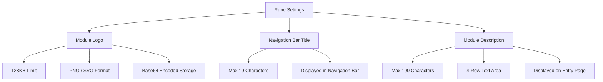

# Rune Settings

## Feature Overview

Rune Settings is used to customize the branding of the **Rune AI Workbench** subsystem, including the module Logo, navigation bar title, and module description. Configuration is saved under the `config.rune` namespace and changes are immediately reflected in the Rune module's navigation bar and entry page.

> 💡 Tip: Rune Settings is independent from Global Platform Settings. Global settings control the branding for the entire platform, while Rune Settings only affects the Rune AI Workbench module itself.

## Access Path

BOSS → Platform Settings → **Rune Settings**

Path: `/boss/settings/rune`

## Page Description


## Configuration Items

### Module Logo

| Property | Description |
|----------|-------------|
| Field Name | `logo` |
| File Size Limit | Maximum **128KB** |
| Encoding | **Base64** encoded storage |
| Supported Formats | **PNG**, **SVG** |
| Purpose | Displayed in the Rune module's navigation bar and entry page |

Steps:

1. Click the Logo upload area
2. Select a local PNG or SVG file (no larger than 128KB)
3. Preview the Logo effect
4. Confirm and click **Save**

> ⚠️ Note: The Rune module Logo size limit (128KB) is much smaller than the global platform Logo (3MB), because the module Logo is stored directly in the configuration database as Base64. Overly large files will affect configuration loading performance.

### Navigation Bar Title

| Property | Description |
|----------|-------------|
| Field Name | `navbar_title` |
| Maximum Length | **10 characters** |
| Purpose | Title text displayed next to the Logo in the Rune module navigation bar |

The default value is "Rune". Administrators can customize it to match the organization or product name, such as "AI Compute Platform", "Smart Computing Center", etc.

### Module Description

| Property | Description |
|----------|-------------|
| Field Name | `description` |
| Maximum Length | **100 characters** |
| Input Rows | **4-row** text area |
| Purpose | Introductory text displayed on the Rune module's entry page or about page |

The description text explains the Rune module's purpose and functionality to users.

## Configuration Storage

All Rune settings are saved under the `config.rune` namespace:

```yaml
# config.rune namespace
logo: "data:image/png;base64,iVBORw0KGgo..."   # Base64 encoded Logo
navbar_title: "Rune"                             # Navigation bar title
description: "Rune AI Workbench provides..."     # Module description
```

## Settings Effect Preview

After saving, the following locations in the Rune module are affected:

| Display Location | Affected Configuration |
|------------------|----------------------|
| Top-left of navigation bar | Logo + Navigation bar title |
| Module entry page | Logo + Description |
| Browser tab | Navigation bar title (as tab prefix) |


> 💡 Tip: After saving changes, users who already have the Rune module open need to refresh the page to see the latest configuration. Users opening the page anew will see the updated content directly.

## Steps

1. Navigate to BOSS → Platform Settings → Rune Settings
2. Modify the Logo, title, and description as needed
3. Preview the changes on the page
4. Click the **Save** button to submit changes
5. Confirm changes have taken effect (refresh the Rune module page to verify)

> ⚠️ Note: If the uploaded Logo file exceeds 128KB, the system will display an error and reject the upload. Please compress the image in advance or use SVG vector format to control file size.

## Configuration Structure Overview



## FAQ

| Issue | Solution |
|-------|----------|
| Logo upload failed | Check if file size exceeds 128KB and if the format is PNG or SVG |
| Title truncated | Reduce character count to 10 or fewer |
| Changes not taking effect | Confirm you clicked Save, then refresh the Rune module page |

## Permission Requirements

Requires the **System Administrator** role to access the Rune Settings page.
