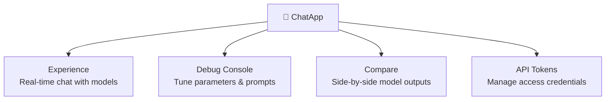
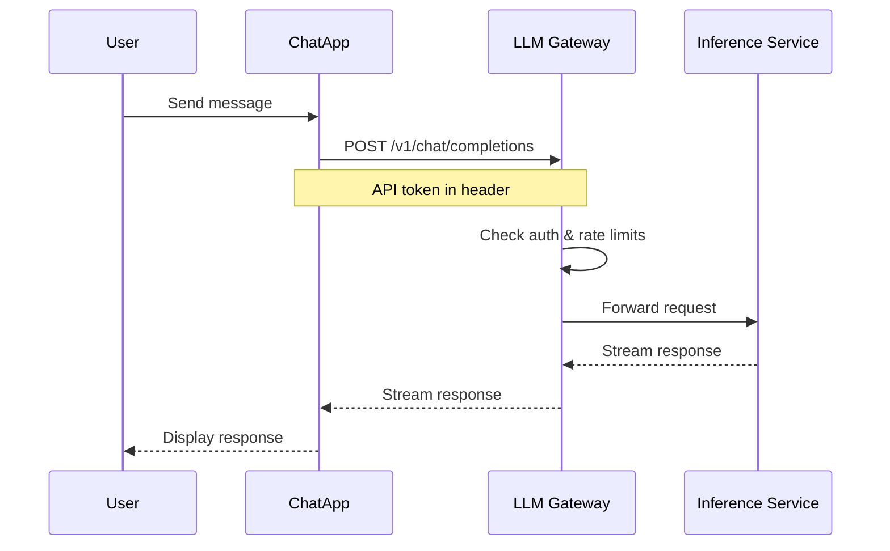

# ChatApp Overview

## What is ChatApp?

**ChatApp** is the chat experience sub-product of Rune Console. It provides a polished interface for interacting with AI models deployed on the platform — whether for production use, debugging, or multi-model comparison.

## Navigation

**Console Home → ChatApp**

## Module Map

## Sub-modules

| Module | Description |
|--------|-------------|
| [Experience](./experience.md) | Full-featured chat interface — conversations, history, attachments |
| [Debug](./debug.md) | Developer-focused console with parameter controls and raw API view |
| [Compare](./compare.md) | Send the same prompt to multiple models simultaneously and compare responses |
| [API Tokens](./token.md) | Create and manage API tokens for programmatic ChatApp access |

## How ChatApp Connects to Models

ChatApp routes messages through the **LLM Gateway** (`/api/airouter`). The gateway maintains a list of configured **channels** (model backends) and handles authentication, routing, and audit logging.

## Available Models

The models available in ChatApp are determined by the channels configured in **BOSS → LLM Gateway → Channels**. If a model doesn't appear, ask your System Admin to add it as a channel.

## Getting Started

1. Click **ChatApp** on the Console home page.
2. Select a model from the model dropdown.
3. Type your message and press Enter or click Send.

For detailed guidance, see:
- [Chat Experience](./experience.md)
- [Debug Console](./debug.md)
- [Model Comparison](./compare.md)
