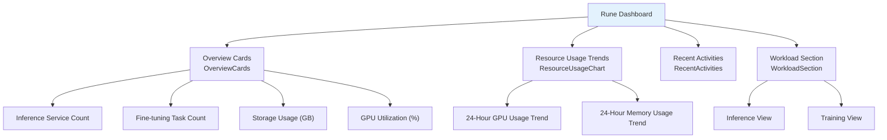

# Home & Dashboard

## Home Page

The Console home page is the first page users see after logging in. It displays prominent carousel cards showcasing the three sub-product entry points, helping users quickly navigate to their target modules.

### Sub-Product Entry Points

| Card | Description | On Click |
|------|-------------|----------|
| **Rune** | AI Workbench — Full pipeline for inference, fine-tuning, development, deployment | Enter Rune Dashboard |
| **Moha** | Model Hub — Model, dataset, image, Space management | Enter Moha Home |
| **ChatApp** | Conversation Experience — AI chat, debugging, evaluation | Enter ChatApp Chat Page |

---

## Rune Dashboard

The default page after entering the Rune Workbench, providing a global resource overview and runtime status monitoring for the current workspace.

**Navigation Path**: Home → Rune → Auto-redirect to Dashboard, or Left Navigation → Dashboard

### Dashboard Component Architecture

---

### Overview Cards (OverviewCards)

The dashboard header displays **4 overview cards** with large numbers and icons for intuitive key metrics:

| Card | Metric | Description | Interaction |
|------|--------|-------------|-------------|
| 🔮 Inference Services | Inference instance count | Total number of running inference services in the current workspace | Click to navigate to inference service list |
| 🔧 Fine-tuning Tasks | Fine-tuning instance count | Total number of running and completed fine-tuning tasks | Click to navigate to fine-tuning service list |
| 💾 Storage Usage | Used GB | Persistent storage usage of the workspace | Click to navigate to storage volume management |
| 🎮 GPU Utilization | Percentage (%) | Current GPU quota utilization of the workspace | Click to navigate to quota page |

> 💡 Tip: The overview card data scope is affected by the currently selected workspace and cluster context. After switching workspaces, card data will automatically refresh.

---

### Resource Usage Trend Chart (ResourceUsageChart)

Displays resource usage trends over the past **24 hours** in area chart format:

| Chart | Data Source | Display |
|-------|------------|---------|
| GPU Usage Trend | Prometheus metrics | Blue area chart, Y-axis shows utilization percentage |
| Memory Usage Trend | Prometheus metrics | Green area chart, Y-axis shows usage in GiB |

**Chart Features**:

- Time span: Last 24 hours
- Data granularity: One data point every 5 minutes
- Hover: Shows exact values at specific time points
- Zoom support: Select a region to zoom into a specific time period
- Dual Y-axis: GPU utilization and memory usage use independent Y-axes

> ⚠️ Note: The resource usage trends only show resource usage within the current workspace scope. To view tenant or cluster-level global resource trends, please go to the BOSS dashboard.

---

### Recent Activities (RecentActivities)

Displays recent instance activity records created or with status changes in the workspace in table format:

| Column | Description | Example |
|--------|-------------|---------|
| Name | Instance name, click to navigate to details | `llama3-70b-chat` |
| Type | Instance type | Inference / Fine-tuning / Dev / App |
| User | Operator username | `zhang.san` |
| Status | Current running status | 🟢 running / ✅ completed / 🔴 failed / ⏳ pending |
| Time | Last activity time | `2 minutes ago` |

#### Activity Status Description

| Status | Meaning | Color |
|--------|---------|-------|
| running | Instance is running | 🟢 Green |
| completed | Task completed (typically for fine-tuning tasks) | ✅ Gray/Blue |
| failed | Instance execution failed | 🔴 Red |
| pending | Instance waiting for resource scheduling | ⏳ Yellow |

---

### Workload Section (WorkloadSection)

Displays detailed runtime metrics for inference services and training tasks across two dimensions, with view switching support.

#### Inference View

| Metric | Description | Display Format |
|--------|-------------|---------------|
| Request Success Rate | Success rate percentage of inference API requests | Ring progress bar |
| Average Latency | Average response time (ms) of inference requests | Value + trend arrow |
| Active Services | List of running inference services | Service list + health bar |
| 7-Day Request Trend | Request volume changes over the last 7 days | Line chart |

**Active Service Health Bar** description:

- 🟢 Green segment: Healthy replicas
- 🔴 Red segment: Unhealthy replicas
- Proportional display intuitively shows the health level of each inference service

#### Training View

| Metric | Description | Display Format |
|--------|-------------|---------------|
| Training Success Rate | Successful completion rate of fine-tuning tasks | Ring progress bar |
| Active Tasks | Number of currently running fine-tuning tasks | Value |
| GPU Hours | Consumed GPU compute hours | Value (GPU·hours) |
| Task List | Running and recently completed training tasks | Status list |

---

## Instance Monitoring Panel

Each Instance's detail page provides a **Prometheus/Grafana-style monitoring panel** displaying various runtime metrics.

### Panel Types

The monitoring panel supports multiple visualization component types:

| Panel Type | Description | Typical Use |
|-----------|-------------|-------------|
| timeseries | Time series charts | CPU utilization trends, request volume trends |
| gauge | Gauge/dial | Current CPU/memory usage ratio |
| stat | Single value statistic | Current total requests, online Pod count |
| bargauge | Horizontal/vertical bar gauge | Multi-node resource usage comparison |
| graph | Line chart / area chart | Multi-metric time series comparison |
| table | Data table | Detailed metric data listing |
| heatmap | Heat map | Request latency distribution |
| piechart | Pie chart | Resource proportion distribution |
| text | Plain text | Panel titles, description text |
| row | Row grouping | Panel row separator |
| singlestat | Single value (legacy) | Legacy panel compatibility |
| logs | Log panel | Embedded log viewing |
| trace | Trace | Request trace analysis |
| dashlist | Dashboard list | Sub-panel navigation |
| alertlist | Alert list | Alert rules and trigger records |

### Monitoring Panel API

| API | Description |
|-----|-------------|
| Panel List | Get all monitoring panels associated with an instance (built-in + dynamic) |
| Panel Query | Query data for a specified panel, render panels based on Prometheus data source |
| Panel Parameters | Get available template variables and parameters for a panel |
| Instance Metrics | Get instance-level Prometheus metrics |

> 💡 Tip: Monitoring panel data comes from the Prometheus time-series database. Panels support time range selection and auto-refresh, allowing you to look back at historical data for troubleshooting.

---

## Cluster-Level Dashboard

On the BOSS side, platform administrators can access cluster-level dashboards providing a global perspective on resource monitoring:

| Dashboard Type | Description |
|---------------|-------------|
| Built-in Dashboard | Platform-preset standard monitoring panels covering cluster health, resource usage, etc. |
| Dynamic Dashboard | Custom panels configured by admins via BOSS Settings → Dynamic Dashboard |

Cluster-level panels typically include:

- **Cluster Resource Overview**: Total, used, and available CPU/GPU/memory/storage
- **Node Status**: Health status and load of each node
- **Tenant Distribution**: Resource usage proportion by tenant
- **Alert Information**: Currently active alert rules and trigger history

---

## Permission Requirements

| Feature | Required Role |
|---------|--------------|
| View Console Home | ALL |
| View Rune Dashboard | ALL |
| View Overview Cards / Trend Charts | ALL |
| View Workload Section | ADMIN / DEVELOPER |
| View Instance Monitoring Panel | ADMIN / DEVELOPER |
| View Cluster-Level Dashboard | Platform Admin (BOSS side) |
