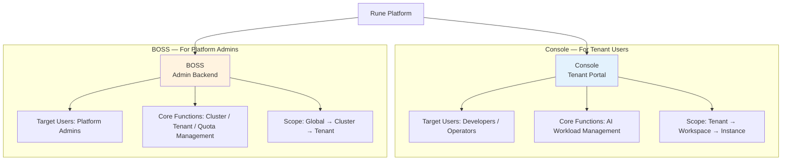

# Console Overview

## Introduction

**Console** is the tenant portal of the Rune platform, designed for workspace operators, AI engineers, and developers. It provides comprehensive AI workload management capabilities, model asset management, and AI conversation experiences. Console is the primary entry point for users' daily interaction with the Rune platform, covering the complete AI engineering lifecycle from model development, training, deployment, to operations.

### Dual Control Panel Architecture

The Rune platform adopts a **Console + BOSS dual control panel** architecture, serving different user groups:

| Comparison | Console (Tenant Portal) | BOSS (Admin Backend) |
|-----------|------------------------|---------------------|
| Target Users | Tenant admins, developers, regular members | Platform admins (super admins) |
| Access Scope | Resources within own tenant | Resources across all tenants and clusters |
| Core Responsibilities | AI workload operations (inference, fine-tuning, deployment, etc.) | Cluster management, tenant configuration, quota allocation, gateway management |
| Resource Management | Workspace-level quota usage and member management | Cluster-level resource pools and tenant-level quota allocation |
| Observability | Instance-level and workspace-level monitoring/logging | Cluster-level global monitoring and logging |

## Feature Architecture

```mermaid
graph TB
    Console["Console Tenant Portal"]

    Console --> Rune["🧠 Rune AI Workbench"]
    Console --> Moha["📦 Moha Model Hub"]
    Console --> ChatApp["💬 ChatApp Conversation"]
    Console --> IAM["👤 Personal Center"]

    Rune --> R1["Inference Services"]
    Rune --> R2["Fine-tuning Services"]
    Rune --> R3["Dev Environments"]
    Rune --> R4["App Management"]
    Rune --> R5["Experiments/Evaluations"]
    Rune --> R6["Storage/Logs/Market"]
    Rune --> R7["Workspaces/Quotas/Flavors"]

    Moha --> M1["Model Management"]
    Moha --> M2["Datasets"]
    Moha --> M3["Image Registry"]
    Moha --> M4["Space Apps"]

    ChatApp --> C1["Conversation Experience"]
    ChatApp --> C2["Model Debug/Compare"]
    ChatApp --> C3["Token Usage Stats"]

    IAM --> I1["Profile/Security"]
    IAM --> I2["API Key / SSH Key"]
    IAM --> I3["Tenant Switch/Theme"]
```

---

## Home Page

After logging in, the home page displays three sub-product entries in a carousel format, helping users quickly navigate:

- **Rune** — Enter the AI Workbench to manage AI workloads such as inference/fine-tuning/development/applications
- **Moha** — Enter the Model Hub to manage AI assets such as models, datasets, and images
- **ChatApp** — Enter the Conversation Experience to interact with deployed AI models for chat and debugging

---

## Sub-Platform Feature Overview

### Rune AI Workbench

Rune is the most feature-rich core module in Console, providing comprehensive AI workload management:

| Feature | Description |
|---------|-------------|
| Inference Services | Deploy trained models as online API services, supporting inference engines like vLLM |
| Fine-tuning Services | Perform domain-specific fine-tuning on pre-trained models |
| Dev Environments | Launch Jupyter Notebook / VS Code interactive development environments |
| App Management | Deploy various AI applications (data labeling, visualization, etc.) |
| Experiment Management | Deploy experiment tracking services such as MLflow / Aim |
| Evaluation Management | Model performance benchmarking |
| Storage Volumes | Manage persistent storage volumes (PVC) |
| Logs | Workload log querying and real-time streaming |
| App Market | Browse and manage Helm Chart deployment templates |
| Workspaces | Resource isolation unit management and member management |
| Quotas/Flavors | View resource quotas and compute flavor specifications |

### Moha Model Hub

Moha is a unified management platform for AI assets:

| Feature | Description |
|---------|-------------|
| Model Management | Upload, version, and share AI models |
| Dataset Management | Upload, version, and share training datasets |
| Image Registry | Manage Docker images |
| Space Apps | Build and share demo applications based on models |
| Organization Management | Manage organizations for models and datasets |

### ChatApp Conversation Experience

ChatApp is a debugging and experience platform for AI conversation scenarios:

| Feature | Description |
|---------|-------------|
| Conversation Experience | Interactive conversations with deployed AI models |
| Model Debugging | Adjust inference parameters (temperature, Top-P, etc.) and observe output changes |
| Model Comparison | Converse with multiple models simultaneously and compare output quality |
| Token Usage | Track token consumption in conversations |

### Personal Center (IAM)

Personal account management and security settings:

| Feature | Description |
|---------|-------------|
| Profile | View and edit user information |
| Security Settings | Change password, MFA configuration |
| API Key | Manage API access keys |
| SSH Key | Manage SSH public keys |
| Tenant Switch | Switch between different tenants |
| Theme Settings | Light/dark theme toggle |

---

## Top Navigation

The Console top navigation bar contains the following elements:

| Element | Position | Description |
|---------|----------|-------------|
| Logo | Left | Platform logo, click to return to home page |
| Sub-product Links | Left | Quick switch between Rune / Moha / ChatApp |
| Search | Right | Global resource search |
| Language Switch | Right | Chinese / English toggle |
| Theme Switch | Right | Light / Dark theme toggle |
| Account Menu | Right | Personal center, switch tenant, logout |

---

## Typical User Workflows

The following are typical operation flows for different user roles in Console:

```mermaid
flowchart TB
    subgraph "Tenant Admin"
        A1["Create Workspace"] --> A2["Allocate Quotas"]
        A2 --> A3["Add Members"]
        A3 --> A4["Configure Permissions"]
    end

    subgraph "AI Engineer"
        B1["Select Workspace"] --> B2["Upload Models/Data to Moha"]
        B2 --> B3["Launch Dev Environment<br/>Write Training Code"]
        B3 --> B4["Submit Fine-tuning Task"]
        B4 --> B5["Review Experiment Results"]
        B5 --> B6["Run Model Evaluation"]
        B6 --> B7{Evaluation Passed?}
        B7 -->|No| B4
        B7 -->|Yes| B8["Deploy as Inference Service"]
    end

    subgraph "App Developer"
        C1["Browse Inference Service API"] --> C2["Get API Endpoint"]
        C2 --> C3["Integrate into Business System"]
        C3 --> C4["Debug via ChatApp"]
    end

    subgraph "Operations Staff"
        D1["View Dashboard"] --> D2["Monitor Service Status"]
        D2 --> D3["Troubleshoot Logs"]
        D3 --> D4["Manage Quotas"]
    end
```

---

## Permission System

The Console portal requires users to belong to at least one tenant. Different roles have access to different features:

| Role | Visible Features | Management Permissions |
|------|-----------------|----------------------|
| Tenant Admin | All features | Workspace management, member management, quota management |
| Developer | Inference/Fine-tuning/Dev/Apps/Experiments/Evaluations/Storage/Logs/Market | Create, edit, start/stop, delete instances |
| Regular Member | List and detail views | View only, no editing permissions |

> 💡 Tip: Role permissions are managed at the workspace level. The same user can have different roles in different workspaces. For example, a user may be a DEVELOPER in the development workspace but only a MEMBER in the production workspace.

---

## Sub-Product Documentation

- [Rune AI Workbench](./rune/) — Full lifecycle management of AI workloads
- [Moha Model Hub](./moha/) — Model and data asset management
- [ChatApp Conversation Experience](./chatapp/) — AI conversation debugging and experience
- [Personal Center](./iam/profile.md) — Account settings and security management
- [Home & Dashboard](./dashboard.md) — Detailed documentation of home page and dashboard features
