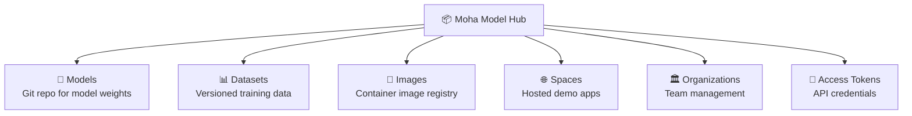
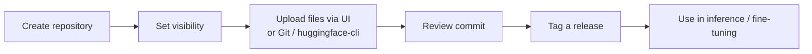

# Moha Model Hub Overview

## What is Moha?

**Moha** is the Model Hub sub-product of Rune Console. It provides a HuggingFace-style repository management system for AI assets — models, datasets, container images, and Space applications. All assets are version-controlled using Git, enabling reproducible and auditable AI workflows.

## Navigation

**Console Home → Moha** or directly via the left navigation.

## Module Overview

## Key Concepts

| Concept | Description |
|---------|-------------|
| **Repository** | A Git-based storage unit for a model, dataset, or Space. Contains files, commits, branches, and tags. |
| **Organization** | A group of users that can collectively own repositories. |
| **Namespace** | The owner prefix of a repository (user or organization username). |
| **Commit** | A versioned snapshot of repository files. |
| **Branch** | A named line of development (default: `main`). |
| **Tag** | An immutable pointer to a specific commit (used for releases). |
| **Access Token** | A personal or organization-level API credential for CLI and SDK access. |

## Common Workflows

### Upload a Model

### Use a Model in Rune

1. Upload model files to a Moha model repository.
2. In the Rune workbench, create an inference service or fine-tuning job.
3. Set environment variables to point to the model path in the mounted storage volume, or configure the template to pull from Moha's Git URL.

## Sub-modules

| Module | Path | Description |
|--------|------|-------------|
| [Models](./model.md) | Moha → Models | Manage AI model repositories |
| [Datasets](./dataset.md) | Moha → Datasets | Manage training and evaluation datasets |
| [Images](./image.md) | Moha → Images | Manage container images |
| [Spaces](./space.md) | Moha → Spaces | Host demo applications |
| [Organizations](./organization.md) | Moha → Organizations | Manage teams and shared ownership |
| [Access Tokens](./token.md) | Moha → Tokens | Manage API access credentials |
