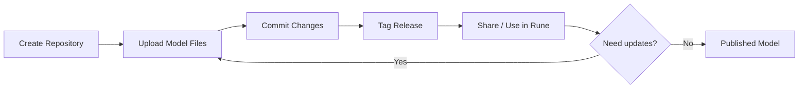

# Model Management

## Overview

The Models module provides a Git-based repository system for managing AI model weights, configuration files, and documentation. Each model is stored as a versioned repository that can be accessed via the web UI, Git CLI, or the `huggingface-hub` SDK.

## Navigation

**Console → Moha → Models**

## Model List


| Column | Description |
|--------|-------------|
| Name | `namespace/model-name` format; click to open the repository |
| Visibility | Public / Private |
| Last Commit | Most recent commit message and timestamp |
| Downloads | Download count |
| Stars | Community star count |

### Filtering

- Search by name or namespace
- Filter by visibility (public / private / organization-owned)
- Sort by last updated, most downloaded, or most starred

## Creating a Model Repository

1. Click **New Model** in the top-right corner.
2. Fill in the repository details.
3. Click **Create**.

### Configuration Fields

| Field | Type | Required | Description |
|-------|------|----------|-------------|
| Owner | Select | ✅ | Your personal namespace or an organization |
| Name | Text | ✅ | Repository name (letters, numbers, hyphens only) |
| Description | Textarea | — | Short description of the model |
| Visibility | Radio | ✅ | Public (visible to all) or Private |
| License | Select | — | Open-source license identifier |
| Model Type | Select | — | Language model / Vision / Audio / Multimodal |

## Repository Page

### File Browser

The **Files** tab shows all files in the repository:

- Click a file to preview its contents
- Use **Upload Files** to add new files via drag-and-drop
- Use the **...** menu to rename, delete, or download files
- Large binary files (model weights) are stored using Git LFS

### Commit History

The **Commits** tab shows the full commit history:

| Column | Description |
|--------|-------------|
| Commit Message | Description of the change |
| Author | Who made the commit |
| Date | Commit timestamp |
| SHA | Short commit hash |

### Model Lifecycle



## Accessing via Git CLI

```bash
# Clone a repository
git clone https://rune.develop.xiaoshiai.cn/moha/username/model-name.git

# Or via SSH (requires SSH key in IAM → SSH Keys)
git clone git@rune.develop.xiaoshiai.cn:username/model-name.git
```

## Accessing via huggingface-hub SDK

```python
from huggingface_hub import snapshot_download, login

login(token="your-moha-access-token")
snapshot_download(
    repo_id="username/model-name",
    endpoint="https://rune.develop.xiaoshiai.cn/api/moha"
)
```

## Permissions

| Action | Required Role |
|--------|--------------|
| View public models | Anyone |
| View private models | Repository members |
| Create / upload | Developer or Admin |
| Delete | Admin or repository owner |
