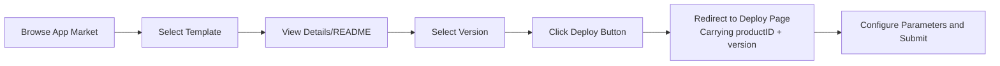

# App Market

## Feature Overview

The App Market is the template center of the Rune platform, providing a rich collection of pre-built product templates covering various scenarios including inference deployment, fine-tuning training, dev environments, experiment management, and general applications. Users can browse, search, and filter templates, view detailed documentation and version information, and jump to the deployment page with one click.

### Core Capabilities

- **Multi-Dimensional Filtering**: Supports locating templates through category, tag, and keyword multi-dimensional filtering
- **Responsive Card Display**: Templates are displayed in intuitive card grid layout, adaptive to screen width
- **Detailed Documentation**: Each template provides complete README.md documentation, version list, and changelog
- **One-Click Deployment**: Jump directly from the template detail page to the deployment page, automatically carrying product ID and version information

## Navigation Path

Rune Workbench → Left Navigation → **App Market**

---

## Browse Templates

The App Market uses the **ProductListView** component for display, providing an intuitive template browsing experience.

### Template Cards

Each template is displayed as a card containing the following information:

| Field | Description |
|-------|-------------|
| Icon | Template icon/logo |
| Name | Template product name |
| Summary | Brief template description (1-2 lines) |
| Category | Classification label (e.g., inference, fine-tuning, etc.) |
| Tags | Technical tags (e.g., PyTorch, vLLM, etc.) |
| Version | Latest version number |

### Category Filtering

Click the category tabs at the top of the page to filter templates by product category:

| Category | Identifier | Description | Typical Templates |
|----------|-----------|-------------|-------------------|
| Inference | `inference` | Model inference deployment templates | vLLM, TGI, Triton |
| Fine-tuning | `tune` | Model fine-tuning training templates | LLaMA-Factory, Swift |
| Dev Environment | `im` | Interactive dev environment templates | JupyterLab, VSCode Server |
| Experiment | `experiment` | Experiment management and evaluation templates | MLflow, WandB |
| Application | `app` | General application templates | ChatBot, API Service |

> 💡 Tip: Category filtering and tag filtering can be used in combination. For example, select the "Inference" category + "vLLM" tag to quickly locate vLLM inference-related templates.

### Tag Filtering

Further refine filtering through technical tags:

| Tag Category | Available Values | Description |
|-------------|-----------------|-------------|
| Language | Python, Java, Go, Node.js | Programming language used by the template |
| Framework | PyTorch, TensorFlow, vLLM, Transformers | Dependent AI framework |
| OS | Ubuntu, CentOS, Debian | Base image operating system |
| Tool | JupyterLab, VSCode, Terminal | Included development tools |

### Keyword Search

Enter keywords in the search box for real-time template name and description search:

- Search supports fuzzy matching
- Built-in **500ms debounce** to reduce unnecessary requests
- Search scope covers template names and description text

> 💡 Tip: Search keywords can be model names (e.g., "llama"), tool names (e.g., "jupyter"), or purpose descriptions (e.g., "inference"), etc.

### Pagination and Responsive Layout

- Template cards use responsive grid layout, automatically adjusting the number of cards per row based on browser window width
- Supports paginated browsing with pagination controls at the bottom

---

## Template Details

Click any template card to enter the detail page. The detail page uses the **ProductDetailLayout** layout component.

### Page Structure

The detail page contains the following areas:

#### Product Information Card

Located at the top or side of the page, displaying:

| Field | Description |
|-------|-------------|
| Icon and Name | Template logo and full name |
| Description | Detailed template description |
| Category | Product category |
| Tag List | All technical tags |
| Latest Version | Current latest version number |
| Maintainer | Template maintenance team or author |

#### README.md Rendering

The main content area of the detail page renders the template's README.md document, typically including:

- Template feature introduction
- Prerequisites and dependency requirements
- Configuration parameter descriptions
- Usage examples
- Frequently asked questions
- Reference links

> 💡 Tip: README rendering supports complete Markdown syntax, including headings, lists, tables, code blocks, images, and links.

#### Version List and Switching

You can view and switch template versions through the **VersionPopover** component:

- Click the dropdown arrow next to the current version number to expand the version list
- Version list is sorted in reverse chronological order
- After selecting a different version, the README and deployment configuration switch to the corresponding version

#### Changelog

Displays update notes for each version, helping users understand differences and improvements between versions.

---

## One-Click Deployment

### Deployment Flow

### Steps

1. Click the **Deploy** button on the template detail page
2. The system automatically redirects to the corresponding resource creation page based on the template's category:
   - `inference` category → Inference service creation page
   - `tune` category → Fine-tuning service creation page
   - `im` category → Dev environment creation page
   - `experiment` category → Experiment creation page
   - `app` category → Application creation page
3. Product ID and version number are automatically filled in, template configuration auto-loads
4. Users only need to supplement basic information (name, description) and select compute flavor
5. Confirm configuration and submit deployment

> 💡 Tip: One-click deployment automatically carries the selected product ID and version information to the deployment page. SchemaForm will render the configuration form based on that version's `values.schema.json`, with no need to manually select the template.

---

## Version Management

Each template may contain multiple versions. Version management helps users select the appropriate template version.

### Version Selection Recommendations

| Scenario | Recommendation |
|----------|---------------|
| Production Deployment | Select the latest stable version (non-beta/rc) |
| Testing and Evaluation | Can try the latest pre-release version |
| Compatibility Requirements | Select a specific version matching the existing environment |
| Existing Instance Upgrade | Refer to Changelog to confirm inter-version compatibility |

> ⚠️ Note: Different versions of a template may contain different Schema parameter definitions. When upgrading versions, please check for configuration parameter changes to avoid incompatibility issues.

---

## How to Find the Right Template

Based on your use case, use the following strategies to quickly locate templates:

### By Use Case

| I Want To... | Recommended Category | Recommended Keywords |
|-------------|---------------------|---------------------|
| Deploy a large language model for API service | Inference | vLLM, TGI, OpenAI |
| Fine-tune a model for business scenarios | Fine-tuning (tune) | LLaMA-Factory, SFT, LoRA |
| Launch Jupyter for data analysis | Dev Environment (im) | JupyterLab, Notebook |
| Use VSCode for remote development | Dev Environment (im) | VSCode, SSH, IDE |
| Deploy a chat interface application | Application (app) | ChatBot, WebUI |

### Filtering Tips

1. **Select Category First**: Choose the major category based on need (inference/fine-tuning/dev environment, etc.)
2. **Then Select Tags**: Use technical tags to narrow scope (e.g., framework, tool)
3. **Finally Search**: Use model name or tool name for precise search
4. **Read README**: Enter the detail page to carefully read the documentation and confirm the template meets requirements
5. **Check Version**: Select the appropriate version for deployment

---

## Permission Requirements

| Operation | Required Role |
|-----------|--------------|
| Browse App Market | ADMIN / DEVELOPER |
| View template details | ADMIN / DEVELOPER |
| One-click deployment | ADMIN / DEVELOPER |
